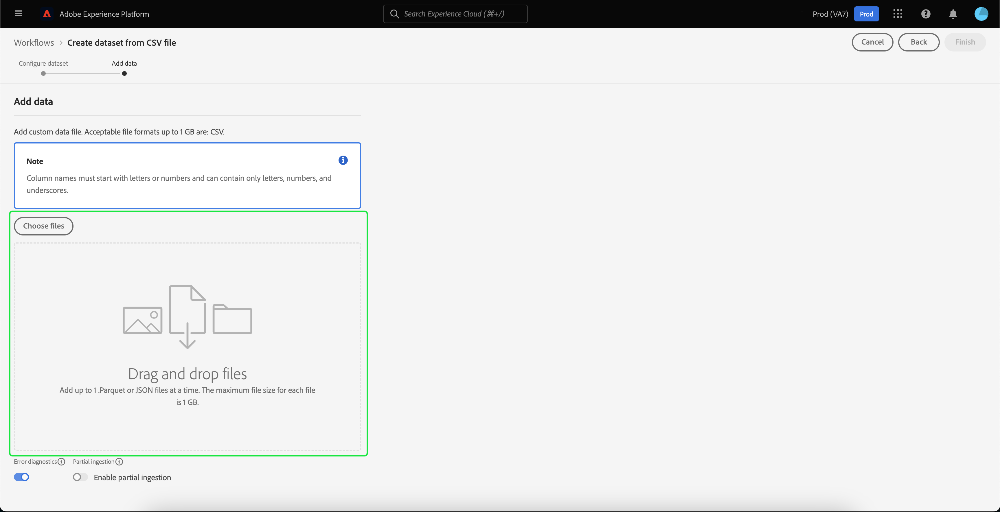

# Guide de l’interface utilisateur des jeux de données

Ce guide d’utilisation fournit des instructions permettant d’exécuter des actions courantes lors de l’utilisation de jeux de données dans l’interface utilisateur d’Adobe Experience Platform.

## Prise en main

Ce guide d’utilisation nécessite une compréhension professionnelle des composants suivants d’Adobe Experience Platform :

* [Jeu de données](overview.md) : la structure de stockage et de gestion pour la persistance des données dans [!DNL Experience Platform].
* [[!DNL Experience Data Model (XDM) System]](../../xdm/home.md) : Cadre normalisé selon lequel [!DNL Experience Platform] organise les données de l’expérience client.
   * [Principes de base de la composition des schémas](../../xdm/schema/composition.md) : découvrez les blocs de création de base des schémas XDM, y compris les principes clés et les bonnes pratiques en matière de composition de schémas.
   * [Éditeur](../../xdm/tutorials/create-schema-ui.md) de schéma : Découvrez comment créer vos propres schémas XDM personnalisés à l’aide de l’ [!DNL Schema Editor] interface  [!DNL Platform] utilisateur.
* [[!DNL Real-time Customer Profile]](../../profile/home.md) : fournit un profil client en temps réel unifié basé sur des données agrégées issues de plusieurs sources.
* [[!DNL Adobe Experience Platform Data Governance]](../../data-governance/home.md): Veiller au respect des réglementations, restrictions et stratégies relatives à l’utilisation des données client.

## Affichage des jeux de données

Dans l&#39;interface utilisateur [!DNL Experience Platform], cliquez sur **[!UICONTROL Datasets]** dans le volet de navigation de gauche pour ouvrir le tableau de bord **[!UICONTROL Datasets]**. Le tableau de bord répertorie tous les jeux de données disponibles pour votre organisation. Des détails s’affichent pour chaque jeu de données répertorié, notamment son nom, le schéma auquel le jeu de données adhère et l’état de l’exécution d’ingestion la plus récente.

Cliquez sur le nom d’un jeu de données pour accéder à l’écran **[!UICONTROL Activité du jeu de données]** et consulter les détails du jeu de données que vous avez sélectionné. L’onglet activité contient un graphique qui permet de visualiser le taux de messages consommé ainsi qu’une liste des lots réussis et en échec.

## Prévisualisation d’un jeu de données

À l’écran **[!UICONTROL Activité du jeu de données]**, cliquez sur **[!UICONTROL Prévisualiser le jeu de données]** près du coin supérieur droit de votre écran pour prévisualiser jusqu’à 100 lignes de données. Si le jeu de données est vide, le lien de la prévisualisation est désactivé et indique que la prévisualisation n&#39;est pas disponible.

Dans la fenêtre de prévisualisation, l’affichage hiérarchique du schéma pour le jeu de données s’affiche sur la droite.

Pour des méthodes plus robustes d&#39;accès à vos données, [!DNL Experience Platform] fournit des services en aval tels que [!DNL Query Service] et [!DNL JupyterLab] pour explorer et analyser les données. Consultez les documents suivants pour plus d’informations :

* [Présentation de Query Service](../../query-service/home.md)
* [Guide d’utilisation de JupyterLab](../../data-science-workspace/jupyterlab/overview.md)

## Création d’un jeu de données {#create}

Pour créer un nouveau jeu de données, commencez par cliquer sur **[!UICONTROL Créer un jeu de données]** dans le tableau de bord **[!UICONTROL Jeux de données]**.

Sur l’écran suivant, les deux options de création d’un nouveau jeu de données suivantes vous sont proposées :

* [Créer un jeu de données à partir d’un schéma](#schema)
* [Créer un jeu de données à partir d’un fichier CSV](#csv)

### Création d’un jeu de données à partir d’un schéma existant  {#schema}

Sur l’écran **[!UICONTROL Créer un jeu de données]**, cliquez sur **[!UICONTROL Créer un jeu de données à partir d’un schéma]** pour créer un nouveau jeu de données vide.

L’étape **[!UICONTROL Sélectionner un schéma]** apparaît. Parcourez la liste des schémas et sélectionnez le schéma auquel le jeu de données doit s’adapter avant de cliquer sur **[!UICONTROL Suivant]**.

L’étape **[!UICONTROL Configurer le jeu de données]** apparaît. Ajoutez un nom et une description facultative au jeu de données, puis cliquez sur **[!UICONTROL Terminer]** pour créer le jeu de données.

### Création d’un jeu de données à partir d’un fichier CSV  {#csv}

Lorsque vous créez un jeu de données à l’aide d’un fichier CSV, un schéma ad hoc est créé pour fournir une structure au jeu de données qui correspond au fichier CSV fourni. Sur l’écran **[!UICONTROL Créer un jeu de données]**, cliquez sur la case intitulée **[!UICONTROL Créer un jeu de données à partir d’un fichier CSV]**.

L’étape **[!UICONTROL Configurer]** apparaît. Ajoutez un nom et une description facultative au jeu de données, puis cliquez sur **[!UICONTROL Suivant]**.

L’étape **[!UICONTROL Ajouter les données]** apparaît. Chargez le fichier CSV soit en le faisant glisser et en le déposant au centre de votre écran, soit en cliquant sur **[!UICONTROL Parcourir]** pour explorer votre répertoire de fichiers. La taille du fichier peut aller jusqu’à 10 gigaoctets. Une fois le fichier CSV chargé, cliquez sur **[!UICONTROL Enregistrer]** pour créer le jeu de données.

>[!NOTE]
>
>Les noms de colonne CSV doivent commencer par des caractères alphanumériques et ne peuvent contenir que des lettres, des chiffres et des traits de soulignement.

## Activation d’un jeu de données pour Real-time Customer Profile {#enable-profile}

Chaque jeu de données a la possibilité d’enrichir les profils clients des données qu’ils ingèrent. Pour ce faire, le schéma auquel le jeu de données adhère doit être compatible avec [!DNL Real-time Customer Profile]. Un schéma compatible répond aux critères suivants :

* Le schéma comporte au moins un attribut défini comme propriété d’identité.
* Le schéma comporte au moins une propriété d’identité définie comme identité principale.

Pour plus d&#39;informations sur l&#39;activation d&#39;un schéma pour [!DNL Profile], consultez le [Guide de l&#39;utilisateur de l&#39;Éditeur de Schémas](../../xdm/tutorials/create-schema-ui.md).

Pour activer un jeu de données dans Profile, accédez à son écran **[!UICONTROL Activité du jeu de données]** et cliquez sur le bouton de basculement **[!UICONTROL Profil]** au sein de la colonne **[!UICONTROL Propriétés]**. Une fois activées, les données ingérées dans le jeu de données seront également utilisées pour générer les profils clients.

>[!NOTE]
>
>Si un jeu de données contient déjà des données et est ensuite activé pour [!DNL Profile], les données existantes ne sont pas automatiquement utilisées par [!DNL Profile]. Une fois qu&#39;un jeu de données est activé pour [!DNL Profile], il est recommandé de réassimiler toutes les données existantes pour qu&#39;elles contribuent aux profils du client.

## Gestion et application de la gouvernance des données sur un jeu de données

Les libellés d’utilisation des données vous permettent de classer les jeux de données et les champs en fonction des stratégies d’utilisation qui s’appliquent à ces données. Pour en savoir plus sur les libellés, consultez la [Présentation de la gouvernance des données](../../data-governance/home.md) ou reportez-vous au [guide d’utilisation des libellés d’utilisation des données](../../data-governance/labels/overview.md) pour savoir comment appliquer des libellés à vos jeux de données.

## Suppression d’un jeu de données

Vous pouvez supprimer un jeu de données en accédant d’abord à son écran **[!UICONTROL Activité du jeu de données]**. Cliquez ensuite sur **[!UICONTROL Supprimer un jeu de données]** pour le supprimer.

>[!NOTE]
>
>Les jeux de données créés et utilisés par les applications et services d&#39;Adobe (tels que Adobe Analytics, Adobe Audience Manager ou [!DNL Offer Decisioning]) ne peuvent pas être supprimés.

Une boîte de confirmation s’affiche alors. Cliquez sur **[!UICONTROL Supprimer]** pour confirmer la suppression du jeu de données.

## Suppression d’un jeu de données activé par Profile

Si un jeu de données est activé pour [!DNL Profile], la suppression de ce jeu de données par l&#39;intermédiaire de l&#39;interface utilisateur le supprime à la fois de Data Lake et du magasin de Profils dans Platform.

Vous pouvez supprimer un jeu de données du magasin [!DNL Profile] uniquement (en laissant les données dans Data Lake) à l’aide de l’API Profil client en temps réel. Pour plus d&#39;informations, consultez le [profil system jobs API endpoint guide](../../profile/api/profile-system-jobs.md).

## Surveillance de l’ingestion des données

Dans l&#39;interface utilisateur [!DNL Experience Platform], cliquez sur **[!UICONTROL Surveillance]** dans le volet de navigation de gauche. Le tableau de bord **[!UICONTROL Surveillance]** vous permet de consulter les états des données entrantes soit depuis le lot soit depuis l’ingestion par flux. Pour afficher les états de lots individuels, cliquez sur **[!UICONTROL Lot de bout en bout]** ou sur **[!UICONTROL Diffusion en continu de bout en bout]**. Les tableaux de bord listes s’exécutent pour l’assimilation en lot ou en flux continu, y compris ceux qui réussissent, échouent ou sont toujours en cours d’exécution. Chaque liste fournit des détails sur le lot, notamment l’identifiant de lot, le nom du jeu de données cibles et le nombre d’enregistrements ingérés. Si le jeu de données de cible est activé pour [!DNL Profile], le nombre d&#39;enregistrements d&#39;identité et de profil assimilés s&#39;affiche également.

Vous pouvez cliquer sur un **[!UICONTROL identifiant de lot]** individuel pour accéder au tableau de bord **[!UICONTROL Présentation du lot]** et afficher les détails pour le lot et notamment les journaux d’erreurs dans le cas de l’échec de l’ingestion du lot.

Si vous souhaitez supprimer le lot, vous pouvez le faire en cliquant sur **[!UICONTROL Supprimer le lot]** situé près du coin supérieur droit du tableau de bord. Cette opération supprimera également les enregistrements du jeu de données pour lequel le lot a été ingéré à l’origine.

## Étapes suivantes

Ce guide d&#39;utilisateur fournit des instructions sur l&#39;exécution d&#39;actions courantes lors de l&#39;utilisation de jeux de données dans l&#39;[!DNL Experience Platform] interface utilisateur. Pour connaître les étapes à suivre pour exécuter des workflows [!DNL Platform] courants impliquant des jeux de données, consultez les didacticiels suivants :

* [Création d’un jeu de données à l’aide d’API](create.md)
* [Interrogation des données d’un jeu de données à l’aide de l’API Data Access](../../data-access/home.md)
* [Configuration d’un jeu de données pour Real-time Customer Profile et Identity Service à l’aide des API](../../profile/tutorials/dataset-configuration.md)
