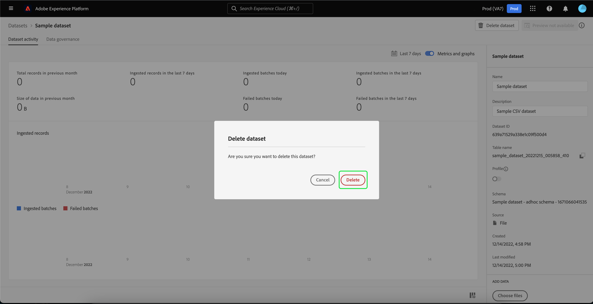

# Guide de l’interface utilisateur des jeux de données

Ce guide d’utilisation fournit des instructions permettant d’exécuter des actions courantes lors de l’utilisation de jeux de données dans l’interface utilisateur d’Adobe Experience Platform.

## Prise en main

Ce guide d’utilisation nécessite une compréhension professionnelle des composants suivants d’Adobe Experience Platform :

* [Jeux de données](overview.md) : structure de stockage et de gestion pour la persistance des données dans [!DNL Experience Platform].
* [[!DNL Experience Data Model (XDM) System]](../../xdm/home.md) : cadre normalisé selon lequel [!DNL Experience Platform] organise les données de l’expérience client.
   * [Principes de base de la composition des schémas](../../xdm/schema/composition.md) : découvrez les blocs de création de base des schémas XDM, y compris les principes clés et les bonnes pratiques en matière de composition de schémas.
   * [Éditeur de schémas](../../xdm/tutorials/create-schema-ui.md) : découvrez comment créer vos propres schémas XDM à l’aide de [!DNL Schema Editor] dans l’interface utilisateur de [!DNL Platform].
* [[!DNL Real-Time Customer Profile]](../../profile/home.md) : fournit un profil de consommateur unifié en temps réel, basé sur des données agrégées provenant de plusieurs sources.
* [[!DNL Adobe Experience Platform Data Governance]](../../data-governance/home.md) : garantissez la conformité aux réglementations, aux restrictions et aux politiques concernant l’utilisation des données clients.

## Affichage des jeux de données {#view-datasets}

>[!CONTEXTUALHELP]
>id="platform_datasets_negative_numbers"
>title="Nombres négatifs dans l&#39;activité du jeu de données"
>abstract="Les nombres négatifs dans les enregistrements ingérés signifient qu&#39;un utilisateur a supprimé certains lots au cours d&#39;une période sélectionnée."
>text="Learn more in documentation"

>[!CONTEXTUALHELP]
>id="platform_datasets_browse_daysRemaining"
>title="Expiration du jeu de données"
>abstract="Cette colonne indique le nombre de jours restants au jeu de données cible avant son expiration automatique."

Dans l’interface utilisateur de [!DNL Experience Platform], sélectionnez **[!UICONTROL Jeux de données]** dans le volet de navigation de gauche pour ouvrir le tableau de bord **[!UICONTROL Jeux de données]**. Le tableau de bord répertorie tous les jeux de données disponibles pour votre organisation. Des détails s’affichent pour chaque jeu de données répertorié, notamment son nom, le schéma auquel le jeu de données adhère et l’état de l’exécution d’ingestion la plus récente.

Sélectionnez le nom d’un jeu de données dans l’onglet [!UICONTROL Parcourir] pour accéder à son écran **[!UICONTROL Activité du jeu de données]** et afficher les détails du jeu de données que vous avez sélectionné. L’onglet activité contient un graphique qui permet de visualiser le taux de messages consommé ainsi qu’une liste des lots réussis et en échec.

## Actions supplémentaires {#more-actions}

Vous pouvez [!UICONTROL Supprimer] ou [!UICONTROL activer un jeu de données pour Profile] à partir de la vue de détails [!UICONTROL Jeu de données]. Pour afficher les actions disponibles, sélectionnez **[!UICONTROL ... Plus]** en haut à droite de l’interface utilisateur. Le menu déroulant s’affiche.

![Espace de travail des jeux de données avec le [!UICONTROL ... Plus] menu déroulant en surbrillance.](../images/datasets/user-guide/more-actions.png)

Si vous sélectionnez **[!UICONTROL Activer un jeu de données pour Profile]**, une boîte de dialogue de confirmation s’affiche. Sélectionnez **[!UICONTROL Activer]** pour confirmer votre choix.

>[!NOTE]
>
>Pour activer un jeu de données pour Profile, le schéma auquel le jeu de données adhère doit être compatible pour être utilisé dans Real-time Customer Profile. Pour plus d’informations, voir la section [Activation d’un jeu de données pour profile](#enable-profile) .

Si vous sélectionnez **[!UICONTROL Supprimer]**, la boîte de dialogue de confirmation [!UICONTROL Supprimer le jeu de données] s’affiche. Sélectionnez **[!UICONTROL Supprimer]** pour confirmer votre choix.

>[!NOTE]
>
>Vous ne pouvez pas supprimer les jeux de données système.

Vous pouvez également supprimer un jeu de données ou ajouter un jeu de données à utiliser avec Real-time Customer Profile à partir des actions intégrées figurant dans l’onglet [!UICONTROL Parcourir] . Pour plus d’informations, consultez la [section d’actions intégrées](#inline-actions) .

## Actions de jeux de données intégrés {#inline-actions}

L’interface utilisateur des jeux de données propose désormais des collections d’actions intégrées pour chaque jeu de données disponible. Sélectionnez les points de suspension (...) d’un jeu de données que vous souhaitez gérer pour afficher les options disponibles dans un menu contextuel. Les actions disponibles sont les suivantes :

* [[!UICONTROL Prévisualiser le jeu de données]](#preview),
* [[!UICONTROL  Gestion des données et des étiquettes d’accès]](#manage-and-enforce-data-governance)
* [[!UICONTROL Activer le profil unifié]](#enable-profile)
* [[!UICONTROL Gérer les balises]](#manage-tags)
* [[!UICONTROL Déplacer vers des dossiers]](#move-to-folders)
* [[!UICONTROL Supprimer]](#delete).

Vous trouverez plus d’informations sur ces actions disponibles dans les sections respectives. Pour savoir comment gérer simultanément un grand nombre de jeux de données, reportez-vous à la section [actions en masse](#bulk-actions) .

### Prévisualisation d’un jeu de données {#preview}

Vous pouvez prévisualiser des données d’exemple de jeu de données à partir des deux options intégrées de l’onglet [!UICONTROL Parcourir] et également de la vue [!UICONTROL Activité du jeu de données]. Dans l’onglet [!UICONTROL Parcourir] , sélectionnez les ellipses (...) en regard du nom du jeu de données que vous souhaitez prévisualiser. Une liste d’options s’affiche. Sélectionnez ensuite **[!UICONTROL Prévisualiser le jeu de données]** dans la liste des options disponibles. Si le jeu de données est vide, le lien de prévisualisation est désactivé et indique à la place que l’aperçu n’est pas disponible.

La fenêtre d’aperçu s’ouvre alors, dans laquelle la vue hiérarchique du schéma du jeu de données s’affiche à droite.

Vous pouvez également, dans l’écran **[!UICONTROL Activité du jeu de données]**, sélectionner **[!UICONTROL Prévisualiser le jeu de données]** près du coin supérieur droit de votre écran pour prévisualiser jusqu’à 100 lignes de données.

Pour des méthodes plus robustes d&#39;accès à vos données, [!DNL Experience Platform] fournit des services en aval tels que [!DNL Query Service] et [!DNL JupyterLab] pour explorer et analyser les données. Pour plus d’informations, consultez les documents suivants :

* [Présentation de Query Service](../../query-service/home.md)
* [Guide d’utilisation de JupyterLab](../../data-science-workspace/jupyterlab/overview.md)

### Gestion et application de la gouvernance des données sur un jeu de données {#manage-and-enforce-data-governance}

Vous pouvez gérer les étiquettes de gouvernance des données pour un jeu de données en sélectionnant les options intégrées de l’onglet [!UICONTROL Parcourir] . Sélectionnez les points de suspension (...) en regard du nom du jeu de données que vous souhaitez gérer, suivi de **[!UICONTROL Gérer les données et accéder aux étiquettes]** dans le menu déroulant.

Les libellés d’utilisation des données, appliqués au niveau du schéma, vous permettent de classer les jeux de données et les champs en fonction des stratégies d’utilisation qui s’appliquent à ces données. Pour en savoir plus sur les libellés, consultez la [présentation de la gouvernance des données](../../data-governance/home.md) ou reportez-vous au [guide d’utilisation des libellés d’utilisation des données](../../data-governance/labels/overview.md) pour obtenir des instructions sur la manière d’appliquer des libellés aux schémas pour la propagation des jeux de données.

## Activation d’un jeu de données pour Real-time Customer Profile {#enable-profile}

Chaque jeu de données a la possibilité d’enrichir les profils clients des données qu’ils ingèrent. Pour ce faire, le schéma auquel le jeu de données adhère doit être compatible pour être utilisé dans [!DNL Real-Time Customer Profile]. Un schéma compatible répond aux critères suivants :

* Le schéma comporte au moins un attribut défini comme propriété d’identité.
* Le schéma comporte au moins une propriété d’identité définie comme identité principale.

Pour plus d’informations sur l’activation d’un schéma pour [!DNL Profile], consultez le [guide d’utilisation de l’éditeur de schémas](../../xdm/tutorials/create-schema-ui.md).

Vous pouvez activer un jeu de données pour Profile à partir des deux options intégrées de l’onglet [!UICONTROL Parcourir] et également de la vue [!UICONTROL Activité du jeu de données]. Dans l’onglet [!UICONTROL Parcourir] de l’espace de travail [!UICONTROL Jeux de données], sélectionnez les points de suspension d’un jeu de données que vous souhaitez activer pour Profile. Une liste d’options s’affiche. Sélectionnez ensuite **[!UICONTROL Activer le profil unifié]** dans la liste des options disponibles.

Vous pouvez également, dans l’écran **[!UICONTROL Activité du jeu de données]** du jeu de données, sélectionner le bouton d’activation/désactivation **[!UICONTROL Profile]** dans la colonne **[!UICONTROL Propriétés]**. Une fois activées, les données ingérées dans le jeu de données seront également utilisées pour générer les profils clients.

>[!NOTE]
>
>Si un jeu de données contient déjà des données et est activé pour [!DNL Profile], les données existantes ne sont pas automatiquement consommées par [!DNL Profile]. Une fois qu’un jeu de données est activé pour [!DNL Profile], il est recommandé d’ingérer à nouveau toutes les données existantes pour qu’elles contribuent aux profils client.

Les jeux de données qui ont été activés pour Profile peuvent également être filtrés selon ce critère. Pour plus d’informations, consultez la section sur la [définition de jeux de données activés pour Profile](#filter-profile-enabled-datasets) .

### Gestion des balises de jeux de données {#manage-tags}

Ajoutez des balises personnalisées créées pour organiser les jeux de données et améliorer les fonctionnalités de recherche, de filtrage et de tri. Dans l’onglet [!UICONTROL Parcourir] de l’espace de travail [!UICONTROL Jeux de données], sélectionnez les points de suspension d’un jeu de données à gérer, puis **[!UICONTROL Gérer les balises]** dans le menu déroulant.

La boîte de dialogue [!UICONTROL Gérer les balises] s’affiche. Entrez une brève description pour créer une balise personnalisée ou faites votre choix parmi une balise préexistante pour étiqueter votre jeu de données. Cliquez sur **[!UICONTROL Enregistrer]** pour confirmer les paramètres.

La boîte de dialogue [!UICONTROL Gérer les balises] peut également supprimer des balises existantes d’un jeu de données. Il vous suffit de sélectionner le &quot;x&quot; en regard de la balise que vous souhaitez supprimer, puis de sélectionner **[!UICONTROL Enregistrer]**.

Une fois qu’une balise a été ajoutée à un jeu de données, les jeux de données peuvent être filtrés en fonction de la balise correspondante. Pour plus d’informations, consultez la section sur la [filtrage des jeux de données par balises](#enable-profile) .

Pour plus d’informations sur la manière de classer les objets d’entreprise pour une découverte et une catégorisation plus simples, consultez le guide sur la [gestion des taxonomies de métadonnées](../../administrative-tags/ui/managing-tags.md). Ce guide explique comment un utilisateur disposant des autorisations appropriées peut créer des balises prédéfinies, affecter des catégories aux balises et effectuer toutes les opérations CRUD associées sur des balises et des catégories de balises dans l’interface utilisateur de Platform.

### Déplacer vers des dossiers {#move-to-folders}

Vous pouvez placer des jeux de données dans des dossiers pour une meilleure gestion des jeux de données. Pour déplacer un jeu de données dans un dossier, sélectionnez les ellipses (...) en regard du nom du jeu de données que vous souhaitez gérer, suivi de l’icône **[!UICONTROL Déplacer vers le dossier]** dans le menu déroulant.

![Le tableau de bord [!UICONTROL Jeux de données] avec les ellipses et [!UICONTROL Déplacer vers le dossier] surligné.](../images/datasets/user-guide/move-to-folder.png)

La boîte de dialogue [!UICONTROL Déplacer] le jeu de données vers le dossier s’affiche. Sélectionnez le dossier vers lequel vous souhaitez déplacer l’audience, puis sélectionnez **[!UICONTROL Déplacer]**. Une notification contextuelle vous informe que le déplacement du jeu de données a réussi.

![ La boîte de dialogue [!UICONTROL Déplacer] du jeu de données avec [!UICONTROL Déplacer] surlignée.](../images/datasets/user-guide/move-dialog.png)

>[!TIP]
>
>Vous pouvez également créer des dossiers directement à partir de la boîte de dialogue Déplacer le jeu de données . Pour créer un dossier, sélectionnez l’icône Créer un dossier () en haut à droite de la boîte de dialogue.
>
>![La boîte de dialogue [!UICONTROL Déplacer] du jeu de données avec l’icône de création de dossier mise en surbrillance.](/help/catalog/images/datasets/user-guide/create-folder.png)

Une fois que le jeu de données se trouve dans un dossier, vous pouvez choisir d’afficher uniquement les jeux de données appartenant à un dossier spécifique. Pour ouvrir la structure de dossiers, sélectionnez l’icône Afficher les dossiers (). Sélectionnez ensuite le dossier de votre choix pour afficher tous les jeux de données associés.

![ Les tableaux de bord [!UICONTROL Jeux de données] avec la structure de dossiers des jeux de données affichée, l’icône Afficher les dossiers et un dossier sélectionné en surbrillance.](../images/datasets/user-guide/folder-structure.png)

### Suppression d’un jeu de données {#delete}

Vous pouvez supprimer un jeu de données des actions intégrées du jeu de données dans l’onglet [!UICONTROL Parcourir] ou en haut à droite de la vue [!UICONTROL Activité du jeu de données]. Dans la vue [!UICONTROL Parcourir], sélectionnez les ellipses (...) en regard du nom du jeu de données que vous souhaitez supprimer. Une liste d’options s’affiche. Sélectionnez ensuite **[!UICONTROL Supprimer]** dans le menu déroulant.

Une boîte de dialogue de confirmation s’affiche. Sélectionnez **[!UICONTROL Supprimer]** pour confirmer.

Vous pouvez également sélectionner **[!UICONTROL Supprimer le jeu de données]** dans l’écran **[!UICONTROL Activité du jeu de données]** .

>[!NOTE]
>
>Les jeux de données créés et utilisés par les applications et services Adobe (tels qu’Adobe Analytics, Adobe Audience Manager ou [!DNL Offer Decisioning]) ne peuvent pas être supprimés.

Une boîte de confirmation s’affiche alors. Sélectionnez **[!UICONTROL Supprimer]** pour confirmer la suppression du jeu de données.

### Suppression d’un jeu de données activé par Profile

Si un jeu de données est activé pour Profile, la suppression de ce jeu de données via l’interface utilisateur le supprime du lac de données, d’Identity Service, ainsi que de toutes les données de profil associées à ce jeu de données dans la banque de données Profile.

Vous pouvez supprimer les données de profil associées à un jeu de données du magasin [!DNL Profile] (en laissant les données dans le lac de données) à l’aide de l’API Real-time Customer Profile. Pour plus d’informations, consultez le [guide relatif au point d’entrée de l’API du système de profils](../../profile/api/profile-system-jobs.md).

## Recherche et filtrage de jeux de données {#search-and-filter}

Pour rechercher ou filtrer la liste des jeux de données disponibles, sélectionnez l’icône de filtre () en haut à gauche de l’espace de travail. Un ensemble d’options de filtre dans le rail de gauche s’affiche. Il existe plusieurs méthodes pour filtrer vos jeux de données disponibles. Il s’agit notamment des éléments suivants : [[!UICONTROL Afficher les jeux de données système]](#show-system-datasets), [[!UICONTROL  inclus dans le profil]](#filter-profile-enabled-datasets), [[!UICONTROL Balises]](#filter-by-tag), [[!UICONTROL Date de création]](#filter-by-creation-date), [[!UICONTROL Date de modification], [!UICONTROL Créée par]](#filter-by-creation-date) et [[!UICONTROL Schéma]](#filter-by-schema).

La liste des filtres appliqués s’affiche au-dessus des résultats filtrés.

### Afficher les jeux de données système {#show-system-datasets}

Par défaut, seuls les jeux de données dans lesquels vous avez ingéré des données s’affichent. Si vous souhaitez afficher les jeux de données générés par le système, cochez la case **[!UICONTROL Oui]** dans la section [!UICONTROL Afficher les jeux de données système] . Les jeux de données générés par le système ne sont utilisés que pour traiter d’autres composants. Par exemple, le jeu de données d’exportation de profil généré par le système est utilisé pour traiter le tableau de bord du profil.

![Les options de filtre de l’espace de travail des jeux de données avec la section [!UICONTROL Afficher les jeux de données système] mise en surbrillance.](../images/datasets/user-guide/show-system-datasets.png)

### Filtrage des jeux de données activés Profile {#filter-profile-enabled-datasets}

Les jeux de données qui ont été activés pour les données de profil sont utilisés pour renseigner les profils clients une fois les données ingérées. Pour en savoir plus, consultez la section sur l’ [activation des jeux de données pour Profile](#enable-profile) .

Pour filtrer votre jeu de données selon qu’il a été activé ou non pour Profile, cochez la case [!UICONTROL Oui] dans les options de filtre.

![Les options de filtre de l’espace de travail des jeux de données avec la section [!UICONTROL Inclus dans le profil] mise en surbrillance.](../images/datasets/user-guide/included-in-profile.png)

### Filtrage des jeux de données par balise {#filter-by-tag}

Saisissez votre nom de balise personnalisé dans l’entrée [!UICONTROL Balises], puis sélectionnez votre balise dans la liste des options disponibles pour rechercher et filtrer les jeux de données qui correspondent à cette balise.

![Les options de filtre de l’espace de travail des jeux de données avec l’icône d’entrée et de filtre [!UICONTROL Balises] mise en surbrillance.](../images/datasets/user-guide/filter-tags.png)

### Filtrage des jeux de données par date de création {#filter-by-creation-date}

Les jeux de données peuvent être filtrés par date de création sur une période personnalisée. Vous pouvez l’utiliser pour exclure les données historiques ou pour générer des informations et des rapports chronologiques spécifiques. Choisissez une [!UICONTROL Date de début] et une [!UICONTROL Date de fin] en sélectionnant l’icône Calendrier pour chaque champ. Ensuite, seuls les jeux de données conformes à ce critère s’affichent dans l’onglet Parcourir .

### Filtrage des jeux de données par date de modification {#filter-by-modified-date}

Tout comme le filtre pour la date de création, vous pouvez filtrer vos jeux de données en fonction de la date de leur dernière modification. Dans la section [!UICONTROL Date de modification] , choisissez une [!UICONTROL Date de début] et une [!UICONTROL Date de fin] en sélectionnant l’icône de calendrier pour chaque champ. Après quoi, seuls les jeux de données modifiés au cours de cette période s’affichent dans l’onglet Parcourir .

### Filtrage par schéma {#filter-by-schema}

Vous pouvez filtrer les jeux de données en fonction du schéma qui définit leur structure. Sélectionnez l’icône de liste déroulante ou saisissez le nom du schéma dans le champ de texte. Une liste des correspondances potentielles s’affiche. Sélectionnez le schéma approprié dans la liste.

## Actions en masse {#bulk-actions}

Utilisez des actions en bloc pour améliorer votre efficacité opérationnelle et effectuez plusieurs actions simultanément sur de nombreux jeux de données. Vous pouvez gagner du temps et conserver une structure de données organisée avec des actions en masse telles que [Déplacer vers le dossier](#move-to-folders), [Modifier les balises](#manage-tags) et [Supprimer](#delete) jeux de données.

Pour agir sur plusieurs jeux de données à la fois, sélectionnez des jeux de données individuels avec la case à cocher sur chaque ligne ou sélectionnez une page entière avec la case à cocher de l’en-tête de colonne. Une fois cette option sélectionnée, la barre d’actions en bloc s’affiche.

Lorsque vous appliquez des actions en bloc à des jeux de données, les conditions suivantes s’appliquent :

* Vous pouvez sélectionner des jeux de données à partir de différentes pages de l’interface utilisateur.
* Si vous sélectionnez un filtre, les jeux de données sélectionnés seront réinitialisés.

## Tri des jeux de données par date de création {#sort}

Les jeux de données de l’onglet [!UICONTROL Parcourir] peuvent être triés par date ascendante ou descendante. Sélectionnez les en-têtes de colonne [!UICONTROL Créé ] ou [!UICONTROL Dernière mise à jour] pour alterner entre croissant et décroissant. Une fois la colonne sélectionnée, une flèche vers le haut ou vers le bas s’affiche sur le côté de l’en-tête de colonne.

## Créer un jeu de données {#create}

Pour créer un nouveau jeu de données, commencez par sélectionner **[!UICONTROL Créer un jeu de données]** dans le tableau de bord **[!UICONTROL Jeux de données]**.

Sur l’écran suivant, les deux options de création d’un nouveau jeu de données suivantes vous sont proposées :

* [Créer un jeu de données à partir d’un schéma](#schema)
* [Créer un jeu de données à partir d’un fichier CSV](#csv)

### Création d’un jeu de données à partir d’un schéma existant {#schema}

Dans l’écran **[!UICONTROL Créer un jeu de données]**, sélectionnez **[!UICONTROL Créer un jeu de données à partir d’un schéma]** pour créer un nouveau jeu de données vide.

L’étape **[!UICONTROL Sélectionner un schéma]** apparaît. Parcourez la liste des schémas et sélectionnez le schéma auquel le jeu de données doit se conformer avant de sélectionner **[!UICONTROL Suivant]**.

L’étape **[!UICONTROL Configurer le jeu de données]** apparaît. Attribuez un nom et une description facultative au jeu de données, puis sélectionnez **[!UICONTROL Terminer]** pour créer le jeu de données.

Les jeux de données peuvent être filtrés à partir de la liste des jeux de données disponibles dans l’interface utilisateur avec le filtre de schéma. Pour plus d’informations, consultez la section sur la [filtrage des jeux de données par schéma](#filter-by-schema) .

### Création d’un jeu de données à partir d’un fichier CSV {#csv}

Lorsque vous créez un jeu de données à l’aide d’un fichier CSV, un schéma ad hoc est créé pour fournir une structure au jeu de données qui correspond au fichier CSV fourni. Dans l’écran **[!UICONTROL Créer un jeu de données]**, sélectionnez **[!UICONTROL Créer un jeu de données à partir d’un fichier CSV]**.

L’étape **[!UICONTROL Configurer]** apparaît. Attribuez un nom et une description facultative au jeu de données, puis sélectionnez **[!UICONTROL Suivant]**.

L’étape **[!UICONTROL Ajouter les données]** apparaît. Téléchargez le fichier CSV en le faisant glisser et en le déposant au centre de votre écran ou sélectionnez **[!UICONTROL Parcourir]** pour explorer votre répertoire de fichiers. La taille du fichier peut aller jusqu’à 10 gigaoctets. Une fois le fichier CSV téléchargé, sélectionnez **[!UICONTROL Enregistrer]** pour créer le jeu de données.

>[!NOTE]
>
>Les noms de colonne CSV doivent commencer par des caractères alphanumériques et ne peuvent contenir que des lettres, des chiffres et des traits de soulignement.

## Surveiller l’ingestion des données

Dans l’interface utilisateur de [!DNL Experience Platform], sélectionnez **[!UICONTROL Surveillance]** dans le volet de navigation de gauche. Le tableau de bord **[!UICONTROL Surveillance]** vous permet de consulter les états des données entrantes soit depuis le lot soit depuis l’ingestion par flux. Pour afficher les états de lots individuels, sélectionnez **[!UICONTROL De bout en bout par lot]** ou **[!UICONTROL Diffusion en continu de bout en bout]**. Les tableaux de bord répertorient toutes les exécutions d’ingestion par lots ou par flux, y compris celles qui ont réussi, échoué ou qui sont toujours en cours. Chaque liste fournit des détails sur le lot, notamment l’identifiant de lot, le nom du jeu de données cibles et le nombre d’enregistrements ingérés. Si le jeu de données cible est activé pour [!DNL Profile], le nombre d’identités ingérées et d’enregistrements de profil s’affiche également.

Vous pouvez effectuer une sélection sur un **[!UICONTROL identifiant de lot]** individuel pour accéder au tableau de bord **[!UICONTROL Présentation du lot]** et afficher les détails du lot, y compris les journaux d’erreurs en cas d’échec de l’ingestion du lot.

Si vous souhaitez supprimer le lot, sélectionnez **[!UICONTROL Supprimer le lot]** près du coin supérieur droit du tableau de bord. La suppression d’un lot supprime également ses enregistrements du jeu de données auquel le lot a été ingéré à l’origine.

>[!NOTE]
>
>Si les données ingérées ont été activées pour Profile et traitées, la suppression d’un lot ne supprime pas ces données de la banque de profils.

## Étapes suivantes

Ce guide d’utilisation a fourni des instructions pour exécuter des actions courantes lors de l’utilisation de jeux de données dans l’interface utilisateur de [!DNL Experience Platform]. Pour obtenir des instructions sur l’exécution de processus [!DNL Platform] courants impliquant des jeux de données, reportez-vous aux tutoriels suivants :

* [Création d’un jeu de données à l’aide d’API](create.md)
* [Interrogation des données d’un jeu de données à l’aide de l’API Data Access](../../data-access/home.md)
* [Configuration d’un jeu de données pour Real-time Customer Profile et Identity Service à l’aide des API](../../profile/tutorials/dataset-configuration.md)
