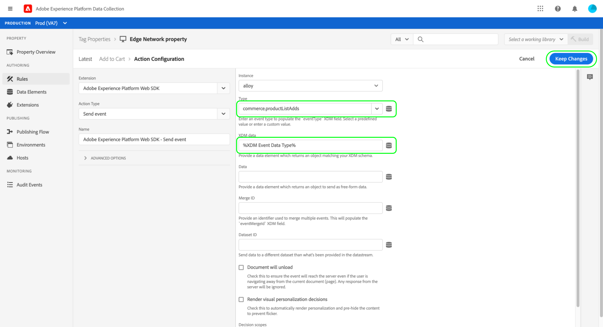
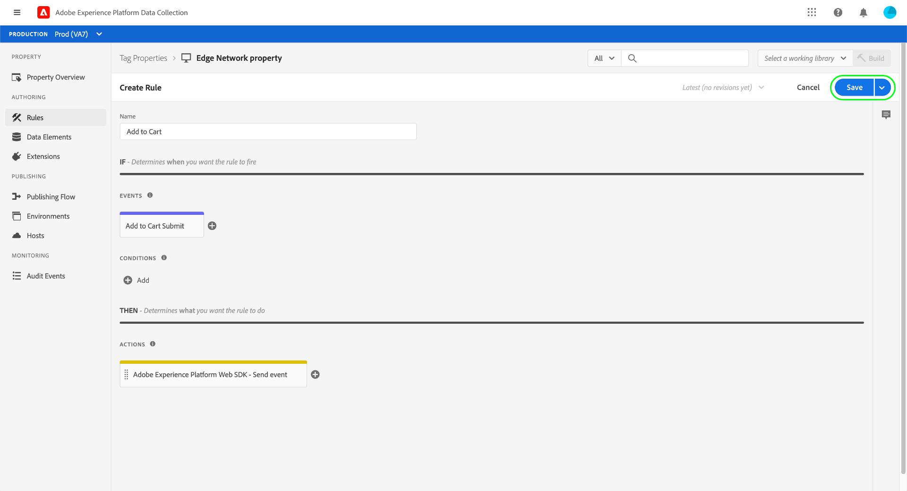

# Présentation complète de la collecte de données

Adobe Experience Platform collecte et transfère vos données vers d’autres produits Adobe et destinations tierces. Pour envoyer des données d’événement de votre application à l’Edge Network Experience Platform, il est important de comprendre ces technologies de base et de les configurer afin de diffuser vos données vers les destinations dont vous avez besoin, lorsque vous en avez besoin.

Ce guide fournit un tutoriel général sur la manière d’envoyer un événement par l’intermédiaire de l’Edge Network à l’aide des fonctionnalités de collecte de données de Platform. Plus précisément, le tutoriel décrit les étapes à suivre pour installer et configurer l’extension de balise SDK Web Adobe Experience Platform dans l’interface utilisateur de collecte de données (anciennement Adobe Experience Platform Launch).

>[!NOTE]
>
>Vous pouvez également choisir d’installer et de configurer le SDK manuellement si vous ne souhaitez pas utiliser de balises, mais les étapes environnantes doivent toujours être effectuées comme indiqué ci-dessous.
>
>Toutes les étapes impliquant l’interface utilisateur de collecte de données peuvent également être effectuées dans l’interface utilisateur Experience Platform.

## Conditions préalables

Ce tutoriel utilise l’interface utilisateur de collecte de données pour créer un schéma, configurer un flux de données et installer le SDK Web. Pour effectuer ces actions dans l’interface utilisateur, vous devez avoir accès à au moins une propriété Web avec les [droits de propriété](../tags/ui/administration/user-permissions.md#property-rights) suivants :

* Développer
* Gérer les extensions

Consultez le guide sur la [gestion des autorisations pour la collecte de données](./permissions.md) pour savoir comment accorder l’accès aux propriétés et aux droits de propriété.

Pour utiliser les différents produits de collecte de données mentionnés dans ce guide, vous devez également avoir accès aux flux de données et la possibilité de créer et de gérer des schémas. Si vous avez besoin d’accéder à l’une de ces fonctionnalités, contactez votre équipe de compte d’Adobe pour obtenir l’accès nécessaire. Si vous n’avez pas acheté Adobe Experience Platform, Adobe vous donnera l’accès nécessaire pour utiliser le SDK sans frais supplémentaires.

Si vous avez déjà accès à Platform, vous devez vous assurer que toutes les [autorisations](../access-control/home.md#permissions) dans les catégories suivantes sont activées :

* Modélisation des données
* Identités

Reportez-vous à la [présentation de l’interface utilisateur du contrôle d’accès](../access-control/ui/overview.md) pour savoir comment accorder des autorisations pour les fonctionnalités de Platform aux utilisateurs.

## Résumé du processus

Le processus de configuration de la collecte de données pour votre site Web peut être résumé comme suit :

1. [Créez un schéma](#schema) afin de déterminer la structure de vos données lors de leur envoi à Edge Network.
1. [Créez un flux de données](#datastream) pour configurer les destinations vers lesquelles vos données doivent être envoyées.
1. [Installez et configurez le SDK Web](#sdk) de façon à envoyer des données aux flux de données lorsque certains événements se produisent sur votre site Web.

Une fois que vous avez la possibilité d’envoyer des données à Edge Network, vous pouvez également [configurer le transfert d’événement](#event-forwarding) si votre entreprise dispose d’une licence pour ce transfert.

## Création d’un schéma {#schema}

[Le modèle de données d’expérience (XDM)](../xdm/home.md) est une spécification open source qui fournit des structures et des définitions communes pour les données sous la forme de schémas. En d’autres termes, XDM constitue un moyen de structurer et de mettre en forme vos données d’une manière exploitable par Edge Network et d’autres applications Adobe Experience Cloud.

La première étape de la configuration de vos opérations de collecte de données consiste à créer un schéma XDM pour représenter vos données. À une étape ultérieure de ce tutoriel, vous allez mapper les données que vous souhaitez envoyer à la structure de ce schéma.

>[!NOTE]
>
>Les schémas XDM sont hautement personnalisables. Plutôt que d’être trop directives, les étapes décrites ci-dessous portent spécifiquement sur les exigences de schéma pour le SDK Web. En dehors de ces paramètres, vous êtes libre de définir la structure restante de vos données comme vous le souhaitez.

Dans l’interface utilisateur, sélectionnez **[!UICONTROL Schémas]** dans le volet de navigation de gauche. À partir de là, vous pouvez voir une liste des schémas créés précédemment et appartenant à votre organisation. Pour continuer, sélectionnez **[!UICONTROL Créer un schéma]**, puis **[!UICONTROL XDM ExperienceEvent]** dans le menu déroulant.


Une boîte de dialogue s’affiche pour vous inviter à commencer à ajouter des groupes de champs au schéma. Pour envoyer des événements à l’aide du SDK Web, vous devez ajouter le groupe de champs **[!UICONTROL AEP Web SDK ExperienceEvent Mixin]**. Ce groupe de champs contient des définitions pour les attributs de données qui automatiquement collectées par la bibliothèque SDK Web.

Utilisez la barre de recherche pour affiner la liste afin de faciliter la recherche de ce groupe de champs. Une fois que vous l’avez trouvé, sélectionnez-le dans la liste avant de sélectionner **[!UICONTROL Ajouter des groupes de champs]**.


La zone de travail des schémas s’affiche ; il s’agit d’une arborescence de votre schéma XDM comprenant les champs fournis par le groupe de champs SDK Web.


Sélectionnez le champ racine dans l’arborescence pour ouvrir les **[!UICONTROL propriétés du schéma]** dans le rail de droite, où vous pouvez fournir un nom et une description facultative du schéma.


Si vous souhaitez ajouter d’autres champs au schéma, vous pouvez le faire en sélectionnant **[!UICONTROL Ajouter]** sous la section **[!UICONTROL Groupes de champs]** dans le rail de gauche.


>[!NOTE]
>
>Pour obtenir des instructions détaillées sur la recherche de différents groupes de champs en fonction de vos cas d’utilisation, consultez le guide sur l’[ajout de groupes de champs](../xdm/ui/resources/schemas.md#add-field-groups) dans la documentation XDM.
>
>La bonne pratique consiste à ajouter uniquement des champs pour les données que vous prévoyez d’envoyer par le biais de Edge Network. Une fois que vous avez ajouté des champs à un schéma et que vous l’avez enregistré, seules des modifications supplémentaires peuvent être apportées au schéma par la suite. Pour plus d’informations, reportez-vous à la section [règles d’évolution des schémas](../xdm/schema/composition.md#evolution).

Une fois que vous avez ajouté les champs dont vous avez besoin, sélectionnez **[!UICONTROL Enregistrer]** pour enregistrer le schéma.


## Création dʼun flux de données {#datastream}

Un flux de données est une configuration qui indique à Edge Network où vous souhaitez que vos données soient envoyées. Plus précisément, un flux de données indique à quels produits Experience Cloud vous souhaitez envoyer les données et comment vous souhaitez que les données soient traitées et stockées dans chaque produit.

>[!NOTE]
>
>Si vous souhaitez utiliser le [transfert d’événement](../tags/ui/event-forwarding/overview.md) (en supposant que votre organisation dispose d’une licence pour cette fonctionnalité), vous devez l’activer pour un flux de données de la même manière que vous activez les produits Adobe. Les détails de ce processus sont traités dans une [section ultérieure](#event-forwarding).

Sélectionnez **[!UICONTROL Datastreams]** dans le volet de navigation de gauche. À partir de là, vous pouvez sélectionner un flux de données existant à modifier dans la liste ou créer une configuration en sélectionnant **[!UICONTROL Nouveau flux de données]**.


Les exigences de configuration d’un flux de données dépendent des produits et fonctionnalités auxquels vous envoyez des données. Pour plus d’informations sur les options de configuration de chaque produit, consultez la [présentation des flux de données](../datastreams/overview.md).

## Installation et configuration du SDK Mobile {#install}

Une fois que vous avez créé un schéma et un flux de données, l’étape suivante consiste à installer et à configurer le SDK Web Platform pour commencer à envoyer des données à Edge Network.

>[!NOTE]
>
>Cette section utilise l’interface utilisateur de collecte de données pour configurer l’extension de balise du SDK Web, mais vous pouvez également l’installer et la configurer à l’aide du code brut. Consultez les guides suivants pour plus d’informations :
>
>* [Installation du SDK](/help/web-sdk/install/overview.md)
>* [Configuration du SDK](/help/web-sdk/commands/configure/overview.md)
>
>Notez également que même si vous souhaitez uniquement utiliser le transfert d’événement, vous devez tout de même installer et configurer le SDK comme décrit précédemment avant de configurer le transfert d’événement à une [étape ultérieure](#event-forwarding).

Le processus peut se résumer comme suit :

1. [Installez le SDK Web d’Adobe Experience Platform sur une propriété de balise](#install-sdk) pour accéder à ses fonctionnalités.
1. [Créez un élément de données d’objet XDM](#data-element) pour mapper les variables de votre site Web à la structure du schéma XDM que vous avez créé précédemment.
1. [Créez une règle](#rule) pour indiquer au SDK quand il doit envoyer des données à Edge Network.
1. [Créez et installez une bibliothèque](#library) pour mettre en œuvre la règle sur votre site Web.

### Installation du SDK sur une propriété de balise {#install-sdk}

Sélectionnez **[!UICONTROL Balises]** dans le volet de navigation de gauche pour afficher une liste des propriétés de balise. Si vous le souhaitez, vous pouvez choisir une propriété existante à modifier ou sélectionner **[!UICONTROL Nouvelle propriété]** à la place.


Si vous créez une propriété, nommez-la de manière descriptive et définissez [!UICONTROL Plateforme] sur **[!UICONTROL Web]**. Indiquez le domaine complet de la propriété Web, puis sélectionnez **[!UICONTROL Enregistrer]**.


La page d’aperçu de la propriété s’affiche. À partir de là, sélectionnez **[!UICONTROL Extensions]** dans le volet de navigation de gauche, puis sélectionnez **[!UICONTROL Catalogue]**. Recherchez la liste du SDK Web Platform (éventuellement à l’aide de la barre de recherche pour limiter les résultats) et sélectionnez **[!UICONTROL Installer]**.


La page de configuration du SDK s’affiche. La plupart des valeurs requises sont automatiquement renseignées avec des valeurs par défaut que vous pouvez modifier si vous le souhaitez.


Toutefois, avant de pouvoir installer le SDK, vous devez sélectionner un flux de données pour savoir où envoyer vos données. Sous **[!UICONTROL Flux de données]**, utilisez le menu déroulant pour sélectionner le flux de données que vous avez configuré à une [étape précédente](#datastream). Une fois que vous avez défini le flux de données, sélectionnez **[!UICONTROL Enregistrer]** pour terminer l’installation du SDK sur la propriété.


### Création d’un élément de données XDM {#data-element}

Pour que le SDK envoie des données à EdgeNetwork, il faut que ces données soient mappées au schéma XDM que vous avez créé lors d’une [étape précédente](#schema). Ce mappage est effectué via l’utilisation d’un élément de données.

Dans l’interface utilisateur, sélectionnez **[!UICONTROL Éléments de données]**, puis sélectionnez **[!UICONTROL Créer un élément de données]**.


À l’écran suivant, sélectionnez **[!UICONTROL SDK Web Adobe Experience Platform]** dans la liste déroulante [!UICONTROL Extension], puis sélectionnez **[!UICONTROL Objet XDM]** pour le type d’élément de données.


La boîte de dialogue de configuration s’affiche pour le type d’objet XDM. La boîte de dialogue sélectionne automatiquement votre sandbox Platform. Vous pouvez voir tous les schémas qui ont été créés dans cette sandbox. Sélectionnez le schéma XDM que vous avez créé précédemment dans la liste.


La structure du schéma apparaît. Tous les champs avec un astérisque (**\***) sont des champs qui seront automatiquement renseignés lorsque les événements se déclenchent. Pour tous les autres champs, vous pouvez explorer la structure du schéma et renseigner le reste des données.


>[!NOTE]
>
>La capture d’écran ci-dessus montre comment mapper une variable accessible globalement du côté client de votre site Web (`cartAbandonsTotal`) à un champ XDM en référençant son nom dans le champ [!UICONTROL Valeur], entouré de signes de pourcentage (`%`).
>
>Vous pouvez également utiliser d’autres éléments de données créés précédemment pour remplir ces champs. Pour plus d’informations, voir la référence sur les [éléments de données](../tags/ui/managing-resources/data-elements.md) dans la documentation sur les balises.

Une fois que vous avez terminé de mapper vos données au schéma, attribuez un nom à l’élément de données avant de sélectionner **[!UICONTROL Enregistrer]**.


### Création d’une règle

Après avoir enregistré l’élément de données, l’étape suivante consiste à créer une règle qui l’enverra au réseau Edge chaque fois qu’un certain événement se produit sur votre site Web (par exemple, lorsqu’un client ajoute un produit à un panier).

Vous pouvez configurer des règles pour pratiquement tous les événements qui peuvent se produire sur votre site Web. Cette section explique par exemple comment créer une règle qui se déclenche lorsqu’un client envoie un formulaire. Le code HTML suivant représente une page Web simple avec un formulaire « Ajouter au panier », qui fera l’objet de la règle :

```html
<!DOCTYPE html>
<html>
<body>

  <form id="add-to-cart-form">
    <label for="item">Product:</label><br>
    <input type="text" id="item" name="item"><br>
    <label for="amount">Amount:</label><br>
    <input type="number" id="amount" name="amount" value="1"><br><br>
    <input type="submit" value="Add to Cart">
  </form> 

</body>
</html>
```

Dans l’interface utilisateur de collecte de données, sélectionnez **[!UICONTROL Règles]** dans le volet de navigation de gauche, puis **[!UICONTROL Créer une règle]**.


À l’écran suivant, donnez un nom à la règle. À partir de là, l’étape suivante consiste à déterminer l’événement pour la règle (en d’autres termes, le moment où la règle se déclenchera). Sélectionnez **[!UICONTROL Ajouter]** sous [!UICONTROL Événements].


La page de configuration d’événement s’affiche. Pour configurer un événement, vous devez d’abord sélectionner le type d’événement. Les types d’événements sont fournis par les extensions. Pour configurer un événement « form submit », par exemple, sélectionnez l’extension **[!UICONTROL Core]**, puis sélectionnez le type d’événement **[!UICONTROL Submit]** dans la catégorie **[!UICONTROL Formulaire]**.

>[!NOTE]
>
>Pour plus d’informations sur les différents types d’événements fournis par les extensions Web d’Adobe, y compris sur la manière de les configurer, consultez la [référence des extensions d’Adobe](../tags/extensions/client/overview.md) dans la documentation sur les balises.

L’événement d’envoi de formulaire vous permet d’utiliser un [sélecteur CSS](https://www.w3schools.com/css/css_selectors.asp) pour référencer un élément spécifique à partir duquel la règle doit se déclencher. Dans l’exemple ci-dessous, l’ID `add-to-cart-form` est utilisé afin que cette règle ne se déclenche que pour le formulaire « Ajouter au panier ». Sélectionnez **[!UICONTROL Conserver les modifications]** pour ajouter l’événement à la règle.


La page de configuration des règles réapparaît, indiquant que l’événement a été ajouté. Vous pouvez réduire la valeur &quot;[!UICONTROL If]&quot; en ajoutant d’autres conditions à la règle.

Dans le cas contraire, l’étape suivante consiste à ajouter une action que la règle doit exécuter lors de son déclenchement. Sélectionnez **[!UICONTROL Ajouter]** sous **[!UICONTROL Actions]** pour continuer.


La page de configuration d’action s’affiche. Pour obtenir la règle permettant d’envoyer des données à Edge Network, sélectionnez **[!UICONTROL SDK Web Adobe Experience Platform]** pour l’extension et **[!UICONTROL Envoyer l’événement]** pour le type d’action.


L’écran se met à jour afin d’afficher des options supplémentaires pour configurer l’action d’envoi d’événement. Sous **[!UICONTROL Type]**, vous pouvez fournir une valeur de type personnalisée pour renseigner le champ XDM `eventType`. Sous **[!UICONTROL Données XDM]**, indiquez le nom du type de données XDM que vous avez créé précédemment (entouré de signes de pourcentage) ou sélectionnez l’icône de base de données () pour le sélectionner dans une liste. Il s’agit des données qui seront envoyées au réseau Edge.

Sélectionnez **[!UICONTROL Conserver les modifications]** lorsque vous avez terminé.



Une fois la configuration de la règle terminée, sélectionnez **[!UICONTROL Enregistrer]** pour terminer le processus.



### Création et installation d’une bibliothèque {#library}

Une fois la règle configurée, vous êtes prêt à l’ajouter à une bibliothèque de balises, à créer cette bibliothèque dans un environnement et à l’installer sur votre site Web.

>[!NOTE]
>
>Si vous n’avez pas encore configuré d’environnement dans l’interface utilisateur de collecte de données, vous devez le faire avant de pouvoir créer une version. Pour plus d’informations, reportez-vous à la section [Configuration d’un environnement pour une propriété Web](../tags/ui/publishing/environments.md#web-configuration) dans la documentation sur les balises.

Pour savoir comment créer une bibliothèque, ajouter des extensions et des règles à la bibliothèque et la créer dans un environnement, consultez le guide sur la [gestion des bibliothèques](../tags/ui/publishing/libraries.md) dans la documentation sur les balises. Lorsque vous créez la bibliothèque, veillez à inclure l’extension SDK Web Platform et les règles de collecte de données que vous avez créées précédemment.

Une fois que vous avez créé la bibliothèque et que sa version a été affectée à un environnement, vous pouvez installer cet environnement du côté client de votre site Web. Pour plus d’informations, consultez la section consacrée à l’[installation d’environnements](../tags/ui/publishing/environments.md#installation).

Une fois l’environnement installé sur votre site Web, vous pouvez [tester votre mise en œuvre](../tags/ui/publishing/embed-code-testing.md) à l’aide du débogueur Adobe Experience Platform.

## Configuration du transfert d’événement (facultatif) {#event-forwarding}

>[!NOTE]
>
>Le transfert d’événement est disponible uniquement pour les organisations ayant reçu une licence associée.

Une fois que vous avez configuré le SDK pour envoyer à Edge Network, vous pouvez configurer le transfert d’événement de façon à indiquer à Edge Network où vous souhaitez que ces données soient diffusées.

Pour utiliser le transfert d’événement, vous devez d’abord créer une propriété de transfert d’événement. Sélectionnez **[!UICONTROL Transfert d’événement]** dans le volet de navigation de gauche, puis sélectionnez **[!UICONTROL Nouvelle propriété]**. Attribuez un nom à la propriété avant de sélectionner **[!UICONTROL Enregistrer]**.

Une fois que vous avez créé une propriété de transfert d’événement, l’étape suivante consiste à créer une règle qui détermine où les données doivent être envoyées. Les règles pour les propriétés de transfert d’événement sont créées de la même manière que pour les propriétés de balise, sauf qu’aucun événement ne peut être spécifié (puisque le transfert d’événement traite uniquement des événements qu’il reçoit directement du flux de données). Pour l’action de la règle, vous pouvez utiliser l’une des extensions de transfert d’événement disponibles ou utiliser un code personnalisé pour diffuser l’événement à la place.


Comme auparavant, une fois la règle configurée, vous devez l’ajouter à une bibliothèque et la créer dans un environnement.

Une fois la génération terminée, l’étape finale consiste à mettre à jour le flux de données que vous avez [précédemment configuré](#datastream) et à activer le transfert d’événement. Pour commencer, accédez à **[!UICONTROL Flux de données]** et sélectionnez le flux de données en question dans la liste. À partir de là, activez la bascule pour le transfert d’événement et indiquez les noms de la propriété et de l’environnement que vous venez de configurer.


## Étapes suivantes

Ce guide fournit un aperçu général de bout en bout de la marche à suivre pour envoyer des données à Edge Network à l’aide du SDK Web Platform. Pour plus d’informations sur les différents composants et services impliqués, reportez-vous à la documentation associée à ce guide.
