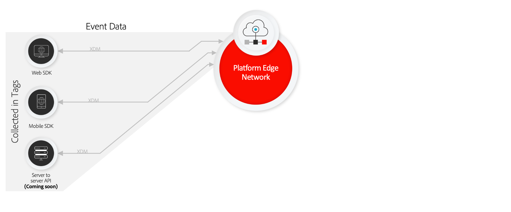

# Présentation de la collecte de données

Adobe Experience Platform fournit un ensemble de technologies qui vous permettent de collecter des données d’expérience client à partir de sources côté client. Vous pouvez ensuite les envoyer à Adobe Experience Platform Edge Network afin qu’elles soient enrichies, transformées et distribuées vers des destinations Adobe ou autres qu’Adobe en quelques secondes.

La collecte de données est prise en charge pour les sources côté client suivantes :

* Applications web
* Applications mobiles natives
* Applications OTT (over-the-top)

La collecte de données se concentre sur la capacité de découverte et l’accessibilité des jeux de données ingérés, ce qui comprend :

* [Adobe Experience Platform Edge Network](https://experienceleague.adobe.com/docs/web-sdk-learn/tutorials/introduction-to-web-sdk-and-edge-network.html?lang=fr)
* [Balises](../tags/home.md)
* [Flux de données](../datastreams/overview.md)
* [Transfert d’événement](../tags/ui/event-forwarding/overview.md)
* [SDK web Adobe Experience Platform](../web-sdk/home.md)
* [ SDK Mobile Adobe Experience Platform](https://developer.adobe.com/client-sdks/documentation/)
* [API du serveur réseau Edge](../server-api/overview.md)
* [Adobe Experience Platform Debugger](https://chrome.google.com/webstore/detail/adobe-experience-platform/bfnnokhpnncpkdmbokanobigaccjkpob?hl=fr)
* [Experience Platform Assurance](../assurance/home.md)

Ce guide présente de manière générale la collecte de données et son fonctionnement pour envoyer des données aux produits Adobe Experience Cloud et aux applications non Adobe via Experience Platform Edge Network.

## Balises, SDK Web et SDK Mobile

Experience Platform Web SDK et Experience Platform Mobile SDK réduisent et compressent toutes les bibliothèques de produits Adobe en un seul kit de développement pour les plateformes web et mobiles, respectivement. Ils peuvent être implémentés à l’aide de code brut ou en utilisant des [balises](../tags/home.md) via l’interface utilisateur Data Collection ou l’interface utilisateur Adobe Experience Platform.

La compression de ces bibliothèques accélère la collecte de données et consolide les opérations dans un flux unique, reliant les appareils côté client à Experience Platform Edge Network.

## Experience Platform Edge Network et flux de données {#edge}

Experience Platform Edge Network est un réseau de serveurs distribué dans le monde entier, rapide et fiable, capable de recevoir et de traiter des données à très grande échelle. Grâce aux balises, vous pouvez mettre en place des [flux de données](../datastreams/overview.md) pour des produits comme Adobe Target, Adobe Audience Manager et Adobe Analytics. Ces configurations vous permettent d‘activer les produits en question côté serveur sans modifier le code côté client.

En outre, les flux de données sont intégrés à plusieurs fonctionnalités Experience Platform qui permettent de s’assurer que toutes les données sensibles que vous envoyez sont traitées de manière appropriée et en respect des politiques organisationnelles et des réglementations légales. Consultez la section sur [la gestion des données sensibles](../datastreams/overview.md#sensitive) dans la documentation sur les flux de données pour plus d’informations.

## Transfert d’événement

[Transfert d’événement](../tags/ui/event-forwarding/overview.md) peut exploiter n’importe quel flux de données Experience Platform, ce qui vous permet de transformer, d’enrichir et d’envoyer des données à n’importe quelle destination non Adobe avec une latence extrême faible et sans ajouter de code tiers à l’appareil client.

>[!NOTE]
>
>Le transfert d’événement est une fonctionnalité payante uniquement incluse dans les offres Connections, Prime, ou Ultimate d’Adobe Real-Time Customer Data Platform.

## Étapes suivantes

Ce document fournit une présentation détaillée du fonctionnement de la collecte de données pour automatiser le processus d’envoi de vos données d’expérience client collectées à des produits Adobe et à des destinations tierces.

Pour plus d’informations sur le workflow général impliqué dans l’envoi des données d’événement via Edge Network, reportez-vous à la section [Présentation complète](./e2e.md).
