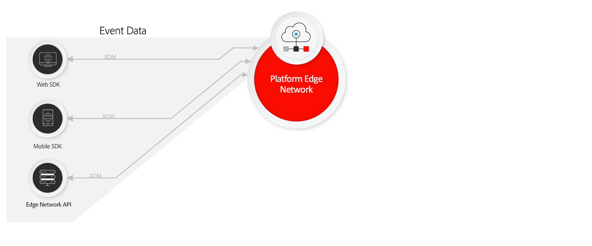
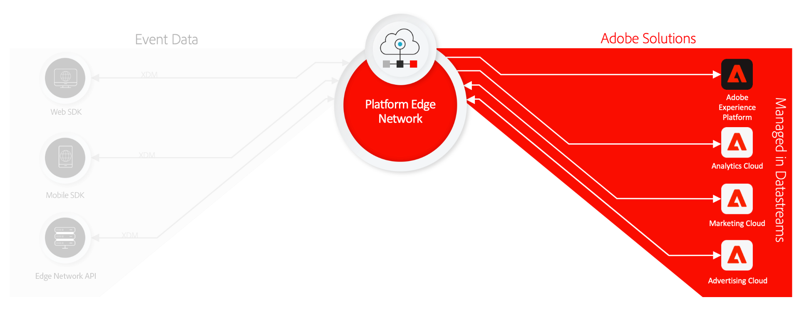
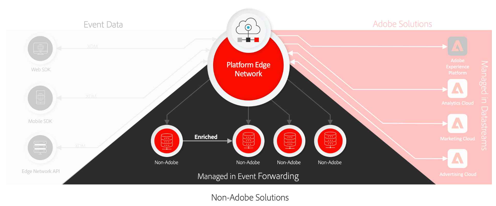

# Présentation de la collecte de données

Adobe Experience Platform fournit un ensemble de technologies qui vous permettent de collecter des données d’expérience client à partir de diverses sources et de les envoyer à Adobe Experience Platform Edge Network. Ces données peuvent ensuite être enrichies, transformées et distribuées vers des destinations Adobe ou autres qu’Adobe.

Adobe prend en charge les langages de code suivants avec des bibliothèques dédiées pour la collecte de données :

* **** : pour les sites web et les applications web
* **Kotlin** : pour les appareils Android
* **Swift** : pour les appareils iOS
* **Brightscript** : pour les appareils Roku
* **Flutter** : pour les applications Android + iOS utilisant Flutter
* **** : pour les applications Android + iOS utilisant React Native

L’interface utilisateur des balises dans la collecte de données Adobe Experience Platform comprend une extension Web SDK et Mobile SDK.

Si aucun des SDK ci-dessus ne répond aux besoins de votre projet, vous pouvez utiliser l’API [Adobe Experience Platform Edge Network](https://developer.adobe.com/data-collection-apis/docs/) pour envoyer directement des données à Adobe.

## Processus de collecte de données

Au lieu d’installer et de mettre en œuvre des bibliothèques individuelles distinctes pour chaque produit Adobe, vous pouvez mettre en œuvre l’un des SDK ou extensions de balises ci-dessus pour agréger toutes les données souhaitées en une seule payload. Cette payload est envoyée à un [flux de données](/help/datastreams/overview.md) dans Adobe Experience Platform Edge Network.

Adobe Experience Platform Edge Network est un réseau de serveurs distribué dans le monde entier, rapide et fiable, capable de recevoir et de traiter des données à très grande échelle. Lorsqu’un flux de données reçoit des données, il les distribue à chaque solution respective que vous avez configurée. Les données sont transmises dans un format compris par chaque produit.

Vous pouvez également utiliser le [transfert d’événement](/help/tags/ui/event-forwarding/overview.md) pour transformer, enrichir et envoyer des données à n’importe quelle destination non Adobe avec une faible latence et sans code d’implémentation côté client.

