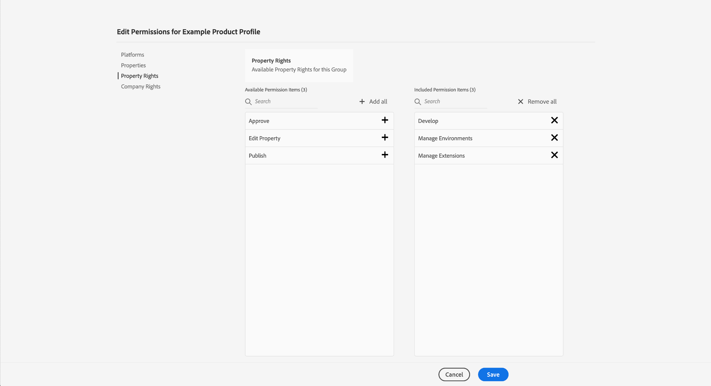

# Gestion des autorisations pour la collecte de données dans Experience Platform {#permission-management}

>[!CONTEXTUALHELP]
>id="platform_tags_permissions"
>title="Autorisations"
>abstract="Découvrez les principales autorisations requises pour travailler avec les flux de données, les schémas, les identités et les sandbox dans Adobe Experience Platform."

La [collecte de données dans Adobe Experience Platform](./home.md) se compose de plusieurs technologies différentes qui fonctionnent ensemble pour collecter et transférer vos données. L’accès à ces technologies est contrôlé par des autorisations granulaires en fonction du rôle dans Adobe Admin Console.

Ce guide vous explique comment gérer les autorisations pour les fonctionnalités de collecte de données.

## Commencer

Pour configurer le contrôle d’accès pour la collecte de données, vous devez disposer de droits d’administrateur pour une organisation qui dispose d’une intégration de produit avec la collecte de données Adobe Experience Platform. Le rôle minimum qui permet d’accorder ou de retirer des autorisations est un **administrateur de profils de produit**. Les autres rôles d’administrateur qui peuvent gérer des autorisations sont les **administrateurs de produit** (qui peuvent gérer tous les profils au sein d’un produit) et les **administrateurs système** (aucune restriction). Consultez l’article sur les [rôles administratifs](https://helpx.adobe.com/fr/enterprise/using/admin-roles.html) dans le guide d’administration d’Adobe Enterprise pour plus d’informations.

Ce guide suppose que vous connaissez les concepts de base d’Admin Console tels que les profils de produit et la manière dont ils accordent des autorisations de produit à des utilisateurs et utilisatrices individuels et à des groupes. Pour plus d’informations, consultez le [guide d’utilisation d’Admin Console](https://helpx.adobe.com/fr/enterprise/using/admin-console.html).

## Autorisations disponibles

Les autorisations appropriées pour la collecte de données sont fournies par le biais de deux désignations de produit dans Admin Console : **Adobe Experience Platform** et **Collecte de données Adobe Experience Platform**. Les sections ci-dessous décrivent les autorisations fournies sous chaque produit, ainsi que des descriptions des fonctionnalités spécifiques auxquelles elles donnent accès.

### Autorisations de Adobe Experience Platform

Les autorisations sous Adobe Experience Platform incluent l’accès aux flux de données, aux identités, aux schémas et aux sandbox. Pour savoir comment configurer les autorisations Adobe Experience Platform, consultez le guide d’utilisation du contrôle d’accès [Access control](../access-control/ui/overview.md).

| Catégorie | Autorisation | Description |
| --- | --- | --- |
| Sandbox | (S/O) | Selon les [sandbox](../sandboxes/home.md) qui ont été créés sous votre organisation, vous pouvez contrôler l’accès à chacun d’eux par le biais de cette catégorie d’autorisations dans Admin Console. |
| Modélisation des données | Gestion des schémas | Permet d’afficher, de créer et de modifier des [schémas de modèle de données d’expérience (XDM)](../xdm/home.md). |
| Modélisation des données | Affichage des schémas | Accorde un accès en lecture seule aux schémas. |
| Identity Management | Gestion des espaces de noms d’identité | Permet d’afficher, de créer et de modifier des [espaces de noms d’identité](../identity-service/features/namespaces.md). |
| Identity Management | Affichages des espaces de noms d’identité | Accorde un accès en lecture seule aux espaces de noms d’identité. |
| Collecte de données | Gérer les flux de données | Permet d’afficher, de créer et de modifier des [flux de données](../datastreams/overview.md). |
| Collecte de données | Afficher les flux de données | Accorde un accès en lecture seule aux flux de données. |

{style="table-layout:auto"}

### Autorisations de la collecte de données Adobe Experience Platform

Les autorisations sous Collecte de données Adobe Experience Platform contrôlent l’accès aux balises et aux fonctionnalités de transfert d’événement, y compris les propriétés, les extensions et les environnements. Pour savoir comment configurer les autorisations de la collecte de données Adobe Experience Platform, reportez-vous à la [section ci-dessous](#manage).

| Catégorie | Autorisation | Description |
| --- | --- | --- |
| Plateformes | Web | Accorde l’accès aux [propriétés web](../tags/ui/administration/companies-and-properties.md) lorsqu’elles sont combinées à d’autres droits de propriété. |
| Plateformes | Mobile | Accorde l’accès aux [propriétés mobiles](../tags/ui/administration/companies-and-properties.md) lorsqu’elles sont combinées à d’autres droits de propriété. |
| Plateformes | Edge | Accorde l’accès aux [propriétés Edge de transfert d’événement](../tags/ui/event-forwarding/getting-started.md) lorsqu’elles sont combinées à d’autres droits de propriété. |
| Propriétés | (S/O) | Selon les propriétés qui ont été créées dans votre organisation, vous pouvez contrôler l’accès à chacune d’elles par le biais de cette catégorie d’autorisations dans Admin Console.  Les droits de propriété attribués à un utilisateur s’appliquent uniquement aux propriétés auxquelles il a été autorisé à accéder via cette catégorie d’autorisations. |
| Droits de propriété | Approuver | Permet d’approuver une version de bibliothèque dans le cadre du [ flux de publication ](../tags/ui/publishing/publishing-flow.md). |
| Droits de propriété | Développer | Permet de développer une version de bibliothèque dans le cadre du [ flux de publication ](../tags/ui/publishing/publishing-flow.md). |
| Droits de propriété | Modifier la propriété | Permet de modifier la configuration de base des propriétés auxquelles un utilisateur a accès. |
| Droits de propriété | Gérer les environnements | Permet de gérer les [environnements](../tags/ui/publishing/environments.md) pour les propriétés auxquelles un utilisateur a accès. |
| Droits de propriété | Gérer les extensions | Permet de gérer les [ extensions ](../tags/ui/managing-resources/extensions/overview.md) pour les propriétés auxquelles un utilisateur a accès. |
| Droits de propriété | Publier | Permet de publier une version de bibliothèque dans le cadre du [ flux de publication ](../tags/ui/publishing/publishing-flow.md). |
| Droits d’entreprise | Développement dʼextensions | Permet de créer et de modifier des packages d’extension qui appartiennent à votre organisation, y compris les versions privées et les demandes de publication publique. |
| Droits d’entreprise | Gérer les configurations d’application | Cette autorisation ne s’applique que si vous disposez d’une licence pour Adobe Journey Optimizer ou une autre solution qui accorde l’accès aux messages in-app et aux notifications push. Cela vous permet de gérer les applications dont Adobe Experience Cloud a connaissance, ainsi que les informations d’identification push nécessaires pour communiquer avec le service Firebase Cloud Messaging et le service de notification push Apple. |
| Droits d’entreprise | Gérer les propriétés | Permet de créer et de gérer des balises (propriété web), un transfert d’événement (propriété Edge) et des propriétés mobiles. |

{style="table-layout:auto"}

>[!NOTE]
>
>Pour plus d’informations sur la manière dont ces autorisations affectent les fonctionnalités des balises, y compris les stratégies d’administration pour les scénarios courants, consultez la documentation sur les balises dans la section [autorisations utilisateur](../tags/ui/administration/user-permissions.md).

## Gérer les autorisations {#manage}

Les autorisations pour la collecte de données sont gérées par le biais de deux désignations de produit : **Adobe Experience Platform** et **Collecte de données Adobe Experience Platform**.

Reportez-vous aux sous-sections ci-dessous pour savoir comment gérer les autorisations appropriées sous chaque produit dans Admin Console :

* [Autorisations de Adobe Experience Platform](#manage-platform)
* [Autorisations de la collecte de données Adobe Experience Platform](#manage-collection)

### Gestion des autorisations sous Adobe Experience Platform {#manage-platform}

>[!NOTE]
>
>Pour gérer les autorisations d’un rôle, vous aurez besoin de droits d’administrateur. Si vous ne disposez pas des privilèges d’administrateur, contactez votre administrateur système.

La section Experience Cloud **[!UICONTROL Autorisations]** vous permet de définir des rôles d’utilisateur et des politiques afin de gérer l’accès aux fonctionnalités et objets d’une application de produit.

Grâce aux [!UICONTROL autorisations], vous pouvez créer et gérer des rôles et attribuer les autorisations de ressources souhaitées pour ces rôles.

Pour accéder aux fonctionnalités de collecte de données, vous devez activer toutes les autorisations dans les catégories **[!UICONTROL Sandbox]**, **[!UICONTROL Modélisation des données]**, **[!UICONTROL Identity Management]** et **[!UICONTROL Collecte de données]**.

Consultez le [guide de l’interface utilisateur du contrôle d’accès](../access-control/ui/overview.md) pour obtenir des instructions détaillées sur la gestion des autorisations Platform.

>[!NOTE]
>
>Selon les SKU de produit auxquels votre organisation a accès, vous ne disposez peut-être pas de toutes les autorisations Platform.

### Gestion des autorisations sous Collecte de données Adobe Experience Platform {#manage-collection}

Pour gérer ces autorisations, connectez-vous à Admin Console et sélectionnez **[!UICONTROL Produits]** dans la barre de navigation supérieure, puis sélectionnez **[!UICONTROL Collecte de données Adobe Experience Platform]**.

#### Sélectionner ou créer un profil de produit

L’écran suivant affiche une liste des profils de produit disponibles pour la collecte de données sous votre organisation, le profil par défaut étant **[!DNL Default Data Collection All Access]**. Vous pouvez choisir de modifier le profil de produit par défaut si vous le souhaitez, ou sélectionner **[!UICONTROL Nouveau profil]** pour en créer un. Si votre organisation compte plusieurs rôles ou groupes d’utilisateurs et d’utilisatrices nécessitant différents niveaux d’accès, vous devez créer un profil de produit distinct pour chacun d’eux.

Après avoir sélectionné ou créé un profil de produit, vous pouvez utiliser les icônes **[!UICONTROL Modifier]** pour commencer à [modifier les autorisations](#edit-permissions) pour le profil, ou sélectionner l’onglet **[!UICONTROL Utilisateurs]** pour commencer à [affecter des utilisateurs](#assign-users) au profil.

#### Modifier les autorisations pour le profil de produit {#edit-permissions}

Lors de l’édition des autorisations d’un profil, les autorisations disponibles sont répertoriées dans la colonne de gauche tandis que celles qui sont incluses dans le profil sont répertoriées dans la colonne de droite. Sélectionnez les autorisations répertoriées pour les déplacer entre les colonnes.

Les autorisations sont organisées en catégories. Pour passer d’une catégorie à l’autre, sélectionnez la catégorie souhaitée dans le volet de navigation de gauche.

Sélectionnez **[!UICONTROL Enregistrer]** une fois que vous avez terminé de configurer les autorisations.

La vue Profil de produit réapparaît avec les autorisations ajoutées reflétées.

#### Affecter des utilisateurs au profil de produits {#assign-users}

Pour affecter des utilisateurs et utilisatrices au profil de produit (et leur accorder les autorisations configurées du profil), sélectionnez l’onglet **[!UICONTROL Utilisateurs]**, suivi de **[!UICONTROL Ajouter un utilisateur]**.

Pour plus d’informations sur la gestion des utilisateurs et utilisatrices pour un profil de produit, voir la [Documentation concernant Admin Console](https://helpx.adobe.com/fr/enterprise/using/manage-product-profiles.html).

## Étapes suivantes

Ce guide couvrait les autorisations disponibles pour la collecte de données et la manière de les gérer via Admin Console. Pour plus d’informations sur la gestion des autorisations pour d’autres fonctionnalités d’Adobe Experience Platform, reportez-vous à la [documentation sur le contrôle d’accès](../access-control/home.md).
