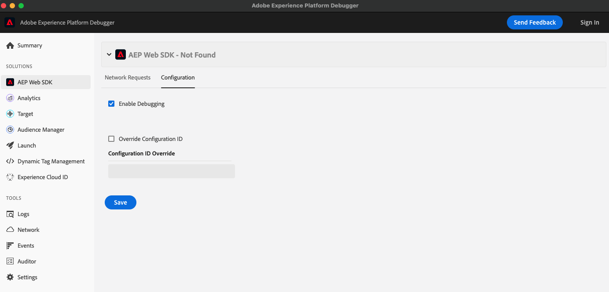

# Méthodes de débogage

Lorsque le débogage est activé, Web SDK génère des messages dans la console du navigateur qui peuvent s’avérer utiles pour déboguer votre implémentation. Elle permet également de voir les messages [`_satellite.logger`](../tags/logger.md) si vous utilisez les balises comme méthode d’implémentation. Le débogage est utile lorsque vous souhaitez comprendre le comportement du SDK en fonction des règles et des éléments de données que vous avez établis.

Le débogage est désactivé par défaut, mais peut être activé de quatre manières différentes. Vous pouvez utiliser n’importe quelle combinaison de ces méthodes pour activer ou désactiver le débogage le plus adapté à votre workflow de développement.

## Utiliser `debugEnabled` dans la commande `configure`

Définissez le booléen `debugEnabled` sur true lors de la configuration de l’extension. Cette option est généralement utilisée pour les environnements de développement, car elle active le débogage pour toutes les personnes qui visitent une page de votre site :

```js
alloy("configure", {
  datastreamId: "ebebf826-a01f-4458-8cec-ef61de241c93",
  orgId: "ADB3LETTERSANDNUMBERS@AdobeOrg",
  debugEnabled: true
});
```

Voir [`debugEnabled`](../js/commands/configure/debugenabled.md) pour plus d’informations.

## Utiliser la commande `setDebug`

De la même manière que la valeur booléenne ci-dessus, cette commande permet le débogage pour tous les visiteurs de la page.

```js
alloy("setDebug", {"enabled": true});
```

Voir la commande [`setDebug`](../js/commands/setdebug.md) pour plus d’informations.

## Définir un paramètre de chaîne de requête

Vous pouvez activer le débogage en ajoutant la chaîne de requête `?alloy_debug=true` à la fin de n’importe quelle URL. Par exemple :

`http://example.com/?alloy_debug=true`

Cette méthode s’applique uniquement à votre ordinateur local, ce qui vous permet de déboguer les sites Web de production sans activer le débogage pour tout le monde. L’activation du débogage de cette manière reste active pendant le reste de la session de navigation ou jusqu’à ce que vous la désactiviez.

## Utilisation d’Adobe Experience Platform Debugger

Adobe Experience Platform Debugger est un outil puissant qui examine vos pages web et vous aide à déboguer votre implémentation des produits Experience Cloud. Vous pouvez activer le débogage à partir de l’onglet configuration de la section AEP Web SDK .



Voir [Présentation d’](/help/debugger/home.md) pour plus d’informations.
