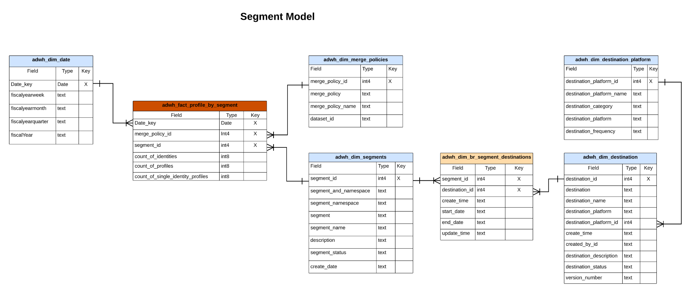

# Modèle de données Real-time Customer Data Platform Insights

La fonction Modèle de données Real-time Customer Data Platform Insights présente les modèles de données et SQL qui alimentent les insights pour divers widgets de profil, de destination et de segmentation. Vous pouvez personnaliser ces modèles de requête SQL afin de créer des rapports Real-Time CDP pour vos cas d’utilisation d’indicateurs de performance clés (IPC) et marketing. Ces insights peuvent ensuite être utilisées comme widgets personnalisés pour vos tableaux de bord définis par l’utilisateur. Pour en savoir plus, consultez la documentation sur les informations sur les rapports de magasin accélérées de requête . [comment créer un modèle de données d’informations sur les rapports via Query Service pour l’utiliser avec des données de magasin accélérées et des tableaux de bord définis par l’utilisateur](../query-service/query-accelerated-store/reporting-insights-data-model.md).

## Conditions préalables

Ce guide nécessite une compréhension pratique de la fonction [fonction de tableaux de bord définis par l’utilisateur](./user-defined-dashboards.md). Veuillez lire la documentation avant de poursuivre avec ce guide.

## Rapports d’informations sur Real-Time CDP et cas d’utilisation

Les rapports Real-Time CDP fournissent des informations sur vos données de profil et sur leurs relations avec les segments et les destinations. Divers modèles de schémas étoiles ont été développés pour répondre à divers cas d’utilisation marketing courants et chaque modèle de données peut prendre en charge plusieurs cas d’utilisation.

>[!IMPORTANT]
>
>Les données utilisées pour les rapports Real-Time CDP sont exactes pour une stratégie de fusion choisie et pour l’instantané quotidien le plus récent.

### Modèle de profil {#profile-model}

Le modèle de profil se compose de trois jeux de données :

- `adwh_dim_date`
- `adwh_fact_profile`
- `adwh_dim_merge_policies`

L’image ci-dessous contient les champs de données appropriés dans chaque jeu de données.


#### Cas pratique du nombre de profils

La logique utilisée pour le widget de comptage des profils renvoie le nombre total de profils fusionnés dans la banque de profils au moment où l’instantané a été pris. Voir [[!UICONTROL Nombre de profils] documentation du widget](./guides/profiles.md#profile-count) pour plus d’informations.

Le SQL qui génère la variable [!UICONTROL Nombre de profils] Le widget est visible dans la section réductible ci-dessous.

Requête +++SQL

```sql
SELECT adwh_dim_merge_policies.merge_policy_name,
  sum(adwh_fact_profile.count_of_profiles) CNT
FROM qsaccel.profile_agg.adwh_fact_profile
LEFT OUTER JOIN qsaccel.profile_agg.adwh_dim_merge_policies ON adwh_dim_merge_policies.merge_policy_id=adwh_fact_profile.merge_policy_id
WHERE adwh_fact_profile.date_key='${lastProcessDate}'
AND adwh_fact_profile.merge_policy_id=${mergePolicyId}
GROUP BY adwh_dim_merge_policies.merge_policy_name;
```

+++

#### Cas d’utilisation des profils d’identité unique

La logique utilisée pour la variable [!UICONTROL Profils d’identité uniques] Le widget fournit un décompte des profils de votre organisation qui ne disposent que d’un seul type d’ID qui crée leur identité. Voir[[!UICONTROL Profils d’identité uniques] documentation du widget](./guides/profiles.md#single-identity-profiles) pour plus d’informations.

Le SQL qui génère la variable [!UICONTROL Profils d’identité uniques] Le widget est visible dans la section réductible ci-dessous.

Requête +++SQL

```sql
SELECT adwh_dim_merge_policies.merge_policy_name,
  sum(adwh_fact_profile.count_of_Single_Identity_profiles) CNT
FROM QSAccel.profile_agg.adwh_fact_profile
LEFT OUTER JOIN QSAccel.profile_agg.adwh_dim_merge_policies ON adwh_dim_merge_policies.merge_policy_id=adwh_fact_profile.merge_policy_id
WHERE adwh_fact_profile.date_key='${lastProcessDate}'
  AND adwh_fact_profile.merge_policy_id =${mergePolicyId}
GROUP BY adwh_dim_merge_policies.merge_policy_name;
```

+++

### Modèle Namespace {#namespace-model}

Le modèle d’espace de noms comprend les jeux de données suivants :

- `adwh_fact_profile_by_namespace`
- `adwh_dim_date`
- `adwh_dim_namespaces`
- `adwh_dim_merge_policies`

L’image ci-dessous contient les champs de données appropriés dans chaque jeu de données.


#### Profils par cas d’utilisation d’identité

Le [!UICONTROL Profils par identité] widget affiche la ventilation des identités pour tous les profils fusionnés de votre banque de profils. Voir [[!UICONTROL Profils par identité] documentation du widget](./guides/profiles.md#profiles-by-identity) pour plus d’informations.

Le SQL qui génère la variable [!UICONTROL Profils par identité] Le widget est visible dans la section réductible ci-dessous.

Requête +++SQL

```sql
SELECT adwh_dim_namespaces.namespace_description,
    sum(adwh_fact_profile_by_namespace.count_of_profiles) count_of_profiles
FROM qsaccel.profile_agg.adwh_fact_profile_by_namespace
JOIN qsaccel.profile_agg.adwh_dim_namespaces ON adwh_fact_profile_by_namespace.namespace_id = adwh_dim_namespaces.namespace_id
AND adwh_fact_profile_by_namespace.merge_policy_id = adwh_dim_namespaces.merge_policy_id
WHERE adwh_fact_profile_by_namespace.merge_policy_id =${mergePolicyId}
AND adwh_fact_profile_by_namespace.date_key = '${lastProcessDate}'
GROUP BY adwh_fact_profile_by_namespace.date_key,
        adwh_fact_profile_by_namespace.merge_policy_id,
        adwh_dim_namespaces.namespace_description
ORDER BY count_of_profiles DESC
LIMIT 5;
```

+++

#### Profils d’identité uniques par cas d’utilisation d’identité

La logique utilisée pour la variable [!UICONTROL Profils d’identité uniques par identité] widget illustre le nombre total de profils qui sont identifiés avec un seul identifiant unique. Voir [Profils d’identité uniques par documentation du widget d’identité](./guides/profiles.md#single-identity-profiles-by-identity) pour plus d’informations.

Le SQL qui génère la variable [!UICONTROL Profils d’identité uniques par identité] Le widget est visible dans la section réductible ci-dessous.

Requête +++SQL

```sql
SELECT
  adwh_dim_namespaces.namespace_description,
  sum(adwh_fact_profile_by_namespace.count_of_Single_Identity_profiles) count_of_Single_Identity_profiles
FROM
  qsaccel.profile_agg.adwh_fact_profile_by_namespace
  LEFT OUTER JOIN
    qsaccel.profile_agg.adwh_dim_namespaces
    ON adwh_fact_profile_by_namespace.namespace_id = adwh_dim_namespaces.namespace_id
AND adwh_fact_profile_by_namespace.merge_policy_id = adwh_dim_namespaces.merge_policy_id
WHERE
  adwh_fact_profile_by_namespace.merge_policy_id=${mergePolicyId}
  AND adwh_fact_profile_by_namespace.date_key='${lastProcessDate}'
GROUP BY
  adwh_fact_profile_by_namespace.date_key,
  adwh_fact_profile_by_namespace.merge_policy_id,
  adwh_dim_namespaces.namespace_description;
```

+++

### Modèle de segment {#segment-model}

Le modèle de segment comprend les jeux de données suivants :

- `adwh_dim_date`
- `adwh_dim_merge_policies`
- `adwh_dim_segments`
- `adwh_fact_profile_by_segment`
- `adwh_dim_br_segment_destinations`
- `adwh_dim_destination`
- `adwh_dim_destination_platform`

L’image ci-dessous contient les champs de données appropriés dans chaque jeu de données.



#### Cas d’utilisation de la taille d’audience

La logique utilisée pour la variable [!UICONTROL Taille de l’audience] widget renvoie le nombre total de profils fusionnés dans le segment sélectionné au moment de l’instantané le plus récent. Voir [[!UICONTROL Taille de l’audience] documentation du widget](./guides/segments.md#audience-size) pour plus d’informations.

Le SQL qui génère la variable [!UICONTROL Taille de l’audience] Le widget est visible dans la section réductible ci-dessous.

Requête +++SQL

```sql
SELECT adwh_fact_profile_by_segment.date_key,
       adwh_dim_merge_policies.merge_policy_name,
       adwh_dim_segments.segment,
       adwh_dim_segments.segment_name,
       sum(adwh_fact_profile_by_segment.count_of_profiles)count_of_profiles
FROM qsaccel.profile_agg.adwh_fact_profile_by_segment
LEFT OUTER JOIN qsaccel.profile_agg.adwh_dim_segments ON adwh_fact_profile_by_segment.segment_id = adwh_dim_segments.segment_id
LEFT OUTER JOIN qsaccel.profile_agg.adwh_dim_merge_policies ON adwh_fact_profile_by_segment.merge_policy_id=adwh_dim_merge_policies.merge_policy_id
WHERE adwh_fact_profile_by_segment.date_key ='${lastProcessDate}'
  AND adwh_fact_profile_by_segment.merge_policy_id=${mergePolicyId}
GROUP BY adwh_fact_profile_by_segment.date_key,
         adwh_dim_merge_policies.merge_policy_name,
         adwh_dim_segments.segment,
         adwh_dim_segments.segment_name
ORDER BY count_of_profiles DESC
LIMIT 20;
```

+++

#### Cas d’utilisation de la tendance de modification de la taille de l’audience

La logique utilisée pour la variable [!UICONTROL Tendance de changement de la taille de l’audience] widget fournit un graphique linéaire qui illustre la différence entre le nombre total de profils qualifiés pour un segment donné et les instantanés quotidiens les plus récents. Voir [[!UICONTROL Tendance de changement de la taille de l’audience] documentation du widget](./guides/segments.md#audience-size-change-trend) pour plus d’informations.

Le SQL qui génère la variable [!UICONTROL Tendance de changement de la taille de l’audience] Le widget est visible dans la section réductible ci-dessous.

Requête +++SQL

```sql
SELECT DISTINCT cast(adwh_dim_segments.create_date AS Date) Date_key, adwh_dim_merge_policies.merge_policy_name,
  count(DISTINCT adwh_dim_segments.segment_id)Segments_Added
FROM qsaccel.profile_agg.adwh_fact_profile_by_segment
JOIN qsaccel.profile_agg.adwh_dim_segments ON adwh_fact_profile_by_segment.segment_id = adwh_dim_segments.segment_id
JOIN qsaccel.profile_agg.adwh_dim_merge_policies ON adwh_fact_profile_by_segment.merge_policy_id=adwh_dim_merge_policies.merge_policy_id
WHERE Cast(adwh_dim_segments.create_date AS date) >= dateadd(DAY, - ${dayRange}, '${lastProcessDate}')
AND adwh_fact_profile_by_segment.merge_policy_id=${mergePolicyId}
GROUP BY cast(adwh_dim_segments.create_date AS date), adwh_dim_merge_policies.merge_policy_name ;
```

+++

#### Cas d’utilisation des destinations les plus utilisées

La logique utilisée dans la variable [!UICONTROL Destinations les plus utilisées] Le widget répertorie les destinations les plus utilisées de votre entreprise en fonction du nombre de segments qui y sont mappés. Ce classement permet de savoir quelles destinations sont utilisées, tout en présentant éventuellement celles qui peuvent être sous-utilisées. Consultez la documentation relative à la [[!UICONTROL Destinations les plus utilisées] widget](./guides/destinations.md#most-used-destinations) pour plus d’informations.

Le SQL qui génère la variable [!UICONTROL Destinations les plus utilisées] Le widget est visible dans la section réductible ci-dessous.

Requête +++SQL

```sql
SELECT
   adwh_dim_destination.destination_name, adwh_dim_destination.destination_id,
   count( distinct adwh_dim_br_segment_destinations.segment_id ) segment_count
FROM
   qsaccel.profile_agg.adwh_dim_destination
   join qsaccel.profile_agg.adwh_dim_br_segment_destinations
 ON
   adwh_dim_destination.destination_id = adwh_dim_br_segment_destinations.destination_id
 WHERE
   adwh_dim_destination.destination_name is not null
 group by
   adwh_dim_destination.destination_name,
   adwh_dim_destination.destination_id
   order by segment_count desc limit 5;
```

+++

#### Cas d’utilisation des segments récemment activés

La logique de la variable [!UICONTROL Segments récemment activés] fournit une liste des segments mappés le plus récemment à une destination. Cette liste fournit un instantané des segments et des destinations activement utilisés dans le système et peut vous aider à résoudre les problèmes de mappages erronés. Voir [[!UICONTROL Segments récemment activés] documentation du widget](./guides/destinations.md#recently-activated-segments) pour plus d’informations.

Le SQL qui génère la variable [!UICONTROL Segments récemment activés] Le widget est visible dans la section réductible ci-dessous.

Requête +++SQL

```sql
SELECT segment_name, segment, destination_name, a.create_time create_time
FROM qsaccel.profile_agg.adwh_dim_br_segment_destinations a
INNER JOIN qsaccel.profile_agg.adwh_dim_segments b ON a.segment_id = b.segment_id
INNER JOIN qsaccel.profile_agg.adwh_dim_destination c ON a.destination_id = c.destination_id
ORDER BY create_time desc, segment LIMIT 5;
```

+++

### Modèle Namespace-segment

Le modèle namespace-segment comprend les jeux de données suivants :

- `adwh_dim_date`
- `adwh_dim_merge_policies`
- `adwh_dim_namespaces`
- `adwh_fact_profile_by_segment_and_namespace`
- `adwh_dim_segments`
- `adwh_dim_br_segment_destinations`
- `adwh_dim_destination`
- `adwh_dim_destination_platform`

L’image ci-dessous contient les champs de données appropriés dans chaque jeu de données.


#### Profils par identité pour un cas d’utilisation de segment

La logique utilisée dans la variable [!UICONTROL Profils par identité] Ce widget fournit une ventilation des identités pour tous les profils fusionnés de votre banque de profils pour un segment donné. Voir [[!UICONTROL Profils par identité] documentation du widget](./guides/segments.md#profiles-by-identity) pour plus d’informations.

Le SQL qui génère la variable [!UICONTROL Profils par identité] Le widget est visible dans la section réductible ci-dessous.

Requête +++SQL

```sql
SELECT adwh_dim_namespaces.namespace_description,
  sum( adwh_fact_profile_by_segment_and_namespace.count_of_profiles) count_of_profiles
FROM qsaccel.profile_agg.adwh_fact_profile_by_segment_and_namespace
LEFT OUTER JOIN qsaccel.profile_agg.adwh_dim_namespaces
ON adwh_fact_profile_by_segment_and_namespace.namespace_id = adwh_dim_namespaces.namespace_id
AND adwh_fact_profile_by_segment_and_namespace.merge_policy_id = adwh_dim_namespaces.merge_policy_id
WHERE adwh_fact_profile_by_segment_and_namespace.segment_id = {segment_id}
AND adwh_fact_profile_by_segment_and_namespace.merge_policy_id = {merge_policy_id}
AND adwh_fact_profile_by_segment_and_namespace.date_key = '{date}'
GROUP BY adwh_dim_namespaces.namespace_description;
```

+++

### Modèle d’espace de noms de chevauchement

Le modèle d’espace de noms de chevauchement est constitué des jeux de données suivants :

- `adwh_dim_date`
- `adwh_dim_namespaces`
- `adwh_fact_profile_overlap_of_namespace`
- `adwh_dim_merge_policies`

L’image ci-dessous contient les champs de données appropriés dans chaque jeu de données.


#### Cas d’utilisation de chevauchement d’identités (profils)

La logique utilisée dans la variable [!UICONTROL Superposition des identités] widget affiche le chevauchement des profils dans votre **Boutique de profils** qui contiennent les deux identités sélectionnées. Pour plus d’informations, voir [[!UICONTROL Superposition des identités] section widget de [!UICONTROL Profils] documentation du tableau de bord](./guides/profiles.md#identity-overlap).

Le SQL qui génère la variable [!UICONTROL Superposition des identités] Le widget est visible dans la section réductible ci-dessous.

Requête +++SQL

```sql
SELECT Sum(overlap_col1) overlap_col1,
       Sum(overlap_col2) overlap_col2,
       coalesce(Sum(overlap_count), 0) overlap_count
  FROM
    (SELECT 0 overlap_col1,
            0 overlap_col2,
            Sum(count_of_profiles) overlap_count
     FROM qsaccel.profile_agg.adwh_fact_profile_overlap_of_namespace
     WHERE adwh_fact_profile_overlap_of_namespace.merge_policy_id = ${mergePolicyId}
       AND adwh_fact_profile_overlap_of_namespace.date_key = '${lastProcessDate}'
       AND adwh_fact_profile_overlap_of_namespace.overlap_id IN
         (SELECT adwh_dim_overlap_namespaces.overlap_id
          FROM qsaccel.profile_agg.adwh_dim_overlap_namespaces
          WHERE adwh_dim_overlap_namespaces.merge_policy_id=${mergePolicyId}
            AND adwh_dim_overlap_namespaces.overlap_namespaces IN ('${namespace1}',
                                                                   '${namespace2}')
          GROUP BY adwh_dim_overlap_namespaces.overlap_id
          HAVING Count(*) > 1)
     UNION ALL SELECT count_of_profiles overlap_col1,
                      0 overlap_col2,
                      0 overlap_count
     FROM qsaccel.profile_agg.adwh_fact_profile_by_namespace
     JOIN qsaccel.profile_agg.adwh_dim_namespaces ON
     adwh_fact_profile_by_namespace.namespace_id = adwh_dim_namespaces.namespace_id
     AND adwh_fact_profile_by_namespace.merge_policy_id = adwh_dim_namespaces.merge_policy_id
     WHERE adwh_fact_profile_by_namespace.merge_policy_id = ${mergePolicyId}
       AND adwh_fact_profile_by_namespace.date_key = '${lastProcessDate}'
       AND adwh_dim_namespaces.namespace_description = '${namespace1}'
     UNION ALL SELECT 0 overlap_col1,
                      count_of_profiles overlap_col2,
                      0 Overlap_count
     FROM qsaccel.profile_agg.adwh_fact_profile_by_namespace
     JOIN qsaccel.profile_agg.adwh_dim_namespaces ON
     adwh_fact_profile_by_namespace.namespace_id = adwh_dim_namespaces.namespace_id
     AND adwh_fact_profile_by_namespace.merge_policy_id = adwh_dim_namespaces.merge_policy_id
     WHERE adwh_fact_profile_by_namespace.merge_policy_id = ${mergePolicyId}
       AND adwh_fact_profile_by_namespace.date_key = '${lastProcessDate}'
       AND adwh_dim_namespaces.namespace_description = '${namespace2}' ) a;
```

+++

### Espace de noms de chevauchement par modèle de segment

L’espace de noms de chevauchement par modèle de segment est constitué des jeux de données suivants :

- `adwh_dim_date`
- `adwh_dim_namespaces`
- `adwh_fact_profile_overlap_of_namespace_by_segment`
- `adwh_dim_merge_policies`
- `adwh_dim_segments`
- `adwh_dim_br_segment_destinations`
- `adwh_dim_destination`
- `adwh_dim_destination_platform`

L’image ci-dessous contient les champs de données appropriés dans chaque jeu de données.


#### Cas d’utilisation de chevauchement d’identités (segments)

La logique utilisée dans la variable [!UICONTROL Segments] tableau de bord [!UICONTROL Superposition des identités] Le widget illustre le chevauchement des profils qui contiennent les deux identités sélectionnées pour un segment particulier. Pour plus d’informations, voir [[!UICONTROL Superposition des identités] section widget de [!UICONTROL Segmentation] documentation du tableau de bord](./guides/segments.md#identity-overlap).

Le SQL qui génère la variable [!UICONTROL Superposition des identités] Le widget est visible dans la section réductible ci-dessous.

Requête +++SQL

```sql
SELECT
   Sum(overlap_col1) overlap_col1,
   Sum( overlap_col2) overlap_col2,
   Sum(overlap_count) Overlap_count
FROM
   (
      SELECT
         0 overlap_col1,
         0 overlap_col2,
         Sum(count_of_profiles) Overlap_count
      FROM
         qsaccel.profile_agg.adwh_fact_profile_overlap_of_namespace_by_segment
      WHERE
         adwh_fact_profile_overlap_of_namespace_by_segment.segment_id = $ {segmentId}
         and adwh_fact_profile_overlap_of_namespace_by_segment.merge_policy_id =$ {mergePolicyId}
         and adwh_fact_profile_overlap_of_namespace_by_segment.date_key = '${lastProcessDate}'
         and adwh_fact_profile_overlap_of_namespace_by_segment.overlap_id IN
         (
            SELECT
               adwh_dim_overlap_namespaces.overlap_id
            FROM
               qsaccel.profile_agg.adwh_dim_overlap_namespaces
            WHERE
               adwh_dim_overlap_namespaces.merge_policy_id =$ {mergePolicyId}
               AND adwh_dim_overlap_namespaces.overlap_namespaces IN
               (
                  '${namespace1}',
                  '${namespace2}'
               )
            GROUP BY
               adwh_dim_overlap_namespaces.overlap_id
            HAVING
               Count(*) > 1
         )
      UNION ALL
      SELECT
         count_of_profiles overlap_col1,
         0 overlap_col2,
         0 Overlap_count
      FROM
         qsaccel.profile_agg.adwh_fact_profile_by_segment_and_namespace
         LEFT OUTER JOIN
            qsaccel.profile_agg.adwh_dim_namespaces
            ON adwh_fact_profile_by_segment_and_namespace.namespace_id = adwh_dim_namespaces.namespace_id
            and adwh_fact_profile_by_segment_and_namespace.merge_policy_id = adwh_dim_namespaces.merge_policy_id
      WHERE
         adwh_dim_namespaces.namespace_description = '${namespace1}'
         and adwh_fact_profile_by_segment_and_namespace.segment_id = $ {segmentId}
         and adwh_fact_profile_by_segment_and_namespace.merge_policy_id =$ {mergePolicyId}
         and adwh_fact_profile_by_segment_and_namespace.date_key = '${lastProcessDate}'
      UNION ALL
      SELECT
         0 overlap_col1,
         count_of_profiles overlap_col2,
         0 Overlap_count
      FROM
         qsaccel.profile_agg.adwh_fact_profile_by_segment_and_namespace
         LEFT OUTER JOIN
            qsaccel.profile_agg.adwh_dim_namespaces
            ON adwh_fact_profile_by_segment_and_namespace.namespace_id = adwh_dim_namespaces.namespace_id
            and adwh_fact_profile_by_segment_and_namespace.merge_policy_id = adwh_dim_namespaces.merge_policy_id
      WHERE
         adwh_dim_namespaces.namespace_description = '${namespace2}'
         and adwh_fact_profile_by_segment_and_namespace.segment_id = $ {segmentId}
         and adwh_fact_profile_by_segment_and_namespace.merge_policy_id =$ {mergePolicyId}
         and adwh_fact_profile_by_segment_and_namespace.date_key = '${lastProcessDate}'
   )
   a;
```

+++
