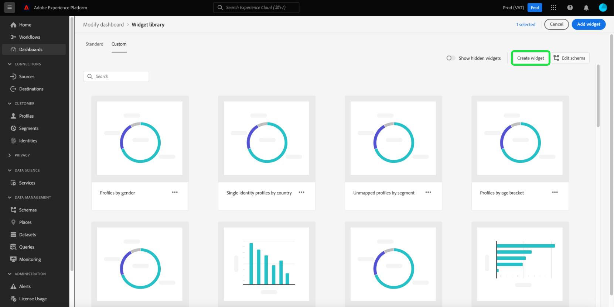

# Création de widgets personnalisés pour les tableaux de bord

Adobe Experience Platform vous permet d’afficher les données de votre organisation et d’interagir avec elles à l’aide de plusieurs tableaux de bord. Vous pouvez également mettre à jour certains tableaux de bord en ajoutant de nouveaux widgets à l’affichage de votre tableau de bord. Outre les widgets standard fournis par Adobe, vous pouvez créer des widgets personnalisés et les partager dans l’ensemble de votre organisation.

Ce guide fournit des instructions détaillées sur la création et l’ajout de widgets personnalisés aux tableaux de bord [!UICONTROL Profils], [!UICONTROL Segments] et [!UICONTROL Destinations] dans l’interface utilisateur de Platform.

>[!NOTE]
>
>Toutes les mises à jour apportées aux tableaux de bord sont effectuées par organisation et par environnement de test.

Pour en savoir plus sur les widgets standard, reportez-vous au guide relatif à l’[ajout de widgets standard à vos tableaux de bord](standard-widgets.md).

## Bibliothèque de widgets {#widget-library}

Ce guide nécessite l’accès à la [!UICONTROL bibliothèque de widgets] d’Experience Platform. Pour en savoir plus sur la bibliothèque de widgets et sur la façon d’y accéder dans l’interface utilisateur, commencez par lire la [présentation de la bibliothèque de widgets](widget-library.md).

## Prise en main des widgets personnalisés

Dans la bibliothèque de widgets, l’onglet **[!UICONTROL Personnalisé]** vous permet de créer des widgets et de les partager avec d’autres utilisateurs de votre organisation afin de personnaliser l’aspect de vos tableaux de bord.

>[!IMPORTANT]
>
>Votre organisation peut créer jusqu’à 20 widgets personnalisés dans la bibliothèque de widgets.

Sélectionnez l’onglet **[!UICONTROL Personnalisé]** pour commencer à créer des widgets personnalisés ou pour afficher les widgets personnalisés déjà créés par votre organisation.

## Création d’un widget personnalisé

Pour créer un widget personnalisé, sélectionnez **[!UICONTROL Créer un widget]** dans le coin supérieur droit de la bibliothèque de widgets ou, s’il s’agit du premier widget personnalisé de votre organisation, sélectionnez **[!UICONTROL Créer]** au centre de la bibliothèque de widgets.

Dans la boîte de dialogue **[!UICONTROL Créer un widget]**, fournissez un titre et une description pour votre nouveau widget. Choisissez ensuite l’attribut que vous souhaitez que le widget affiche.

>[!NOTE]
>
>La liste des attributs disponibles dépend du schéma configuré pour votre organisation. Pour en savoir plus sur la sélection d’attributs et la configuration de schéma, consultez le guide sur la [modification du schéma afin de créer des widgets personnalisés](edit-schema.md).

Pour choisir un attribut, cliquez sur le bouton radio en regard de l’attribut que vous souhaitez ajouter.

>[!NOTE]
>
>Un seul attribut peut être sélectionné par widget et un seul widget peut être créé par attribut. Si un widget a déjà été créé pour un attribut, l’attribut apparaît grisé.

## Sélection d’une visualisation

Après avoir sélectionné un attribut, une prévisualisation du nouveau widget s’affiche dans la boîte de dialogue. L’intelligence artificielle permet de sélectionner automatiquement la visualisation qui correspond le mieux aux données de l’attribut. Elle fournit en outre des options de visualisation supplémentaires que vous pouvez sélectionner manuellement.

En fonction de l’attribut, l’IA recommande différentes options de visualisation. La liste complète des visualisations comprend les éléments suivants :

* Graphique à barres horizontales : les valeurs sont représentées par des lignes horizontales.
* Diagramme en barres verticales : les valeurs sont représentées par des lignes verticales.
* Graphique en anneau : comme dans un graphique en secteurs, les valeurs s’affichent sous la forme de parties d’un tout.
* Graphique de dispersion : les valeurs sont indiquées à l’aide d’un axe horizontal et d’un axe vertical.
* Graphique en courbes : les valeurs s’affichent sur une seule ligne afin d’illustrer les modifications sur une période donnée.
* Carte de nombres : affiche une synthèse des chiffres afin de représenter une valeur de clé unique.
* Tableau de données : les valeurs s’affichent sous forme de lignes dans un tableau.

>[!NOTE]
>
>La seule mesure actuellement prise en charge pour tous les attributs est le nombre de profils.
>
>Les données affichées dans l’exemple de widget sont uniquement fournies à titre d’illustration. La prévisualisation n’affiche pas les données réelles de votre organisation.

Pour enregistrer votre nouveau widget et revenir à l’onglet [!UICONTROL Personnalisé], sélectionnez **[!UICONTROL Créer]**.

Vous pouvez désormais ajouter votre nouveau widget à un tableau de bord en le sélectionnant dans la bibliothèque et en sélectionnant **[!UICONTROL Ajouter un widget]**.

## Masquage d’un widget personnalisé

Après avoir ajouté un widget à la bibliothèque, vous pouvez le masquer en sélectionnant les points de suspension (`...`) sur la vignette du widget, puis en sélectionnant **[!UICONTROL Masquer le widget]**. Vous pouvez également prévisualiser et modifier le widget à partir de la même liste déroulante.

Pour afficher les widgets qui ont été masqués, sélectionnez **[!UICONTROL Afficher les widgets masqués]** dans le coin supérieur droit de la bibliothèque de widgets.

>[!WARNING]
>
>Le masquage d’un widget dans la bibliothèque ne le supprime pas des tableaux de bord d’utilisateurs individuels. Si un widget ne doit plus être utilisé dans votre organisation, veillez à en informer directement tous les utilisateurs de Platform. Ils devront en effet supprimer le widget de leurs tableaux de bord.

## Modification d’un widget personnalisé

Vous pouvez modifier des widgets personnalisés dans la bibliothèque de widgets en sélectionnant les points de suspension (`...`) sur la vignette du widget, puis en sélectionnant **[!UICONTROL Modifier]** dans le menu déroulant.

Dans la boîte de dialogue **[!UICONTROL Modifier le widget]**, vous pouvez modifier le titre et la description du widget, ainsi que prévisualiser et sélectionner différentes visualisations. Une fois vos modifications effectuées, sélectionnez **[!UICONTROL Enregistrer]** pour enregistrer les changements et revenir à l’onglet des widgets personnalisés.

>[!WARNING]
>
>La modification d’un widget dans la bibliothèque ne met pas à jour le widget pour les utilisateurs individuels. Si un widget a été mis à jour, veillez à en informer directement tous les utilisateurs de Platform. Ils devront en effet supprimer le widget obsolète de leurs tableaux de bord, puis sélectionner et ajouter le widget mis à jour à partir de la bibliothèque de widgets.

## Étapes suivantes

Après lecture de ce document, vous êtes en mesure d’accéder à la bibliothèque de widgets et de l’utiliser pour la création et l’ajout de widgets personnalisés pour votre organisation. Pour modifier la taille et l’emplacement des widgets qui apparaissent dans le tableau de bord, reportez-vous au [guide de modification des tableaux de bord](modify.md).
