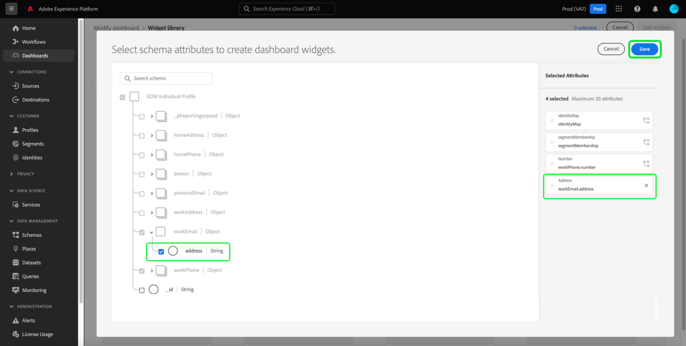

# Modification du schéma pour créer des widgets personnalisés

Pour créer des widgets personnalisés pour les tableaux de bord d’Adobe Experience Platform, vous devez d’abord identifier les attributs Real-time Customer Profile sur lesquels les widgets seront basés.

Ce guide fournit des instructions détaillées pour modifier le schéma de votre organisation en sélectionnant des attributs, afin de créer des widgets de tableaux de bord personnalisés.

Une fois les attributs sélectionnés et le schéma configuré, vous pouvez suivre la procédure de [création de widgets personnalisés pour vos tableaux de bord](custom-widgets.md).

>[!NOTE]
>
>Pour pouvoir modifier le schéma, les utilisateurs doivent disposer de l’autorisation « Gérer les tableaux de bord standard ». Pour obtenir des instructions sur l’octroi d’autorisations d’accès aux tableaux de bord, reportez-vous au [guide des autorisations des tableaux de bord](../permissions.md).

## Bibliothèque de widgets {#widget-library}

Ce guide nécessite l’accès à la [!UICONTROL bibliothèque de widgets] d’Experience Platform. Pour en savoir plus sur la bibliothèque de widgets et sur la façon d’y accéder dans l’interface utilisateur, commencez par lire la [présentation de la bibliothèque de widgets](widget-library.md).

## Modification du schéma

Dans la bibliothèque de widgets, l’onglet **[!UICONTROL Personnalisé]** vous permet de créer des widgets et de les partager avec d’autres utilisateurs de votre organisation afin de personnaliser l’aspect de vos tableaux de bord.

Avant de pouvoir créer des widgets personnalisés, vous devez sélectionner les attributs Real-time Customer Profile pour garantir l’inclusion des données dans l’instantané quotidien.

>[!IMPORTANT]
>
>Votre organisation peut sélectionner jusqu’à 20 attributs.

Si votre organisation n’a sélectionné aucun attribut de profil, commencez par sélectionner **[!UICONTROL Modifier le schéma]** dans le coin supérieur droit de la bibliothèque de widgets.

Après la création d’au moins un attribut personnalisé, sélectionnez **[!UICONTROL Modifier le schéma]** pour afficher les attributs sélectionnés et en ajouter d’autres.

## Sélection d’un attribut

Pour sélectionner un attribut dans la boîte de dialogue **[!UICONTROL Sélectionner un champ de schéma d’union]**, accédez à l’attribut dans le schéma d’union (ou utilisez la recherche) et cochez la case en regard de cet attribut. Si vous cochez la case, l’attribut est également ajouté à la liste **[!UICONTROL Attributs sélectionnés]** située dans la partie droite de la boîte de dialogue.

>[!NOTE]
>
>Pour qu’un attribut soit visible pour la sélection, il doit s’agir de l’un des éléments suivants : chaîne, date, date-heure, valeur booléenne, court, long, entier ou octet. Les types de données de mappage et double ne sont pas pris en charge et sont grisés afin d’empêcher leur sélection.

Après avoir choisi les attributs que vous souhaitez ajouter, sélectionnez **[!UICONTROL Enregistrer]** pour enregistrer vos attributs et revenir à l’onglet des widgets personnalisés.

>[!WARNING]
>Les attributs nouvellement sélectionnés sont disponibles après l’instantané quotidien suivant, lorsque l’actualisation des données est effectuée.

## Étapes suivantes

Après lecture de ce guide, vous êtes en mesure d’accéder à la bibliothèque de widgets et de sélectionner des attributs Real-time Customer Profile pour configurer votre schéma. Une fois les attributs de profil sélectionnés, vous pouvez démarrer la [création de widgets personnalisés pour vos tableaux de bord](custom-widgets.md).
