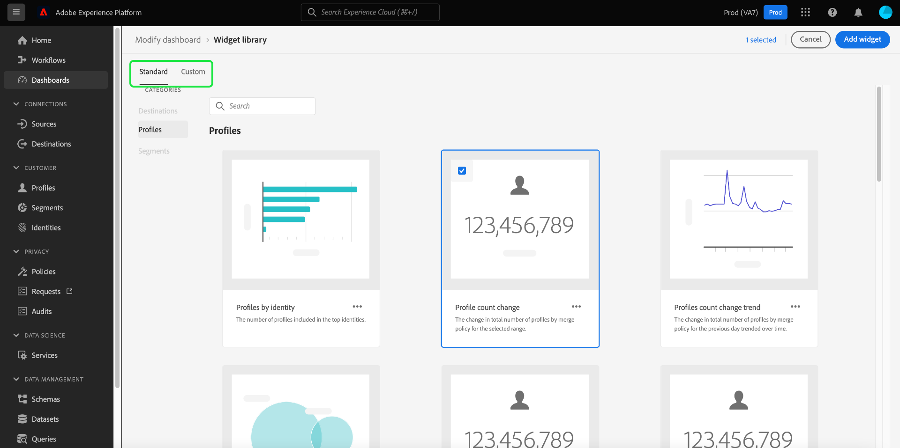

# Modification des tableaux de bord {#modify-dashboards}

L’interface utilisateur (IU) d’Adobe Experience Platform vous permet d’afficher les données de votre organisation et d’interagir avec elles à l’aide de plusieurs tableaux de bord. Les widgets et mesures par défaut affichés dans les tableaux de bord peuvent être ajustés au niveau de chaque utilisateur afin d’afficher les données préférées. Les widgets peuvent également être créés et partagés entre les utilisateurs d’une même organisation.

>[!NOTE]
>
>Toutes les mises à jour apportées aux tableaux de bord sont effectuées par organisation et par environnement de test.

Ce guide fournit des instructions détaillées pour personnaliser l’affichage des données dans les tableaux de bord [!UICONTROL Profils], [!UICONTROL Segments] et [!UICONTROL Destinations] dans l’interface utilisateur de Platform.

## Prise en main

Depuis n’importe quel tableau de bord (par exemple, le tableau de bord [!UICONTROL Profils]), vous pouvez sélectionner **[!UICONTROL Modifier le tableau de bord]** afin de redimensionner et de réorganiser les widgets existants.

## Réorganisation de widgets

Après avoir choisi de modifier le tableau de bord, vous pouvez réorganiser les widgets en sélectionnant le titre des widgets, puis en les faisant glisser et en les déposant dans l’ordre souhaité. Dans cet exemple, le widget **[!UICONTROL Tendance du nombre de profils]** est déplacé vers la ligne supérieure et le widget **[!UICONTROL Nombre de profils]** apparaît sur la deuxième ligne.

## Redimensionnement de widgets

Vous pouvez également redimensionner un widget en sélectionnant le symbole d’angle dans le coin inférieur droit du widget (`⌟`) et en faisant glisser le widget à la taille souhaitée. Dans cet exemple, le widget **[!UICONTROL Profils par identité]** est redimensionné de façon à remplir l’intégralité de la ligne supérieure, déplaçant automatiquement les autres widgets vers la deuxième ligne. Notez la façon dont l’axe horizontal s’ajuste pour fournir des incréments plus détaillés lorsque le widget s’agrandit.

>[!NOTE]
>
>Lors de l’ajustement de la taille des widgets, un repositionnement dynamique est effectué pour les widgets environnants. Cela peut entraîner le déplacement de certains widgets vers d’autres lignes. Il vous faut alors faire défiler l’écran pour afficher tous les widgets.

## Enregistrement des mises à jour de tableaux de bord

Une fois que vous avez déplacé et redimensionné les widgets, sélectionnez **[!UICONTROL Enregistrer et quitter]** pour enregistrer les modifications et revenir à la vue principale du tableau de bord. Si vous ne souhaitez pas conserver vos modifications, sélectionnez **[!UICONTROL Annuler]** pour réinitialiser le tableau de bord et revenir à l’affichage principal du tableau de bord.

## Bibliothèque de widgets

Outre le redimensionnement et la réorganisation des widgets, la sélection de **[!UICONTROL Modifier le tableau de bord]** dans les tableaux de bord [!UICONTROL Profils], [!UICONTROL Segments] et [!UICONTROL Destinations] vous permet d’accéder à la **[!UICONTROL bibliothèque de widgets]**, dans laquelle vous pouvez trouver d’autres widgets à afficher ou créer des widgets personnalisés pour votre organisation.

Pour obtenir des instructions détaillées sur l’accès et l’utilisation de la [!UICONTROL bibliothèque de widgets], reportez-vous au [guide de la bibliothèque de widgets](widget-library.md).

## Étapes suivantes

Après lecture de ce document, vous savez comment utiliser la fonctionnalité de modification de tableau de bord pour réorganiser et redimensionner les widgets afin de personnaliser l’affichage de votre tableau de bord. Pour savoir comment créer et ajouter des widgets à vos tableaux de bord, consultez le [guide de la bibliothèque de widgets](widget-library.md).
