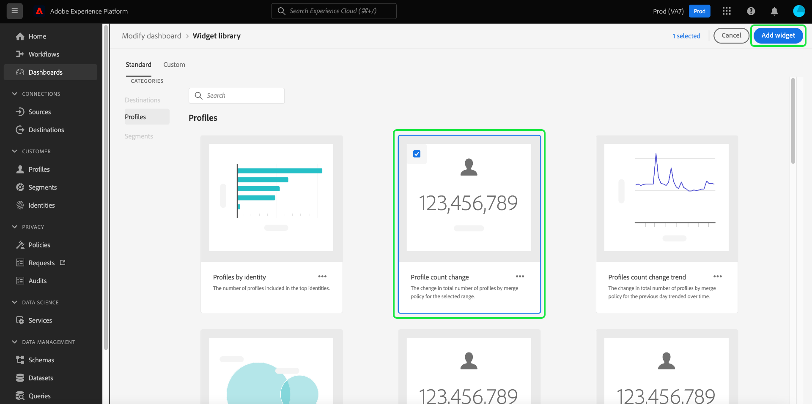
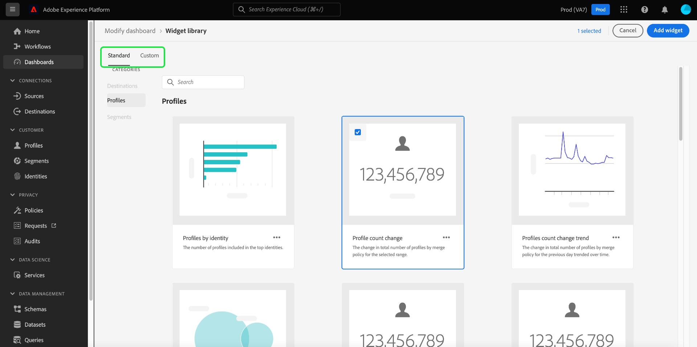

# Présentation de la bibliothèque de widgets

L’interface utilisateur d’Adobe Experience Platform vous permet d’afficher les données de votre organisation et d’interagir avec elles à l’aide de plusieurs tableaux de bord. Vous pouvez également mettre à jour certains tableaux de bord en ajoutant des widgets à l’affichage du tableau de bord.

Ce guide fournit des instructions détaillées pour accéder à la [!UICONTROL bibliothèque de widgets] dans Experience Platform, où vous pouvez sélectionner des widgets standard et créer des widgets personnalisés pour changer les informations affichées dans vos tableaux de bord.

>[!NOTE]
>
>Toutes les mises à jour apportées aux tableaux de bord sont effectuées par organisation et par environnement de test.

Pour plus d’informations sur la manière de modifier l’emplacement et la taille des widgets déjà affichés dans vos tableaux de bord, reportez-vous au [guide de modification des tableaux de bord](modify.md).

## Accès à la bibliothèque de widgets {#access}

Dans n’importe quel tableau de bord (par exemple, le tableau de bord Profils ), sélectionnez **[!UICONTROL Ajouter un widget]** pour accéder directement à la bibliothèque de widgets où vous pouvez [ajouter des widgets](#add-widgets) à votre tableau de bord.

Sélectionnez **[!UICONTROL Modifier le tableau de bord]** pour déplacer, redimensionner ou supprimer des widgets de votre tableau de bord. À partir de cet affichage, vous pouvez également sélectionner la **[!UICONTROL bibliothèque de widgets]** pour parcourir et [ajouter des widgets](#add-widgets). Pour savoir comment modifier la taille et la mise en page des widgets, consultez la [documentation Modifier les tableaux de bord](./modify.md).

Sélectionnez **[!UICONTROL Bibliothèque de widgets]** pour ouvrir la bibliothèque de widgets et afficher toutes les mesures standard disponibles ou commencer à créer des widgets personnalisés.

## Ajouter des widgets {#add-widgets}

Dans la [!UICONTROL bibliothèque de widgets], sélectionnez un widget dans la liste des widgets standard ou personnalisés disponibles. Une coche dans le coin du widget indique votre sélection.

### Libellé en cours d’utilisation {#in-use-label}

Les widgets déjà ajoutés à un tableau de bord sont associés à une étiquette [!UICONTROL En cours d’utilisation] lorsqu’ils sont affichés dans la bibliothèque de widgets. Ce libellé met en évidence les widgets qui ont déjà été ajoutés à votre tableau de bord afin d’éviter la duplication. Cependant, vous pouvez toujours ajouter le même widget plusieurs fois si vous le souhaitez.

Une fois que vous avez sélectionné tous les widgets requis, sélectionnez **[!UICONTROL Ajouter des widgets]** pour confirmer votre choix et ajouter les widgets à votre tableau de bord.

## Widgets standard et personnalisés {#standard-and-custom}

La [!UICONTROL Bibliothèque de widgets] contient deux onglets :

* **[!UICONTROL Standard] :** l’onglet standard contient les widgets fournis par Adobe. Vous pouvez mettre à jour vos tableaux de bord à lʼaide de lʼune de ces mesures standard. Pour en savoir plus sur l’ajout de widgets standard à votre tableau de bord, reportez-vous au guide relatif à [l’utilisation de widgets standard dans les tableaux de bord](standard-widgets.md).
* **[!UICONTROL Personnalisé] :** l’onglet personnalisé vous permet de créer et de partager des widgets au sein de votre organisation. Pour connaître la procédure complète afin de créer vos propres widgets, reportez-vous au [guide des widgets personnalisés pour les tableaux de bord](custom-widgets.md).

## Étapes suivantes

Après lecture de ce document, vous êtes désormais en mesure d’accéder à la bibliothèque de widgets dans l’interface utilisateur d’Experience Platform. Pour modifier la taille et l’emplacement des widgets qui apparaissent dans le tableau de bord, reportez-vous au [guide de modification des tableaux de bord](modify.md).
