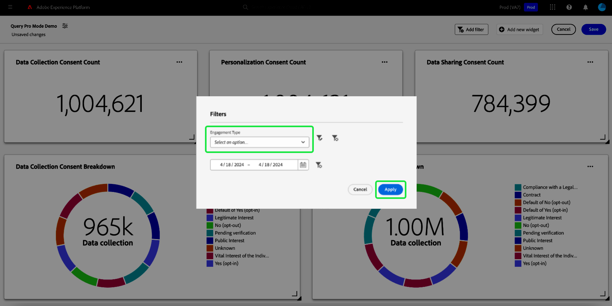

# Créer un filtre global {#create-global-filter}

Pour créer un filtre global, commencez par sélectionner **[!UICONTROL Ajouter un filtre]** dans la vue du tableau de bord, puis **[!UICONTROL Filtre global]** dans le menu déroulant.

>[!IMPORTANT]
>
>Assurez-vous d’associer vos filtres globaux à tous vos graphiques. Il ne s’agit pas d’un processus automatique. Pour utiliser un filtre global, vous devez inclure un [paramètre de requête](../../../../query-service/ui/parameterized-queries.md) dans le SQL de votre graphique, [activer le filtre global ;](#enable-global-filter) dans le compositeur de widgets, et [sélectionner une valeur d’exécution ;](#select-global-filter) pour le paramètre dans la boîte de dialogue de filtrage global. Consultez le guide de pro-requête pour savoir comment modifier votre SQL si vous devez incorporer un paramètre de requête.

Vous pouvez rapidement modifier les insights fournis par votre SQL avec des filtres globaux personnalisés.

La variable [!UICONTROL Créer un filtre global] s’ouvre. La création d&#39;un filtre global suit le même processus que la création d&#39;un insight avec SQL. Sélectionnez d’abord une base de données (modèle de données d’insights) à interroger, puis saisissez votre code SQL personnalisé dans Query Editor, puis enfin sélectionnez l’icône d’exécution ().

>[!IMPORTANT]
>
>Lorsque vous créez un filtre global, vous devez inclure un identifiant et une valeur. Les exemples de valeurs vous permettent d’exécuter l’instruction SQL et de créer le graphique. Notez que les exemples de valeurs que vous fournissez lors de la composition de votre instruction sont remplacés par les valeurs réelles que vous sélectionnez pour la date ou le filtre global au moment de l’exécution.

Une fois la requête exécutée, l’onglet Résultats affiche les résultats. Sélectionnez **[!UICONTROL Suivant]**.

![La variable [!UICONTROL Création d’une boîte de dialogue de filtre global] avec le menu déroulant du jeu de données, l’icône d’exécution et Suivant sont mises en surbrillance.](../../../images/customizable-insights/global-filter.png)

La dernière étape du workflow de création de filtre global nécessite l’ajout d’un libellé pour votre filtre. Ajoutez un libellé au **[!UICONTROL Libellé du filtre]** texte et sélectionnez un type de filtre dans la liste déroulante.

>[!NOTE]
>
>Seule la variable [!UICONTROL Zone de liste déroulante] l’option de type filtre est actuellement prise en charge.

Enfin, sélectionnez **[!UICONTROL Sélectionner]** pour revenir à la vue du tableau de bord.

![La variable [!UICONTROL Création d’une boîte de dialogue de filtre global] avec Sélectionner et la saisie de texte Libellé du filtre mise en surbrillance.](../../../images/customizable-insights/global-filter-label.png)

## Activer le filtre global pour chaque insight {#enable-global-filter}

>[!TIP]
>
>Activez les filtres globaux dans chaque graphique que vous créez. Vous avez ainsi la garantie que les valeurs que vous choisissez comme filtre global à refléter dans tous vos graphiques.

Après avoir créé votre filtre global pour votre tableau de bord, le bouton d’activation/désactivation de ce filtre global devient disponible dans le cadre du compositeur de widgets.

>[!IMPORTANT]
>
>Assurez-vous que le paramètre de filtre global est inclus dans le SQL de chaque insight.

## Sélectionner un filtre global {#select-global-filter}

Pour ouvrir la [!UICONTROL Filtres] qui répertorie tous vos filtres personnalisés, sélectionnez l’icône de filtre () à gauche de votre tableau de bord. Ensuite, pour appliquer les effets sur vos insights de tableau de bord, sélectionnez une option dans le menu déroulant de votre filtre global, puis sélectionnez **[!UICONTROL Appliquer]**.

