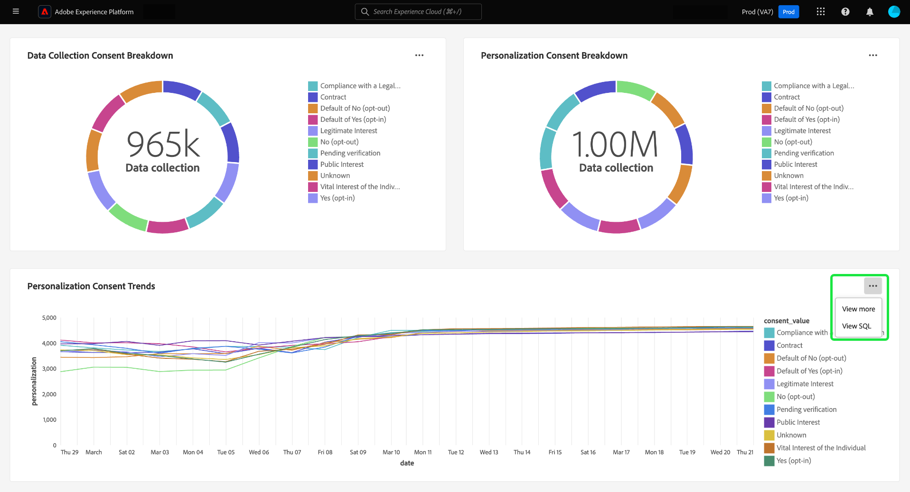

# Afficher plus {#view-more}

Une fois que vous avez créé un [aperçu personnalisé](./overview.md) avec le [ mode de requête pro ](./query-pro-mode.md), vous pouvez afficher vos données de graphique dans différents formats. Vous pouvez afficher une forme de tableau des résultats ou télécharger les données sous la forme d’un fichier CSV à afficher dans une feuille de calcul.

## Résultats tabulés {#tabulated-results}

Pour chaque graphique créé en mode de requête pro via SQL, vous pouvez visualiser les résultats tabulés de votre analyse dans l’interface utilisateur de l’Experience Platform.

Dans votre tableau de bord personnalisé, sélectionnez les ellipses (`...`) de n’importe quel widget pour accéder aux options [!UICONTROL Afficher plus] et [!UICONTROL Afficher SQL] .

## Télécharger le fichier CSV {#download-csv}

La fonction [!UICONTROL Afficher plus] affiche sous forme tabulaire les points de données spécifiques du graphique. Pour simplifier le processus de partage et de manipulation des données, vous pouvez télécharger les données traitées au format CSV à partir de cette boîte de dialogue. Sélectionnez **[!UICONTROL Télécharger CSV]** pour télécharger vos données.

>[!NOTE]
>
>Le téléchargement CSV est limité aux 500 premiers enregistrements.

## Étapes suivantes

Après avoir lu ce document, vous savez maintenant comment afficher les résultats tabulés de l’analyse SQL de votre graphique personnalisé et télécharger les données sous forme de fichier CSV. Consultez le document d’affichage SQL pour savoir comment [afficher le code SQL derrière vos insights personnalisés](./view-more.md).

Vous pouvez également apprendre à générer des graphiques à partir de modèles de données existants dans l’interface utilisateur de Adobe Experience Platform avec le [guide de mode de conception guidé](../../user-defined-dashboards.md).
