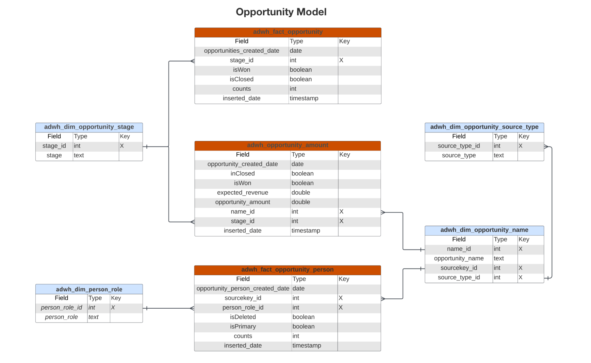

# B2B edition du modèle de données d’informations Real-Time CDP

Le modèle de données Real-Time CDP Insights pour B2B edition expose les modèles de données et SQL qui alimentent les informations pour les [profils de compte](https://experienceleague.adobe.com/en/docs/experience-platform/rtcdp/account/account-profile-overview). Vous pouvez personnaliser ces modèles de requête SQL pour créer des rapports Real-Time CDP pour vos cas d’utilisation de marketing B2B et d’indicateurs clés de performance (KPI). Ces informations peuvent ensuite être utilisées comme widgets personnalisés pour vos tableaux de bord.

>[!AVAILABILITY]
>
>Cette fonctionnalité est disponible pour les clients qui ont acheté les packages Real-Time CDP Prime et Ultimate. Consultez la documentation sur les [éditions de Real-Time CDP disponibles](../../rtcdp/overview.md#rtcdp-editions) pour plus d’informations, ou contactez votre représentant Adobe.

<!-- 
See the query accelerated store reporting insights documentation to learn [how to build a reporting insights data model through Query Service for use with accelerated store data and user-defined dashboards](../../query-service/data-distiller/sql-insights/reporting-insights-data-model.md).
 -->

## Conditions préalables

Ce guide nécessite une connaissance pratique des tableaux de bord personnalisés. Lisez la documentation sur [comment créer un tableau de bord personnalisé](../standard-dashboards.md) avant de poursuivre avec ce guide.

## Rapports et cas d’utilisation Real-Time CDP B2B insight {#B2B-insight-reports-and-use-cases}

Les rapports B2B de Real-Time CDP fournissent des informations sur les données des profils de votre compte et sur la relation entre les comptes et les opportunités. Les modèles de schéma en étoile suivants ont été développés pour répondre à divers cas d’utilisation marketing courants. Chaque modèle de données peut prendre en charge plusieurs cas d’utilisation.

>[!IMPORTANT]
>
>Les données utilisées pour les rapports B2B de Real-Time CDP sont exactes pour une politique de fusion choisie et à partir de l’instantané quotidien le plus récent.

### Modèle de profil de compte {#account-profile-model}

Le modèle de profil de compte se compose de huit jeux de données :

- `adwh_dim_industry`
- `adwh_dim_account_name`
- `adwh_dim_geo`
- `adwh_dim_account_type`
- `adwh_fact_account`
- `account_revenue_employee`

Le diagramme ci-dessous affiche les champs de données pertinents dans chaque jeu de données, leur type de données et les clés étrangères liant les jeux de données.


#### Cas pratique des nouveaux comptes par secteur {#accounts-by-industry}

La logique utilisée pour le [!UICONTROL New accounts by industry] insight renvoie les cinq principaux secteurs d’activité en fonction de leur nombre de profils de compte et de leur taille relative les uns par rapport aux autres. Pour plus d’informations[[!UICONTROL New accounts By Industry] consultez la documentation sur le widget ](../guides/account-profiles.md#accounts-by-industry) .

>[!TIP]
>
>Vous pouvez personnaliser cette requête SQL pour qu’elle renvoie plus ou moins de valeurs que pour les cinq principaux secteurs d’activité.

Le code SQL qui génère le [!UICONTROL New accounts by industry] insight est visible dans la section réductible ci-dessous.

+++Requête SQL

```sql
WITH RankedIndustries AS (
    SELECT
        i.industry,
        SUM(f.counts) AS total_accounts,
        ROW_NUMBER() OVER (ORDER BY SUM(f.counts) DESC) AS industry_rank
    FROM
        adwh_fact_account f
    INNER JOIN adwh_dim_industry i ON f.industry_id = i.industry_id
    WHERE f.accounts_created_date between UPPER(COALESCE('$START_DATE', '')) and UPPER(COALESCE('$END_DATE', ''))
    GROUP BY
        i.industry
)
SELECT
    CASE
        WHEN industry_rank <= 5 THEN industry
        ELSE 'Others'
    END AS industry_group,
    SUM(total_accounts) AS total_accounts
FROM
    RankedIndustries
GROUP BY
    CASE
        WHEN industry_rank <= 5 THEN industry
        ELSE 'Others'
    END
ORDER BY
    total_accounts DESC
LIMIT 5000;
```

+++

#### Cas d’utilisation des nouveaux comptes par type {#accounts-by-type}

La logique utilisée par [!UICONTROL New accounts by type] insight renvoie la répartition numérique des comptes par type. Cette insight peut vous aider à orienter la stratégie commerciale et les opérations, y compris l’allocation des ressources ou les stratégies marketing. Pour plus d’informations[[!UICONTROL New accounts by type] consultez la documentation sur le widget ](../guides/account-profiles.md#accounts-by-type) .

Le code SQL qui génère le [!UICONTROL New accounts by type] insight est visible dans la section réductible ci-dessous.

+++Requête SQL

```sql
SELECT t.account_type,
       Sum(f.counts) AS account_count
FROM   adwh_fact_account f
       JOIN adwh_dim_account_type t
         ON f.account_type_id = t.account_type_id
WHERE  accounts_created_date BETWEEN Upper(Coalesce('$START_DATE', '')) AND
                                     Upper(
                                     Coalesce('$END_DATE', ''))
GROUP  BY t.account_type
LIMIT  5000; 
```

+++

### Modèle d’opportunité {#opportunity-model}

Le modèle d’opportunité se compose de sept jeux de données :

- `adwh_dim_opportunity_stage`
- `adwh_dim_person_role`
- `adwh_dim_opportunity_source_type`
- `adwh_dim_opportunity_name`
- `adwh_fact_opportunity`
- `adwh_opportunity_amount`
- `adwh_fact_opportunity_person`

Le diagramme ci-dessous affiche les champs de données pertinents dans chaque jeu de données.


