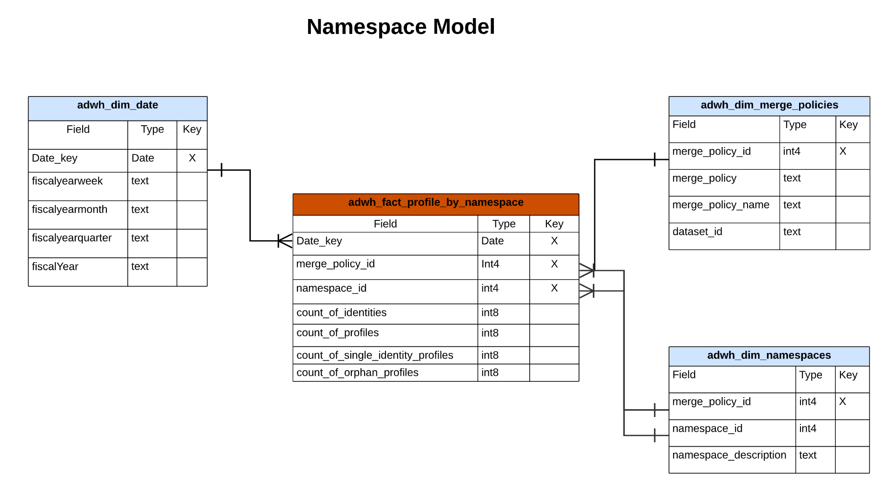

# B2C Edition du modèle de données d’informations Real-Time Customer Data Platform

Le modèle de données d’informations Real-Time Customer Data Platform pour [B2C Edition](../../rtcdp/overview.md#rtcdp-b2c) expose les modèles de données et SQL qui alimentent les informations pour divers widgets de profil, de destination et de segmentation. Vous pouvez personnaliser ces modèles de requête SQL pour créer des rapports Real-Time CDP pour vos cas d’utilisation de marketing et d’indicateurs clés de performance (KPI). Ces informations peuvent ensuite être utilisées comme widgets personnalisés pour vos tableaux de bord définis par l’utilisateur. Consultez la documentation sur les informations de rapports du magasin accéléré de requêtes pour découvrir [comment créer un modèle de données d’informations de rapports via Query Service à utiliser avec les données du magasin accéléré et les tableaux de bord définis par l’utilisateur](../../query-service/data-distiller/sql-insights/reporting-insights-data-model.md).

>[!NOTE]
>
>Le terme « segment » a été remplacé par « audience » sur l’ensemble des systèmes Adobe Experience Platform. Certaines références aux segments restent utilisées pour les chemins d’accès aux fichiers et les conventions de dénomination des jeux de données.

## Conditions préalables

Ce guide nécessite une compréhension pratique de la [&#x200B; fonctionnalité des tableaux de bord définis par l’utilisateur](../standard-dashboards.md). Veuillez lire la documentation avant de poursuivre avec ce guide.

## Rapports et cas d’utilisation Real-Time CDP insight

La création de rapports Real-Time CDP fournit des informations sur vos données de profil et sur leur relation avec les audiences et les destinations. Plusieurs modèles de schéma en étoile ont été développés pour répondre à divers cas d’utilisation marketing courants. Chaque modèle de données peut prendre en charge plusieurs cas d’utilisation.

>[!IMPORTANT]
>
>Les données utilisées pour les rapports Real-Time CDP sont exactes pour une politique de fusion choisie et à partir de l’instantané quotidien le plus récent.

### Modèle de profil {#profile-model}

Le modèle de profil se compose de trois jeux de données :

- `adwh_dim_date`
- `adwh_fact_profile`
- `adwh_dim_merge_policies`

L’image ci-dessous contient les champs de données pertinents dans chaque jeu de données.


#### Cas d’utilisation du nombre de profils {#profile-count}

La logique utilisée pour le widget [!UICONTROL Profile count] renvoie le nombre total de profils fusionnés dans la banque de profils au moment où l’instantané a été pris. Pour plus d’informations[[!UICONTROL Profile count] consultez la documentation sur le widget &#x200B;](../guides/profiles.md#profile-count) .

Le code SQL qui génère le widget [!UICONTROL Profile count] est visible dans la section réductible ci-dessous.

+++Requête SQL

```sql
SELECT qsaccel.profile_agg.adwh_dim_merge_policies.merge_policy_name,
       sum(qsaccel.profile_agg.adwh_fact_profile.count_of_profiles) CNT
  FROM qsaccel.profile_agg.adwh_fact_profile
  LEFT OUTER JOIN qsaccel.profile_agg.adwh_dim_merge_policies ON qsaccel.profile_agg.adwh_dim_merge_policies.merge_policy_id=adwh_fact_profile.merge_policy_id
  WHERE qsaccel.profile_agg.adwh_fact_profile.date_key='2024-01-10'
    AND qsaccel.profile_agg.adwh_fact_profile.merge_policy_id = 2027892989
  GROUP BY qsaccel.profile_agg.adwh_dim_merge_policies.merge_policy_name;
```

+++

#### Cas d’utilisation des profils d’identité uniques {#single-identity-profiles}

La logique utilisée pour le widget [!UICONTROL Single identity profiles] fournit un nombre des profils de votre organisation qui ne disposent que d’un seul type d’identifiant qui crée leur identité. Pour plus d’informations[[!UICONTROL Single identity profiles] consultez la documentation sur le widget &#x200B;](../guides/profiles.md#single-identity-profiles) .

Le code SQL qui génère le widget [!UICONTROL Single identity profiles] est visible dans la section réductible ci-dessous.

+++Requête SQL

```sql
SELECT qsaccel.profile_agg.adwh_dim_merge_policies.merge_policy_name,
       sum(qsaccel.profile_agg.adwh_fact_profile.count_of_Single_Identity_profiles) CNT
  FROM qsaccel.profile_agg.adwh_fact_profile
  LEFT OUTER JOIN qsaccel.profile_agg.adwh_dim_merge_policies ON qsaccel.profile_agg.adwh_dim_merge_policies.merge_policy_id=adwh_fact_profile.merge_policy_id
  WHERE qsaccel.profile_agg.adwh_fact_profile.date_key='2024-01-10'
    AND qsaccel.profile_agg.adwh_fact_profile.merge_policy_id = 2027892989
  GROUP BY qsaccel.profile_agg.adwh_dim_merge_policies.merge_policy_name;
```

+++

### Modèle d’espace de noms {#namespace-model}

Le modèle d’espace de noms se compose des jeux de données suivants :

- `adwh_dim_date`
- `adwh_fact_profile_by_namespace`
- `adwh_dim_merge_policies`
- `adwh_dim_namespaces`

L’image ci-dessous contient les champs de données pertinents dans chaque jeu de données.



#### Profils par cas d’utilisation d’identité {#profiles-by-identity}

Le widget [!UICONTROL Profiles by identity] affiche la répartition des identités pour tous les profils fusionnés de votre banque de profils. Pour plus d’informations[[!UICONTROL Profiles by identity] consultez la documentation sur le widget &#x200B;](../guides/profiles.md#profiles-by-identity) .

Le code SQL qui génère le widget [!UICONTROL Profiles by identity] est visible dans la section réductible ci-dessous.

+++Requête SQL

```sql
SELECT qsaccel.profile_agg.adwh_dim_namespaces.namespace_description,
        sum(qsaccel.profile_agg.adwh_fact_profile_by_namespace_trendlines.count_of_profiles) count_of_profiles
  FROM qsaccel.profile_agg.adwh_fact_profile_by_namespace_trendlines
  LEFT OUTER JOIN qsaccel.profile_agg.adwh_dim_namespaces ON qsaccel.profile_agg.adwh_fact_profile_by_namespace_trendlines.namespace_id = qsaccel.profile_agg.adwh_dim_namespaces.namespace_id
  AND qsaccel.profile_agg.adwh_fact_profile_by_namespace_trendlines.merge_policy_id = qsaccel.profile_agg.adwh_dim_namespaces.merge_policy_id
  WHERE qsaccel.profile_agg.adwh_fact_profile_by_namespace_trendlines.merge_policy_id = 2027892989
    AND qsaccel.profile_agg.adwh_fact_profile_by_namespace_trendlines.date_key = '2024-01-10'
  GROUP BY qsaccel.profile_agg.adwh_fact_profile_by_namespace_trendlines.date_key,
          qsaccel.profile_agg.adwh_fact_profile_by_namespace_trendlines.merge_policy_id,
          qsaccel.profile_agg.adwh_dim_namespaces.namespace_description
  ORDER BY count_of_profiles DESC;
```

+++

#### Profils à identité unique par cas d’utilisation d’identité {#single-identity-profiles-by-identity}

La logique utilisée pour le widget [!UICONTROL Single identity profiles by identity] illustre le nombre total de profils qui sont identifiés avec un seul identifiant unique. Pour plus d’informations, consultez la documentation du widget [Profils d’identité unique par identité](../guides/profiles.md#single-identity-profiles-by-identity) .

Le code SQL qui génère le widget [!UICONTROL Single identity profiles by identity] est visible dans la section réductible ci-dessous.

+++Requête SQL

```sql
SELECT qsaccel.profile_agg.adwh_dim_namespaces.namespace_description,
        sum(qsaccel.profile_agg.adwh_fact_profile_by_namespace_trendlines.count_of_Single_Identity_profiles) count_of_Single_Identity_profiles
  FROM qsaccel.profile_agg.adwh_fact_profile_by_namespace_trendlines
  LEFT OUTER JOIN qsaccel.profile_agg.adwh_dim_namespaces ON qsaccel.profile_agg.adwh_fact_profile_by_namespace_trendlines.namespace_id = qsaccel.profile_agg.adwh_dim_namespaces.namespace_id
  AND qsaccel.profile_agg.adwh_fact_profile_by_namespace_trendlines.merge_policy_id = qsaccel.profile_agg.adwh_dim_namespaces.merge_policy_id
  WHERE qsaccel.profile_agg.adwh_fact_profile_by_namespace_trendlines.merge_policy_id = 2027892989
    AND qsaccel.profile_agg.adwh_fact_profile_by_namespace_trendlines.date_key = '2024-01-10'
  GROUP BY qsaccel.profile_agg.adwh_fact_profile_by_namespace_trendlines.date_key,
          qsaccel.profile_agg.adwh_fact_profile_by_namespace_trendlines.merge_policy_id,
          qsaccel.profile_agg.adwh_dim_namespaces.namespace_description;
```

+++

### Modèle d’audience {#audience-model}

Le modèle d’audience se compose des jeux de données suivants :

- `adwh_dim_date`
- `adwh_fact_profile_by_segment`
- `adwh_dim_merge_policies`
- `adwh_dim_segments`
- `adwh_dim_br_segment_destinations`
- `adwh_dim_destination`
- `adwh_dim_destination_platform`

L’image ci-dessous contient les champs de données pertinents dans chaque jeu de données.


#### Cas d’utilisation de la taille de l’audience {#audience-size}

La logique utilisée pour le widget [!UICONTROL Audience size] renvoie le nombre total de profils fusionnés dans l’audience sélectionnée au moment de l’instantané le plus récent. Pour plus d’informations[[!UICONTROL Audience size] consultez la documentation sur le widget &#x200B;](../guides/audiences.md#audience-size) .

Le code SQL qui génère le widget [!UICONTROL Audience size] est visible dans la section réductible ci-dessous.

+++Requête SQL

```sql
SELECT
  sum(
    qsaccel.profile_agg.adwh_fact_profile_by_segment_trendlines.count_of_profiles
  ) count_of_profiles
FROM
  qsaccel.profile_agg.adwh_fact_profile_by_segment_trendlines
  LEFT OUTER JOIN qsaccel.profile_agg.adwh_dim_segments ON qsaccel.profile_agg.adwh_fact_profile_by_segment_trendlines.segment_id = qsaccel.profile_agg.adwh_dim_segments.segment_id
WHERE
  qsaccel.profile_agg.adwh_fact_profile_by_segment_trendlines.segment_id = -1323307941
  AND qsaccel.profile_agg.adwh_fact_profile_by_segment_trendlines.merge_policy_id = 1914917902
  AND qsaccel.profile_agg.adwh_fact_profile_by_segment_trendlines.date_key = '2024-01-12';
```

+++

#### Cas d’utilisation de la tendance de changement de la taille de l’audience {#audience-size-change-trend}

La logique utilisée pour le widget [!UICONTROL Audience size change trend] fournit un graphique linéaire qui illustre la différence entre le nombre total de profils qualifiés pour une audience donnée et les instantanés quotidiens les plus récents. Pour plus d’informations[[!UICONTROL Audience size change trend] consultez la documentation sur le widget &#x200B;](../guides/audiences.md#audience-size-change-trend) .

Le code SQL qui génère le widget [!UICONTROL Audience size change trend] est visible dans la section réductible ci-dessous.

+++Requête SQL

```sql
SELECT date_key,
      Profiles_added
  FROM
    (SELECT rn_num,
            date_key,
            (count_of_profiles-lag(count_of_profiles, 1, 0) over(
                                                                ORDER BY date_key))Profiles_added
    FROM
      (SELECT date_key,
              sum(x.count_of_profiles)count_of_profiles,
              row_number() OVER (
                                  ORDER BY date_key) rn_num
        FROM qsaccel.profile_agg.adwh_fact_profile_by_segment_trendlines x
        INNER JOIN
          (SELECT MAX(process_date) last_process_date,
                  merge_policy_id
          FROM qsaccel.profile_agg.adwh_lkup_process_delta_log
          WHERE process_name = 'FACT_TABLES_PROCESSING'
            AND process_status = 'SUCCESSFUL'
          GROUP BY merge_policy_id) y ON x.merge_policy_id = y.merge_policy_id
        WHERE segment_id = 1333234510
          AND x.date_key >= dateadd(DAY, -30 -1, y.last_process_date)
        GROUP BY x.date_key) a)b
  WHERE rn_num > 1;
```

+++

#### Cas d’utilisation des destinations les plus utilisées {#most-used-destinations}

La logique utilisée dans le widget [!UICONTROL Most used destinations] répertorie les destinations les plus utilisées de votre organisation en fonction du nombre d’audiences mappées. Ce classement fournit à insight les destinations utilisées, tout en présentant éventuellement celles qui peuvent être sous-utilisées. Pour plus d’informations[[!UICONTROL Most used destinations] consultez la documentation sur le widget &#x200B;](../guides/destinations.md#most-used-destinations) .

Le code SQL qui génère le widget [!UICONTROL Most used destinations] est visible dans la section réductible ci-dessous.

+++Requête SQL

```sql
SELECT qsaccel.profile_agg.adwh_dim_destination.destination_name,
       qsaccel.profile_agg.adwh_dim_destination.destination_id,
       qsaccel.profile_agg.adwh_dim_destination.destination,
       count(DISTINCT qsaccel.profile_agg.adwh_dim_br_segment_destinations.segment_id) segment_count
  FROM qsaccel.profile_agg.adwh_dim_destination
  JOIN qsaccel.profile_agg.adwh_dim_br_segment_destinations ON qsaccel.profile_agg.adwh_dim_destination.destination_id = qsaccel.profile_agg.adwh_dim_br_segment_destinations.destination_id
  WHERE qsaccel.profile_agg.adwh_dim_destination.destination_name IS NOT NULL
  GROUP BY qsaccel.profile_agg.adwh_dim_destination.destination_name,
           qsaccel.profile_agg.adwh_dim_destination.destination,
           qsaccel.profile_agg.adwh_dim_destination.destination_id
  ORDER BY segment_count DESC
  LIMIT 20;
```

+++

#### Cas d’utilisation des audiences récemment activées {#recently-activated-audiences}

La logique du widget [!UICONTROL Recently activated audiences] fournit une liste des audiences mappées le plus récemment à une destination. Cette liste fournit un instantané des audiences et des destinations utilisées activement dans le système et peut aider à résoudre les problèmes de mappages erronés. Pour plus d’informations[[!UICONTROL Recently activated audiences] consultez la documentation sur le widget &#x200B;](../guides/destinations.md#recently-activated-audiences) .

Le code SQL qui génère le widget [!UICONTROL Recently activated audiences] est visible dans la section réductible ci-dessous.

+++Requête SQL

```sql
SELECT
  segment_name,
  segment,
  destination_name,
  a.create_time create_time
FROM
  qsaccel.profile_agg.adwh_dim_br_segment_destinations a
  INNER JOIN qsaccel.profile_agg.adwh_dim_segments b ON a.segment_id = b.segment_id
  INNER JOIN qsaccel.profile_agg.adwh_dim_destination c ON a.destination_id = c.destination_id
ORDER BY
  create_time DESC,
  segment
LIMIT
  20;
```

+++

### Modèle d’audience d’espace de noms {#namespace-audience-model}

Le modèle espace de noms-audience se compose des jeux de données suivants :

- `adwh_dim_date`
- `adwh_dim_namespaces`
- `adwh_fact_profile_by_segment_and_namespace`
- `adwh_dim_merge_policies`
- `adwh_dim_segments`
- `adwh_dim_br_segment_destinations`
- `adwh_dim_destination`
- `adwh_dim_destination_platform`

L’image ci-dessous contient les champs de données pertinents dans chaque jeu de données.


#### Profils par identité pour un cas d’utilisation d’audience {#audience-profiles-by-identity}

La logique utilisée dans le widget [!UICONTROL Profiles by identity] fournit une répartition des identités pour tous les profils fusionnés de votre banque de profils pour une audience donnée. Pour plus d’informations[[!UICONTROL Profiles by identity] consultez la documentation sur le widget &#x200B;](../guides/audiences.md#profiles-by-identity) .

Le code SQL qui génère le widget [!UICONTROL Profiles by identity] est visible dans la section réductible ci-dessous.

+++Requête SQL

```sql
SELECT qsaccel.profile_agg.adwh_dim_namespaces.namespace_description,
        sum(qsaccel.profile_agg.adwh_fact_profile_by_segment_and_namespace_trendlines.count_of_profiles) count_of_profiles
  FROM qsaccel.profile_agg.adwh_fact_profile_by_segment_and_namespace_trendlines
  LEFT OUTER JOIN qsaccel.profile_agg.adwh_dim_namespaces ON qsaccel.profile_agg.adwh_fact_profile_by_segment_and_namespace_trendlines.namespace_id = qsaccel.profile_agg.adwh_dim_namespaces.namespace_id
  AND qsaccel.profile_agg.adwh_fact_profile_by_segment_and_namespace_trendlines.merge_policy_id = qsaccel.profile_agg.adwh_dim_namespaces.merge_policy_id
  WHERE qsaccel.profile_agg.adwh_fact_profile_by_segment_and_namespace_trendlines.segment_id = 1333234510
    AND qsaccel.profile_agg.adwh_fact_profile_by_segment_and_namespace_trendlines.merge_policy_id = 1709997014
    AND qsaccel.profile_agg.adwh_fact_profile_by_segment_and_namespace_trendlines.date_key = '2024-01-10'
  GROUP BY qsaccel.profile_agg.adwh_dim_namespaces.namespace_description
  ORDER BY count_of_profiles DESC;
```

+++

### Modèle d’espace de noms de chevauchement

Le modèle d’espace de noms de chevauchement se compose des jeux de données suivants :

- `adwh_dim_date`
- `adwh_dim_overlap_namespaces`
- `adwh_fact_profile_overlap_of_namespace`
- `adwh_dim_merge_policies`

L’image ci-dessous contient les champs de données pertinents dans chaque jeu de données.


#### Cas d’utilisation de chevauchement d’identités (profils) {#profiles-identity-overlap}

La logique utilisée dans le widget [!UICONTROL Identity overlap] affiche le chevauchement des profils de votre **banque de profils** qui contiennent les deux identités sélectionnées. Pour plus d’informations, consultez la section [[!UICONTROL Identity overlap] le widget de la documentation du tableau de bord [!UICONTROL Profiles]](../guides/profiles.md#identity-overlap).

Le code SQL qui génère le widget [!UICONTROL Identity overlap] est visible dans la section réductible ci-dessous.

+++Requête SQL

```sql
SELECT Sum(overlap_col1) overlap_col1,
        Sum(overlap_col2) overlap_col2,
        coalesce(Sum(overlap_count), 0) overlap_count
  FROM
    (SELECT 0 overlap_col1,
            0 overlap_col2,
            Sum(count_of_profiles) overlap_count
    FROM qsaccel.profile_agg.adwh_fact_profile_overlap_of_namespace
    WHERE qsaccel.profile_agg.adwh_fact_profile_overlap_of_namespace.merge_policy_id = 2027892989
      AND qsaccel.profile_agg.adwh_fact_profile_overlap_of_namespace.date_key = '2024-01-10'
      AND qsaccel.profile_agg.adwh_fact_profile_overlap_of_namespace.overlap_id IN
        (SELECT a.overlap_id
          FROM
            (SELECT qsaccel.profile_agg.adwh_dim_overlap_namespaces.overlap_id overlap_id,
                    count(*) cnt_num
            FROM qsaccel.profile_agg.adwh_dim_overlap_namespaces
            WHERE qsaccel.profile_agg.adwh_dim_overlap_namespaces.merge_policy_id = 2027892989
              AND qsaccel.profile_agg.adwh_dim_overlap_namespaces.overlap_namespaces in ('avid',
                                                                                          'crmid')
            GROUP BY qsaccel.profile_agg.adwh_dim_overlap_namespaces.overlap_id)a
          WHERE a.cnt_num>1 )
    UNION ALL SELECT count_of_profiles overlap_col1,
                      0 overlap_col2,
                      0 overlap_count
    FROM qsaccel.profile_agg.adwh_fact_profile_by_namespace_trendlines
    JOIN qsaccel.profile_agg.adwh_dim_namespaces ON qsaccel.profile_agg.adwh_fact_profile_by_namespace_trendlines.namespace_id = qsaccel.profile_agg.adwh_dim_namespaces.namespace_id
    AND qsaccel.profile_agg.adwh_fact_profile_by_namespace_trendlines.merge_policy_id = qsaccel.profile_agg.adwh_dim_namespaces.merge_policy_id
    WHERE qsaccel.profile_agg.adwh_fact_profile_by_namespace_trendlines.merge_policy_id = 2027892989
      AND qsaccel.profile_agg.adwh_fact_profile_by_namespace_trendlines.date_key = '2024-01-10'
      AND qsaccel.profile_agg.adwh_dim_namespaces.namespace_description = 'avid'
    UNION ALL SELECT 0 overlap_col1,
                      count_of_profiles overlap_col2,
                      0 Overlap_count
    FROM qsaccel.profile_agg.adwh_fact_profile_by_namespace_trendlines
    JOIN qsaccel.profile_agg.adwh_dim_namespaces ON qsaccel.profile_agg.adwh_fact_profile_by_namespace_trendlines.namespace_id = qsaccel.profile_agg.adwh_dim_namespaces.namespace_id
    AND qsaccel.profile_agg.adwh_fact_profile_by_namespace_trendlines.merge_policy_id = qsaccel.profile_agg.adwh_dim_namespaces.merge_policy_id
    WHERE qsaccel.profile_agg.adwh_fact_profile_by_namespace_trendlines.merge_policy_id = 2027892989
      AND qsaccel.profile_agg.adwh_fact_profile_by_namespace_trendlines.date_key = '2024-01-10'
      AND qsaccel.profile_agg.adwh_dim_namespaces.namespace_description = 'crmid' )a;
```

+++

### Chevaucher l’espace de noms par modèle d’audience {#overlap-namespace-by-audience-model}

L’espace de noms de chevauchement par modèle d’audience se compose des jeux de données suivants :

- `adwh_dim_date`
- `adwh_dim_overlap_namespaces`
- `adwh_fact_profile_overlap_of_namespace_by_segment`
- `adwh_dim_merge_policies`
- `adwh_dim_segments`
- `adwh_dim_br_segment_destinations`
- `adwh_dim_destination`
- `adwh_dim_destination_platform`

L’image ci-dessous contient les champs de données pertinents dans chaque jeu de données.


#### Cas d’utilisation de chevauchement d’identités (audiences) {#audiences-identity-overlap}

La logique utilisée dans le widget de [!UICONTROL Audiences] du tableau de bord [!UICONTROL Identity overlap] illustre le chevauchement des profils qui contiennent les deux identités sélectionnées pour une audience particulière. Pour plus d’informations, consultez la section [[!UICONTROL Identity overlap] le widget de la documentation du tableau de bord [!UICONTROL Audiences]](../guides/audiences.md#identity-overlap).

Le code SQL qui génère le widget [!UICONTROL Identity overlap] est visible dans la section réductible ci-dessous.

+++Requête SQL

```sql
SELECT Sum(overlap_col1) overlap_col1,
        Sum(overlap_col2) overlap_col2,
        Sum(overlap_count) Overlap_count
  FROM
    (SELECT 0 overlap_col1,
            0 overlap_col2,
            Sum(count_of_profiles) Overlap_count
    FROM qsaccel.profile_agg.adwh_fact_profile_overlap_of_namespace_by_segment
    WHERE qsaccel.profile_agg.adwh_fact_profile_overlap_of_namespace_by_segment.segment_id = 1333234510
      AND qsaccel.profile_agg.adwh_fact_profile_overlap_of_namespace_by_segment.merge_policy_id = 1709997014
      AND qsaccel.profile_agg.adwh_fact_profile_overlap_of_namespace_by_segment.date_key = '2024-01-10'
      AND qsaccel.profile_agg.adwh_fact_profile_overlap_of_namespace_by_segment.overlap_id IN
        (SELECT a.overlap_id
          FROM
            (SELECT qsaccel.profile_agg.adwh_dim_overlap_namespaces.overlap_id overlap_id,
                    count(*) cnt_num
            FROM qsaccel.profile_agg.adwh_dim_overlap_namespaces
            WHERE qsaccel.profile_agg.adwh_dim_overlap_namespaces.merge_policy_id = 1709997014
              AND qsaccel.profile_agg.adwh_dim_overlap_namespaces.overlap_namespaces in ('crmid',
                                                                                          'email')
            GROUP BY qsaccel.profile_agg.adwh_dim_overlap_namespaces.overlap_id)a
          WHERE a.cnt_num>1 )
    UNION ALL SELECT count_of_profiles overlap_col1,
                      0 overlap_col2,
                      0 Overlap_count
    FROM qsaccel.profile_agg.adwh_fact_profile_by_segment_and_namespace_trendlines
    LEFT OUTER JOIN qsaccel.profile_agg.adwh_dim_namespaces ON qsaccel.profile_agg.adwh_fact_profile_by_segment_and_namespace_trendlines.namespace_id = qsaccel.profile_agg.adwh_dim_namespaces.namespace_id
    AND qsaccel.profile_agg.adwh_fact_profile_by_segment_and_namespace_trendlines.merge_policy_id = qsaccel.profile_agg.adwh_dim_namespaces.merge_policy_id
    WHERE qsaccel.profile_agg.adwh_dim_namespaces.namespace_description = 'crmid'
      AND qsaccel.profile_agg.adwh_fact_profile_by_segment_and_namespace_trendlines.segment_id = 1333234510
      AND qsaccel.profile_agg.adwh_fact_profile_by_segment_and_namespace_trendlines.merge_policy_id = 1709997014
      AND qsaccel.profile_agg.adwh_fact_profile_by_segment_and_namespace_trendlines.date_key = '2024-01-10'
    UNION ALL SELECT 0 overlap_col1,
                      count_of_profiles overlap_col2,
                      0 Overlap_count
    FROM qsaccel.profile_agg.adwh_fact_profile_by_segment_and_namespace_trendlines
    LEFT OUTER JOIN qsaccel.profile_agg.adwh_dim_namespaces ON qsaccel.profile_agg.adwh_fact_profile_by_segment_and_namespace_trendlines.namespace_id = qsaccel.profile_agg.adwh_dim_namespaces.namespace_id
    AND qsaccel.profile_agg.adwh_fact_profile_by_segment_and_namespace_trendlines.merge_policy_id = qsaccel.profile_agg.adwh_dim_namespaces.merge_policy_id
    WHERE qsaccel.profile_agg.adwh_dim_namespaces.namespace_description = 'email'
      AND qsaccel.profile_agg.adwh_fact_profile_by_segment_and_namespace_trendlines.segment_id = 1333234510
      AND qsaccel.profile_agg.adwh_fact_profile_by_segment_and_namespace_trendlines.merge_policy_id = 1709997014
      AND qsaccel.profile_agg.adwh_fact_profile_by_segment_and_namespace_trendlines.date_key = '2024-01-10' ) a;
```

+++

<!-- Commented out as Anil wanted to add something but did not provide information yet:
### Overlap Namespace-Audience model {#overlap-namespace-audience-model}

The overlap namespace-audience model is comprised of the following datasets: 

- `adwh_fact_profile_overlap_by_namespace_and_segment`
- `adwh_dim_date`
- `adwh_dim_namespace`
- `adwh_dim_overlap_namespaces`
- `adwh_dim_merge_policies`
- `adwh_dim_segments`
- `adwh_dim_br_segment_destinations`
- `adwh_dim_destination`
- `adwh_dim_destination_platform`

 -->

<!-- What insights are gathered from this particular data model? -->

<!-- Commented out as Anil wanted to add something but did not provide information yet:
### AI model {#ai-model}

The AI model is comprised of the following datasets: 

- `adwh_fact_profile_ai_models`
- `adwh_dim_date`
- `adwh_dim_merge_policies`
- `adwh_dim_ai_models`

 -->

<!-- What insights are gathered from this particular data model? -->

