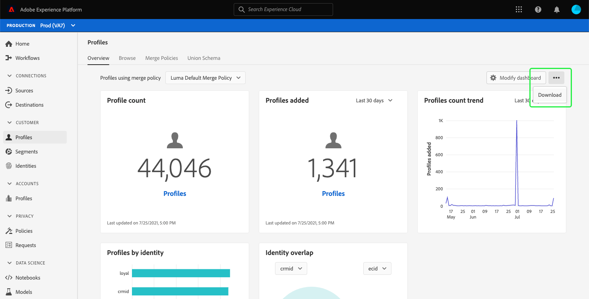
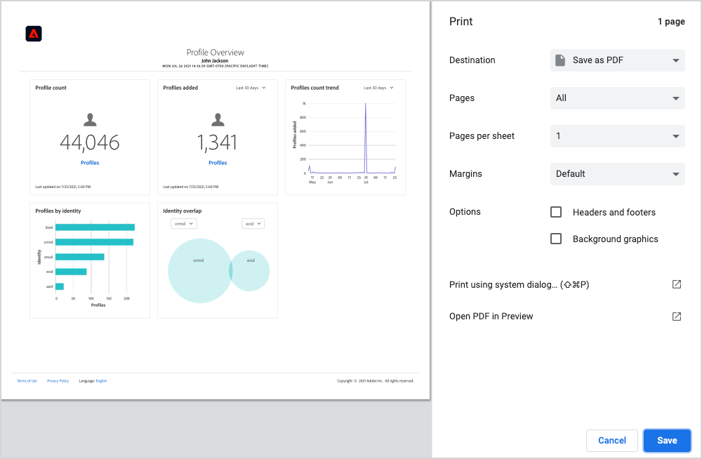
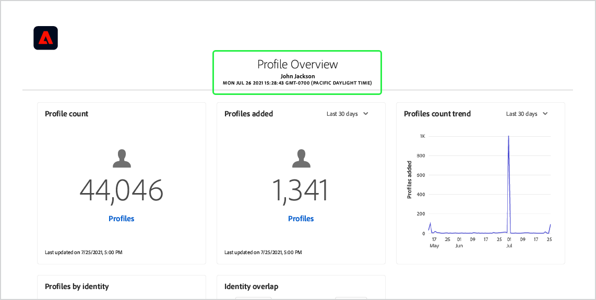
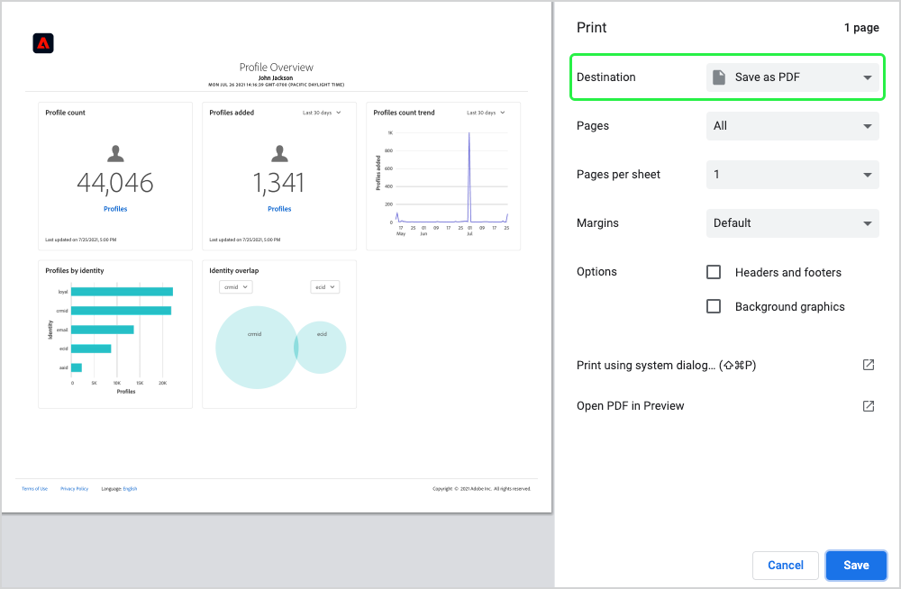
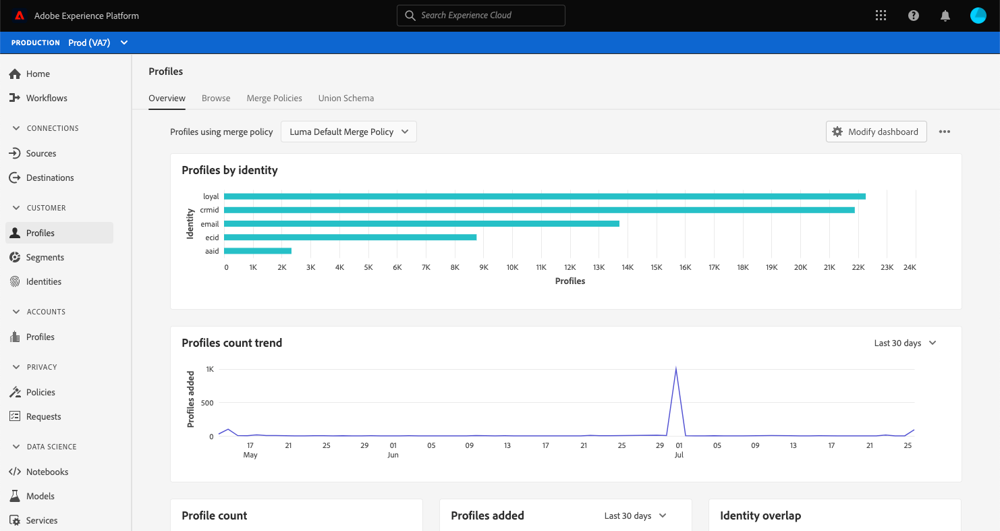
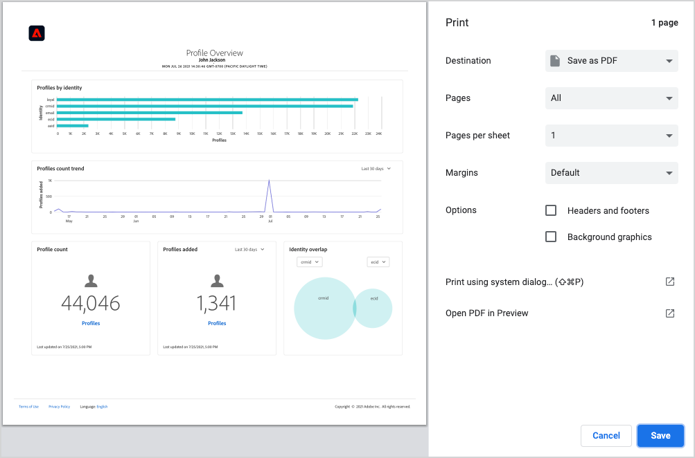

# Téléchargement de tableaux de bord au format PDF

Les tableaux de bord de Adobe Experience Platform peuvent être téléchargés sur PDF à partir de l’interface utilisateur d’Experience Platform afin de faciliter le partage d’informations avec les membres de votre organisation.

Ce document résume la procédure à suivre pour télécharger des tableaux de bord à l’aide de l’interface utilisateur d’Experience Platform et enregistrer le tableau de bord dans PDF à l’aide du menu d’impression par défaut du navigateur.

>[!WARNING]
>
>Les données contenues dans vos tableaux de bord peuvent inclure des informations d’identification personnelle (PII) sur vos clients ou des données sensibles liées à votre organisation. Toutes les données des tableaux de bord enregistrées au format PDF doivent être gérées de manière appropriée, conformément aux directives relatives à la confidentialité des données de votre organisation.

## Téléchargement de tableau de bord

Pour commencer à télécharger un tableau de bord, accédez au tableau de bord que vous souhaitez télécharger (par exemple, le tableau de bord [!UICONTROL Profiles]), puis sélectionnez le menu Plus d’options (**`...`**) dans le coin supérieur droit du tableau de bord. Ensuite, sélectionnez **[!UICONTROL Download]**.

## Prévisualisation PDF

Après avoir sélectionné **[!UICONTROL Download]**, le menu d’impression par défaut de votre navigateur s’ouvre. Cet exemple montre l’affichage du menu d’impression de Google Chrome.

Le menu d’impression vous permet de prévisualiser le PDF qui sera enregistré. Le PDF est une véritable représentation des widgets du tableau de bord tels qu’ils apparaissent dans l’interface utilisateur d’Experience Platform. La taille du PDF est automatiquement ajustée pour afficher tous les widgets du tableau de bord actuellement visibles sur une seule page.

Le fichier PDF inclut un en-tête généré automatiquement, lequel contient le logo d’Experience Platform, le nom du tableau de bord, votre nom ainsi que la date et l’heure de téléchargement du tableau de bord. Ces informations sont en lecture seule et ne peuvent pas être modifiées dans le PDF.

## Enregistrement au format PDF

Après avoir prévisualisé le PDF, sélectionnez **Enregistrer** pour choisir l’emplacement où vous souhaitez enregistrer le fichier PDF.

>[!NOTE]
>
>Si nécessaire, vous pouvez utiliser la liste déroulante **Destination** pour sélectionner **Enregistrer en tant que PDF** si cette option n’est pas automatiquement sélectionnée.

## Personnalisation des fichiers PDF de tableaux de bord

Le fichier PDF généré correspond au tableau de bord visible dans l’interface utilisateur et ne comprend que les widgets actuellement visibles dans votre tableau de bord. Certains tableaux de bord peuvent être personnalisés pour modifier la taille et l’emplacement des widgets ou pour ajouter et supprimer des widgets de l’affichage. La personnalisation de l’aspect de votre tableau de bord dans l’interface utilisateur d’Experience Platform modifie également l’aspect du PDF généré.

Par exemple, vous pouvez modifier l’aspect du tableau de bord des profils afin d’inclure plusieurs widgets pleine largeur empilés au-dessus de trois widgets standard.

Si vous choisissez de télécharger le tableau de bord mis à jour, une nouvelle prévisualisation du fichier PDF reprenant l’aspect du tableau de bord des profils personnalisés s’affiche. En outre, la taille du fichier PDF est automatiquement ajustée pour garantir l’inclusion de tous les widgets visibles dans un fichier PDF d’une seule page.

Pour en savoir plus sur la personnalisation des tableaux de bord, commencez par lire la [présentation de la personnalisation des tableaux de bord](customize/overview.md).

## Étapes suivantes

Maintenant que vous avez téléchargé votre tableau de bord et que vous l’avez enregistré au format PDF, vous pouvez répéter ces étapes pour télécharger des tableaux de bord supplémentaires ou partager le fichier PDF avec des membres de votre organisation.
