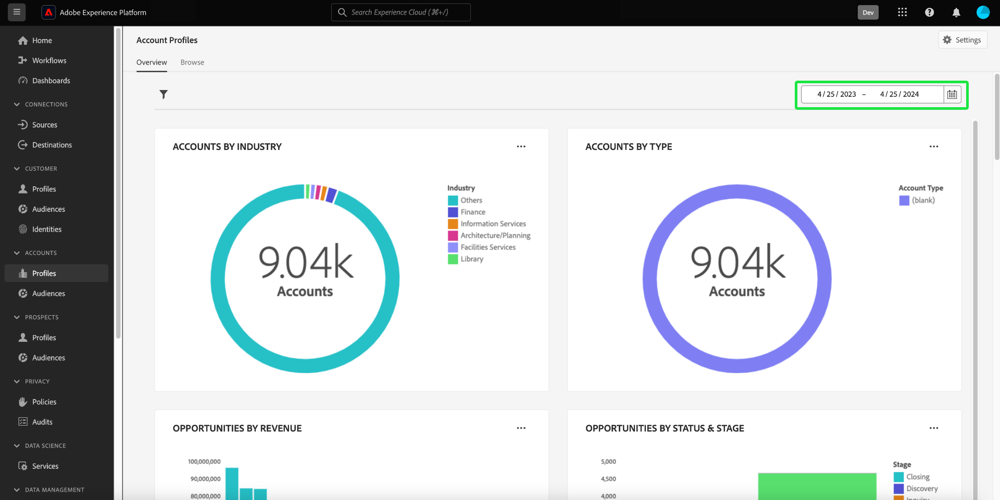
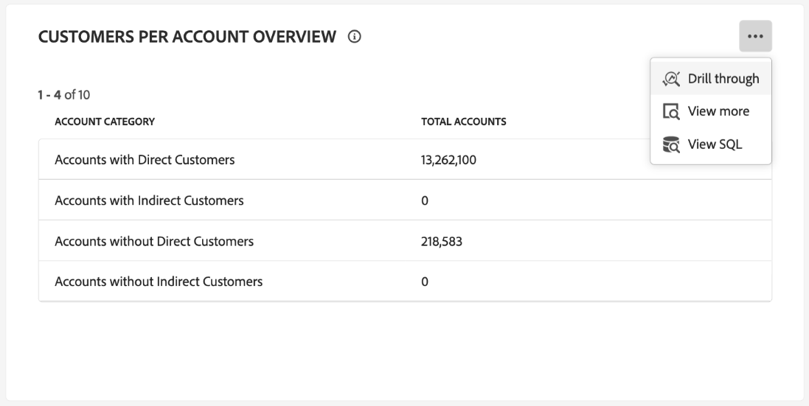
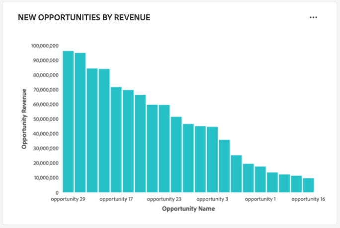

# Tableau de bord Profils de compte

L’interface utilisateur de Adobe Experience Platform fournit un tableau de bord grâce auquel vous pouvez afficher des informations importantes sur les profils de votre compte. Ceux-ci sont présentés tels qu’ils sont capturés lors d’instantanés quotidiens. Ce guide explique comment accéder au tableau de bord [!UICONTROL Account Profiles] et l’utiliser dans l’interface utilisateur. Il fournit également des informations supplémentaires sur les visualisations affichées dans le tableau de bord.

Ce document présente les fonctionnalités du tableau de bord [!UICONTROL Account Profiles] et détaille les informations standard disponibles. Consultez le guide de l’interface utilisateur de [[!UICONTROL Account Profiles]](../../rtcdp/accounts/account-profile-ui-guide.md) pour obtenir des détails complets sur ses fonctionnalités disponibles.

## Commencer

Vous devez disposer de l’autorisation [Adobe Real-Time Customer Data Platform B2B edition](../../rtcdp/b2b-overview.md) pour accéder au tableau de bord de l’[!UICONTROL Account Profiles] B2B.

## Données des profils de compte {#data}

Le tableau de bord [!UICONTROL Account Profiles] affiche un instantané des informations de votre compte unifié. Ces informations de compte proviennent des multiples sources de vos canaux marketing et des différents systèmes actuellement utilisés par votre organisation pour stocker les informations de compte client.

Les données de profil de l’instantané affichent les données telles qu’elles apparaissent au moment précis où l’instantané a été pris. En d’autres termes, l’instantané n’est pas une approximation ou un échantillon des données, et le tableau de bord [!UICONTROL Account Profiles] n’est pas mis à jour en temps réel.

>[!NOTE]
>
>Les modifications ou mises à jour apportées aux données depuis la prise dʼun instantané ne seront pas reflétées dans le tableau de bord avant la prise de lʼinstantané suivant.

## Explorer le tableau de bord [!UICONTROL Account Profiles] {#explore}

Pour accéder au tableau de bord [!UICONTROL Account Profiles] dans l’interface utilisateur d’Experience Platform, sélectionnez **[!UICONTROL Profiles]** sous [!UICONTROL Accounts] dans le panneau de navigation de gauche.

Depuis le tableau de bord [!UICONTROL Account Profiles], vous pouvez [parcourir les profils de compte ingérés dans votre organisation](#browse-account-profiles) ou [afficher l’intégralité des données de profil de compte en un coup d’œil à l’aide de widgets](#standard-widgets).

### Filtre de date {#date-filter}

L’onglet [!UICONTROL Overview] est composé de widgets qui fournissent des mesures en lecture seule pour transmettre des informations importantes sur les profils de votre compte. Sélectionnez l’icône ou les dates du calendrier pour modifier le filtre de date global de vos widgets.

>[!IMPORTANT]
>
>La période sélectionnée dans le calendrier déroulant affecte tous les insights, à l’exception des deux widgets de notation prédictive ([distribution](#predictive-scoring-distribution) et [principaux facteurs d’influence](#predictive-scoring-top-influential-factors)).

### Configuration du service de correspondance des prospects et des comptes {#lead-to-account-matching-service}

Sélectionnez **[!UICONTROL Settings]** pour configurer le service de correspondance des prospects et des comptes dans la boîte de dialogue [!UICONTROL Account settings]. Pour plus d’informations sur la configuration de la correspondance de votre prospect et de votre compte, consultez le [ guide de l’interface utilisateur](../../rtcdp/accounts/account-profile-ui-guide.md#configure-lead-to-account-matching). Pour en savoir plus sur la correspondance des prospects et des comptes, reportez-vous à la documentation [correspondance des prospects et des comptes) dans Real-Time CDP B2B ](../../rtcdp/b2b-ai-ml-services/lead-to-account-matching.md).

## Parcourir les profils de compte {#browse-account-profiles}

Dans l’onglet [!UICONTROL Browse] , vous pouvez rechercher et afficher les profils de compte en lecture seule ingérés dans votre organisation. Utilisez un identifiant de compte provenant d’une source d’entreprise connectée ou saisissez directement les détails de la source. Dans cet espace de travail, vous pouvez voir les informations importantes appartenant au profil de compte, notamment son nom, son secteur d’activité, son chiffre d’affaires et son audience.

Sélectionnez l’[!UICONTROL Profile ID] dans les résultats affichés dans l’onglet [!UICONTROL Browse] pour ouvrir l’onglet [!UICONTROL Details] du profil de compte.

Les informations de profil de compte affichées dans l’onglet [!UICONTROL Details] ont été fusionnées à partir de plusieurs fragments de profil afin de former une vue unique du compte individuel. Consultez la documentation sur la [navigation dans les profils de compte dans Adobe Real-Time Customer Data Platform](../../rtcdp/accounts/account-profile-ui-guide.md#browse-account-profiles) pour en savoir plus sur les fonctionnalités d’affichage des profils de compte dans l’interface utilisateur d’Experience Platform.

## Widgets standard {#standard-widgets}

>[!CONTEXTUALHELP]
>id="platform_dashboards_accountprofiles_customersperaccountoverview"
>title="Vue d’ensemble des clientes et clients par compte"
>abstract="Ce widget d’analyse fournit des informations sur la structure de vos données B2B. Il vous permet d’identifier le nombre de profils de compte auxquels aucun profil client n’est associé ou auxquels un ou plusieurs profils clients sont associés.<ul><li>Clients directs : profils clients directement associés à un compte par l’itinéraire `personComponents`.</li><li>Clients indirects : profils client associés à un compte via l’itinéraire `Account-Person`.</li></ul>"

Adobe fournit des widgets standard que vous pouvez utiliser pour visualiser différentes mesures liées aux profils de votre compte.

>[!IMPORTANT]
>
>Si vous ne fournissez pas de filtre de date, le comportement par défaut des insights analyse les données ajoutées de l’année précédente à aujourd’hui.

Pour en savoir plus sur chacun des widgets standards disponibles, sélectionnez le nom d’un widget dans la liste suivante :

* [Profils de compte ajoutés](#account-profiles-added)
* [Vue d’ensemble des clientes et clients par compte](#customers-per-account-overview)
   * [Présentation des opportunités par compte](#opportunities-per-account-overview)
   * [Détails des opportunités par compte](#opportunities-per-account-detail)
   * [Détails des clients par compte](#customers-per-account-detail)
* [Nouveaux comptes par secteur](#accounts-by-industry)
* [Nouveaux comptes par type](#accounts-by-type)
* [Nouvelles opportunités par rôle de personne](#opportunities-by-person-role)
* [Nouvelles opportunités par chiffre d’affaires](#opportunities-by-revenue)
* [Nouvelles opportunités par statut et étape](#opportunities-by-status-&-stage)
* [Nouvelles opportunités confirmées](#opportunities-won)
* [Opportunités ajoutées](#opportunities-added)
* [Répartition du score prédictif](#predictive-scoring-distribution)
* [Facteurs les plus influents du score prédictif](#predictive-scoring-top-influential-factors)

### Profils de compte ajoutés {#account-profiles-added}

Le widget [!UICONTROL Account profiles added] utilise un graphique linéaire pour afficher le nombre de profils de compte ajoutés chaque jour sur une période donnée. Utilisez le filtre de date global situé en haut de votre tableau de bord pour déterminer la période d’analyse. Si aucun filtre de date n’est fourni, le comportement par défaut répertorie les profils de compte ajoutés pour l’année précédant aujourd’hui. Les résultats peuvent être utilisés pour déduire une tendance du nombre de profils de compte ajoutés.

### Vue d’ensemble des clientes et clients par compte {#customers-per-account-overview}

>[!NOTE]
>
>Les [!UICONTROL Customers per account overview] insight et ses graphiques d’exploration amont ([!UICONTROL Customers per account detail], [!UICONTROL Opportunities per account overview], [!UICONTROL Opportunities per account detail]) ne sont pas affectés par les filtres de date globaux que vous avez peut-être définis.

Le graphique [!UICONTROL Customers per account overview] fournit une synthèse des comptes en fonction de leurs types de clients. Il affiche un tableau à quatre lignes qui classe les comptes comme ayant des clients directs ou indirects, ou ceux qui n’en ont pas. Il indique le nombre total de comptes pour chaque catégorie. Le graphique permet d’identifier la répartition des comptes ayant des clients directs et indirects.

Les clients directs sont des profils client directement liés à un compte par le biais de l’itinéraire `personComponents`. Cette relation est plus simple et implique un lien direct et explicite entre le client et le compte.

Les clients indirects sont des profils client liés à un compte via l’itinéraire `Account-Person`. Cette relation est moins simple et implique une entité intermédiaire ou un lien plus complexe entre le client et le compte, généralement par le biais d’autres comptes ou relations.

Pour accéder à des informations plus détaillées, sélectionnez l’ellipse (**...**) du graphique [!UICONTROL Customers per account overview] et choisissez **[!UICONTROL Drill through]** dans le menu déroulant.

La vue d&#39;exploration s&#39;affiche. Ensuite, explorez les graphiques d’exploration amont disponibles pour mieux comprendre la structure de vos données B2B. Vous pouvez utiliser ces graphiques d’exploration pour identifier le nombre de profils de compte auxquels aucun profil client n’est lié ou auxquels un ou plusieurs profils client sont associés. Vous pouvez également les utiliser pour identifier le nombre de clients directs ou indirects associés à vos comptes.

* [[!UICONTROL Customers per account detail]](#customers-per-account-detail)
* [[!UICONTROL Accounts per opportunity overview]](#accounts-per-opportunity-overview)
* [[!UICONTROL Opportunities per account detail]](#accounts-per-opportunity-detail)

### [!UICONTROL Navigate between dashboard views] {#dashboard-view-navigation}

Pour basculer entre l’exploration en amont et le tableau de bord Profils de compte , sélectionnez l’icône de dossier () suivi de l’affichage correct dans le menu déroulant.

Pour en savoir plus sur l’exploration amont dans l’interface utilisateur d’Experience Platform, consultez le [guide d’exploration amont](../sql-insights-query-pro-mode/drill-through.md).

#### [!UICONTROL Customers per account detail] {#customers-per-account-detail}

Le graphique [!UICONTROL Customers per account detail] fournit des détails plus précis sur le nombre de comptes associés à différents types de clients. Il affiche un tableau à trois colonnes détaillant le nombre de comptes par type de client (direct ou indirect), et la plage de clients qui leur est associée. Ce graphique vous permet de comprendre la répartition des clients entre les différentes catégories de clients et le nombre total de comptes associés à chacune d’elles.

#### [!UICONTROL Opportunities per account overview] {#opportunities-per-account-overview}

Le graphique [!UICONTROL Opportunities per account overview] présente un résumé des comptes qui ont ou n’ont pas d’opportunités. Ce tableau à deux lignes permet de déterminer rapidement le nombre de comptes associés aux opportunités, fournissant ainsi un instantané de l’engagement des opportunités entre les comptes.

#### [!UICONTROL Opportunities per account detail] {#opportunities-per-account-detail}

Le graphique [!UICONTROL Opportunities per account detail] propose une répartition plus détaillée des comptes en fonction du nombre d’opportunités dont ils disposent. Le tableau affiche le nombre de comptes regroupés par plages de nombres d’opportunités, par exemple 1 à 10 opportunités ou plus de 100 opportunités. Ce graphique permet d’identifier la manière dont les comptes sont distribués en fonction du nombre d’opportunités gérées par les comptes.

### Nouveaux comptes par secteur {#accounts-by-industry}

Le widget [!UICONTROL New accounts by industry] affiche le nombre total de comptes dans une seule mesure dans un graphique en anneau. Le graphique en anneau illustre la composition relative des différentes industries qui composent ce total. Une clé à code couleur fournit une répartition de tous les secteurs d’activité inclus. Les décomptes individuels de chaque secteur s’affichent dans une boîte de dialogue lorsque le curseur survole la section correspondante du graphique en anneau.

### Nouveaux comptes par type {#accounts-by-type}

Le widget [!UICONTROL New accounts by type] affiche le nombre total de comptes dans une seule mesure dans un graphique en anneau. Le graphique en anneau illustre la composition relative des différents types de comptes qui composent ce total. Une clé codée par couleur fournit une répartition de tous les types de compte inclus. Les nombres individuels pour chaque type de compte sont affichés dans une boîte de dialogue lorsque le curseur survole la section correspondante du graphique en anneau.

### Nouvelles opportunités par rôle de personne {#opportunities-by-person-role}

Le widget [!UICONTROL New opportunities by person role] affiche le nombre total de vos opportunités dans une seule mesure à l’intérieur d’un graphique en anneau. Le graphique en anneau illustre la composition relative des rôles qui composent ce nombre total d’opportunités. Une clé codée par couleur fournit une répartition de tous les rôles inclus. Les nombres individuels de chaque rôle sont affichés dans une boîte de dialogue lorsque le curseur survole la section correspondante du graphique en anneau.

>[!NOTE]
>
>L’erreur [!UICONTROL No data found] ou [!UICONTROL Unable to load] est due au fait que la table-pont « Opportunity-Person » n’est pas utilisée dans votre schéma. Si votre insight affiche l’une de ces erreurs, vérifiez votre schéma d’union et assurez-vous que le groupe de champs « Opportunité-Personne » ingère des données.

### Nouvelles opportunités par chiffre d’affaires {#opportunities-by-revenue}

Le widget [!UICONTROL New opportunities by revenue] utilise un graphique à barres pour illustrer le montant total estimé des recettes générées par vos opportunités. Le widget prend en charge jusqu’à six opportunités.

Pour afficher une boîte de dialogue contenant le chiffre d’affaires total spécifique d’une opportunité, utilisez le curseur pour pointer sur des barres individuelles.

### Nouvelles opportunités par statut et étape {#opportunities-by-status-&-stage}

Ce widget utilise un graphique à barres pour illustrer le nombre d’opportunités ouvertes ou clôturées à toutes les étapes du funnel marketing/ventes. Le widget utilise des couleurs pour différencier l’étape des opportunités. Une clé codée par couleur indique les étapes disponibles pour les opportunités.

### Nouvelles opportunités confirmées {#opportunities-won}

Le widget [!UICONTROL New opportunities won] affiche le nombre total d’opportunités finalisées avec succès dans une seule mesure, dans un graphique en anneau. Le graphique en anneau illustre la composition relative des opportunités qui sont gagnées ou non. Une clé avec code couleur permet de distinguer les opportunités confirmées des opportunités non confirmées. Les nombres individuels de chaque rôle sont affichés dans une boîte de dialogue lorsque le curseur survole la section correspondante du graphique en anneau.

### Opportunités ajoutées {#opportunities-added}

Le widget [!UICONTROL Opportunities added] utilise un graphique linéaire pour afficher le nombre d’opportunités ajoutées chaque jour sur une période donnée. Utilisez le filtre de date global situé en haut de votre tableau de bord pour déterminer la période d’analyse. Si aucun filtre de date n’est fourni, le comportement par défaut répertorie les opportunités ajoutées pour l’année précédant aujourd’hui. Les résultats peuvent être utilisés pour déduire une tendance dans le nombre d’opportunités ajoutées.

<!-- Link to date filter documentation from Annamalai -->

### Répartition du score prédictif {#predictive-scoring-distribution}

Le widget [!UICONTROL Predictive scoring distribution] affiche la distribution de score de tous les profils de compte pour vous aider à comprendre en un coup d’œil l’intégrité de votre pipeline de ventes. Les données de notation sont transmises par l’intermédiaire d’un graphique en anneau et d’un graphique à colonnes.

Le graphique en anneau illustre la proportion de vos profils de compte totaux dans chacun des compartiments à forte, moyenne et faible propension à acheter. La clé fournit plus de détails sur les sections à code couleur, y compris les plages de compartiments de notation et le nombre de profils de compte dans cette plage.

Le graphique à colonnes fournit une répartition de notation plus granulaire. Chaque colonne indique le nombre de profils de compte dans chacun des 20 compartiments à cinq points d’incrémentation.

Le menu déroulant du widget vous permet de sélectionner le modèle de notation du compte.

>[!NOTE]
>
>Les filtres de période globale ne s’appliquent pas aux informations de score prédictif. Les widgets de notation prédictive analysent les données en fonction du modèle de notation du compte sélectionné dans la liste déroulante.

### Facteurs les plus influents du score prédictif {#predictive-scoring-top-influential-factors}

Le widget [!UICONTROL Predictive scoring top influential factors] vous aide à comprendre les facteurs les plus importants qui déterminent les scores pour chaque intervalle de propension.

Ce widget affiche les principaux facteurs d’influence pour chacun des compartiments à propension élevée, moyenne et faible. Une barre pour chaque facteur d’influence indique le pourcentage des profils de compte dans cet intervalle de propension qui contient le facteur d’influence spécifique.

Le menu déroulant du widget vous permet de sélectionner le modèle de notation du compte.

>[!NOTE]
>
>Les filtres de période globale ne s’appliquent pas aux informations de score prédictif. Les widgets de notation prédictive analysent les données en fonction du modèle de notation du compte sélectionné dans la liste déroulante.

## Erreur Impossible de charger les données {#errors}

Si un widget s’affiche *[!UICONTROL Unable to load. Try again.]*, c’est qu’il n’y a pas de données disponibles pour l’entité B2B. Par exemple, le widget affiché ci-dessous [!UICONTROL New opportunities by person role] le message « [!UICONTROL Unable to load. Try again.] », car ce sandbox ne dispose pas des données d’opportunité disponibles.

Pour résoudre ce problème, vous devez ingérer les données d’entité B2B, telles que les données *personne de l’opportunité* dans le sandbox. Au bout de 48 heures, les données sont reflétées dans les widgets.

## Étapes suivantes

En suivant ce document, vous devriez maintenant savoir comment localiser le tableau de bord [!UICONTROL Account Profiles] et comprendre également les mesures affichées dans les widgets disponibles. Pour en savoir plus sur l’utilisation des profils de compte dans le cadre de vos données B2B dans l’interface utilisateur d’Experience Platform, reportez-vous à la [ présentation des profils de compte ](../../rtcdp/accounts/account-profile-overview.md) pour Adobe Real-Time CDP, B2B edition.
