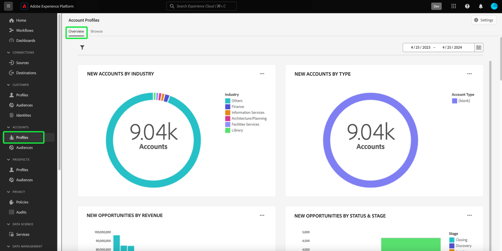
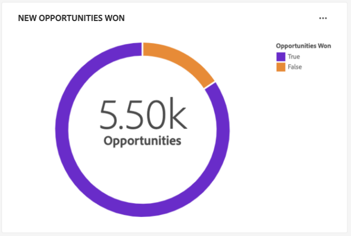

# Tableau de bord [!UICONTROL Profils de compte]

L’interface utilisateur de Adobe Experience Platform fournit un tableau de bord grâce auquel vous pouvez afficher des informations importantes sur vos profils de compte, telles qu’elles sont capturées lors d’un instantané quotidien. Ce guide explique comment accéder au tableau de bord [!UICONTROL Profils de compte] et l’utiliser dans l’interface utilisateur. Il fournit également des informations supplémentaires sur les visualisations affichées dans le tableau de bord.

Ce document présente les fonctionnalités du tableau de bord [!UICONTROL Profils de compte] et détaille les informations standard disponibles. Pour plus d’informations sur les fonctionnalités disponibles, reportez-vous au [[!UICONTROL guide d’interface utilisateur Profils de compte]](../../rtcdp/accounts/account-profile-ui-guide.md) .

## Commencer

Vous devez avoir le droit d’accéder au tableau de bord [Profils de compte] d’Adobe Real-Time Customer Data Platform B2B.](../../rtcdp/b2b-overview.md)[!UICONTROL 

## Données des profils de compte {#data}

Le tableau de bord [!UICONTROL  Profils de compte ] affiche un instantané des informations de votre compte unifié. Ces informations de compte proviennent de plusieurs sources sur vos canaux marketing et des différents systèmes actuellement utilisés par votre entreprise pour stocker les informations de compte client.

Les données de profil de l’instantané affichent les données exactement telles qu’elles apparaissent au moment précis où l’instantané a été pris. En d’autres termes, l’instantané n’est pas une approximation ou un échantillon des données, et le tableau de bord [!UICONTROL Profils de compte] ne se met pas à jour en temps réel.

>[!NOTE]
>
>Les modifications ou mises à jour apportées aux données depuis la prise dʼun instantané ne seront pas reflétées dans le tableau de bord avant la prise de lʼinstantané suivant.

## Explorez le tableau de bord [!UICONTROL Profils de compte] {#explore}

Pour accéder au tableau de bord [!UICONTROL Profils de compte] dans l’interface utilisateur de Platform, sélectionnez **[!UICONTROL Profils]** sous [!UICONTROL Comptes] dans le panneau de navigation de gauche.

Depuis le tableau de bord [!UICONTROL  Profils de compte ], vous pouvez [ parcourir les profils de compte ingérés dans votre organisation ](#browse-account-profiles) ou [ afficher l’intégralité des données de profil de compte en un coup d’oeil à l’aide de widgets ](#standard-widgets).

### Filtre de date {#date-filter}

L’onglet [!UICONTROL Aperçu] est composé de widgets qui fournissent des mesures en lecture seule pour transmettre des informations importantes sur les profils de votre compte. Sélectionnez l’icône ou les dates du calendrier pour modifier le filtre de date global de vos widgets.

>[!IMPORTANT]
>
>La période que vous sélectionnez dans le calendrier déroulant affecte toutes les informations, à l’exception des deux widgets de notation prédictive ([distribution](#predictive-scoring-distribution) et [principaux facteurs d’influence](#predictive-scoring-top-influential-factors)).

### Configuration du service de correspondance de comptes {#lead-to-account-matching-service}

Sélectionnez **[!UICONTROL Paramètres]** pour configurer le service de correspondance de compte dans la boîte de dialogue [!UICONTROL  Paramètres du compte]. Pour plus d’informations sur la configuration de la correspondance de comptes avec votre prospect, consultez le [guide de l’interface utilisateur](../../rtcdp/accounts/account-profile-ui-guide.md#configure-lead-to-account-matching). Pour en savoir plus sur la correspondance de pistes vers des comptes, consultez la [correspondance de pistes vers des comptes dans la documentation Real-Time CDP B2B](../../rtcdp/b2b-ai-ml-services/lead-to-account-matching.md).

## Parcourir les profils de compte {#browse-account-profiles}

Dans l’onglet [!UICONTROL Parcourir], vous pouvez rechercher et afficher les profils de compte en lecture seule ingérés dans votre organisation. Utilisez un ID de compte provenant d’une source d’entreprise connectée ou saisissez directement les informations sources. Dans cet espace de travail, vous pouvez voir des informations importantes appartenant au profil de compte, notamment leur nom, leur secteur d’activité, leurs recettes et leur audience.

Sélectionnez l&#39;[!UICONTROL ID de profil] dans les résultats affichés sur l&#39;onglet [!UICONTROL Parcourir] pour ouvrir l&#39;onglet [!UICONTROL Détails] du profil du compte.

Les informations de profil du compte affichées dans l’onglet [!UICONTROL Détails] ont été fusionnées à partir de plusieurs fragments de profil pour former une vue unique du compte individuel. Pour en savoir plus sur les fonctionnalités d’affichage des profils de compte dans l’interface utilisateur de Platform, consultez la documentation sur la [navigation des profils de compte dans Adobe Real-Time Customer Data Platform](../../rtcdp/accounts/account-profile-ui-guide.md#browse-account-profiles) .

## Widgets standard {#standard-widgets}

Adobe fournit des widgets standard que vous pouvez utiliser pour visualiser différentes mesures liées à vos profils de compte.

>[!IMPORTANT]
>
>Si vous ne fournissez pas de filtre de date, le comportement par défaut des insights analyse les données ajoutées de l’année précédente à aujourd’hui.

Pour en savoir plus sur chacun des widgets standards disponibles, sélectionnez le nom d’un widget dans la liste suivante :

* [Profils de compte ajoutés](#account-profiles-added)
* [Nouveaux comptes par secteur](#accounts-by-industry)
* [Nouveaux comptes par type](#accounts-by-type)
* [Nouvelles opportunités par rôle individuel](#opportunities-by-person-role)
* [Nouvelles opportunités par recettes](#opportunities-by-revenue)
* [Nouvelles opportunités par statut et étape](#opportunities-by-status-&-stage)
* [De nouvelles opportunités gagnées](#opportunities-won)
* [Opportunités ajoutées](#opportunities-added)
* [Répartition du score prédictif](#predictive-scoring-distribution)
* [Facteurs les plus influents du score prédictif](#predictive-scoring-top-influential-factors)

### Profils de compte ajoutés {#account-profiles-added}

Le widget [!UICONTROL Profils de compte ajoutés] utilise un graphique linéaire pour afficher le nombre de profils de compte ajoutés chaque jour sur une période donnée. Utilisez le filtre de date globale situé en haut de votre tableau de bord pour déterminer la période d’analyse. Si aucun filtre de date n’est fourni, le comportement par défaut répertorie les profils de compte ajoutés pour l’année précédente. Les résultats peuvent être utilisés pour déduire une tendance du nombre de profils de compte ajoutés.

### Nouveaux comptes par secteur {#accounts-by-industry}

Le widget [!UICONTROL Nouveaux comptes par secteur] affiche le nombre total de comptes dans une seule mesure dans un graphique en anneau. Le graphique en anneau illustre la composition relative des différentes industries qui composent ce total. Une clé codée par couleur permet de ventiler toutes les industries incluses. Les décomptes individuels de chaque secteur sont affichés dans une boîte de dialogue lorsque le curseur survole la section correspondante du graphique en anneau.

### Nouveaux comptes par type {#accounts-by-type}

Le widget [!UICONTROL Nouveaux comptes par type] affiche le nombre total de comptes dans une seule mesure dans un graphique en anneau. Le graphique en anneau illustre la composition relative des différents types de compte qui composent ce total. Une clé codée par couleur fournit une ventilation de tous les types de compte inclus. Les comptes individuels de chaque type de compte s’affichent dans une boîte de dialogue lorsque le curseur survole la section correspondante du graphique en anneau.

### Nouvelles opportunités par rôle individuel {#opportunities-by-person-role}

Le widget [!UICONTROL Nouvelles opportunités par rôle de personne] affiche le nombre total de vos opportunités dans une mesure unique dans un graphique en anneau. Le graphique en anneau illustre la composition relative des rôles qui constituent ce nombre total d’opportunités. Une clé codée par couleur fournit une ventilation de tous les rôles inclus. Les décomptes individuels de chaque rôle s’affichent dans une boîte de dialogue lorsque le curseur survole la section correspondante du graphique en anneau.

>[!NOTE]
>
>L’erreur [!UICONTROL Aucune donnée trouvée] ou [!UICONTROL Impossible de charger] est provoquée lorsque la table-pont &#39;Opportunity-Person&#39; n’est pas utilisée dans votre schéma. Si votre insight affiche l’une de ces erreurs, vérifiez votre schéma d’union et assurez-vous que le groupe de champs &#39;Opportunity-Person&#39; ingère des données.

### Nouvelles opportunités par recettes {#opportunities-by-revenue}

Le widget [!UICONTROL Nouvelles opportunités par chiffre d&#39;affaires] utilise un graphique à barres pour illustrer le montant total estimé des recettes générées par vos opportunités. Le widget prend en charge jusqu’à six opportunités.

Pour afficher une boîte de dialogue contenant le total des recettes spécifiques d’une opportunité, placez le curseur sur des barres individuelles.

### Nouvelles opportunités par statut et étape {#opportunities-by-status-&-stage}

Ce widget utilise un graphique à barres pour illustrer le nombre d’opportunités ouvertes ou fermées à toutes les étapes de l’entonnoir marketing/vente. Le widget utilise des couleurs pour différencier l’étape des opportunités. Une clé codée par couleur indique les étapes disponibles pour les opportunités.

### De nouvelles opportunités gagnées {#opportunities-won}

Le widget [!UICONTROL Nouvelles opportunités gagnées] affiche le nombre total de vos opportunités qui ont été finalisées avec succès dans une mesure unique dans un graphique en anneau. Le graphique en anneau illustre la composition relative des opportunités gagnées ou non. Une clé codée en couleur fait la distinction entre les opportunités gagnées et non gagnées. Les décomptes individuels de chaque rôle s’affichent dans une boîte de dialogue lorsque le curseur survole la section correspondante du graphique en anneau.

### Opportunités ajoutées {#opportunities-added}

Le widget [!UICONTROL Opportunités ajoutées] utilise un graphique linéaire pour afficher le nombre d’opportunités ajoutées chaque jour sur une période donnée. Utilisez le filtre de date globale situé en haut de votre tableau de bord pour déterminer la période d’analyse. Si aucun filtre de date n’est fourni, le comportement par défaut répertorie les opportunités ajoutées pour l’année précédente. Les résultats peuvent être utilisés pour déduire une tendance du nombre d’opportunités ajoutées.

<!-- Link to date filter documentation from Annamalai -->

### Répartition du score prédictif {#predictive-scoring-distribution}

Le widget [!UICONTROL Distribution de notation prédictive] affiche la distribution de score de tous les profils de compte pour vous aider à comprendre en un coup d’oeil l’état de votre pipeline de ventes. Les données de notation sont véhiculées par le biais d’un graphique en anneau et d’un graphique en colonnes.

Le graphique en anneau illustre la proportion de vos profils de compte totaux dans chacune des classes à forte, moyenne et faible propension à acheter. La clé fournit plus de détails sur les sections codées par couleur, y compris les plages de compartiment de notation et le nombre de profils de compte dans cette plage.

Le graphique en colonnes fournit une ventilation de notation plus granulaire. Chaque colonne indique le nombre de profils de compte dans chacun des 20 intervalles de cinq points.

Le menu déroulant du widget vous permet de sélectionner le modèle de notation du compte.

>[!NOTE]
>
>Les filtres de période globaux ne s’appliquent pas aux insights de notation prédictive. Les widgets de notation prédictive analysent les données en fonction du modèle de notation de compte sélectionné dans la liste déroulante.

### Facteurs les plus influents du score prédictif {#predictive-scoring-top-influential-factors}

Le widget [!UICONTROL Score prédictif des principaux facteurs d’influence] vous permet de comprendre les facteurs les plus significatifs qui génèrent les scores pour chaque compartiment de propension.

Ce widget présente les principaux facteurs d’influence pour chacun des compartiments de propension élevée, moyenne et faible. Une barre pour chaque facteur d’influence indique le pourcentage des profils de compte dans ce compartiment de propension qui contient le facteur d’influence spécifique.

Le menu déroulant du widget vous permet de sélectionner le modèle de notation du compte.

>[!NOTE]
>
>Les filtres de période globaux ne s’appliquent pas aux insights de notation prédictive. Les widgets de notation prédictive analysent les données en fonction du modèle de notation de compte sélectionné dans la liste déroulante.

## Erreur de chargement des données impossible {#errors}

Si un widget affiche *[!UICONTROL Impossible de charger. Essaie à nouveau.]* car il n’existe aucune donnée disponible pour l’entité B2B. Par exemple, le widget affiché sous [!UICONTROL Nouvelles opportunités par rôle de personne] affiche le message &quot;[!UICONTROL Impossible de charger. Essaie à nouveau.]&quot;, car cet environnement de test ne contient pas de données d’opportunité disponibles.

Pour résoudre ce problème, vous devez ingérer dans l’environnement de test des données d’entité B2B, telles que des données *personne qui a la possibilité de saisir une opportunité*. Au bout de 48 heures, les données sont répercutées dans les widgets.

## Étapes suivantes

En suivant ce document, vous devez maintenant savoir comment localiser le tableau de bord [!UICONTROL Profils de compte] et comprendre également les mesures affichées dans les widgets disponibles. Pour en savoir plus sur l’utilisation des profils de compte dans le cadre de vos données B2B dans l’interface utilisateur de l’Experience Platform, reportez-vous à la [présentation des profils de compte](../../rtcdp/accounts/account-profile-overview.md) pour Adobe Real-Time CDP, édition B2B.
