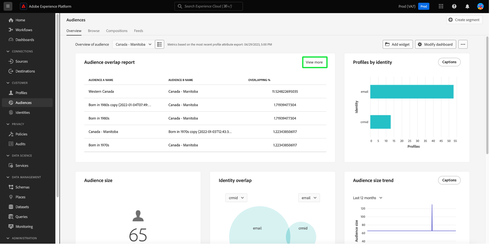

# Tableau de bord des [!UICONTROL Audiences] {#audiences-dashboard}

L’interface utilisateur de Adobe Experience Platform fournit un tableau de bord grâce auquel vous pouvez afficher des informations importantes sur vos audiences, telles qu’elles sont capturées lors d’un instantané quotidien. Ce guide explique comment accéder au tableau de bord [!UICONTROL Audiences] et l’utiliser dans l’interface utilisateur. Il fournit également des informations supplémentaires sur les visualisations affichées dans le tableau de bord.

Pour obtenir un aperçu de toutes les fonctionnalités du service de segmentation d’Adobe Experience Platform au sein de l’interface utilisateur de la plateforme, veuillez consulter le [Guide de l’interface utilisateur du service de segmentation](../../segmentation/ui/overview.md).

## Données du tableau de bord [!UICONTROL Audiences]

Le tableau de bord [!UICONTROL Audiences] affiche un instantané des données d’attribut (enregistrement) dont votre organisation dispose dans la banque de profils en Experience Platform. L’instantané n’inclut aucune donnée d’événement (série temporelle).

Les données de lʼinstantané montrent les données exactement comme elles apparaissent au moment précis où lʼinstantané a été pris. En d’autres termes, l’instantané n’est pas une approximation ou un échantillon des données, et le tableau de bord [!UICONTROL Audiences] n’est pas mis à jour en temps réel.

>[!NOTE]
>
>Les modifications ou mises à jour apportées aux données depuis la prise dʼun instantané ne seront pas reflétées dans le tableau de bord avant la prise de lʼinstantané suivant.

## Explorez le tableau de bord [!UICONTROL Audiences] {#explore}

Pour accéder au tableau de bord [!UICONTROL Audiences] dans l’interface utilisateur de Platform, sélectionnez **[!UICONTROL Audiences]** dans le rail de gauche, puis sélectionnez l’onglet **[!UICONTROL Aperçu]** pour afficher le tableau de bord.

>[!NOTE]
>
>Si votre organisation débute sur Platform et ne dispose pas encore de jeux de données de profils actifs ou de politiques de fusion créés, le tableau de bord [!UICONTROL Audiences] n’est pas visible. Au lieu de cela, l’onglet [!UICONTROL Présentation] affiche des liens et de la documentation pour vous aider à démarrer avec la segmentation.

![ Onglet [!UICONTROL Audiences] du tableau de bord [!UICONTROL Aperçu] avec [!UICONTROL Audiences] et [!UICONTROL Présentation] mise en surbrillance.](../images/audiences/dashboard-overview.png)

### Modification du tableau de bord [!UICONTROL Audiences] {#modify}

Vous pouvez modifier l’aspect du tableau de bord [!UICONTROL Audiences] en sélectionnant **[!UICONTROL Modifier le tableau de bord]**. Cela vous permet de déplacer, d’ajouter et de supprimer des widgets du tableau de bord ainsi que d’accéder à la **[!UICONTROL Bibliothèque de widgets]** pour explorer les widgets disponibles et créer des widgets personnalisés pour votre organisation.

Reportez-vous à la section [Modification des tableaux de bord](../customize/modify.md) et [Présentation de la bibliothèque de widgets](../customize/widget-library.md) pour en savoir plus.

### Ajouter des widgets {#add-widget}

Sélectionnez **[!UICONTROL Ajouter un widget]** pour accéder à la bibliothèque de widgets et voir la liste des widgets disponibles à ajouter à votre tableau de bord.

![Présentation du tableau de bord [!UICONTROL Audiences] avec [!UICONTROL Ajouter un widget] surligné.](../images/audiences/audiences-overview-add-widget.png)

Dans la bibliothèque de widgets, vous pouvez parcourir la sélection de widgets d’audience standard et personnalisés. Pour plus d’informations sur l’ajout de widgets, consultez la documentation de la bibliothèque de widgets sur la manière d’[ajouter un widget](../customize/widget-library.md#add-widgets).

### Afficher le SQL {#view-sql}

Vous pouvez afficher le code SQL qui génère les insights visualisés sur votre tableau de bord avec une bascule sur l’espace de travail [!UICONTROL Overview]. Vous pouvez vous inspirer du SQL de vos insights existants pour créer de nouvelles requêtes qui obtiennent des insights uniques à partir des données Platform en fonction des besoins de votre entreprise. Pour en savoir plus sur cette fonctionnalité, consultez le [guide de l’interface utilisateur SQL d’affichage](../view-sql.md).

## Sélection d’une audience {#select-audience}

Le tableau de bord sélectionne automatiquement l’audience à afficher. Vous pouvez toutefois modifier l’audience à l’aide du menu déroulant ou du sélecteur d’audiences.

Pour choisir une autre audience, sélectionnez la liste déroulante en regard du nom de l’audience ou utilisez le sélecteur d’audience pour ouvrir la boîte de dialogue de sélection d’audience.

>[!IMPORTANT]
>
>Seules les audiences dont le nombre de profils est supérieur à zéro s’affichent dans la liste des audiences sélectionnables.

![ La boîte de dialogue [!UICONTROL Sélectionner l’audience] qui affiche toutes les audiences disponibles.](../images/audiences/select-audience-dialog.png)

## Widgets et mesures {#widgets-and-metrics}

Le tableau de bord [!UICONTROL Audiences] est composé de widgets, qui sont des mesures en lecture seule fournissant des informations importantes sur l’audience sélectionnée.

La date et l’heure de l’instantané le plus récent sont affichées en haut de l’onglet [!UICONTROL Aperçu] en regard de la liste déroulante de l’audience. Toutes les données du widget sont exactes à cette date et cette heure. La date et l’heure de l’instantané sont fournies en UTC ; elles ne se trouvent pas dans le fuseau horaire de l’utilisateur/utilisatrice ou de l’organisation.

## Widgets par défaut {#default-widgets}

Un chargement de widget par défaut est fourni pour toutes les nouvelles instances de Adobe Experience Platform qui mettent en évidence les dernières informations disponibles à partir de vos données. Les widgets suivants sont préconfigurés dans l’affichage des segments dès le départ. Vous trouverez des détails complets sur l’objectif et la fonction des widgets dans leurs sections respectives.

* [[!UICONTROL Taille de l’audience]](#audience-size)
* [[!UICONTROL Tendance de changement de la taille de l’audience]](#audience-size-change-trend)
* [[!UICONTROL Chevauchement des identités]](#identity-overlap)
* [[!UICONTROL Profils par identité]](#profiles-by-identity)

>[!NOTE]
>
>Depuis le 26 juillet 2023, les tableaux de bord [!UICONTROL Profils], [!UICONTROL Audiences] et [!UICONTROL Destinations] de présentation ont été réinitialisés à un nouveau chargement de widget par défaut pour tous les utilisateurs qui n’ont pas modifié leurs vues au cours des six derniers mois.
>Reportez-vous à la documentation des sections de widget par défaut [Profils](./profiles.md#default-widgets) et [Destinations](./destinations.md#default-widgets) pour plus d’informations sur les widgets inclus dans les chargements de widget par défaut. Vous pouvez continuer à personnaliser vos widgets de tableau de bord comme auparavant.

## Widgets Customer AI {#customer-ai-audiences-widgets}

Customer AI est utilisé pour générer des scores de propension personnalisés tels que les taux d’attrition et de conversion de profils individuels à grande échelle. Pour ce faire, Customer AI analyse les données d’événement d’expérience client existantes afin de prédire les **scores de propension à l’attrition ou à la conversion**. Ces modèles de propension des clients à haute précision permettent une segmentation et un ciblage plus précis. La [distribution des scores](#customer-ai-distribution-of-scores) et les [résumé de notation](#customer-ai-scoring-summary) affichent la division dans votre audience. Ils mettent en évidence les profils qui correspondent à une propension élevée/faible/moyenne et la manière dont ils sont répartis dans les nombres de profils.

* [[!UICONTROL Résumé des scores de l’IA dédiée aux clientes et aux clients]](#customer-ai-scoring-summary)
* [[!UICONTROL Distribution des scores par l’IA dédiée aux clientes et aux clients]](#customer-ai-distribution-of-scores)

### [!UICONTROL Distribution des scores par l’IA dédiée aux clientes et aux clients] {#customer-ai-distribution-of-scores}

>[!CONTEXTUALHELP]
>id="platform_dashboards_segments_distributionOfScores"
>title="Distribution des scores"
>abstract="Ce widget visualise la distribution du nombre total de profils en fonction de leurs scores de propension, par incréments de cinq pour cent. La distribution du nombre de profils est déterminée par le modèle d’IA et la politique de fusion sélectionnée. Vous pouvez modifier le modèle d’IA dans le menu déroulant sous le titre du widget."

Le widget [!UICONTROL distribution Customer AI des scores] classe le nombre total de profils en fonction de leurs scores de propension. La distribution du nombre de profils est déterminée par le modèle AI et la stratégie de fusion sélectionnée, puis visualisée par incréments de 5 % qui indiquent leur propension. Le nombre de profils est fourni le long de l’axe Y et les scores de propension sont fournis le long de l’axe X.

>[!NOTE]
>
>Si la visualisation est un score de propension à la conversion, les scores élevés sont en vert et les scores faibles en rouge. Si vous prédisez la propension à l’attrition, les scores élevés sont en rouge et les scores faibles en vert. Le compartiment moyen reste jaune quel que soit le type de propension sélectionné.

Le modèle AI qui détermine les scores de propension est sélectionné dans le sélecteur de liste déroulante sous le titre du widget. La liste déroulante contient une liste de tous les modèles Customer AI configurés. Sélectionnez le modèle d’IA approprié à votre analyse dans la liste des modèles disponibles. Si aucun modèle Customer AI n’est disponible, un message du widget vous invite à configurer au moins un modèle Customer AI et fournit un lien hypertexte vers la page de configuration du modèle Customer AI. Consultez la documentation pour obtenir des instructions sur la configuration d’une instance Customer AI](../../intelligent-services/customer-ai/user-guide/configure.md).[

>[!NOTE]
>
>Sélectionnez la liste déroulante juste en dessous de l’onglet d’aperçu pour modifier la stratégie de fusion qui détermine les profils inclus dans l’analyse. Pour obtenir une brève description, reportez-vous à la section sur les [stratégies de fusion](#merge-policies) ou à la [présentation des stratégies de fusion](../../profile/merge-policies/overview.md) pour plus d’informations.

Pour accéder à la page d’informations détaillées du modèle Customer AI sélectionné, sélectionnez **[!UICONTROL Afficher les détails du modèle]**.

![Le tableau de bord Audiences Experience Platform avec le widget [!UICONTROL  Distribution Customer AI des scores] et [!UICONTROL Afficher les détails du modèle] mis en surbrillance.](../images/segments/customer-ai-distribution-of-scores.png)

La page d’informations détaillées sur les modèles s’affiche.

Vous trouverez plus d’informations sur Customer AI dans le [guide de découverte de l’interface utilisateur d’insights](../../intelligent-services/customer-ai/user-guide/discover-insights.md).

### [!UICONTROL Résumé des scores de l’IA dédiée aux clientes et aux clients] {#customer-ai-scoring-summary}

>[!CONTEXTUALHELP]
>id="platform_dashboards_segments_scoringSummary"
>title="Résumé des scores"
>abstract="Le résumé des scores affiche le nombre total de profils notés et les classe en compartiments de propension élevée, moyenne et faible. Le graphique en anneau illustre la composition proportionnelle du total des profils selon la propension élevée, moyenne et faible."

Ce widget affiche le nombre total de profils notés et les classe en compartiments de propension élevée, moyenne et faible sous la forme respectivement de vert, de jaune et de rouge. Un graphique en anneau est utilisé pour illustrer la composition proportionnelle des profils totaux entre les propensions élevées, moyennes et faibles, en vert, jaune et rouge, respectivement. Un profil est admissible pour une propension élevée à plus de 75 ans, une propension moyenne entre 25 et 74 ans et une propension faible à moins de 24 ans. Une légende indique le code couleur et les seuils de propension. Les valeurs de profil correspondant aux propensions élevées, moyennes et faibles s’affichent dans une boîte de dialogue lorsque le curseur survole la section correspondante du graphique en anneau.

>[!NOTE]
>
>Si la visualisation est un score de propension à la conversion, les scores élevés sont en vert et les scores faibles en rouge. Si vous prédisez la propension à l’attrition, les scores élevés sont en rouge et les scores faibles en vert. Le compartiment moyen reste jaune quel que soit le type de propension sélectionné.

Le menu déroulant sous le titre du widget fournit une liste de tous les modèles Customer AI configurés. Sélectionnez le modèle d’IA approprié à votre analyse dans la liste des modèles disponibles. Si aucun modèle Customer AI n’est disponible, un message du widget vous invite à configurer au moins un modèle Customer AI et fournit un lien hypertexte vers la page de configuration du modèle Customer AI. Pour obtenir des instructions détaillées, consultez la documentation sur [la configuration d’une instance Customer AI](../../intelligent-services/customer-ai/user-guide/configure.md) .

>[!NOTE]
>
>Le nombre total de profils calculés dépend de la stratégie de fusion choisie. Pour modifier la stratégie de fusion utilisée, sélectionnez la liste déroulante juste en dessous de l’onglet d’aperçu. Pour obtenir une brève description, reportez-vous à la section sur les [stratégies de fusion](#merge-policies) ou à la [présentation des stratégies de fusion](../../profile/merge-policies/overview.md) pour plus d’informations.

Sélectionnez **[!UICONTROL Afficher les détails du modèle]** pour accéder à la page d’informations détaillées du modèle Customer AI sélectionné. Vous trouverez plus d’informations sur Customer AI dans le [guide de découverte de l’interface utilisateur d’insights](../../intelligent-services/customer-ai/user-guide/discover-insights.md).

## Widgets standard {#standard-widgets}

Adobe fournit plusieurs widgets standard que vous pouvez utiliser pour visualiser différentes mesures liées à vos audiences. Vous pouvez également créer des widgets personnalisés à partager avec votre organisation à l’aide de la [!UICONTROL Bibliothèque de widgets]. Pour en savoir plus sur la création de widgets personnalisés, commencez par lire la [Présentation de la bibliothèque de widgets](../customize/widget-library.md).

Pour en savoir plus sur chacun des widgets standards disponibles, sélectionnez le nom d’un widget dans la liste suivante :

* [[!UICONTROL Taille de l’audience]](#audience-size)
* [[!UICONTROL Ordre d’activation de l’audience]](#audience-activation-order)
* [[!UICONTROL Tendance de la taille de l’audience]](#audience-size-trend)
* [[!UICONTROL Tendance de changement de la taille de l’audience]](#audience-size-change-trend)
* [[!UICONTROL Tendance de la taille de l’audience par identité]](#audience-size-trend-by-identity)
* [[!UICONTROL Chevauchements d’audience]](#audience-overlap)
* [[!UICONTROL Rapport de chevauchements d’audience]](#audience-overlap-report)
* [[!UICONTROL Chevauchement des identités]](#identity-overlap)
* [[!UICONTROL Profils par identité]](#profiles-by-identity)
* [[!UICONTROL Activations planifiées]](#scheduled-activations)

### [!UICONTROL Taille de l’audience] {#audience-size}

>[!CONTEXTUALHELP]
>id="platform_dashboards_segments_audiencesize"
>title="Taille de l’audience"
>abstract="Ce widget affiche le nombre total de profils fusionnés dans l’audience sélectionnée. Ce nombre dépend de la politique de fusion appliquée à vos données et est correct au moment de l’instantané le plus récent."

Le widget **[!UICONTROL Taille de l’audience]** affiche le nombre total de profils fusionnés dans l’audience sélectionnée au moment de l’instantané. Ce nombre est le résultat de l’application de la stratégie de fusion d’audiences à vos données de profil pour fusionner des fragments de profil et former un seul profil pour chaque individu de l’audience.

Pour plus d’informations sur les fragments et les profils fusionnés, reportez-vous à la [présentation de Real-time Customer Profile](../../profile/home.md).

![Présentation du tableau de bord [!UICONTROL Audiences] avec le widget [!UICONTROL Taille de l’audience] en surbrillance.](../images/audiences/audience-size.png)

### [!UICONTROL Tendance de la taille de l’audience] {#audience-size-trend}

>[!CONTEXTUALHELP]
>id="platform_dashboards_segments_audiencesizetrend"
>title="Tendance de la taille de l’audience"
>abstract="Ce widget fournit des informations sur le nombre total de profils qui répondent aux critères de **toute** définition de segment, telle qu’elle est capturée lors de l’instantané quotidien, pendant les derniers 30 jours, 90 jours ou 12 mois."

Le widget **[!UICONTROL Tendance de la taille de l’audience]** fournit une illustration graphique linéaire du nombre total de profils qui remplissent les critères pour une audience **n’importe quelle audience** sur une période donnée. La tendance de la taille d’audience peut être visualisée sur des périodes de 30 jours, 90 jours et 12 mois. La période est sélectionnée dans un menu déroulant du widget. La taille de l’audience est représentée sur l’axe y et le temps est représenté sur l’axe x.

Ce widget inclut également la fonctionnalité [!UICONTROL Sous-titres] automatique dans laquelle un modèle d’apprentissage automatique analyse les données de graphique et d’audience et génère automatiquement des sous-titres pour décrire les tendances clés et les événements importants. Sélectionnez **[!UICONTROL Légendes]** pour ouvrir la boîte de dialogue des légendes automatiques.

![ La [!UICONTROL présentation d’Audiences] affiche le widget de tendance de la taille de l’audience.](../images/audiences/audience-size-trend-captions.png)

La boîte de dialogue de légendes automatique s’ouvre, vous permettant d’obtenir des informations sur vos données.

Pour en savoir plus sur l’évaluation des audiences et sur la façon dont les profils remplissent les critères et sortent des audiences, consultez la [documentation du service de segmentation](../../segmentation/home.md).

### [!UICONTROL Tendance de changement de la taille de l’audience] {#audience-size-change-trend}

Ce widget fournit un graphique linéaire qui illustre la différence entre le nombre total de profils qualifiés pour une audience donnée et les instantanés quotidiens les plus récents. L’audience choisie pour l’analyse est sélectionnée dans la liste déroulante de présentation. La période d’analyse des tendances peut être consultée sur des périodes de 30 jours, 90 jours et 12 mois. La période est sélectionnée dans un menu déroulant du widget. La taille de l’audience est représentée sur l’axe y et le temps est représenté sur l’axe x.

### [!UICONTROL Tendance de la taille de l’audience par identité] {#audience-size-trend-by-identity}

Ce widget illustre la tendance de taille de l’audience pour une audience spécifique en fonction du type d’identité sélectionné dans le menu déroulant du widget. L’audience utilisée pour l’analyse est sélectionnée dans la liste déroulante d’aperçu. La période d’analyse des tendances peut être consultée sur des périodes de 30 jours, 90 jours et 12 mois. La période est sélectionnée dans un menu déroulant du widget.

### [!UICONTROL Ordre d’activation de l’audience] {#audience-activation-order}

Le widget [!UICONTROL Commande d’activation d’audience] fournit un tableau à trois colonnes qui répertorie le nom de destination, la plateforme et la date d’activation de l’audience. La liste est classée en fonction de la date en commençant par la plus récente et peut contenir jusqu’à 10 lignes.

### [!UICONTROL Chevauchement des audiences] {#audience-overlap}

Ce widget utilise un diagramme de Venn pour visualiser le nombre de personnes qui correspondent aux critères des deux audiences. Les audiences utilisées pour la comparaison sont sélectionnées dans les menus déroulants du widget. Le nombre total de profils contenus dans la définition de segment appropriée peut être affiché en passant la souris sur un cercle ou l’intersection du diagramme de Venn.

Ce widget vous permet d’optimiser la stratégie de segmentation en consultant les similitudes dans les résultats de vos définitions de segment.

### [!UICONTROL Rapport de chevauchement des audiences] {#audience-overlap-report}

Ce widget tabulaire les données de chevauchement de profils pour une audience spécifique. Une liste de cinq audiences classées des pourcentages de chevauchement les plus élevés aux plus bas est fournie pour l’audience choisie dans le menu déroulant en haut de l’écran. Pour plus de clarté, l’audience choisie est répertoriée dans la colonne [!UICONTROL AUDIENCE A NAME] . L’analyse du chevauchement des audiences est fournie pour la deuxième audience répertoriée dans la colonne [!UICONTROL AUDIENCE B NAME]. Le chevauchement en pourcentage est fourni dans la troisième colonne avec une précision de douze décimales.

Le rapport sur les chevauchements d’audiences vous aide à créer de nouvelles audiences hautement performantes. L’observation des chevauchements au pourcentage élevé vous permet de supprimer des audiences et d’empêcher l’envoi d’une même audience vers différentes destinations. Elle vous aide également à identifier les informations cachées qui peuvent contribuer à une meilleure segmentation. Un chevauchement au pourcentage faible permet de localiser les profils uniques à rechercher.

Sélectionnez **[!UICONTROL Afficher plus]** pour ouvrir une boîte de dialogue plein écran contenant davantage de données de chevauchement des audiences.

La boîte de dialogue [!UICONTROL Rapport de chevauchement des audiences] s’affiche. Cette boîte de dialogue peut contenir jusqu’à 50 lignes d’analyses de chevauchement des audiences, divisées en six colonnes. Sélectionnez l’icône des paramètres () pour supprimer ou ajouter des colonnes du tableau.

>[!NOTE]
>
>Sélectionnez l’en-tête de colonne **[!UICONTROL Chevauchement]** pour modifier le classement des résultats, du plus haut au plus bas ou du plus bas au plus haut.

Pour télécharger l’intégralité du rapport au format PDF, sélectionnez le menu d’options (**`...`**), puis **[!UICONTROL Télécharger]**.

Sélectionnez une ligne dans le rapport pour ouvrir un diagramme de Venn de l’analyse de chevauchement. Passez la souris sur une section du diagramme de Venn pour afficher le nombre de profils dans une boîte de dialogue.

Sélectionnez **[!UICONTROL Fermer]** pour revenir au tableau de bord [!UICONTROL Audiences].

### [!UICONTROL Chevauchement des identités] {#identity-overlap}

>[!CONTEXTUALHELP]
>id="platform_dashboards_segments_identityoverlap"
>title="Chevauchement des identités"
>abstract="Ce widget affiche le chevauchement des profils de votre audience contenant les deux identités sélectionnées. Les cercles affichent la taille relative de chaque identité. Le nombre de profils contenant les deux espaces de noms est représenté par le chevauchement entre les cercles."

Le widget **[!UICONTROL chevauchement des identités]** affiche un diagramme de Venn, ou un diagramme de définition, qui montre le chevauchement des profils de votre audience contenant plusieurs identités.

Utilisez les menus déroulants du widget pour sélectionner les identités à comparer. Les cercles affichent la taille relative de chaque identité choisie, le nombre de profils contenant les deux espaces de noms étant représenté par la taille du chevauchement entre les cercles.

Si un client interagit avec votre marque sur plusieurs canaux, plusieurs identités seront associées à ce client individuel. Cette situation rend probable le fait que votre organisation comportera plusieurs profils contenant des fragments provenant de plusieurs identités.

Pour en savoir plus sur les identités, consultez la [documentation Identity Service](../../identity-service/home.md).

![Présentation du tableau de bord [!UICONTROL Audiences] avec le widget de chevauchement des identités surligné.](../images/audiences/identity-overlap.png)

### [!UICONTROL Profils par identité] {#profiles-by-identity}

>[!CONTEXTUALHELP]
>id="platform_dashboards_segments_profilesbyidentity"
>title="Profils par identité"
>abstract="Ce widget affiche la répartition des identités pour chaque profil fusionné dans votre audience sélectionnée."

Le widget **[!UICONTROL Profils par identité]** affiche la ventilation des identités pour chaque profil fusionné de l’audience sélectionnée. Le nombre total de profils par identité peut être supérieur au nombre total de profils dans l’audience, car plusieurs identités peuvent y être associées pour un profil. En d’autres termes, le fait de additionner les valeurs affichées pour chaque identité peut représenter un total supérieur à la taille totale de l’audience. En effet, si un client interagit avec votre marque sur plusieurs canaux, plusieurs identités peuvent être associées à ce client individuel.

Sélectionnez **[!UICONTROL Légendes]** pour ouvrir la boîte de dialogue des légendes automatiques.

![Présentation du tableau de bord [!UICONTROL Audiences] avec l&#39;option Profils par widget d&#39;identité mise en surbrillance et l&#39;option Sous-titres.](../images/audiences/profiles-by-identity.png)

Un modèle de machine learning génère automatiquement des informations sur les données en analysant la distribution globale et les dimensions clés des données.

Pour en savoir plus sur les identités, consultez la [documentation Identity Service](../../identity-service/home.md).

### Activations planifiées {#scheduled-activations}

Le widget d’[!UICONTROL activations planifiées] offre une vue tabulée des destinations activées le plus récemment. Le tableau comprend la plateforme de destination, le nom de votre flux d’activation vers cette destination et les dates de début et de fin de l’activation pour l’audience sélectionnée. Si aucune date de fin n’est fournie pour l’activation, elle affiche le statut [!UICONTROL En cours]. L’audience à analyser est sélectionnée dans la liste déroulante en haut de la page.

Le widget vous permet de découvrir en un coup d’œil où et quand l’audience est activée. De plus, il rend les activations en double ou inutiles plus transparentes. Ces informations cumulées indiquent également les endroits où les activations ont été laissées de côté.

## Étapes suivantes

En suivant ce document, vous devriez maintenant pouvoir localiser le tableau de bord [!UICONTROL Audiences] et sélectionner une audience à afficher. Vous devriez également comprendre désormais les mesures affichées dans les widgets disponibles. Pour en savoir plus sur l’utilisation des audiences dans l’interface utilisateur de l’Experience Platform, consultez le [guide de l’interface utilisateur de Segmentation Service](../../segmentation/ui/overview.md).
