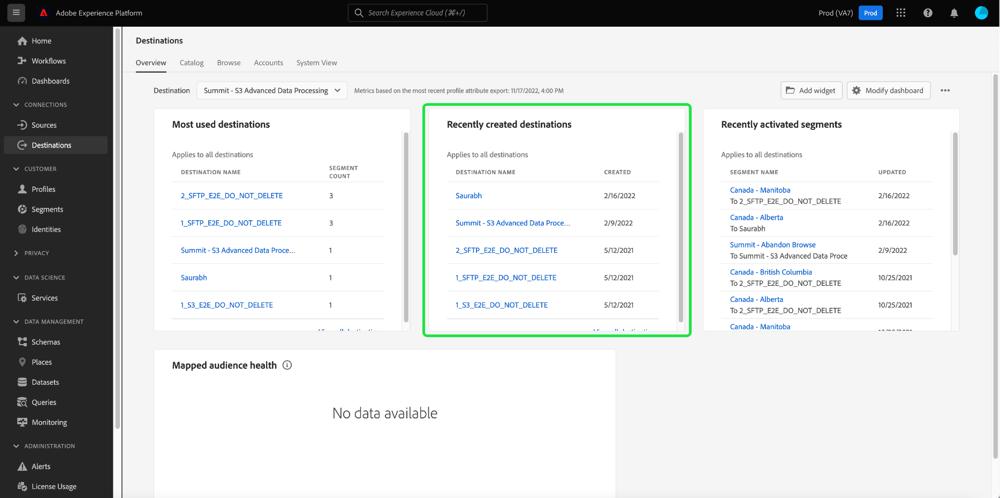
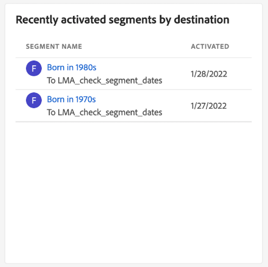

# [!UICONTROL Destinations] tableau de bord

L’interface utilisateur de Adobe Experience Platform fournit un tableau de bord grâce auquel vous pouvez afficher des informations importantes sur les destinations principales de votre entreprise, telles qu’elles sont capturées lors d’un instantané quotidien. Ce guide explique comment accéder au tableau de bord des destinations et l’utiliser dans l’interface utilisateur. Il fournit également des informations supplémentaires sur les mesures affichées dans le tableau de bord.

Pour obtenir un aperçu des destinations, ainsi qu’un catalogue de toutes les destinations disponibles dans Experience Platform, veuillez consulter le [documentation sur les destinations](../../destinations/home.md).

## [!UICONTROL Destinations] données du tableau de bord {#destinations-dashboard-data}

Le [!UICONTROL Destinations] Le tableau de bord affiche un instantané des destinations que votre entreprise a activées dans Experience Platform. Les données de lʼinstantané montrent les données exactement comme elles apparaissent au moment précis où lʼinstantané a été pris. En d’autres termes, l’instantané n’est pas une approximation ou un échantillon des données, et le tableau de bord des destinations n’est pas mis à jour en temps réel.

>[!NOTE]
>
>Les modifications ou mises à jour apportées aux données depuis la prise dʼun instantané ne seront pas reflétées dans le tableau de bord avant la prise de lʼinstantané suivant.

## Exploration du tableau de bord des destinations

Pour accéder au tableau de bord des destinations dans l’interface utilisateur de Platform, sélectionnez **[!UICONTROL Destinations]** dans le rail de gauche, puis sélectionnez l’option **[!UICONTROL Présentation]** pour afficher le tableau de bord.

>[!NOTE]
>
>Si votre entreprise est une nouvelle société qui n’a pas encore de destinations principales, la variable [!UICONTROL Destinations] tableau de bord et [!UICONTROL Présentation] ne sont pas visibles. À la place, sélectionnez [!UICONTROL Destinations] dans le volet de navigation de gauche affiche le [!UICONTROL Catalogue] . Pour en savoir plus sur la variable [!UICONTROL Catalogue] , voir [[!UICONTROL Destinations] guide de workspace](../../destinations/ui/destinations-workspace.md).

### Modification du tableau de bord des destinations

Vous pouvez modifier l’aspect du tableau de bord des destinations en sélectionnant **[!UICONTROL Modifier le tableau de bord]**. Cela vous permet de déplacer, d’ajouter et de supprimer des widgets du tableau de bord, ainsi que d’accéder au **[!UICONTROL Bibliothèque de widgets]** pour explorer les widgets disponibles et créer des widgets personnalisés pour votre organisation.

Reportez-vous à la section [modification des tableaux de bord](../customize/modify.md) et [Présentation de la bibliothèque de widgets](../customize/widget-library.md) pour en savoir plus.

## Widgets standard

Adobe fournit plusieurs widgets standard que vous pouvez utiliser pour visualiser différentes mesures liées à vos destinations et évaluer l’exhaustivité des segments disponibles pour votre analyse des données. Vous pouvez également créer des widgets personnalisés à partager avec votre organisation à l’aide de la variable [!UICONTROL Bibliothèque de widgets]. Pour en savoir plus sur la création de widgets personnalisés, commencez par lire le [Présentation de la bibliothèque de widgets](../customize/widget-library.md).

Pour en savoir plus sur chacun des widgets standard disponibles, sélectionnez le nom d’un widget dans la liste suivante :

* [[!UICONTROL Destinations les plus utilisées]](#most-used-destinations)
* [[!UICONTROL Destinations créées récemment]](#recently-created-destinations)
* [[!UICONTROL Segments récemment activés]](#recently-activated-segments)
* [[!UICONTROL Segments récemment activés par destination]](#recently-activated-segments-by-destination)
* [[!UICONTROL Tendance de la taille de l’audience]](#audience-size-trends)
* [[!UICONTROL Segments non mappés par identité]](#unmapped-segments-by-identity)
* [[!UICONTROL Segments mappés par identité]](#mapped-segments-by-identity)
* [[!UICONTROL Audiences courantes]](#common-audiences)
* [[!UICONTROL Nombre de destinations]](#destinations-count)

### [!UICONTROL Destinations les plus utilisées] {#most-used-destinations}

Le **[!UICONTROL Destinations les plus utilisées]** widget affiche les principales destinations de votre entreprise en fonction du nombre de segments mappés, à partir du dernier instantané. Ce classement permet de savoir quelles destinations sont utilisées, tout en présentant éventuellement celles qui peuvent être sous-utilisées.

Par exemple, si vous avez configuré une destination hier mais que vous ne lui avez mappé aucun segment, vous pouvez constater que la destination est actuellement sous-utilisée.

Le nombre de segments mappés affichés dans la colonne du nombre de segments est précis à partir du dernier instantané quotidien. Le mappage d’un nouveau segment à la destination ne met pas à jour le nombre tant que l’instantané suivant n’a pas été pris.

Si vous sélectionnez le nom d’une destination dans la liste affichée sur le widget, vous accédez aux détails de destination tels que liés à partir de la variable **[!UICONTROL Parcourir]** . Vous pouvez également sélectionner **[!UICONTROL Afficher tout]** pour accéder au **[!UICONTROL Parcourir]** puis sélectionnez le nom d’une destination pour en afficher les détails.

### [!UICONTROL Destinations créées récemment] {#recently-created-destinations}

Le **[!UICONTROL Destinations créées récemment]** vous permet d’afficher la liste des destinations configurées le plus récemment par votre entreprise.

La date de création affichée est exacte par rapport au dernier instantané quotidien. En d’autres termes, si vous créez une destination, elle n’apparaîtra pas dans la liste tant que l’instantané suivant n’aura pas été pris.

Si vous sélectionnez le nom d’une destination dans la liste affichée sur le widget, vous accédez aux détails de destination tels que liés à partir de la variable **[!UICONTROL Parcourir]** . Vous pouvez également sélectionner **[!UICONTROL Afficher tout]** pour accéder au **[!UICONTROL Parcourir]** puis sélectionnez le nom d’une destination pour en afficher les détails.

Pour en savoir plus sur la configuration de types de destinations spécifiques, consultez la page [documentation sur les destinations](../../destinations/home.md).

### [!UICONTROL Segments récemment activés] {#recently-activated-segments}

Le **[!UICONTROL Segments récemment activés]** fournit une liste des segments mappés le plus récemment à une destination. Cette liste fournit un instantané des segments et des destinations utilisés activement dans le système et peut vous aider à résoudre les problèmes de mappages erronés.

La date mise à jour affichée affiche la dernière fois que le segment a été activé vers la destination et est précis par rapport au dernier instantané quotidien. En d’autres termes, si vous activez un segment vers la destination, la date mise à jour ne changera pas tant que l’instantané suivant n’aura pas été pris.

Si vous sélectionnez le nom d’un segment dans la liste affichée sur le widget, vous accédez aux détails du segment. Vous pouvez également sélectionner **[!UICONTROL Afficher tout]** pour accéder à l’onglet navigation des segments, sélectionnez ensuite le nom d’un segment afin d’en afficher les détails.

Pour plus d’informations sur l’utilisation des segments dans Experience Platform, commencez par lire le [Présentation de Segmentation Service](../../segmentation/home.md).

### [!UICONTROL Segments récemment activés par destination] {#recently-activated-segments-by-destination}

Le **[!UICONTROL Segments récemment activés par destination]** le widget affiche les cinq segments les plus récemment activés dans l’ordre décroissant en fonction de la destination choisie dans la liste déroulante d’aperçu. Elle est similaire au [!UICONTROL Segments récemment activés] widget, mais les données affichées **only** s’applique à la destination sélectionnée.

Ce widget contient deux mesures : le nom du segment et la date de la dernière activation du segment vers la destination. Les données affichées sont correctes à partir du dernier instantané quotidien.

Vous pouvez afficher les détails d’un segment en le sélectionnant dans la liste affichée.

### [!UICONTROL Tendance de la taille de l’audience] {#audience-size-trend}

Le **[!UICONTROL Tendance de la taille de l’audience]** Le widget illustre la relation entre le nombre de profils sur une période donnée pour un segment qui a été mappé à ce compte de destination. Le widget utilise un graphique linéaire pour illustrer le nombre de profils contenus dans le segment, qui sont envoyés quotidiennement au compte de destination.

Une période pour la tendance de l’audience des 30 derniers jours, 90 jours ou 12 mois, peut être ajustée à l’aide du premier menu déroulant.

Le deuxième menu déroulant répertorie tous les segments disponibles qui peuvent être envoyés au compte de destination choisi en haut du tableau de bord.

Le **[!UICONTROL Tendance de la taille de l’audience]** fournit un [!UICONTROL Sous-titres] en haut à droite du widget. Sélectionner **[!UICONTROL Sous-titres]** pour ouvrir la boîte de dialogue des sous-titres automatiques. Un modèle d’apprentissage automatique génère automatiquement des sous-titres pour décrire les tendances clés et les événements importants en analysant le graphique et les données de segment.

### [!UICONTROL Segments non mappés par identité] {#unmapped-segments-by-identity}

Le **[!UICONTROL Segments non mappés par identité]** Le widget répertorie les cinq premiers **non mappé** segments classés par nombre d’identités décroissant pour une destination et une identité données. Il met en évidence les segments qui sont les plus bénéfiques à mapper sur le compte de destination choisi en fonction de l’identifiant choisi.

La liste déroulante Identifiant de destination filtre vos segments disponibles. Les ID de filtre répertoriés dans la liste déroulante changent en fonction du compte de destination sélectionné en haut de la page d’aperçu.

La colonne Identités comptabilise le nombre d’identifiants source dans le segment qui peuvent correspondre à l’identifiant choisi dans la liste déroulante Identifiant du widget.

### [!UICONTROL Segments mappés par identité] {#mapped-segments-by-identity}

Ce widget fournit les cinq premières listes de **mappé** segments. La liste est classée de haut en bas en fonction du nombre d’ID source contenus dans les segments. L’ID de destination à comptabiliser est sélectionné dans le menu déroulant sous le titre du widget. Les identifiants de destination disponibles dans la liste déroulante du widget changent en fonction du filtre du compte de destination sélectionné en haut du tableau de bord de la présentation.

Le **[!UICONTROL Segments mappés par identité]** le widget met en évidence en un coup d’oeil la probabilité de réussir le ciblage des opportunités de profil pour une campagne au sein de la destination choisie. Une campagne ciblée efficace ne dépend pas du nombre de profils envoyés à la destination, mais plutôt du nombre d’identifiants sources qui sont susceptibles d’être associés aux identifiants de destination pour fournir des données utiles et exploitables.

### Audiences courantes

Le **[!UICONTROL Audiences courantes]** fournit une liste des cinq premiers segments activés dans le compte de destination choisi en haut de la page, ainsi que la destination sélectionnée dans la liste déroulante du widget. La liste des segments est classée en fonction de leur date d’activation récente. Le segment le plus récemment activé s’affiche en haut de l’écran.

Le [!UICONTROL TAILLE DE L’AUDIENCE] indique le nombre total de profils de chaque segment répertorié.

### Santé de l’audience mappée

Le widget fournit une liste de 20 segments mappés au maximum dont le nombre total de profils, à partir du dernier instantané quotidien, s’écarte d’un facteur d’écart type au moins par rapport à la taille moyenne d’audience de 30 jours mappée à cette destination.

En résumé, il fournit une mesure calculée pour la dispersion des tailles d’audience par rapport à la moyenne au cours des 30 derniers jours. Il compare la taille actuelle de l’audience en dehors de l’écart-type historique observé dans les données au cours des 30 derniers jours.

Toutes les tailles d’audience du système sont triées de la taille élevée à la taille faible, comme indiqué dans la variable [!UICONTROL DERNIÈRE TAILLE] colonne .

Si le nombre de profils mappés de votre segment ne correspond pas à l’écart-type par rapport à la taille de profil mappée moyenne au cours des 30 derniers jours, cela indique une anomalie du système et doit être étudié.

Si un segment dans la variable [!UICONTROL Santé de l’audience mappée] vous devez vous reporter au graphique de tendance de la taille de l’audience et localiser le segment anormal. La tendance peut fournir des informations supplémentaires sur l’intégrité de votre segment.

### [!UICONTROL Nombre de destinations] {#destinations-count}

Le [!UICONTROL Nombre de destinations] fournit le nombre total de points de terminaison disponibles où une audience peut être activée et diffusée dans le système. Ce nombre inclut les destinations principales et inactives.

Sous le nombre total, sélectionnez **[!UICONTROL Destinations]** pour accéder à l’onglet de navigation des destinations. Cette page répertorie toutes les destinations avec lesquelles vous avez établi une connexion à ce jour.

## Étapes suivantes

En suivant ce document, vous devriez maintenant pouvoir localiser le tableau de bord des destinations et comprendre les mesures affichées dans les widgets disponibles. Pour en savoir plus sur l’utilisation des destinations dans Experience Platform, reportez-vous à la section [documentation sur les destinations](../../destinations/home.md).
