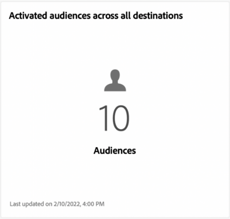

# Tableau de bord des [!UICONTROL destinations]

L’interface utilisateur d’Adobe Experience Platform fournit un tableau de bord grâce auquel vous pouvez afficher des informations importantes sur les destinations actives de votre organisation. Celles-ci sont présentées telles qu’elles sont capturées lors d’instantanés quotidiens. Ce guide explique comment accéder au tableau de bord des destinations et l’utiliser dans l’interface utilisateur. Il fournit également des informations supplémentaires sur les mesures affichées dans le tableau de bord.

Pour obtenir un aperçu des destinations, ainsi qu’un catalogue de toutes les destinations disponibles dans Experience Platform, veuillez consulter la [documentation sur les destinations](../../destinations/home.md).

## Données du tableau de bord des [!UICONTROL destinations] {#destinations-dashboard-data}

Le tableau de bord des destinations affiche un instantané des destinations activées par votre entreprise dans Experience Platform. Les données de lʼinstantané montrent les données exactement comme elles apparaissent au moment précis où lʼinstantané a été pris. En dʼautres termes, lʼinstantané nʼest pas une approximation ou un exemple des données, et le tableau de bord des destinations n’est pas mis à jour en temps réel.

>[!NOTE]
>
>Les modifications ou mises à jour apportées aux données depuis la prise dʼun instantané ne seront pas reflétées dans le tableau de bord avant la prise de lʼinstantané suivant.

## Explorez le tableau de bord des [!UICONTROL destinations] {#explore}

Pour accéder au tableau de bord des destinations dans l’interface utilisateur de Platform, sélectionnez **[!UICONTROL Destinations]** dans le rail de gauche, puis sélectionnez l’onglet **[!UICONTROL Présentation]** pour afficher le tableau de bord.

La date et l’heure de l’instantané le plus récent s’affichent en haut de la [!UICONTROL Présentation] à côté du menu déroulant de destination. Toutes les données du widget sont exactes à cette date et cette heure. La date et l’heure de l’instantané sont fournies en UTC ; elles ne se trouvent pas dans le fuseau horaire de l’utilisateur/utilisatrice ou de l’organisation.

>[!NOTE]
>
>Si votre organisation débute dans l’utilisation d’Experience Platform et n’a pas encore de destinations actives, le tableau de bord des destinations et l’onglet [!UICONTROL Présentation] ne sont pas visibles. À la place, sélectionnez [!UICONTROL Destinations] dans le volet de navigation de gauche pour afficher l’onglet [!UICONTROL Catalogue]. Pour en savoir plus sur l’onglet [!UICONTROL Catalogue], voir le [[!UICONTROL guide d’espace de travail des ]destinations](../../destinations/ui/destinations-workspace.md).

### Modifier le tableau de bord des [!UICONTROL destinations] {#modify}

Sélectionnez **[!UICONTROL Modifier le tableau de bord]** pour modifier l’aspect du tableau de bord des destinations. Cela vous permet de déplacer, d’ajouter et de supprimer des widgets du tableau de bord, ainsi que d’accéder à la bibliothèque de widgets. Dans la bibliothèque de widgets, vous pouvez explorer les widgets disponibles et créer des widgets personnalisés pour votre organisation.

Reportez-vous à la documentation sur la [modification des tableaux de bord](../customize/modify.md) et la [présentation de la bibliothèque de widgets](../customize/widget-library.md) pour en savoir plus.

### Ajouter des widgets {#add-widget}

Sélectionnez **[!UICONTROL Ajouter un widget]** pour accéder à la bibliothèque de widgets et voir la liste des widgets disponibles à ajouter à votre tableau de bord.

Dans la bibliothèque de widgets, vous pouvez parcourir la sélection de widgets de segment standards et personnalisés. Pour plus d’informations sur l’ajout de widgets, consultez la documentation de la bibliothèque de widgets sur la manière d’[ajouter un widget](../customize/widget-library.md#add-widgets).

## Widgets standard {#standard-widgets}

Adobe fournit plusieurs widgets standards que vous pouvez utiliser pour visualiser différentes mesures liées à vos destinations et évaluer l’exhaustivité des segments disponibles pour votre analyse des données. Vous pouvez également créer des widgets personnalisés à partager avec votre organisation à l’aide de la [!UICONTROL Bibliothèque de widgets]. Pour en savoir plus sur la création de widgets personnalisés, commencez par lire la [Présentation de la bibliothèque de widgets](../customize/widget-library.md).

### Conditions préalables {#prerequisites}

Avant de poursuivre avec les descriptions des widgets standard, assurez-vous de bien connaître les définitions des termes clés suivants utilisés dans toute la documentation :

* **Segment :** Un segment est **ensemble de règles** qui incluent des attributs et des données d’événement qui qualifient un certain nombre de profils en tant qu’audience.
* **Audience**: Une audience est **l’ensemble des profils** qui répondent aux critères d’une définition de segment.
* **Mappé/Mappage**: Le mappage des données est le processus de mappage des champs de données sources aux champs cibles associés dans une destination.
* **Identité**: Une identité est un identifiant qui représente de manière unique un client individuel, tel qu’un identifiant de cookie, un identifiant d’appareil ou un identifiant de courrier électronique.
* **Activer**: Activer est l’action entreprise par un utilisateur pour mapper un segment ou des profils à une destination telle que l’Oracle Eloqua, Google ou le Marketing Cloud Salesforce.

Pour en savoir plus sur chacun des widgets standards disponibles, sélectionnez le nom d’un widget dans la liste suivante :

* [[!UICONTROL Destinations les plus utilisées]](#most-used-destinations)
* [[!UICONTROL Destinations créées récemment]](#recently-created-destinations)
* [[!UICONTROL Segments récemment activés]](#recently-activated-segments)
* [[!UICONTROL Segments récemment activés par destination]](#recently-activated-segments-by-destination)
* [[!UICONTROL Tendance de la taille de l’audience]](#audience-size-trend)
* [[!UICONTROL Segments non mappés par identité]](#unmapped-segments-by-identity)
* [[!UICONTROL Segments mappés par identité]](#mapped-segments-by-identity)
* [[!UICONTROL Audiences courantes]](#common-audiences)
* [[!UICONTROL Audiences mappées]](#mapped-audiences)
* [[!UICONTROL Intégrité de l’audience mappée]](#mapped-audience-health)
* [[!UICONTROL Nombre de destinations]](#destinations-count)
* [[!UICONTROL Statut de destination]](#destination-status)
* [[!UICONTROL Destinations actives par plateforme de destination]](#active-destinations-by-destination-platform)
* [[!UICONTROL Audiences activées sur toutes les destinations]](#activated-audiences-across-all-destinations)
* [[!UICONTROL Audiences activées]](#activated-audiences)

### [!UICONTROL Destinations les plus utilisées] {#most-used-destinations}

>[!CONTEXTUALHELP]
>id="platform_dashboards_destinations_mostuseddestinations"
>title="Destinations les plus utilisées"
>abstract="Ce widget affiche les destinations les plus actives de votre organisation en fonction du nombre de segments mappés. Ces chiffres sont précis au moment du dernier instantané. Ce classement fournit des informations sur les destinations les plus utilisées actuellement tout en mettant en évidence celles qui peuvent être sous-utilisées."

Le widget **[!UICONTROL Destinations les plus utilisées]** affiche les principales destinations de votre organisation en fonction du nombre de segments mappés, à partir du dernier instantané. Ce classement permet de savoir quelles destinations sont utilisées, tout en présentant éventuellement celles qui peuvent être sous-utilisées.

Par exemple, si hier vous avez configuré une destination mais que vous ne lui avez mappé aucun segment, vous pourrez constater que la destination est actuellement sous-utilisée.

Le nombre de segments mappés affiché dans la colonne du nombre de segments est correct selon le dernier instantané de la journée. Le mappage d’un nouveau segment à la destination ne met pas à jour le compteur tant que l’instantané suivant n’a pas été pris.

Sélectionner le nom d’une destination dans la liste affichée sur le widget vous permet d’accéder aux détails de la destination liée depuis l’onglet **[!UICONTROL Parcourir]**. Vous pouvez également sélectionner **[!UICONTROL Afficher tout]** pour accéder à l’onglet **[!UICONTROL Parcourir]** et sélectionner le nom d’une destination pour en afficher les détails.

### [!UICONTROL Destinations récemment créées] {#recently-created-destinations}

>[!CONTEXTUALHELP]
>id="platform_dashboards_destinations_recentlycreateddestinations"
>title="Destinations récemment créées"
>abstract="Ce widget affiche la liste des destinations configurées les plus récemment au sein de votre organisation."

Le widget **[!UICONTROL Destinations récemment créées]** vous permet d’afficher la liste des destinations configurées les plus récemment par votre organisation.

La date de création affichée correspond au dernier instantané pris dans la journée. En d’autres termes, si vous créez une nouvelle destination, elle n’apparaîtra sur la liste que lorsque le prochain instantané sera pris.

Sélectionner le nom d’une destination dans la liste affichée sur le widget vous donne accès aux détails de la destination qui sont liés depuis l’onglet **[!UICONTROL Parcourir]**. Vous pouvez également sélectionner **[!UICONTROL Afficher tout]** pour accéder à l’onglet **[!UICONTROL Parcourir]** et sélectionner le nom d’une destination pour en afficher les détails.

Pour en savoir plus sur la configuration de types de destinations spécifiques, consultez la page [Documentation sur les destinations](../../destinations/home.md).

### [!UICONTROL Segments récemment activés] {#recently-activated-segments}

>[!CONTEXTUALHELP]
>id="platform_dashboards_destinations_recentlyactivatedsegments"
>title="Segments récemment activés"
>abstract="Ce widget fournit une liste de segments qui ont été mappés à une destination le plus récemment. Cette liste fournit un instantané des segments et des destinations utilisés actuellement dans le système et peut aider à corriger les mappages erronés."

Le widget **[!UICONTROL Segments récemment activés]** fournit une liste des segments mappés le plus récemment à une destination. Cette liste fournit un instantané des segments et des destinations utilisés actuellement dans le système et peut aider à corriger les mappages erronés.

La date mise à jour affichée indique la dernière fois que le segment a été activé vers la destination et correspond au dernier instantané quotidien. En d’autres termes, si vous activez un segment vers la destination, la date mise à jour ne changera pas tant que l’instantané suivant n’aura pas été effectué.

Si vous sélectionnez le nom d’un segment dans la liste affichée sur le widget, vous accéderez aux détails du segment. Vous pouvez également sélectionner **[!UICONTROL Afficher tout]** pour accéder à l’onglet navigation des segments. Sélectionnez ensuite le nom d’un segment afin d’en afficher les détails.

Pour plus d’informations sur l’utilisation des segments dans Experience Platform, reportez-vous à la section [Présentation de Segmentation Service](../../segmentation/home.md).

### [!UICONTROL Segments récemment activés par destination] {#recently-activated-segments-by-destination}

>[!CONTEXTUALHELP]
>id="platform_dashboards_destinations_recentlyactivatedsegmentsbydestination"
>title="Segments récemment activés par destination"
>abstract="Ce widget affiche les cinq segments les plus récemment activés par ordre décroissant en fonction de la destination choisie dans le menu déroulant de la vue d’ensemble."

Le widget **[!UICONTROL Segments récemment activés par destination]** affiche les cinq segments activés les plus récemment dans l’ordre décroissant en fonction de la destination choisie dans le menu déroulant de l’aperçu. Il est similaire au widget [!UICONTROL Segments récemment activés], mais les données affichées s’appliquent **uniquement** à la destination sélectionnée.

Ce widget contient deux champs : le nom du segment et la date de la dernière activation du segment vers la destination. Les données affichées sont correctes selon le dernier instantané quotidien.

Vous pouvez afficher les détails d’un segment en le sélectionnant dans la liste proposée.

Consultez la section Conditions préalables pour [définitions des termes utilisés](#prerequisites) dans cette description.

### [!UICONTROL Tendance de la taille de l’audience] {#audience-size-trend}

>[!CONTEXTUALHELP]
>id="platform_dashboards_destinations_audiencesizetrend"
>title="Tendance de la taille de l’audience"
>abstract="Ce widget indique le nombre de profils contenus dans le segment qui est envoyé quotidiennement au compte de destination. Le premier menu déroulant adapte la période à la tendance de l’audience. Le deuxième menu déroulant du widget sélectionne le segment à analyser. La destination est choisie dans la liste déroulante de l’aperçu."

Le widget **[!UICONTROL Tendance de la taille d’audience]** décrit l’évolution du nombre de profils sur une période donnée pour un segment qui a été mappé à ce compte de destination. Le widget utilise un graphique linéaire pour illustrer le nombre de profils contenus dans le segment qui sont envoyés quotidiennement au compte de destination.

A l’aide du premier menu déroulant, une période peut être ajustée pour la tendance de l’audience des 30 derniers jours, 90 jours ou 12 mois.

Le deuxième menu déroulant répertorie tous les segments disponibles qui peuvent être envoyés au compte de destination choisi en haut du tableau de bord.

Le widget **[!UICONTROL Tendance de la taille d’audience]** contient un bouton [!UICONTROL Légendes] en haut à droite du widget. Sélectionnez **[!UICONTROL Légendes]** pour ouvrir la boîte de dialogue des légendes automatiques. Un modèle de machine learning génère automatiquement des légendes pour décrire les tendances clés et les événements importants en analysant les données des graphiques et des segments.

### [!UICONTROL Segments non mappés par identité] {#unmapped-segments-by-identity}

>[!CONTEXTUALHELP]
>id="platform_dashboards_destinations_unmappedsegmentsbyidentity"
>title="Segments non mappés par identité"
>abstract="Ce widget répertorie les cinq premiers segments **non mappés** classés par nombre d’identités décroissant pour une destination et une identité données. Les identifiants de filtre répertoriés dans la liste déroulante du widget changent en fonction du compte de destination sélectionné en haut de la page d’aperçu."

Le widget **[!UICONTROL Segments non mappés par identité]** répertorie les cinq premiers segments **non mappés** classés par nombre d’identités décroissant pour une destination et une identité données. Il met en évidence les segments qui sont les plus bénéfiques à mapper sur le compte de destination choisi en fonction de l’identifiant choisi.

La liste déroulante d’identifiant de destination filtre vos segments disponibles. Les identifiants de filtre répertoriés dans la liste déroulante changent en fonction du compte de destination sélectionné en haut de la page d’aperçu.

La colonne identités comptabilise le nombre d’identifiants sources dans le segment qui peuvent correspondre à l’identifiant choisi dans la liste déroulante d’identifiants du widget.

Consultez la section Conditions préalables pour [définitions des termes utilisés](#prerequisites) dans cette description.

### [!UICONTROL Segments mappés par identité] {#mapped-segments-by-identity}

>[!CONTEXTUALHELP]
>id="platform_dashboards_destinations_mappedsegmentsbyidentity"
>title="Segments mappés par identité"
>abstract="Ce widget fournit une liste des cinq premiers segments **mappés**. La liste est classée de haut en bas en fonction du nombre d’identifiants sources contenus dans les segments. L’identifiant de destination à comptabiliser est sélectionné dans le menu déroulant sous le titre du widget. Les identifiants de destination disponibles dans la liste déroulante du widget dépendent de la destination choisie en haut du tableau de bord de la présentation."

Ce widget fournit une liste des cinq premiers segments **mappé**. La liste est classée de haut en bas en fonction du nombre d’identifiants sources contenus dans les segments. L’identifiant de destination à comptabiliser est sélectionné dans le menu déroulant sous le titre du widget. Les identifiants de destination disponibles dans la liste déroulante du widget changent en fonction du filtre du compte de destination sélectionné en haut du tableau de bord de la présentation.

Le widget **[!UICONTROL Segments mappés par identité]** met en évidence rapidement la probabilité de réussir le ciblage des opportunités de profil pour une campagne au sein de la destination choisie. Une campagne ciblée efficace ne dépend pas du nombre de profils envoyés à la destination, mais plutôt du nombre d’identifiants sources qui sont susceptibles d’être associés aux identifiants de destination pour fournir des données utiles et activables.

### Audiences courantes {#common-audiences}

>[!CONTEXTUALHELP]
>id="platform_dashboards_destinations_commonaudiences"
>title="Audiences courantes"
>abstract="Ce widget fournit une liste des cinq premiers segments activés sur le compte de destination choisi en haut de la page, ainsi que la destination sélectionnée dans la liste déroulante du widget. La liste des segments est classée en fonction de leur date d’activation récente. Le segment le plus récemment activé s’affiche en haut de l’écran."

Le widget **[!UICONTROL Audiences courantes]** fournit une liste des cinq premiers segments activés dans le compte de destination choisi en haut de la page, ainsi que la destination sélectionnée dans la liste déroulante du widget. La liste des segments est classée en fonction de leur date d’activation récente. Le segment le plus récemment activé s’affiche en haut de l’écran.

La colonne [!UICONTROL TAILLE DE L’AUDIENCE] indique le nombre total de profils de chaque segment répertorié.

### Audiences mappées {#mapped-audiences}

Le widget [!UICONTROL Audiences mappées] affiche le nombre total d’audiences mappées qui peuvent être activées vers la destination sélectionnée en haut de la page.

Sélectionnez **[!UICONTROL Segments]** pour accéder à l’onglet [!UICONTROL Parcourir] du tableau de bord Segments. Cet espace de travail affiche une liste de toutes les définitions de segment pour votre organisation.

### Intégrité de l’audience mappée {#mapped-audience-health}

>[!CONTEXTUALHELP]
>id="platform_dashboards_destinations_mappedaudiencehealth"
>title="Intégrité de l’audience mappée"
>abstract="Ce widget fournit une liste de 20 segments mappés au maximum dont le nombre total de profils s’écarte d’un facteur d’écart-type au moins par rapport à la taille moyenne d’audience de 30 jours mappée à cette destination. Il fournit une mesure calculée pour la dispersion des tailles d’audience par rapport à la moyenne au cours des 30 derniers jours. Les tailles d’audience sont triées de haut en bas."

Le widget fournit une liste de 20 segments mappés au maximum dont le nombre total de profils, à partir du dernier instantané quotidien, s’écarte d’un facteur d’écart-type au moins par rapport à la taille moyenne d’audience de 30 jours mappée à cette destination.

En résumé, il fournit une mesure calculée pour la dispersion des tailles d’audience par rapport à la moyenne au cours des 30 derniers jours. Il compare la taille actuelle de l’audience en dehors de l’écart-type historique observé dans les données au cours des 30 derniers jours.

Toutes les tailles d’audience du système sont triées de la gande taille à la petite taille, comme indiqué dans la colonne [!UICONTROL DERNIÈRE TAILLE].

Si le nombre de profils mappés de votre segment ne correspond pas à l’écart-type par rapport à la taille de profil mappée moyenne au cours des 30 derniers jours, cela indique une anomalie du système qui doit être étudiée.

Si un segment dans le widget [!UICONTROL Intégrité de l’audience mappée] s’écarte de beaucoup, vous devez vous reporter au graphique de tendance de la taille de l’audience et localiser le segment anormal. La tendance peut fournir des informations supplémentaires sur l’intégrité de votre segment.

>[!NOTE]
>
>La taille par défaut du widget d’intégrité de l’audience mappée peut bloquer les informations du tableau. Modifiez la taille du widget pour améliorer la lisibilité de vos noms de segment et titres de colonnes mappés. Pour plus d’informations sur la modification des tableaux de bord, reportez-vous à la documentation sur le [redimensionnement d’un widget](../customize/modify.md).

### [!UICONTROL Nombre de destinations] {#destinations-count}

>[!CONTEXTUALHELP]
>id="platform_dashboards_destinations_destinationscount"
>title="Nombre de destinations"
>abstract="Ce widget fournit le nombre total de points d’entrée disponibles où une audience peut être activée et diffusée dans le système. Ce nombre inclut les destinations actives et inactives."

Le widget [!UICONTROL Nombre de destinations] fournit le nombre total de points d’entrée disponibles où une audience peut être activée et diffusée dans le système. Ce nombre inclut les destinations actives et inactives.

Sous le nombre total, sélectionnez **[!UICONTROL Destinations]** pour accéder à l’onglet de navigation des destinations. Cette page répertorie toutes les destinations avec lesquelles vous avez établi une connexion à ce jour.

### [!UICONTROL Statut de destination] {#destination-status}

Le widget [!UICONTROL Statut de destination] affiche le nombre total de destinations activées sous la forme d’une mesure unique et utilise un graphique en anneau pour illustrer la différence proportionnelle entre les destinations activées et désactivées.

Les décomptes individuels des destinations activées ou désactivées s’affichent dans une boîte de dialogue lorsque le curseur survole la section correspondante du graphique en anneau.

### [!UICONTROL Destinations actives par plateforme de destination] {#active-destinations-by-destination-platform}

Ce widget utilise un tableau à deux colonnes pour afficher la liste des plateformes de destination actives et le nombre total de destinations actives pour chaque plateforme de destination. La liste des plateformes de destination est classée de haut en bas.

### [!UICONTROL Audiences activées sur toutes les destinations] {#activated-audiences-across-all-destinations}

Le widget [!UICONTROL Audiences activées sur toutes les destinations] fournit le nombre total d’audiences activées sur toutes les destinations dans une seule mesure.

>[!NOTE]
>
>Ce widget affiche le nombre d’audiences et non le nombre de segments.

Ce nombre correspond à l’instantané le plus récent.

Sélectionnez **[!UICONTROL Audiences]** pour accéder à l’onglet [!UICONTROL Parcourir] des destinations. Cette page fournit une liste de toutes les destinations activées, ainsi que diverses mesures pertinentes. Consultez la documentation pour en savoir plus sur l’onglet [[!UICONTROL Parcourir]](../../destinations/ui/destinations-workspace.md#browse).

Consultez la section Conditions préalables pour [définitions des termes utilisés](#prerequisites) dans cette description.

### [!UICONTROL Audiences activées] {#activated-audiences}

Ce widget fournit une mesure unique pour le nombre total d’audiences activées vers une destination.

Sélectionnez **[!UICONTROL Audiences]** pour accéder à la page de détails du tableau de bord des destinations. L’onglet [!UICONTROL Données d’activation] affiche la liste des segments qui ont été mappés à la destination, y compris leur date de début et de fin (le cas échéant), ainsi que d’autres informations pertinentes pour l’exportation des données, telles que le type d’exportation, la planification et la fréquence. Pour afficher les détails d’un segment spécifique, sélectionnez son nom dans la liste.

Ce widget vous aide à comprendre en un coup d’œil la valeur de vos destinations en fonction du nombre d’audiences activées. Il permet également d’accéder facilement à des informations plus détaillées pour une analyse plus approfondie.

Consultez la section Conditions préalables pour [définitions des termes utilisés](#prerequisites) dans cette description.

## Étapes suivantes

En suivant ce document, vous devriez maintenant pouvoir localiser le tableau de bord des destinations et comprendre les mesures affichées dans les widgets disponibles. Pour en savoir plus sur l’utilisation des destinations dans Experience Platform, reportez-vous à la [documentation sur les destinations](../../destinations/home.md).
