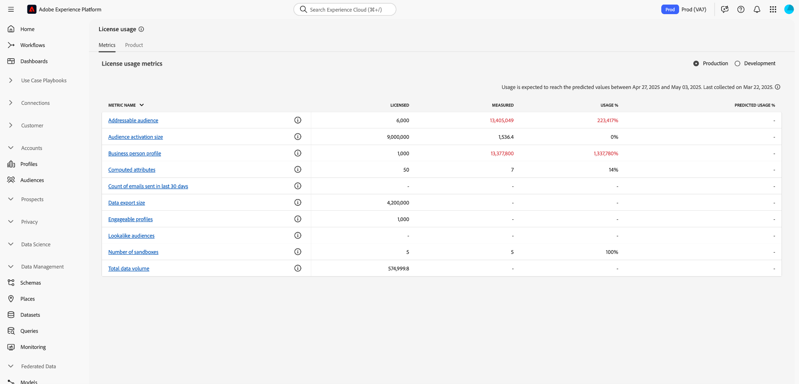
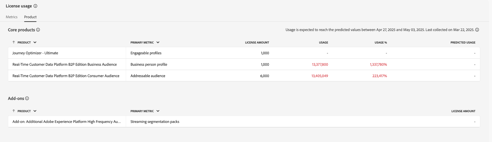

# Tableau de bord d’utilisation des licences {#license-usage-dashboard}

>[!CONTEXTUALHELP]
>id="testy-mctestface"
>title="Boîte de dialogue de test qui ne doit pas être visible"
>abstract="L’objet {name} est affiché le {date}."

>[!CONTEXTUALHELP]
>id="platform_dashboards_licenseusage_core"
>title="Table des produits principaux"
>abstract="Les produits principaux répertoriés dans le tableau comportent leurs propres mesures, le suivi de l’utilisation et des vues détaillées au niveau du sandbox. Ces produits principaux fournissent les mesures clés pour le suivi et les modules complémentaires sont inclus dans ces mesures."

>[!CONTEXTUALHELP]
>id="platform_dashboards_licenseusage_addons"
>title="Tableau des modules complémentaires"
>abstract="Le tableau des modules complémentaires répertorie les produits dont le montant des licences est combiné aux mesures prises en charge par les produits principaux. Ces modules complémentaires ne comportent pas de mesures distinctes, mais améliorent le suivi de l’utilisation des produits principaux auxquels ils sont associés."

>[!CONTEXTUALHELP]
>id="platform_dashboards_licenseUsage"
>title="Tableau de bord d’utilisation des licences"
>abstract="Le tableau de bord d’utilisation des licences donne des informations sur les produits Adobe Experience Platform que vous avez achetés. La vue d’ensemble du tableau de bord affiche les mesures principales pour vos produits, notamment votre utilisation pour chacune d’entre elles et la quantité de licences contractées. L’espace de travail des détails affiche une répartition de vos mesures pour chaque produit dans des sandbox spécifiques."
>additional-url="https://experienceleague.adobe.com/docs/experience-platform/data-lifecycle/ui/dataset-expiration.html?lang=fr" text="Expirations automatisées des jeux de données"
>additional-url="https://experienceleague.adobe.com/docs/experience-platform/profile/pseudonymous-profiles.html" text="Expiration des données de profils pseudonymes"

>[!CONTEXTUALHELP]
>id="platform_licenseusage"
>title="Tableau de bord d’utilisation des licences"
>abstract="Le tableau de bord d’utilisation des licences donne des informations sur les produits Adobe Experience Platform que vous avez achetés. La vue d’ensemble du tableau de bord affiche les mesures principales pour vos produits, notamment votre utilisation pour chacune d’entre elles et la quantité de licences contractées. L’espace de travail des détails affiche une répartition de vos mesures pour chaque produit dans des sandbox spécifiques."
>additional-url="https://experienceleague.adobe.com/docs/experience-platform/data-lifecycle/ui/dataset-expiration.html?lang=fr" text="Expirations automatisées des jeux de données"
>additional-url="https://experienceleague.adobe.com/docs/experience-platform/profile/pseudonymous-profiles.html" text="Expiration des données de profils pseudonymes"

>[!CONTEXTUALHELP]
>id="platform_dashboards_licenseusage_predictedusage_computehours"
>title="Heures de calcul prévues"
>abstract="Les heures de calcul mesurent le temps que les moteurs de Query Service passent à lire, à traiter et à écrire des données lors de l’exécution de requêtes par lots. Votre utilisation peut atteindre la quantité sous licence. Pour évaluer ou réduire l’utilisation des requêtes, accédez à Requêtes > Journal pour consulter l’historique de vos requêtes. Si vous n’avez pas accès à l’espace de travail Requêtes , contactez votre administrateur."
>additional-url="https://experience.adobe.com/#/platform/query/log.html?lang=fr" text="Espace de travail Journal des requêtes"

>[!CONTEXTUALHELP]
>id="platform_dashboards_licenseusage_predictedusage_addressableaudience"
>title="Audience adressable prévue"
>abstract="L’audience adressable est l’ensemble des profils de personne dans le profil client en temps réel que votre entreprise est autorisée à engager. Cette mesure inclut les profils directement identifiables et pseudonymes. Votre utilisation peut atteindre la quantité sous licence. Pour réduire l’utilisation, configurez l’expiration des données de jeux de données ou de profils pseudonymes."
>additional-url="https://experienceleague.adobe.com/docs/experience-platform/profile/event-expirations.html?lang=fr" text="Expirations des événements d’expérience"
>additional-url="https://experienceleague.adobe.com/docs/experience-platform/profile/pseudonymous-profiles.html" text="Expiration des données de profils pseudonymes"

>[!CONTEXTUALHELP]
>id="platform_dashboards_licenseusage_predictedusage_engageableprofiles"
>title="Profils prévus pouvant permettre un engagement"
>abstract="Les profils engageables sont des profils de personnes dans le profil client en temps réel que votre entreprise a tenté d’engager à l’aide de Journey Optimizer au cours des 12 derniers mois. Votre utilisation peut atteindre la quantité sous licence. Pour réduire l’utilisation, configurez l’expiration des données de jeux de données ou de profils pseudonymes."
>additional-url="https://experienceleague.adobe.com/docs/experience-platform/profile/event-expirations.html?lang=fr" text="Expirations des événements d’expérience"
>additional-url="https://experienceleague.adobe.com/docs/experience-platform/profile/pseudonymous-profiles.html" text="Expiration des données de profils pseudonymes"

>[!CONTEXTUALHELP]
>id="platform_dashboards_licenseusage_predictedusage_businesspersonprofile"
>title="Profil de personnes commerciales prédit"
>abstract="Les profils professionnels sont des enregistrements dans le profil client en temps réel représentant des individus dans un contexte B2B. Votre utilisation peut atteindre la quantité sous licence. Pour réduire l’utilisation, configurez l’expiration des données de jeux de données ou de profils pseudonymes."
>additional-url="https://experienceleague.adobe.com/docs/experience-platform/profile/event-expirations.html?lang=fr" text="Expirations des événements d’expérience"
>additional-url="https://experienceleague.adobe.com/docs/experience-platform/profile/pseudonymous-profiles.html" text="Expiration des données de profils pseudonymes"

>[!CONTEXTUALHELP]
>id="platform_dashboards_licenseusage_predictedusage_corehours"
>title="Heures principales prévues"
>abstract="Les heures principales représentent le temps de traitement consommé dans les services Experience Platform. Votre utilisation peut atteindre la quantité sous licence. Pour réduire l’utilisation, configurez l’expiration des données de jeux de données ou de profils pseudonymes."
>additional-url="https://experienceleague.adobe.com/docs/experience-platform/profile/event-expirations.html?lang=fr" text="Expirations des événements d’expérience"
>additional-url="https://experienceleague.adobe.com/docs/experience-platform/profile/pseudonymous-profiles.html" text="Expiration des données de profils pseudonymes"

>[!CONTEXTUALHELP]
>id="platform_dashboards_licenseusage_predictedusage_totaldatavolume"
>title="Volume total de données prévu"
>abstract="Le volume total de données est la quantité de données disponible dans le profil client en temps réel pour une utilisation dans les workflows d’engagement et de personnalisation. Votre utilisation peut atteindre la quantité sous licence. Pour réduire l’utilisation, configurez l’expiration des données de jeux de données ou de profils pseudonymes."
>additional-url="https://experienceleague.adobe.com/docs/experience-platform/profile/event-expirations.html?lang=fr" text="Expirations des événements d’expérience"
>additional-url="https://experienceleague.adobe.com/docs/experience-platform/profile/pseudonymous-profiles.html" text="Expiration des données de profils pseudonymes"

>[!CONTEXTUALHELP]
>id="platform_dashboards_licenseusage_predictedusage_cjaRowsAvailable"
>title="Lignes CJA prédites disponibles"
>abstract="Lignes CJA disponibles fait référence aux lignes moyennes quotidiennes de données disponibles pour analyse dans Customer Journey Analytics. Votre utilisation peut atteindre la quantité sous licence. Pour réduire l’utilisation, configurez l’expiration des données de jeux de données ou de profils pseudonymes."
>additional-url="https://experienceleague.adobe.com/docs/experience-platform/profile/event-expirations.html?lang=fr" text="Expirations des événements d’expérience"
>additional-url="https://experienceleague.adobe.com/docs/experience-platform/profile/pseudonymous-profiles.html" text="Expiration des données de profils pseudonymes"

>[!CONTEXTUALHELP]
>id="platform_dashboards_licenseusage_exceededusage_addressableaudience"
>title="Audience adressable prévue"
>abstract="L’audience adressable est l’ensemble des profils de personne dans le profil client en temps réel que votre entreprise est autorisée à engager. Cela inclut les profils directement identifiables et pseudonymes. Votre utilisation a dépassé la quantité sous licence. Pour réduire l’utilisation, configurez l’expiration des données de jeux de données ou de profils pseudonymes."
>additional-url="https://experienceleague.adobe.com/docs/experience-platform/profile/event-expirations.html?lang=fr" text="Expirations des événements d’expérience"
>additional-url="https://experienceleague.adobe.com/docs/experience-platform/profile/pseudonymous-profiles.html" text="Expiration des données de profils pseudonymes"

>[!CONTEXTUALHELP]
>id="platform_dashboards_licenseusage_exceededusage_engageableprofiles"
>title="Profils prévus pouvant permettre un engagement"
>abstract="Les profils engageables sont des profils de personnes dans le profil client en temps réel que votre entreprise a tenté d’engager à l’aide de Journey Optimizer au cours des 12 derniers mois. Votre utilisation a dépassé la quantité sous licence. Pour réduire l’utilisation, configurez l’expiration des données de jeux de données ou de profils pseudonymes."
>additional-url="https://experienceleague.adobe.com/docs/experience-platform/profile/event-expirations.html?lang=fr" text="Expirations des événements d’expérience"
>additional-url="https://experienceleague.adobe.com/docs/experience-platform/profile/pseudonymous-profiles.html" text="Expiration des données de profils pseudonymes"

>[!CONTEXTUALHELP]
>id="platform_dashboards_licenseusage_exceededusage_businesspersonprofile"
>title="Profil de personnes commerciales prédit"
>abstract="Les profils professionnels sont des enregistrements dans le profil client en temps réel représentant des individus dans un contexte B2B. Votre utilisation a dépassé la quantité sous licence. Pour réduire l’utilisation, configurez l’expiration des données de jeux de données ou de profils pseudonymes."
>additional-url="https://experienceleague.adobe.com/docs/experience-platform/profile/event-expirations.html?lang=fr" text="Expirations des événements d’expérience"
>additional-url="https://experienceleague.adobe.com/docs/experience-platform/profile/pseudonymous-profiles.html" text="Expiration des données de profils pseudonymes"

>[!CONTEXTUALHELP]
>id="platform_dashboards_licenseusage_exceededusage_corehours"
>title="Heures principales prévues"
>abstract="Les heures principales représentent le temps de traitement consommé dans les services Experience Platform. Votre utilisation a dépassé la quantité sous licence. Pour réduire l’utilisation, configurez l’expiration des données de jeux de données ou de profils pseudonymes."
>additional-url="https://experienceleague.adobe.com/docs/experience-platform/profile/event-expirations.html?lang=fr" text="Expirations des événements d’expérience"
>additional-url="https://experienceleague.adobe.com/docs/experience-platform/profile/pseudonymous-profiles.html" text="Expiration des données de profils pseudonymes"

>[!CONTEXTUALHELP]
>id="platform_dashboards_licenseusage_exceededusage_totaldatavolume"
>title="Volume total de données prévu"
>abstract="Le volume total de données est la quantité de données disponible dans le profil client en temps réel pour une utilisation dans les workflows d’engagement et de personnalisation. Votre utilisation a dépassé la quantité sous licence. Pour réduire l’utilisation, configurez l’expiration des données de jeux de données ou de profils pseudonymes."
>additional-url="https://experienceleague.adobe.com/docs/experience-platform/profile/event-expirations.html?lang=fr" text="Expirations des événements d’expérience"
>additional-url="https://experienceleague.adobe.com/docs/experience-platform/profile/pseudonymous-profiles.html" text="Expiration des données de profils pseudonymes"

>[!CONTEXTUALHELP]
>id="platform_dashboards_licenseusage_exceededusage_cjaRowsAvailable"
>title="Lignes CJA prédites disponibles"
>abstract="Lignes CJA disponibles fait référence aux lignes moyennes quotidiennes de données disponibles pour analyse dans Customer Journey Analytics. Votre utilisation a dépassé la quantité sous licence. Pour réduire l’utilisation, configurez l’expiration des données de jeux de données ou de profils pseudonymes."
>additional-url="https://experienceleague.adobe.com/docs/experience-platform/profile/event-expirations.html?lang=fr" text="Expirations des événements d’expérience"
>additional-url="https://experienceleague.adobe.com/docs/experience-platform/profile/pseudonymous-profiles.html" text="Expiration des données de profils pseudonymes"

Vous pouvez afficher des informations importantes sur l’utilisation des licences de votre entreprise via le tableau de bord Adobe Experience Platform [!UICONTROL Utilisation des licences]. Les informations affichées ici sont capturées lors d’un instantané quotidien de votre instance Experience Platform.

Les rapports d’utilisation des licences offrent un haut degré de granularité. La plupart des mesures sont partagées entre plusieurs produits et reflètent l’utilisation agrégée sur tous les produits qui les utilisent, et non les totaux par produit. Le tableau de bord fournit une utilisation consolidée de ces mesures dans tous les sandbox de production ou de développement, ainsi que la mesure d’utilisation d’un sandbox spécifique. Les applications Experience Platform suivantes peuvent être suivies avec des mesures d’utilisation : Real-Time Customer Data Platform, Adobe Journey Optimizer et Customer Journey Analytics.

Ce guide explique comment accéder au tableau de bord d’utilisation des licences et l’utiliser dans l’interface utilisateur. Il fournit également des informations supplémentaires sur les visualisations affichées dans le tableau de bord.

Pour une présentation générale de l’interface utilisateur d’Experience Platform, consultez le [guide de l’interface utilisateur d’Experience Platform](../../landing/ui-guide.md).

## [!UICONTROL Utilisation des licences] données du tableau de bord

Le tableau de bord [!UICONTROL  Utilisation des licences ] affiche la liste de tous les produits Experience Platform que vous avez achetés et de tous les modules complémentaires associés. Depuis ce tableau de bord, vous pouvez obtenir un instantané des données liées aux licences de l’entreprise pour Experience Platform dans n’importe quel sandbox associé.

Les données de ce tableau de bord s’affichent exactement telles qu’elles s’affichaient au moment précis où l’instantané a été pris. Il ne s’agit pas d’une approximation ou d’un échantillon, mais le tableau de bord n’est pas mis à jour en temps réel.

>[!NOTE]
>
>La plupart des mesures du tableau de bord sont mises à jour quotidiennement, en fonction d’un instantané de votre instance Experience Platform. [!UICONTROL Lignes CJA disponibles] est une exception qui est mise à jour tous les mois. Les mesures étiquetées avec des « packs », telles que [!UICONTROL Packs d’utilisateurs Adhoc Query Service], [!UICONTROL Nombre de packs de richesse de profil] et [!UICONTROL Nombre de packs de segmentation en flux continu], reflètent les droits de licence pour les offres de modules complémentaires et ne font pas le suivi de l’utilisation continue. Les modifications apportées après l’instantané ne sont pas visibles tant que l’instantané suivant n’a pas été pris.

## Exploration du tableau de bord d’utilisation des licences {#explore}

Pour accéder au tableau de bord d’utilisation de la licence dans l’interface utilisateur d’Experience Platform, sélectionnez **[!UICONTROL Utilisation de la licence]** dans le rail de gauche. Le tableau de bord contient deux onglets : **[!UICONTROL Mesures]** et **[!UICONTROL Produits]**.

>[!NOTE]
>
>Le tableau de bord d’utilisation de la licence n’est pas activé par défaut. Les utilisateurs doivent disposer de l’autorisation « Afficher le tableau de bord d’utilisation des licences » pour afficher le tableau de bord. Pour obtenir des instructions sur l’octroi des autorisations d’accès, reportez-vous au guide [autorisations des tableaux de bord](../permissions.md).

## Onglet [!UICONTROL  Mesures ] {#metrics-tab}

L’onglet **[!UICONTROL Mesures]** fournit une vue centralisée de toutes les mesures d’utilisation des licences de votre organisation. Comme la plupart des mesures sont partagées entre les produits, il n’existe pas de répartition distincte par produit pour ces mesures.

Le tableau des mesures comprend les colonnes suivantes :

| Nom de la colonne | Description |
|---|---|
| **[!UICONTROL Nom de la mesure]** | Nom de la mesure d’utilisation de licence. Chaque entrée comprend une icône d’informations (`ⓘ`) qui affiche une description et une liste des produits associés. |
| **[!UICONTROL sous licence]** | Nombre d’unités que votre entreprise est autorisée à utiliser, tel que défini dans votre contrat. Cette mesure équivaut à la valeur du **Montant de la licence** dans l’onglet Produits . |
| **[!UICONTROL Mesuré]** | Quantité de la mesure actuellement utilisée par votre organisation. |
| **[!UICONTROL Utilisation %]** | Pourcentage de la valeur sous licence actuellement utilisé. |
| **[!UICONTROL Utilisation prévue %]** | Plage prévue d’utilisation des mesures au cours des 6 prochaines semaines. |

Utilisez le bouton (bascule) **[!UICONTROL Production]** ou **[!UICONTROL Développement]** du sandbox pour filtrer les mesures affichées par les sandbox.

>[!NOTE]
>
>Les rapports de consommation sont cumulatifs par type de sandbox. Sélectionner [!UICONTROL Production] ou [!UICONTROL Développement] affiche l’utilisation combinée sur tous les sandbox de ce type.

>[!WARNING]
>
>L’autorisation d’affichage du tableau de bord d’utilisation de la licence doit être spécifiée au niveau du sandbox. Ajoutez des autorisations à chaque sandbox individuel pour les afficher dans le tableau de bord. Cette limitation sera corrigée dans une version ultérieure. En attendant, la solution de contournement suivante est disponible :
>
>1. Création d’un profil de produit dans le Adobe Admin Console.
>2. Sous Autorisation dans la catégorie Sandbox , ajoutez tous les sandbox que vous souhaitez afficher dans le tableau de bord d’utilisation des licences.
>3. Dans la catégorie Autorisation du tableau de bord des utilisateurs , ajoutez l’autorisation « Afficher le tableau de bord d’utilisation des licences ».

### Afficher les détails de la mesure {#view-metric-details}

Pour afficher les détails d’utilisation d’une mesure spécifique, sélectionnez un nom de mesure dans la liste. Une vue détaillée de la mesure s’affiche, notamment :

- Graphique linéaire historique montrant l’utilisation au fil du temps
- Comparaison des valeurs sous licence et des valeurs mesurées
- Utilisation par sandbox individuel
- Sélecteur de sandbox pour filtrer les données
- Une option d’exportation pour le téléchargement CSV

Cette visualisation vous permet de suivre les tendances, de comprendre comment chaque sandbox contribue à l’utilisation globale et d’exporter les données pour une analyse hors ligne.

Chaque graphique comprend des menus déroulants pour filtrer les données. Utilisez le menu déroulant des périodes pour ajuster la période de recherche en amont (par défaut : 30 derniers jours) ou utilisez le menu déroulant des sandbox pour afficher l’utilisation d’un sandbox de production ou de développement spécifique.

Vous pouvez également sélectionner une **[!UICONTROL Date personnalisée]** pour choisir la période affichée.

### Exportation CSV {#export-metric-usage-data}

Vous pouvez exporter les données historiques d’utilisation de la mesure et du sandbox sélectionnés au format CSV directement à partir de la vue des détails de la mesure. Sélectionnez l&#39;icône **[!UICONTROL Exporter]** pour télécharger les données du graphique sous forme de tableau. Le fichier CSV exporté facilite l’analyse des tendances hors ligne ou le partage d’informations d’utilisation entre les équipes.

## Onglet [!UICONTROL Produits] {#products-tab}

L’onglet **[!UICONTROL Produits]** présente les données d’utilisation des licences regroupées par produits achetés et par modules complémentaires associés. L’onglet [!UICONTROL Products] contient deux tableaux :

- **[!UICONTROL Tableau des produits principaux]** : ce tableau répertorie les principaux produits Adobe Experience Platform sous licence par votre entreprise. Chaque produit répertorie sa mesure principale, le suivi de l’utilisation et l’utilisation prévue.
- **[!UICONTROL Tableau des modules complémentaires]** : répertorie les éléments supplémentaires dont les montants de licence contribuent aux mesures de base du produit. Les modules complémentaires n’ont pas de mesures distinctes, mais améliorent le suivi de l’utilisation des produits principaux auxquels ils sont associés.

| Nom de la colonne | Description |
|---|---|
| **[!UICONTROL Produit]** | La solution Adobe sous licence de votre entreprise. |
| **[!UICONTROL Mesure De Principal]** | Mesure principale utilisée pour le suivi au sein de ce produit. |
| **[!UICONTROL Montant de la licence]** | Valeur sous-traitée pour le montant maximal de la mesure principale. |
| **[!UICONTROL Utilisation]** | Quantité de la mesure principale utilisée. |
| **[!UICONTROL Utilisation %]** | Pourcentage de la mesure principale utilisée en fonction du montant de votre licence. |
| **[!UICONTROL Utilisation prévue]** | Pourcentage d’utilisation prévu de votre mesure principale. |

>[!NOTE]
>
>Le [!UICONTROL Montant de la licence] pour les modules complémentaires est inclus dans le montant total de la licence du produit principal. Les modules complémentaires ne sont pas suivis séparément, mais améliorent les fonctionnalités de leurs produits associés. Par exemple, si vous achetez un pack de cinq sandbox en tant que module complémentaire, le montant est ajouté à celui du produit de base. Le tableau des modules complémentaires affiche un [!UICONTROL Montant de la licence] spécifique au module complémentaire, mais l’utilisation réelle est suivie via le produit de base.

### Utilisation prédite {#predicted-usage}

>[!CONTEXTUALHELP]
>id="platform_dashboards_licenseUsage_prediction"
>title="Utilisation prédite"
>abstract="Les prévisions sont basées sur l’utilisation au cours des 6 à 7 derniers mois et sont générées sur une base hebdomadaire chaque vendredi. Notez que les prédictions d’utilisation des licences sont des approximations basées sur l’utilisation passée. Il vous incombe de comprendre l’utilisation réelle de votre entreprise et de vous assurer que cette utilisation ne dépasse pas la portée de la licence obtenue par votre entreprise auprès d’Adobe. Pour réduire l’utilisation, vous pouvez configurer l’expiration des données de jeux de données ou de profils pseudonymes pour les sandbox et les jeux de données."
>additional-url="https://experienceleague.adobe.com/docs/experience-platform/data-lifecycle/ui/dataset-expiration.html?lang=fr" text="Expirations automatisées des jeux de données"
>additional-url="https://experienceleague.adobe.com/docs/experience-platform/profile/pseudonymous-profiles.html" text="Expiration des données de profils pseudonymes"

>[!CONTEXTUALHELP]
>id="platform_licenseusage_prediction"
>title="Utilisation prédite"
>abstract="Les prédictions sont basées sur l’utilisation des 6 à 7 derniers mois et sont générées le 15 de chaque mois. Notez que les prédictions d’utilisation des licences sont des approximations basées sur l’utilisation passée. Il vous incombe de comprendre l’utilisation réelle de votre entreprise et de vous assurer que cette utilisation ne dépasse pas la portée de la licence obtenue par votre entreprise auprès d’Adobe. Pour réduire l’utilisation, vous pouvez configurer l’expiration des données de jeux de données ou de profils pseudonymes pour les sandbox et les jeux de données."
>additional-url="https://experienceleague.adobe.com/docs/experience-platform/data-lifecycle/ui/dataset-expiration.html?lang=fr" text="Expirations automatisées des jeux de données"
>additional-url="https://experienceleague.adobe.com/docs/experience-platform/profile/pseudonymous-profiles.html" text="Expiration des données de profils pseudonymes"

Gérez et optimisez vos ressources de licence de manière proactive avec des prévisions d’utilisation précises et à jour. La colonne [!UICONTROL  Utilisation prévue ] prévoit l’utilisation future des licences au niveau du sandbox pour tous les sandbox de production et de développement pour tous les produits achetés. Les prévisions sont désormais mises à jour chaque semaine, fournissant des prévisions sur six semaines basées sur les dernières données d’utilisation. Chaque prédiction comprend une limite inférieure et une limite supérieure pour prendre en charge une planification éclairée.

>[!IMPORTANT]
>
>Les prévisions sont actualisées chaque semaine, le vendredi. La date d’actualisation est incluse dans une icône d’informations () au-dessus du titre de la colonne.

Affichez un résumé de l’utilisation des droits d’un produit dans l’onglet [!UICONTROL Produit] sous le tableau [!UICONTROL Produits principaux].

![Onglet [!UICONTROL Utilisation de la licence] [!UICONTROL Produit] avec un produit et la colonne Utilisation prévue mise en surbrillance.](../images/license-usage/product-predicted-usage.png)

>[!NOTE]
>
>Notez que les prédictions d’utilisation des licences sont des approximations basées sur l’utilisation passée. Il vous incombe de comprendre l’utilisation réelle par votre organisation et de vous assurer que cette utilisation ne dépasse pas la portée de la licence de votre organisation avec Adobe.

Le pourcentage d&#39;utilisation prévu est déterminé comme suit :

- Si les limites inférieure et supérieure sont sensiblement différentes, elles sont affichées sous la forme d’une plage (par exemple, 32 % à 35 %).
- Si les limites inférieure et supérieure sont presque identiques et non nulles, elles sont affichées sous forme de valeur approximative (par exemple, ~34 %).
- Si les limites inférieure et supérieure sont presque identiques et égales à zéro, elles s&#39;affichent exactement à 0 %.

>[!NOTE]
>
>« Presque identique » dans ce contexte signifie que les valeurs sont statistiquement significatives à deux décimales (par exemple, une limite inférieure de 0,342 et une limite supérieure de 0,344 sont toutes deux arrondies à 34 %).

La fonctionnalité d’utilisation prévue prend en charge les mesures suivantes :

- [!UICONTROL  Audience adressable ]
- [!UICONTROL Profils professionnels]
- [!UICONTROL Heures de calcul]
- [!UICONTROL Nombre de lignes de l’audience du Parcours client]
- [!UICONTROL Profils engageables]
- [!UICONTROL Volume total de données]

## Mesures disponibles {#available-metrics}

>[!IMPORTANT]
>
>À compter du 20 août, les clients disposant de droits pour « [!UICONTROL Richesse moyenne du profil] » et « [!UICONTROL Stockage total] » ont plutôt vu « [!UICONTROL Volume total de données] » dans le tableau de bord d’utilisation des licences. Les droits des clients n’ont pas été modifiés, mais les mesures de suivi ont été simplifiées. Le [!UICONTROL  Volume total de données ] représente les données disponibles dans le profil client en temps réel pour les workflows d’engagement et de personnalisation. Cette mesure simplifiée a amélioré la gestion et la mesure de l’utilisation du profil client en temps réel. Nous recommandons aux clients de contacter leur représentant Adobe pour plus d’informations sur cette modification.

Le tableau de bord d’utilisation des licences établit des rapports sur plusieurs mesures uniques qui s’appliquent à plusieurs produits dans l’organisation. Les mesures disponibles sont les suivantes :

| Mesure | Description |
|---|---|
| [!UICONTROL Taille D’Audience Activation] | La taille totale des profils activés vers une destination basée sur des fichiers au cours d’une année. Remarque : les profils envoyés par le biais de destinations de diffusion en streaming ne sont pas inclus. |
| [!UICONTROL Audience adressable] | Ensemble de profils de personne dans le profil client en temps réel que votre entreprise est autorisée à utiliser, y compris les profils directement identifiables et pseudonymes. Ces profils peuvent contenir des attributs, des comportements et des données d’appartenance à un segment. Les volumes de profil sont calculés à l’aide du graphique d’identités déterministe par défaut de Adobe Experience Platform et sont considérés comme une fonction partagée. |
| [!UICONTROL Packs d’utilisateurs d’Adhoc Query Service] | Un module complémentaire pour augmenter vos droits d’utilisateurs Query Service simultanés autorisés de cinq utilisateurs Query Service simultanés supplémentaires et d’une requête ad hoc supplémentaire en cours d’exécution simultanée par pack. Plusieurs packs d’utilisateurs de requêtes ad hoc supplémentaires peuvent être sous licence. |
| [!UICONTROL Richesse moyenne du profil] | **Obsolète** - La somme de toutes les données de production stockées à tout moment dans le service de profil Hub, divisée par cinq fois le nombre de profils professionnels autorisés. [!UICONTROL richesse moyenne du profil] est une fonctionnalité partagée. |
| [!UICONTROL Lignes CJA Disponibles] | Lignes de données moyennes par jour disponibles pour analyse dans Customer Journey Analytics. |
| [!UICONTROL Attributs calculés] | Données comportementales de profil agrégées basées sur des événements d’expérience convertis en attribut de profil et pouvant être inclus dans un profil de personne. |
| [!UICONTROL Audience des consommateurs] | Nombre de profils de personnes identifiés comme « Audience des consommateurs » sur la commande client. |
| [!UICONTROL Taille de l’exportation des données] | La quantité de données envoyées par le biais des activations de jeux de données au cours d’une année. |
| [!UICONTROL Exportations de données] | La taille totale des jeux de données qui peuvent être exportés vers une solution non Adobe (directement ou indirectement) au cours d’une année. |
| [!UICONTROL Data Lake Storage] | Quantité utilisée de la banque de données analytique dans Adobe Experience Platform. |
| [!UICONTROL Audience Modifiable] | Groupe de profils de personnes dans le profil client en temps réel que vous avez tenté d’impliquer au cours des 12 derniers mois à l’aide des fonctionnalités de création, de prise de décision, de diffusion, d’expérimentation ou d’orchestration de Journey Optimizer. |
| [!UICONTROL Audiences semblables] | Une audience semblable d’un consommateur est une audience générée en modélisant une audience de consommateurs existante pour identifier les profils de personnes avec des attributs ou des comportements similaires. |
| [!UICONTROL  Nombre de modèles AMM ] | Décompte du modèle de machine learning (intégré à Adobe Mix Modeler) utilisé pour mesurer et/ou prédire un résultat spécifié en fonction de vos investissements. |
| [!UICONTROL Nombre de sandbox] | Nombre de séparations logiques au sein de votre instance d’un service à la demande Adobe qui accède à Adobe Experience Platform pour isoler les données et les opérations. |
| [!UICONTROL Richesse du profil - Nombre de packs] | Augmentation du volume total de données autorisé de 25 Ko par profil pour chaque pack d’augmentation de la richesse du profil. |
| [!UICONTROL Heures de calcul de Query Service] | Mesure du temps pris par les moteurs de Query Service pour lire, traiter et écrire des données dans le lac de données lorsqu’une requête par lots est exécutée. |
| [!UICONTROL Nombre de packs de segmentation en flux continu] | Les packs mettent à jour l’appartenance à un segment pour un profil de personne au fur et à mesure que de nouvelles données entrent dans le service de segmentation par le biais d’un flux de diffusion en continu. L’appartenance à un segment est évaluée en fonction des attributs de profil de la personne actuelle et de la valeur de l’événement actuel, sans prendre en compte le comportement historique. La segmentation en flux continu est une fonctionnalité partagée. |
| [!UICONTROL Volume total de données] | Quantité totale de données disponibles pour le profil client en temps réel à utiliser dans les workflows d’engagement. Pour en savoir plus, consultez les [questions fréquentes sur le volume total de données](../../landing/license-usage-and-guardrails/total-data-volume.md). |
| [!UICONTROL Volume total de données sortantes] | Volume annuel cumulé de données exportées de Adobe Experience Platform vers des entrepôts de données tiers. |

<!-- |  [!UICONTROL Sandbox No of Packs] |  A logical separation within your instance of any Adobe On-demand Service that accesses Adobe Experience Platform isolating data and operations | -->

>[!TIP]
>
>Vous pouvez vérifier vos droits de licence dans votre commande client pour calculer des mesures telles que votre « Allocation de stockage ». Par exemple,<ul><li>Allocation de stockage = Nombre de « profils autorisés » dans votre contrat X Richesse moyenne du profil</li></ul>

La disponibilité de ces mesures et la définition spécifique de chacune d’elles varient en fonction des licences achetées par votre entreprise. Pour obtenir des définitions détaillées de chaque mesure, reportez-vous à la documentation de description du produit appropriée :

| Licence | Description du produit |
| --- | --- |
| <ul><li>ADOBE EXPERIENCE PLATFORM:OD LITE</li><li>ADOBE EXPERIENCE PLATFORM:OD STANDARD</li><li>ADOBE EXPERIENCE PLATFORM:OD LOURD</li></ul> | [Adobe Experience Platform](https://helpx.adobe.com/legal/product-descriptions/adobe-experience-platform.html) |
| <ul><li>ADOBE EXPERIENCE PLATFORM:OD</li></ul> | [Experience Platform, App Services et Intelligent Services](https://helpx.adobe.com/legal/product-descriptions/exp-platform-app-svcs.html) |
| <ul><li>RT CUSTOMER DATA PLATFORM:OD</li><li>RT CUSTOMER DATA PLATFORM : OD PRFL À 10M</li><li>RT CUSTOMER DATA PLATFORM : OD PRFL JUSQU’À 50 MILLIONS</li></ul> | [Adobe Real-Time Customer Data Platform](https://helpx.adobe.com/fr/legal/product-descriptions/real-time-customer-data-platform.html) |
| <ul><li>ACTIVATION D’AEP:OD</li><li>AEP:OD ACTIVATION PRFL TO 10M</li><li>PRFL D’ACTIVATION AEP:OD JUSQU’À 50 MILLIONS</li></ul> | [Activation de Adobe Experience Platform](https://helpx.adobe.com/fr/legal/product-descriptions/adobe-experience-platform0.html) |
| <ul><li>AEP:OD INTELLIGENCE</li></ul> | [Adobe Experience Platform Intelligence](https://helpx.adobe.com/legal/product-descriptions/adobe-experience-platform-intelligence---product-description.html) |
| <ul><li>JOURNEY OPTIMIZER SELECT:OD</li><li>JOURNEY OPTIMIZER PRIME:OD</li><li>JOURNEY OPTIMIZER ULTIMATE:OD</li><li>UNP AJO PRIME STARTER:OD</li><li>UNP AJO ULTIMATE STARTER:OD</li><li>REAL-TIME CDP UNP:OD PROFILE ORCHESTRATION</li></ul> | [Adobe Journey Optimizer](https://helpx.adobe.com/fr/legal/product-descriptions/adobe-journey-optimizer.html) |

>[!WARNING]
>
>Le tableau de bord d’utilisation de la licence ne répertorie que la dernière licence configurée pour votre organisation. Si la dernière licence configurée pour votre organisation n’apparaît pas dans le tableau ci-dessus, le tableau de bord d’utilisation de la licence risque de ne pas s’afficher correctement. La prise en charge de licences supplémentaires et de licences multiples dans une seule organisation est prévue pour une version ultérieure.

## Étapes suivantes

Après lecture de ce document, vous êtes en mesure de localiser le tableau de bord d’utilisation de la licence et d’afficher les mesures d’utilisation de chaque produit acheté, pour tous les sandbox de production ou de développement, ainsi que pour un sandbox spécifique. Vous trouverez plus d’informations sur les mesures disponibles pour votre organisation, en fonction des licences achetées par celle-ci.

Pour en savoir plus sur les autres fonctionnalités disponibles dans l’interface utilisateur d’Experience Platform, consultez le [guide de l’interface utilisateur d’Experience Platform](../../landing/ui-guide.md).
