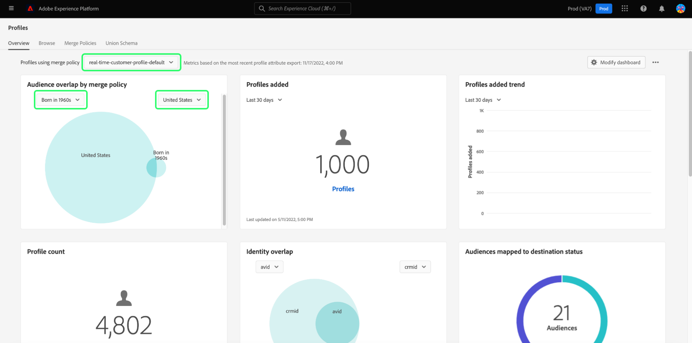

# [!UICONTROL Profils] tableau de bord

L’interface utilisateur de Adobe Experience Platform fournit un tableau de bord grâce auquel vous pouvez afficher des informations importantes sur votre [!DNL Real-time Customer Profile] données, telles qu’elles sont capturées lors d’un instantané quotidien. Ce guide explique comment accéder à et utiliser le [!UICONTROL Profils] tableau de bord dans l’interface utilisateur et fournit des informations sur les mesures affichées dans le tableau de bord.

Pour une présentation de toutes les fonctionnalités de profil de l’interface utilisateur de l’Experience Platform, consultez la page [Guide de l’interface utilisateur de Real-time Customer Profile](../../profile/ui/user-guide.md).

## Données du tableau de bord du profil

Le [!UICONTROL Profils] Le tableau de bord affiche un instantané des données d’attribut (enregistrement) dont votre organisation dispose dans la banque de profils dans Experience Platform. L’instantané n’inclut aucune donnée d’événement (série temporelle).

Les données d’attribut de l’instantané affichent les données exactement telles qu’elles apparaissent au moment précis où l’instantané a été pris. En d’autres termes, l’instantané n’est pas une approximation ou un échantillon des données, et le tableau de bord Profil n’est pas mis à jour en temps réel.

>[!NOTE]
>
>Les modifications ou mises à jour apportées aux données depuis la prise dʼun instantané ne seront pas reflétées dans le tableau de bord avant la prise de lʼinstantané suivant.

## Exploration de la [!UICONTROL Profils] tableau de bord

Pour accéder au [!UICONTROL Profils] Tableau de bord dans l’interface utilisateur de Platform, sélectionnez **[!UICONTROL Profils]** dans le rail de gauche, puis sélectionnez l’option **[!UICONTROL Présentation]** pour afficher le tableau de bord.

>[!NOTE]
>
>Si votre entreprise est une nouvelle entreprise de Platform et qu’elle ne dispose pas encore de jeux de données Profile principaux ni de stratégies de fusion créés, la variable [!UICONTROL Profils] tableau de bord n’est pas visible. Au lieu de cela, la variable [!UICONTROL Présentation] Cet onglet affiche des liens et de la documentation pour vous aider à prendre en main Real-time Customer Profile.

### Modification de la variable [!UICONTROL Profils] tableau de bord

Vous pouvez modifier l’aspect de la variable [!UICONTROL Profils] tableau de bord en sélectionnant **[!UICONTROL Modifier le tableau de bord]**. Cela vous permet de déplacer, d’ajouter et de supprimer des widgets du tableau de bord, ainsi que d’accéder au **[!UICONTROL Bibliothèque de widgets]** pour explorer les widgets disponibles et créer des widgets personnalisés pour votre organisation.

Reportez-vous à la section [modification des tableaux de bord](../customize/modify.md) et [Présentation de la bibliothèque de widgets](../customize/widget-library.md) pour en savoir plus.

## (Version bêta) Informations sur l’efficacité des profils {#profile-efficacy-insights}

>[!IMPORTANT]
>
>La fonctionnalité d’informations sur l’efficacité des profils est actuellement en version bêta et n’est pas disponible pour tous les utilisateurs. La documentation et les fonctionnalités peuvent changer.

Le [!UICONTROL Efficacité] fournit des mesures sur la qualité et l’exhaustivité de vos données de profil grâce à l’utilisation de widgets d’efficacité de profil. Ces widgets illustrent en un coup d’oeil la composition de vos profils, les tendances d’exhaustivité au fil du temps et les évaluations de la qualité des données de votre profil.

Voir [section widgets d’efficacité du profil](#profile-efficacy-widgets) pour plus d’informations sur les widgets actuellement disponibles.

La mise en page de ce tableau de bord peut également être personnalisée en sélectionnant [**[!UICONTROL Modifier le tableau de bord]**](../customize/modify.md) de la [!UICONTROL Présentation] .

## Parcourir les profils {#browse-profiles}

Le [!UICONTROL Parcourir] vous permet de rechercher et d’afficher les profils en lecture seule ingérés dans votre organisation. Vous y trouverez des informations importantes appartenant au profil concernant leurs préférences, les événements passés, les interactions et les segments.

Pour en savoir plus sur les fonctionnalités d’affichage des profils fournies dans l’interface utilisateur de Platform, consultez la documentation sur [navigation dans les profils dans Real-time Customer Data Platform](../../rtcdp/profile/profile-browse.md).

## Stratégies de fusion {#merge-policies}

Les mesures affichées dans la [!UICONTROL Profils] Le tableau de bord est basé sur les stratégies de fusion appliquées à vos données Real-time Customer Profile. Lorsque des données sont rassemblées à partir de plusieurs sources pour créer le profil client, les données peuvent contenir des valeurs en conflit. Par exemple, un jeu de données peut désigner un client comme &quot;célibataire&quot;, tandis qu’un autre jeu de données peut désigner le client comme &quot;marié&quot;. La tâche de la stratégie de fusion consiste à déterminer les données à prioriser et à afficher dans le cadre du profil.

Pour plus d’informations sur les stratégies de fusion, notamment sur la création, la modification et la déclaration d’une stratégie de fusion par défaut pour votre organisation, commencez par lire la section [présentation des stratégies de fusion](../../profile/merge-policies/overview.md).

Le tableau de bord sélectionne automatiquement une stratégie de fusion à utiliser. La stratégie de fusion appliquée peut être modifiée à l’aide du menu déroulant en regard du nom de la stratégie de fusion.

>[!NOTE]
>
>Le menu déroulant affiche uniquement les stratégies de fusion liées à la classe XDM Individual Profile. Cependant, si votre organisation a créé plusieurs stratégies de fusion, il se peut que vous deviez faire défiler l’écran pour afficher la liste complète des stratégies de fusion disponibles.

## Schémas d’union

Le [!UICONTROL Schéma d’union] Le tableau de bord affiche le schéma d’union pour une classe XDM spécifique. En sélectionnant la variable **[!UICONTROL Classe]** dans la liste déroulante, vous pouvez afficher les schémas d’union pour différentes classes XDM.

Les schémas d’union sont composés de plusieurs schémas qui partagent la même classe et qui ont été activés pour Profile. Ils vous permettent de voir en une seule vue, une fusion de chaque champ contenu dans chaque schéma qui partage la même classe.

Pour en savoir plus sur l’interface utilisateur du schéma d’union, consultez le guide de l’interface utilisateur du schéma d’union . [affichage des schémas d’union dans l’interface utilisateur de Platform](../../profile/ui/union-schema.md#view-union-schemas).

## Widgets et mesures

Le tableau de bord est composé de widgets, qui sont des mesures en lecture seule fournissant des informations importantes sur vos données de profil.

La date et l’heure de la &quot;dernière mise à jour&quot; d’un widget indique le moment où le dernier instantané des données a été pris. La date et l’heure de l’instantané sont indiquées en UTC ; il ne se trouve pas dans le fuseau horaire de l’utilisateur ou de l’organisation.

## Widgets standard {#standard-widgets}

Adobe fournit plusieurs widgets standard que vous pouvez utiliser pour visualiser différentes mesures liées à vos données de profil. Vous pouvez également créer des widgets personnalisés à partager avec votre organisation à l’aide de la variable [!UICONTROL Bibliothèque de widgets]. Pour en savoir plus sur la création de widgets personnalisés, commencez par lire le [Présentation de la bibliothèque de widgets](../customize/widget-library.md).

Pour en savoir plus sur chacun des widgets standard disponibles, sélectionnez le nom d’un widget dans la liste suivante :

* [[!UICONTROL Nombre de profils]](#profile-count)
* [[!UICONTROL Tendance du nombre de profils]](#profile-count-trend)
* [[!UICONTROL Modification du nombre de profils]](#profile-count-change)
* [[!UICONTROL Tendance du nombre de changements de profils]](#profiles-count-change-trend)
* [[!UICONTROL Tendance de changement du nombre de profils par d’identité]](#profiles-count-change-trend-by-identity)
* [[!UICONTROL Profils par identité]](#profiles-by-identity)
* [[!UICONTROL Superposition des identités]](#identity-overlap)
* [[!UICONTROL Profils d’identité uniques]](#single-identity-profiles)
* [[!UICONTROL Profils non segmentés]](#unsegmented-profiles)
* [[!UICONTROL Tendance des profils non segmentés]](#unsegmented-profiles-trend)
* [[!UICONTROL Profils non segmentés par identité]](#unsegmented-profiles-by-identity)
* [[!UICONTROL Audiences]](#audiences)
* [[!UICONTROL Audiences mappées au statut de destination]](#audiences-mapped-to-destination-status)
* [[!UICONTROL Taille des audiences]](#audiences-size)
* [[!UICONTROL Profils d’identité uniques par identité]](#single-identity-profiles-by-identity)
* [[!UICONTROL Chevauchements d’audience par de stratégie de fusion]](#audience-overlap-by-merge-policy)

### [!UICONTROL Nombre de profils] {#profile-count}

>[!CONTEXTUALHELP]
>id="platform_dashboards_profiles_profilecount"
>title="Nombre de profils"
>abstract="Ce widget affiche le nombre total de profils fusionnés dans la banque de profils au moment où l’instantané a été pris. Le nombre dépend de la stratégie de fusion sélectionnée appliquée à vos données de profil."
>additional-url="https://experienceleague.adobe.com/docs/experience-platform/dashboards/guides/profiles.html" text="En savoir plus dans la documentation"

Le **[!UICONTROL Nombre de profils]** widget affiche le nombre total de profils fusionnés dans la banque de profils au moment de la prise de vue instantanée. Ce nombre est le résultat de l’application de la stratégie de fusion sélectionnée à vos données de profil afin de fusionner les fragments de profil pour former un seul profil pour chaque individu.

Voir [section sur les stratégies de fusion plus tôt dans ce document](#merge-policies) pour en savoir plus.

>[!NOTE]
>
>Le [!UICONTROL Nombre de profils] Le widget peut afficher un nombre différent du nombre de profils affiché dans la variable [!UICONTROL Parcourir] dans le [!UICONTROL Profils] pour plusieurs raisons. La raison la plus courante est que la variable [!UICONTROL Parcourir] L’onglet référence le nombre total de profils fusionnés en fonction de la stratégie de fusion par défaut de votre organisation, tandis que la variable [!UICONTROL Nombre de profils] Le widget référence le nombre total de profils fusionnés en fonction de la stratégie de fusion que vous avez sélectionnée pour afficher dans le tableau de bord.
>
>Une autre raison courante est due aux différences entre le moment où l’instantané du tableau de bord est pris et le moment où l’exemple de tâche est exécuté pour la fonction [!UICONTROL Parcourir] . Vous pouvez voir quand la variable [!UICONTROL Nombre de profils] Le widget a été mis à jour pour la dernière fois en examinant l’horodatage du widget et pour en savoir plus sur la manière dont l’exemple de tâche est déclenché sur la page [!UICONTROL Parcourir] , voir [section sur le nombre de profils dans le guide de l’interface utilisateur de Real-time Customer Profile](https://experienceleague.adobe.com/docs/experience-platform/profile/ui/user-guide.html?lang=en#profile-count).

### [!UICONTROL Tendance du nombre de profils] {#profile-count-trend}

Le [!UICONTROL Tendance du nombre de profils] widget utilise un graphique linéaire pour illustrer la tendance du nombre total de profils contenus dans le système au fil du temps. Ce nombre total inclut tous les profils importés dans le système depuis le dernier instantané quotidien. Les données peuvent être consultées sur des périodes de 30 jours, 90 jours et 12 mois. La période est sélectionnée dans un menu déroulant du widget.

### [!UICONTROL Modification du nombre de profils] {#profile-count-change}

>[!CONTEXTUALHELP]
>id="platform_dashboards_profiles_profilescountchange"
>title="Modification du nombre de profils"
>abstract="Ce widget affiche le nombre total de profils fusionnés **ajouté** à la banque de profils au moment de la dernière capture instantanée. Le nombre dépend de la stratégie de fusion sélectionnée appliquée à vos données de profil."
>additional-url="https://experienceleague.adobe.com/docs/experience-platform/dashboards/guides/profiles.html" text="En savoir plus dans la documentation"

Le **[!UICONTROL Modification du nombre de profils]** widget affiche le nombre de profils fusionnés ajoutés à la banque de profils depuis l’instantané précédent. Ce nombre est le résultat de l’application de la stratégie de fusion sélectionnée à vos données de profil afin de fusionner les fragments de profil pour former un seul profil pour chaque individu. Vous pouvez utiliser le sélecteur de liste déroulante pour afficher le nombre de profils ajoutés au cours des 30, 90 ou 12 derniers jours.

>[!NOTE]
>
>Le [!UICONTROL Modification du nombre de profils] widget reflète le nombre de profils ajoutés **after** la configuration initiale de l’ingestion des profils et de la banque de profils. En d’autres termes, si votre entreprise a configuré la banque de profils et ingéré 4 000 000 le jour 1, le tableau de bord sera disponible dans les 24 heures, mais la variable [!UICONTROL Modification du nombre de profils] est défini sur 0. Cela permet d’éviter un pic associé à l’ingestion initiale des profils dans le système. Au cours des 30 prochains jours, votre entreprise assimilera 1 000 000 profils supplémentaires dans la banque de profils. Une fois l’instantané suivant pris, la variable [!UICONTROL Modification du nombre de profils] Le widget affiche un total de 1 000 000 profils ajoutés, tandis que la variable [!UICONTROL Nombre de profils] le widget afficherait 5 000 000 profils au total.

### [!UICONTROL Tendance du nombre de changements de profils] {#profiles-count-change-trend}

>[!CONTEXTUALHELP]
>id="platform_dashboards_profiles_profilesaddedtrend"
>title="Tendance du nombre de changements de profils"
>abstract="Ce widget affiche le nombre de profils fusionnés qui ont été ajoutés quotidiennement à la banque de profils au cours des 30, 90 ou 12 derniers jours. Le nombre dépend également de la stratégie de fusion sélectionnée appliquée à vos données de profil."
>additional-url="https://experienceleague.adobe.com/docs/experience-platform/dashboards/guides/profiles.html" text="En savoir plus dans la documentation"

Le **[!UICONTROL Tendance du nombre de changements de profils]** widget affiche le nombre total de profils fusionnés qui ont été ajoutés quotidiennement à la banque de profils au cours des 30, 90 ou 12 derniers jours. Ce nombre est mis à jour chaque jour lorsque l’instantané est pris. Par conséquent, si vous deviez ingérer des profils dans Platform, le nombre de profils ne serait pas reflété tant que l’instantané suivant n’a pas été pris. Le nombre de profils ajoutés est le résultat de l’application de la stratégie de fusion sélectionnée à vos données de profil afin de fusionner les fragments de profil pour former un seul profil pour chaque individu.

Voir [section sur les stratégies de fusion plus tôt dans ce document](#merge-policies) pour en savoir plus.

Le **[!UICONTROL Tendance du nombre de changements de profils]** widget affiche un bouton &quot;légendes&quot; en haut à droite du widget. Sélectionner **[!UICONTROL Sous-titres]** pour ouvrir la boîte de dialogue des sous-titres automatiques.

Un modèle d’apprentissage automatique génère automatiquement des sous-titres pour décrire les tendances clés et les événements importants en analysant le graphique et les données.

### [!UICONTROL Tendance de changement du nombre de profils par d’identité] {#profiles-count-change-trend-by-identity}

<!-- This widget uses a line graph to illustrate the change in number of profiles filtered by a chosen source identity and merge policy. -->

Ce widget filtre le nombre de profils en fonction d’une identité source sélectionnée et d’une stratégie de fusion, puis illustre le changement de nombre pour diverses périodes à l’aide d’un graphique linéaire. La stratégie de fusion est sélectionnée dans la liste déroulante d’aperçu située en haut de la page. L’identité source et la période sont sélectionnées dans les menus déroulants du widget. La tendance peut être visualisée sur des périodes de 30 jours, 90 jours et 12 mois.

Ce widget vous aide à gérer vos besoins d’activation de destination en présentant le modèle de croissance des profils filtrés par une identité requise.

### [!UICONTROL Profils par identité] {#profiles-by-identity}

>[!CONTEXTUALHELP]
>id="platform_dashboards_profiles_profilesbyidentity"
>title="Profils par identité"
>abstract="Ce widget affiche la ventilation de tous les profils fusionnés dans votre banque de profils par identités."
>additional-url="https://experienceleague.adobe.com/docs/experience-platform/dashboards/guides/profiles.html" text="En savoir plus dans la documentation"

Le **[!UICONTROL Profils par identité]** widget affiche la ventilation des identités pour tous les profils fusionnés de votre banque de profils. Le nombre total de profils par identité (c’est-à-dire en additionnant les valeurs affichées pour chaque espace de noms) peut être supérieur au nombre total de profils fusionnés, car plusieurs espaces de noms peuvent être associés à un profil. Par exemple, si un client interagit avec votre marque sur plusieurs canaux, plusieurs espaces de noms seront associés à ce client individuel.

Voir [section sur les stratégies de fusion plus tôt dans ce document](#merge-policies) pour en savoir plus.

Sélectionner **[!UICONTROL Sous-titres]** pour ouvrir la boîte de dialogue des sous-titres automatiques.

Un modèle d’apprentissage automatique génère automatiquement des informations sur les données en analysant la distribution globale et les dimensions clés des données.

Pour en savoir plus sur les identités, rendez-vous sur la page [Documentation du service Adobe Experience Platform Identity](../../identity-service/home.md).

### [!UICONTROL Superposition des identités] {#identity-overlap}

>[!CONTEXTUALHELP]
>id="platform_dashboards_profiles_identityoverlap"
>title="Superposition des identités"
>abstract="Ce widget utilise un diagramme de Venn pour afficher le chevauchement des profils de votre banque de profils qui contiennent les deux identités sélectionnées."
>additional-url="https://experienceleague.adobe.com/docs/experience-platform/dashboards/guides/profiles.html" text="En savoir plus dans la documentation"

Le **[!UICONTROL Superposition des identités]** Le widget utilise un diagramme de Venn, ou un diagramme de définition, pour afficher le chevauchement des profils de votre banque de profils qui contiennent les deux identités sélectionnées.

Utilisez les menus déroulants du widget pour sélectionner les identités à comparer. Les cercles affichent le nombre total relatif de profils qui contiennent chaque identité. Le nombre de profils contenant les deux identités est représenté par la taille du chevauchement entre les cercles. Si un client interagit avec votre marque sur plusieurs canaux, plusieurs identités seront associées à ce client individuel. Par conséquent, il est probable que votre organisation dispose de plusieurs profils contenant des fragments provenant de plusieurs identités.

Pour plus d’informations sur les fragments de profil, commencez par lire la section sur [fragments de profil par rapport aux profils fusionnés](https://experienceleague.adobe.com/docs/experience-platform/profile/home.html?lang=en#profile-fragments-vs-merged-profiles) dans la présentation de Real-time Customer Profile.

Pour en savoir plus sur les identités, rendez-vous sur la page [Documentation du service Adobe Experience Platform Identity](../../identity-service/home.md).

### [!UICONTROL Profils d’identité uniques] {#single-identity-profiles}

>[!CONTEXTUALHELP]
>id="platform_dashboards_profiles_singleidentityprofiles"
>title="Profils d’identité uniques"
>abstract="Ce widget fournit un comptage des profils de votre organisation qui n’ont qu’un seul type d’ID qui crée leur identité. Ce type d’identifiant peut être un email ou un ECID."
>additional-url="https://experienceleague.adobe.com/docs/experience-platform/dashboards/guides/profiles.html" text="En savoir plus dans la documentation"

Le [!UICONTROL Profils d’identité uniques] Le widget fournit un décompte des profils de votre organisation qui ne disposent que d’un seul type d’ID qui crée leur identité. Ce type d’identifiant peut être un email ou un ECID. Le nombre de profils est généré à partir des données contenues dans l’instantané le plus récent.

### [!UICONTROL Profils non segmentés] {#unsegmented-profiles}

>[!CONTEXTUALHELP]
>id="platform_dashboards_profiles_unsegmentedprofiles"
>title="Profils non segmentés"
>abstract="Ce widget fournit le nombre total de tous les profils qui ne sont associés à aucun segment et représente l’opportunité d’activation des profils à l’échelle de votre organisation."
>additional-url="https://experienceleague.adobe.com/docs/experience-platform/dashboards/guides/profiles.html" text="En savoir plus dans la documentation"

Le [!UICONTROL Profils non segmentés] fournit le nombre total de tous les profils qui ne sont associés à aucun segment. Le nombre, généré à partir du dernier instantané, est précis et souligne l’opportunité d’activation de profils dans votre entreprise. Elle indique également la possibilité d’effacer les profils qui ne fournissent pas un retour sur investissement adéquat.

### [!UICONTROL Tendance des profils non segmentés] {#unsegmented-profiles-trend}

>[!CONTEXTUALHELP]
>id="platform_dashboards_profiles_unsegmentedprofilestrend"
>title="Tendance des profils non segmentés"
>abstract="Ce widget fournit une représentation graphique linéaire du nombre de profils qui ne sont associés à aucun segment sur une période donnée. La tendance des profils non associés à un segment peut être visualisée sur des périodes de 30 jours, 90 jours et 12 mois."
>additional-url="https://experienceleague.adobe.com/docs/experience-platform/dashboards/guides/profiles.html#unsegmented-profiles-trend" text="En savoir plus dans la documentation"

Le [!UICONTROL Tendance des profils non segmentés] Le widget fournit une représentation graphique linéaire pour le nombre de profils qui ne sont associés à aucun segment sur une période donnée. La tendance des profils non associés à un segment peut être visualisée sur des périodes de 30 jours, 90 jours et 12 mois. La période est sélectionnée dans un menu déroulant du widget. Le nombre de profils est reflété sur l’axe des ordonnées et sur l’heure sur l’axe des abscisses.

### [!UICONTROL Profils non segmentés par identité] {#unsegmented-profiles-by-identity}

>[!CONTEXTUALHELP]
>id="platform_dashboards_profiles_unsegmentedprofilesbyidentity"
>title="Profils non segmentés par identité"
>abstract="Ce widget classe le nombre total de profils non segmentés en fonction de leur identifiant unique."
>additional-url="https://experienceleague.adobe.com/docs/experience-platform/dashboards/guides/profiles.html" text="En savoir plus dans la documentation"

Le [!UICONTROL Profils non segmentés par identité] widget classe le nombre total de profils non segmentés en fonction de leur identifiant unique. Les données sont visualisées dans un graphique à barres afin de faciliter la comparaison.

### [!UICONTROL Audiences] {#audiences}

Ce widget fournit le nombre total de segments prêts à être activés, en fonction de la stratégie de fusion choisie appliquée aux données de votre profil.

Sélectionner **[!UICONTROL Audiences]** pour accéder au [!UICONTROL Segments] tableau de bord [!UICONTROL Parcourir] . De là, vous pouvez voir une liste de toutes les définitions de segment pour votre organisation.

<!-- https://jira.corp.adobe.com/browse/PLAT-115291 -->

<!-- * [[!UICONTROL Audiences change trend]](#audiences-change-trend) -->
<!-- ### [!UICONTROL Audiences change trend] {#audiences-change-trend}

This line graph widget visualizes the change in the total number of audiences each day, trending over time. The change in the number of audiences is dependent on the selected merge policy being applied to your profile data. The period of analysis is selected from the widget dropdown menu. The bar chart can be visualized over 30 days, 90 days, and 12-month periods.  

The visualization allows you to monitor the overall health of audiences within Adobe Experience Platform by understanding trends in the growth or decline of the total number of audiences. -->

<!--  -->

<!-- * [[!UICONTROL Audience overlap report]](#audience-overlap-report) -->
<!-- ### [!UICONTROL Audience overlap report] {#audience-overlap-report} -->

<!-- View an ordered list of audiences by highest or lowest overlap percentages by selected merge policy. -->
<!--  -->
<!-- https://jira.corp.adobe.com/browse/PLAT-126851 -->

### [!UICONTROL Audiences mappées au statut de destination] {#audiences-mapped-to-destination-status}

Le [!UICONTROL Audiences mappées à l’état de destination] le widget affiche le nombre total d’audiences mappées et non mappées dans une seule mesure et utilise un graphique en anneau pour illustrer la différence proportionnelle entre leurs totaux. Les nombres calculés dépendent de la stratégie de fusion choisie.

Les décomptes individuels des audiences mappées ou non mappées s’affichent dans une boîte de dialogue lorsque le curseur survole la section correspondante du graphique en anneau.

### [!UICONTROL Taille des audiences] {#audiences-size}

Le [!UICONTROL Taille des audiences] Ce widget fournit un tableau à deux colonnes qui répertorie jusqu’à 20 segments et le nombre total d’audiences contenues dans chaque segment. La liste est classée de haut en bas en fonction du nombre total d’audiences. Le nombre total de tailles d’audience dépend de la stratégie de fusion appliquée.

Pour afficher des informations complètes sur un segment, sélectionnez un nom de segment dans la liste fournie pour accéder au [!UICONTROL Segments] [!UICONTROL Détail] page. En outre, en sélectionnant **[!UICONTROL Afficher tous les segments]** à partir de la fin du widget, vous pouvez accéder au [!UICONTROL Segments] [!UICONTROL Parcourir] pour rechercher un segment existant.

Pour plus d’informations sur la variable [[!UICONTROL Segments] [!UICONTROL  Parcourir] tab](https://experienceleague.adobe.com/docs/experience-platform/segmentation/ui/overview.html#browse).

### [!UICONTROL Profils d’identité uniques par identité] {#single-identity-profiles-by-identity}

Ce widget utilise un graphique à barres pour illustrer le nombre total de profils qui sont identifiés à l’aide d’un identifiant unique. Le widget prend en charge jusqu’à cinq des identités les plus courantes.

Pointez sur des barres individuelles pour afficher une boîte de dialogue détaillant le nombre total de profils pour une identité.

### [!UICONTROL Chevauchements d’audience par de stratégie de fusion] {#audience-overlap-by-merge-policy}

Ce widget utilise un diagramme de Venn pour afficher le chevauchement de deux segments sélectionnés. La stratégie de fusion est sélectionnée dans la liste déroulante d’aperçu située en haut de la page et les segments à analyser sont sélectionnés dans deux menus déroulants du widget. Le nombre total de profils contenus dans la définition de segment pertinente peut être affiché en passant la souris sur un cercle ou l’intersection.

Comme le widget affiche le croisement visuel des définitions de segment, vous pouvez optimiser votre stratégie de segmentation en étudiant les similarités entre vos définitions de segment.

## (Version bêta) Widgets d’efficacité des profils {#profile-efficacy-widgets}

>[!IMPORTANT]
>
>Les widgets d’efficacité du profil sont actuellement en version bêta et ne sont pas disponibles pour tous les utilisateurs. La documentation et les fonctionnalités peuvent changer.

Adobe fournit plusieurs widgets pour évaluer l’exhaustivité des profils ingérés disponibles pour votre analyse des données. Chacun des widgets d’efficacité de profil peut être filtré par la stratégie de fusion. Pour modifier le filtre de stratégie de fusion, sélectionnez la variable[!UICONTROL Profils utilisant une stratégie de fusion] et sélectionnez la stratégie appropriée dans la liste disponible.

Pour en savoir plus sur chacun des widgets d’efficacité de profil, sélectionnez le nom d’un widget dans la liste suivante :

* [[!UICONTROL Évaluation de la qualité des attributs]](#attributes-quality-assessment)
* [[!UICONTROL Profils par exhaustivité]](#profiles-by-completeness)
* [[!UICONTROL Tendance d’achèvement des profils]](#profiles-completeness-trend)

### (Version bêta) [!UICONTROL Évaluation de la qualité des attributs] {#attributes-quality-assessment}

>[!CONTEXTUALHELP]
>id="platform_dashboards_profiles_attributesqualityassessment"
>title="Évaluation de la qualité des attributs"
>abstract="Ce widget affiche l’exhaustivité et la cardinalité de tous les profils en fonction de leurs attributs. Chaque ligne décrit un attribut. Le **Profils** indique le nombre de profils qui possèdent cet attribut et qui sont remplis avec des valeurs non nulles. Le **Complétude** Le pourcentage est déterminé par le nombre total de profils qui possèdent cet attribut et qui sont remplis de valeurs non nulles divisées par le nombre total de valeurs non vides dans les profils pour cet attribut. **Cardinalité** fournit le nombre total de valeurs non nulles uniques de cet attribut pour tous les attributs."
>additional-url="https://experienceleague.adobe.com/docs/experience-platform/dashboards/guides/profiles.html" text="En savoir plus dans la documentation"

Le [!UICONTROL Évaluation de la qualité des attributs] widget affiche l’exhaustivité et la cardinalité de tous les profils en fonction de leurs attributs. Les données sont exactes jusqu’à la date du dernier traitement. Ces informations sont présentées sous la forme d’un tableau de quatre colonnes où chaque ligne du tableau représente un attribut unique.

| Colonne | Description |
|---|---|
| Attribut | Nom de l’attribut. |
| Profils | Le nombre de profils qui possèdent cet attribut et qui sont remplis par des valeurs non nulles. |
| Complétude | Ce pourcentage est déterminé par le nombre total de profils qui possèdent cet attribut et qui sont renseignés avec des valeurs non nulles. Le nombre est calculé en divisant le nombre total de profils par le nombre total de valeurs non vides dans les profils pour cet attribut. |
| Cardinalité | Le nombre total de **unique** valeurs non nulles de cet attribut. Elle est mesurée sur tous les profils. |

### (Version bêta) [!UICONTROL Profils par exhaustivité] {#profiles-by-completeness}

>[!CONTEXTUALHELP]
>id="platform_dashboards_profiles_profilesbycompleteness"
>title="Profils par exhaustivité"
>abstract="Le graphique en anneau affiche le pourcentage des attributs de profil remplis de valeurs non nulles parmi tous les attributs observés. Il illustre la proportion de profils présentant une exhaustivité élevée, moyenne ou faible. Les profils d’exhaustivité élevée ont plus de 70 % de leurs attributs remplis. Les profils d’exhaustivité moyenne disposent de 30 à 70 % de leurs attributs renseignés. Les profils d’exhaustivité basse ont moins de 30 % de leurs attributs renseignés."
>additional-url="https://experienceleague.adobe.com/docs/experience-platform/dashboards/guides/profiles.html" text="En savoir plus dans la documentation"

Le [!UICONTROL Profils par exhaustivité] crée un graphique en anneau d’exhaustivité du profil depuis la date du dernier traitement. L’exhaustivité d’un profil est mesurée par le pourcentage d’attributs remplis avec des valeurs non nulles parmi tous les attributs observés.

Ce widget affiche la proportion de profils présentant une exhaustivité élevée, moyenne ou faible. Par défaut, trois niveaux d’exhaustivité sont configurés :

* Haute exhaustivité : Les profils sont remplis à plus de 70 % de leurs attributs.
* Paramètre d’exhaustivité moyenne : Les profils ont entre 30 et 70 % de leurs attributs renseignés.
* Faible exhaustivité : Les profils sont remplis à moins de 30 % de leurs attributs.

### (Version bêta) [!UICONTROL Tendance d’achèvement des profils] {#profiles-completeness-trend}

>[!CONTEXTUALHELP]
>id="platform_dashboards_profiles_profilescompletenesstrend"
>title="Tendance d’achèvement des profils"
>abstract="Ce widget crée un diagramme de surface empilé pour décrire la tendance de l’exhaustivité des profils au fil du temps. La complexité est mesurée par le pourcentage d’attributs remplis avec des valeurs non nulles parmi tous les attributs observés."
>additional-url="https://experienceleague.adobe.com/docs/experience-platform/dashboards/guides/profiles.html" text="En savoir plus dans la documentation"

Ce widget crée un diagramme de surface empilé pour décrire la tendance de l’exhaustivité des profils au fil du temps. La complexité est mesurée par le pourcentage d’attributs remplis avec des valeurs non nulles parmi tous les attributs observés. Elle classe l’exhaustivité du profil comme une exhaustivité élevée, moyenne ou faible depuis la date du dernier traitement.

L’axe X représente le temps, l’axe Y le nombre de profils et les couleurs les trois niveaux d’exhaustivité du profil.

Les trois niveaux d&#39;exhaustivité sont les suivants :

* Haute exhaustivité : Les profils comportent plus de 70 % des attributs renseignés.
* Paramètre d’exhaustivité moyenne : Les profils comportent moins de 70 % et plus de 30 % des attributs renseignés.
* Faible exhaustivité : Les profils comportent moins de 30 % des attributs renseignés.

## Étapes suivantes

En suivant ce document, vous devriez maintenant pouvoir localiser le tableau de bord Profils et comprendre les mesures affichées dans les widgets disponibles. Pour en savoir plus sur l’utilisation de [!DNL Profile] données de l’interface utilisateur de l’Experience Platform, reportez-vous à la section [Guide de l’interface utilisateur de Real-time Customer Profile](../../profile/ui/user-guide.md).
