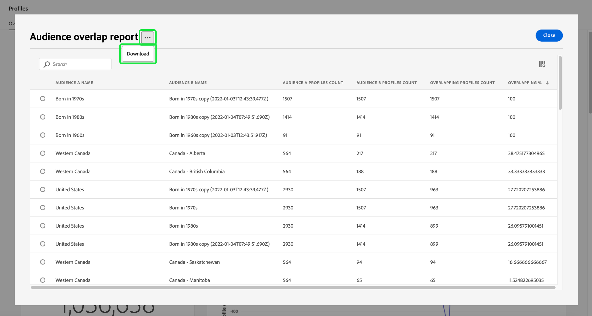
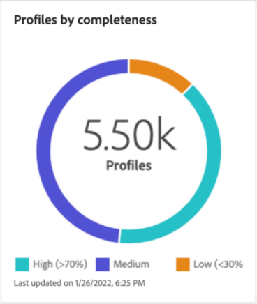

# Tableau de bord des [!UICONTROL profils]

L’interface utilisateur d’Adobe Experience Platform fournit un tableau de bord grâce auquel vous pouvez afficher des informations importantes sur vos données [!DNL Real-Time Customer Profile], présentées ainsi lors d’un instantané quotidien. Ce guide explique comment accéder au tableau de bord Profils et l’utiliser dans l’interface utilisateur. Il fournit également des informations sur les mesures affichées dans le tableau de bord.

Voir [Guide de l’interface utilisateur de Real-Time Customer Profile](../../profile/ui/user-guide.md) pour une présentation des fonctionnalités de profil dans l’interface utilisateur de l’Experience Platform.

## Données du tableau de bord Profils

Le tableau de bord Profils affiche un instantané des données d’attribut (d’enregistrement) dont votre entreprise dispose dans la banque de profils d’Experience Platform. L’instantané n’inclut aucune donnée d’événement (série temporelle).

Les données de lʼinstantané montrent les données exactement comme elles apparaissent au moment précis où lʼinstantané a été pris. En dʼautres termes, lʼinstantané nʼest pas une approximation ou un exemple des données, et le tableau de bord Profils n’est pas mis à jour en temps réel.

>[!NOTE]
>
>Les modifications ou mises à jour apportées aux données depuis la prise dʼun instantané ne seront pas reflétées dans le tableau de bord avant la prise de lʼinstantané suivant.

## Explorer le tableau de bord Profils

Pour accéder au tableau de bord Profils dans l’interface utilisateur de Platform, sélectionnez **[!UICONTROL Profils]** dans le rail de gauche, puis sélectionnez l’onglet **[!UICONTROL Présentation]** pour afficher le tableau de bord.

>[!NOTE]
>
>Si votre organisation débute avec Platform et ne dispose pas encore de jeux de données ou de politiques de fusion de profil actifs, le tableau de bord Profils n’est pas visible. Au lieu de cela, la variable [!UICONTROL Présentation] Cet onglet affiche des liens et de la documentation pour vous aider à prendre en main Real-time Customer Profile.

### Modifier le tableau de bord Profils

Vous pouvez modifier l’aspect du tableau de bord Profils en sélectionnant **[!UICONTROL Modifier le tableau de bord]**. Vous pouvez déplacer, ajouter, redimensionner et supprimer des widgets du tableau de bord, ainsi que d’accéder au **[!UICONTROL Bibliothèque de widgets]** pour explorer les widgets disponibles et créer des widgets personnalisés pour votre organisation.

Pour en savoir plus, voir la section [modification des tableaux de bord](../customize/modify.md) et [Présentation de la bibliothèque de widgets](../customize/widget-library.md) la documentation.

### Ajouter des widgets {#add-widget}

Sélectionnez **[!UICONTROL Ajouter un widget]** pour accéder à la bibliothèque de widgets et voir la liste des widgets disponibles à ajouter à votre tableau de bord.

Dans la bibliothèque de widgets, vous pouvez parcourir la sélection de widgets d’audience standard et personnalisés. Pour plus d’informations sur l’ajout de widgets, consultez la documentation de la bibliothèque de widgets sur la manière d’[ajouter un widget](../customize/widget-library.md#add-widgets).

<!-- ## (Beta) Profile efficacy insights {#profile-efficacy-insights}

>[!IMPORTANT]
>
>The profile efficacy insight functionality is currently in beta and are not available to all users. The documentation and the functionality are subject to change.

The [!UICONTROL Efficacy] tab provides metrics on the quality and completeness of your profile data through the use of profile efficacy widgets. These widgets illustrate at a glance the composition of your profiles, trends in completeness over time, and assessments on the quality of your profile data.

See the [profile efficacy widgets section](#profile-efficacy-widgets) for more information on the widgets currently available.

The layout of this dashboard is also customizable by selecting [**[!UICONTROL Modify dashboard]**](../customize/modify.md) from the [!UICONTROL Overview] tab. -->

## Parcourir les profils {#browse-profiles}

L’onglet [!UICONTROL Parcourir] vous permet de rechercher et d’afficher les profils en lecture seule ingérés dans votre organisation. Vous y trouverez des informations importantes appartenant au profil concernant leurs préférences, les événements passés, les interactions et les audiences.

Pour en savoir plus sur les fonctionnalités d’affichage des profils fournies dans l’interface utilisateur de Platform, consultez la documentation sur [navigation dans les profils dans Adobe Real-time Customer Data Platform](../../rtcdp/profile/profile-browse.md).

## Politiques de fusion {#merge-policies}

Les mesures affichées dans le tableau de bord Profils reposent sur les stratégies de fusion appliquées à vos données Real-Time Customer Profile. Lorsque des données sont rassemblées à partir de plusieurs sources pour créer le profil client, les données peuvent contenir des valeurs en conflit. Par exemple, un jeu de données peut désigner un(e) client(e) comme « célibataire » tandis qu’un autre jeu de données peut désigner le/la client(e) comme « marié(e) ». La tâche de la politique de fusion consiste à déterminer les données à prioriser et à afficher dans le cadre du profil.

Pour plus d’informations sur les politiques de fusion, notamment sur la création, la modification et la déclaration d’une politique de fusion par défaut pour votre organisation, reportez-vous à la [présentation des politiques de fusion](../../profile/merge-policies/overview.md).

Le tableau de bord sélectionne automatiquement une stratégie de fusion à utiliser. La politique de fusion appliquée peut être modifiée à l’aide du menu déroulant à côté du nom de la politique de fusion.

>[!NOTE]
>
>Le menu déroulant affiche uniquement les politiques de fusion qui utilisent le schéma `_xdm.context.profile`. Cependant, si votre organisation a créé plusieurs politiques de fusion, vous devrez peut-être faire défiler la liste complète des politiques de fusion disponibles.

## Schémas d’union

Le tableau de bord [!UICONTROL Schéma d’union] affiche le schéma d’union pour une classe XDM spécifique. En sélectionnant la liste déroulante **[!UICONTROL Classe]**, vous pouvez afficher les schémas d’union pour différentes classes XDM.

Les schémas d’union sont composés de plusieurs schémas qui partagent la même classe et qui ont été activés pour Profile. Ils vous permettent de voir en une seule vue, une fusion de chaque champ contenu dans chaque schéma qui partage la même classe.

Pour en savoir plus sur [affichage des schémas d’union dans l’interface utilisateur de Platform](../../profile/ui/union-schema.md#view-union-schemas), reportez-vous au guide de l’interface utilisateur du schéma d’union.

## Widgets et mesures

Le tableau de bord est composé de widgets, qui sont des mesures en lecture seule fournissant des informations importantes sur vos données de profil.

La date et l’heure de l’instantané le plus récent s’affichent en haut de l’onglet [!UICONTROL Présentation] à côté de la liste déroulante Politique de fusion. Toutes les données du widget sont exactes à cette date et cette heure. La date et l’heure de l’instantané sont fournies en UTC ; elles ne se trouvent pas dans le fuseau horaire de l’utilisateur/utilisatrice ou de l’organisation.

## Widgets par défaut {#default-widgets}

Un chargement de widget par défaut est fourni pour toutes les nouvelles instances de Adobe Experience Platform qui mettent en évidence les dernières informations disponibles à partir de vos données. Les widgets suivants sont préconfigurés dans l’affichage des segments dès le départ. Vous trouverez ci-dessous des détails complets sur l’objectif et la fonction des widgets.

* [[!UICONTROL Nombre de profils]](#profile-count)
* [[!UICONTROL Modification du nombre de profils]](#profile-count-change)
* [[!UICONTROL Tendance de modification du nombre de profils]](#profiles-count-change-trend)
* [[!UICONTROL Profils par identité]](#profiles-by-identity)
* [[!UICONTROL Chevauchement des identités]](#identity-overlap)

>[!NOTE]
>
>Depuis le 26 juillet 2023, la variable [!UICONTROL Profils], [!UICONTROL Audiences], et [!UICONTROL Destinations] Les tableaux de bord Aperçu ont été réinitialisés à un nouveau chargement de widget par défaut pour tous les utilisateurs qui n’ont pas modifié leurs vues au cours des six derniers mois. Reportez-vous à la documentation du [Destinations](./destinations.md#default-widgets) et [Audiences](./audiences.md#default-widgets) sections de widget par défaut pour plus d’informations sur les widgets qui sont inclus dans les chargements de widgets par défaut. Vous pouvez continuer à personnaliser vos widgets de tableau de bord comme auparavant.

## Widgets standard {#standard-widgets}

Adobe fournit plusieurs widgets standards que vous pouvez utiliser pour visualiser différentes mesures liées à vos données de profil. Vous pouvez également créer des widgets personnalisés à partager avec votre organisation à l’aide de la [!UICONTROL Bibliothèque de widgets]. Pour en savoir plus sur la création de widgets personnalisés, commencez par lire le [Présentation de la bibliothèque de widgets](../customize/widget-library.md).

Pour en savoir plus sur chacun des widgets standards disponibles, sélectionnez le nom d’un widget dans la liste suivante :

* [[!UICONTROL Nombre de profils]](#profile-count)
* [[!UICONTROL Tendance du nombre de profils]](#profile-count-trend)
* [[!UICONTROL Modification du nombre de profils]](#profile-count-change)
* [[!UICONTROL Tendance de modification du nombre de profils]](#profiles-count-change-trend)
* [[!UICONTROL Tendance de modification du nombre de profils par d’identité]](#profiles-count-change-trend-by-identity)
* [[!UICONTROL Profils par identité]](#profiles-by-identity)
* [[!UICONTROL Chevauchement des identités]](#identity-overlap)
* [[!UICONTROL Profils à identité unique]](#single-identity-profiles)
* [[!UICONTROL Profils à identité unique par identité]](#single-identity-profiles-by-identity)
* [[!UICONTROL Profils non segmentés]](#unsegmented-profiles)
* [[!UICONTROL Les profils non segmentés changent de tendance]](#unsegmented-profiles-change-trend)
* [[!UICONTROL Profils non segmentés par identité]](#unsegmented-profiles-by-identity)
* [[!UICONTROL Audiences]](#audiences)
* [[!UICONTROL Audiences mappées au statut de destination]](#audiences-mapped-to-destination-status)
* [[!UICONTROL Taille des audiences]](#audiences-size)
* [[!UICONTROL Chevauchements d’audience par politique de fusion]](#audience-overlap-by-merge-policy)
* [[!UICONTROL Rapport de chevauchement d’audience]](#audience-overlap-report)

### [!UICONTROL Nombre de profils] {#profile-count}

>[!CONTEXTUALHELP]
>id="platform_dashboards_profiles_profilecount"
>title="Nombre de profils"
>abstract="Ce widget affiche le nombre total de profils fusionnés dans la banque de profils au moment où l’instantané a été pris. Le nombre dépend de la politique de fusion sélectionnée appliquée à vos données de profil."

Le widget **[!UICONTROL Nombre de profils]** affiche le nombre total de profils fusionnés dans la banque de profils au moment où l’instantané a été pris. Ce nombre est le résultat de l’application de la politique de fusion sélectionnée à vos données de profil afin de fusionner les fragments de profil pour former un seul profil pour chaque individu.

Pour en savoir plus, consultez la [section sur les politiques de fusion plus haut dans ce document](#merge-policies).

>[!NOTE]
>
>Le widget [!UICONTROL Nombre de profils] peut afficher un nombre différent du nombre de profils affiché dans l’onglet [!UICONTROL Parcourir] dans la section [!UICONTROL Profils] de l’interface utilisateur pour plusieurs raisons. La raison la plus courante de cette différence est que la variable [!UICONTROL Parcourir] L’onglet référence le nombre total de profils fusionnés en fonction de la stratégie de fusion par défaut de votre organisation, tandis que la variable [!UICONTROL Nombre de profils] Le widget référence le nombre total de profils fusionnés en fonction de la stratégie de fusion que vous avez sélectionnée pour afficher dans le tableau de bord.
>
>Une autre raison courante est due aux différences entre le moment où l’instantané du tableau de bord est pris et le moment où l’exemple de tâche est exécuté pour l’onglet [!UICONTROL Parcourir]. Vous pouvez voir quand le widget [!UICONTROL Nombre de profils] a été mis à jour pour la dernière fois en regardant la date et l’heure sur le widget. Pour en savoir plus sur la manière dont l’exemple de tâche est déclenché sur la page [!UICONTROL Parcourir] , voir [section sur le nombre de profils dans le guide de l’interface utilisateur de Real-time Customer Profile](https://experienceleague.adobe.com/docs/experience-platform/profile/ui/user-guide.html?lang=fr#profile-count).

### [!UICONTROL Tendance du nombre de profils] {#profile-count-trend}

Le widget [!UICONTROL Tendance du nombre de profils] utilise un graphique linéaire pour illustrer la tendance du nombre total de profils contenus dans le système au fil du temps. Ce nombre total inclut tous les profils importés dans le système depuis le dernier instantané quotidien. Les données peuvent être visualisées sur des périodes de 30 jours, 90 jours et 12 mois. La période est sélectionnée dans un menu déroulant du widget.

### [!UICONTROL Modification du nombre de profils] {#profile-count-change}

>[!CONTEXTUALHELP]
>id="platform_dashboards_profiles_profilescountchange"
>title="Modification du nombre de profils"
>abstract="Ce widget affiche le nombre total de profils fusionnés **ajoutés** à la banque de profils au moment du dernier instantané. Le nombre dépend de la politique de fusion sélectionnée appliquée à vos données de profil."

Le widget **[!UICONTROL Modification du nombre de profils]** affiche le nombre de profils fusionnés ajoutés à la banque de profils depuis l’instantané précédent. Ce nombre est le résultat de l’application de la politique de fusion sélectionnée à vos données de profil afin de fusionner les fragments de profil pour former un seul profil pour chaque individu. Vous pouvez utiliser le sélecteur de liste déroulante pour afficher le nombre de profils ajoutés au cours des 30 derniers jours, des 90 derniers jours, ou des 12 derniers mois.

>[!NOTE]
>
>Le widget [!UICONTROL Modification du nombre de profils] reflète le nombre de profils ajoutés **après** la configuration initiale de l’ingestion des profils et de la banque de profils. En d’autres termes, si votre organisation a configuré la banque de profils et ingéré 4 000 000 profils au jour 1, le tableau de bord sera disponible dans les 24 heures, mais le widget [!UICONTROL Modification du nombre de profils] sera défini sur 0. Cette méthode de comptage est effectuée pour éviter un pic associé à l’ingestion initiale des profils dans le système. Au cours des 30 prochains jours, votre organisation ingèrera 1 000 000 profils supplémentaires dans la banque de profils. Une fois l’instantané suivant pris, le widget [!UICONTROL Modification du nombre de profils] affiche un total de 1 000 000 profils ajoutés, tandis que le widget [!UICONTROL Nombre de profils] affiche un total de 5 000 000 profils.

### [!UICONTROL Tendance de modification du nombre de profils] {#profiles-count-change-trend}

>[!CONTEXTUALHELP]
>id="platform_dashboards_profiles_profilesaddedtrend"
>title="Tendance de modification du nombre de profils"
>abstract="Ce widget affiche le nombre de profils fusionnés qui ont été ajoutés quotidiennement à la banque de profils au cours des 30 derniers jours, des 90 derniers jours, ou des 12 derniers mois. Le nombre dépend également de la politique de fusion sélectionnée appliquée à vos données de profil."

Le widget **[!UICONTROL Tendance de modification du nombre de profils]** affiche le nombre total de profils fusionnés qui ont été ajoutés quotidiennement à la banque de profils au cours des 30 derniers jours, des 90 derniers jours, ou des 12 derniers mois. Ce nombre est mis à jour chaque jour lorsque l’instantané est pris. Par conséquent, si vous deviez ingérer des profils dans Platform, le nombre de profils ne serait pas reflété tant que l’instantané suivant n’aurait pas été pris. Le nombre de profils ajoutés est le résultat de l’application de la politique de fusion sélectionnée à vos données de profil afin de fusionner les fragments de profil pour former un seul profil pour chaque individu.

Pour en savoir plus, voir la section [section sur les stratégies de fusion plus tôt dans ce document](#merge-policies).

Le widget **[!UICONTROL Tendance de modification du nombre de profils]** affiche un bouton « légendes » en haut à droite du widget. Pour ouvrir la boîte de dialogue de sous-titres automatiques, sélectionnez **[!UICONTROL Sous-titres]**.

Un modèle de machine learning génère automatiquement des légendes pour décrire les tendances clés et les événements importants en analysant le graphique et les données. Les annotations sont ajoutées au graphique en fonction des légendes. Sélectionnez une légende pour mettre l’accent sur l’annotation correspondante.

### [!UICONTROL Tendance de modification du nombre de profils par identité] {#profiles-count-change-trend-by-identity}

<!-- This widget uses a line graph to illustrate the change in number of profiles filtered by a chosen source identity and merge policy. -->

Ce widget filtre le nombre de profils en fonction d’une identité source sélectionnée et fusionne la stratégie, puis illustre le changement de nombre pour différentes périodes à l’aide d’un graphique linéaire. La stratégie de fusion est sélectionnée dans la liste déroulante d’aperçu en haut de la page, l’identité source et la période sont sélectionnées dans les menus déroulants du widget. La tendance peut être visualisée sur des périodes de 30 jours, 90 jours et 12 mois.

Ce widget vous permet de gérer vos besoins d’activation de destination en présentant le modèle de croissance des profils filtrés selon l’identité requise.

### [!UICONTROL Profils par identité] {#profiles-by-identity}

>[!CONTEXTUALHELP]
>id="platform_dashboards_profiles_profilesbyidentity"
>title="Profils par identité"
>abstract="Ce widget affiche la répartition de tous les profils fusionnés dans votre banque de profils par identités."

Le widget **[!UICONTROL Profils par identité]** affiche la répartition des identités pour tous les profils fusionnés de votre banque de profils. Le nombre total de profils par identité (c’est-à-dire en additionnant les valeurs affichées pour chaque espace de noms) peut être supérieur au nombre total de profils fusionnés, car plusieurs espaces de noms peuvent être associés à un profil. Par exemple, si un client interagit avec votre marque sur plusieurs canaux, plusieurs espaces de noms sont associés à ce client individuel.

Pour en savoir plus, voir la section [section sur les stratégies de fusion plus tôt dans ce document](#merge-policies).

Pour ouvrir la boîte de dialogue de sous-titres automatiques, sélectionnez **[!UICONTROL Sous-titres]**.

Un modèle de machine learning génère automatiquement des informations sur les données en analysant la distribution globale et les dimensions clés des données.

Pour en savoir plus sur les identités, reportez-vous au [Documentation du service Adobe Experience Platform Identity](../../identity-service/home.md).

### [!UICONTROL Chevauchement des identités] {#identity-overlap}

>[!CONTEXTUALHELP]
>id="platform_dashboards_profiles_identityoverlap"
>title="Chevauchement des identités"
>abstract="Ce widget utilise un diagramme de Venn pour afficher le chevauchement des profils de votre banque de profils qui contiennent les deux identités sélectionnées."

Le widget **[!UICONTROL Chevauchement des identités]** utilise un diagramme de Venn, ou un diagramme logique, pour afficher le chevauchement des profils de votre banque de profils qui contiennent les deux identités sélectionnées.

Utilisez les menus déroulants du widget pour sélectionner les identités à comparer. Les cercles affichent le nombre total relatif de profils qui contiennent chaque identité. Le nombre de profils contenant les deux identités est représenté par la taille du chevauchement entre les cercles. Si un client interagit avec votre marque sur plusieurs canaux, plusieurs identités sont associées à ce client individuel. Dans ce cas, il est probable que votre organisation dispose de plusieurs profils contenant des fragments provenant de plusieurs identités.

Pour plus d&#39;informations sur les fragments de profil, consultez la section sur [fragments de profil par rapport aux profils fusionnés](../../profile/home.md#profile-fragments-vs-merged-profiles) dans la présentation de Real-time Customer Profile.

Pour en savoir plus sur les identités, reportez-vous au [Documentation du service Adobe Experience Platform Identity](../../identity-service/home.md).

### [!UICONTROL Profils à identité unique] {#single-identity-profiles}

>[!CONTEXTUALHELP]
>id="platform_dashboards_profiles_singleidentityprofiles"
>title="Profils à identité unique"
>abstract="Ce widget fournit le nombre de profils de votre organisation qui n’ont qu’un seul type d’identifiant qui crée leur identité. Ce type d’identifiant peut être une adresse e-mail ou un ECID."

Le widget [!UICONTROL Profils à identité unique] fournit un nombre des profils de votre organisation qui ne disposent que d’un seul type d’identifiant qui crée leur identité. Ce type d’identifiant peut être une adresse e-mail ou un ECID. Le nombre de profils est généré à partir des données contenues dans l’instantané le plus récent.

### [!UICONTROL Profils d’identité unique par identité] {#single-identity-profiles-by-identity}

Ce widget utilise un graphique à barres pour illustrer le nombre total de profils qui sont identifiés à l’aide d’un identifiant unique. Le widget prend en charge jusqu’à cinq des identités les plus courantes.

Pour afficher une boîte de dialogue détaillant le nombre total de profils pour une identité, placez le curseur sur des barres individuelles.

### [!UICONTROL Profils non segmentés] {#unsegmented-profiles}

>[!CONTEXTUALHELP]
>id="platform_dashboards_profiles_unsegmentedprofiles"
>title="Profils non segmentés"
>abstract="Ce widget fournit le nombre total de profils qui ne sont associés à aucune audience et représente l’opportunité d’activation des profils à l’échelle de votre organisation."

La variable [!UICONTROL Profils non segmentés] fournit le nombre total de tous les profils qui ne sont associés à aucune audience. Le nombre, généré à partir du dernier instantané, est précis et souligne l’opportunité d’activation de profils dans votre entreprise. Il indique également la possibilité d’effacer les profils qui ne fournissent pas un retour sur investissement adéquat.

### [!UICONTROL Les profils non segmentés changent de tendance] {#unsegmented-profiles-change-trend}

>[!CONTEXTUALHELP]
>id="platform_dashboards_profiles_unsegmentedprofilestrend"
>title="Tendance des profils non segmentés"
>abstract="Ce widget fournit une illustration graphique linéaire du nombre de profils qui ne sont associés à aucune audience sur une période donnée. La tendance des profils non associés à une audience peut être visualisée sur des périodes de 30 jours, 90 jours et 12 mois."

La variable [!UICONTROL Les profils non segmentés changent de tendance] widget utilise un graphique linéaire pour illustrer le nombre de profils ajoutés depuis le dernier instantané quotidien qui ne sont associés à aucune audience. La tendance de changement des profils qui ne sont associés à aucune audience peut être visualisée sur des périodes de 30 jours, 90 jours et 12 mois. La période est sélectionnée dans un menu déroulant du widget. Le nombre de profils est reflété sur l’axe des ordonnées et la période sur l’axe des abscisses.

### [!UICONTROL Profils non segmentés par identité] {#unsegmented-profiles-by-identity}

>[!NOTE]
>
>Le widget Profils non segmentés par identité a été abandonné en octobre 2022 et n’est plus disponible.

<!-- 

>[!CONTEXTUALHELP]
>id="platform_dashboards_profiles_unsegmentedprofilesbyidentity"
>title="Unsegmented profiles by identity"
>abstract="This widget categorizes the total number of unsegmented profiles by their unique identifier."

The [!UICONTROL Unsegmented Profiles by Identity] widget categorizes the total number of unsegmented profiles by their unique identifier. The data is visualized in a bar chart for ease of comparison. 

 -->

### [!UICONTROL Audiences] {#audiences}

Ce widget fournit le nombre total d’audiences prêtes à être activées, en fonction de la stratégie de fusion choisie appliquée aux données de votre profil.

Sélectionner **[!UICONTROL Audiences]** pour accéder au [!UICONTROL Audiences] tableau de bord [!UICONTROL Parcourir] . À partir de là, vous pouvez voir une liste de toutes les définitions de segment pour votre organisation.

<!-- https://jira.corp.adobe.com/browse/PLAT-115291 -->

<!-- * [[!UICONTROL Audiences change trend]](#audiences-change-trend) -->
<!-- ### [!UICONTROL Audiences change trend] {#audiences-change-trend}

This line graph widget visualizes the change in the total number of audiences each day, trending over time. The change in the number of audiences is dependent on the selected merge policy being applied to your profile data. The period of analysis is selected from the widget dropdown menu. The bar chart can be visualized over 30 days, 90 days, and 12-month periods.

The visualization allows you to monitor the overall health of audiences within Adobe Experience Platform by understanding trends in the growth or decline of the total number of audiences. -->

<!--  -->

### [!UICONTROL Rapport de chevauchement des audiences] {#audience-overlap-report}

Ce widget tableau les données de chevauchement de toutes les audiences disponibles filtrées par stratégie de fusion. Une liste de cinq audiences classées du pourcentage de chevauchement le plus élevé au plus faible est fournie pour la politique de fusion choisie dans le menu déroulant en haut de l’écran. Les deux audiences analysées sont répertoriées dans la variable [!UICONTROL AUDIENCE A NAME] et [!UICONTROL NOM DE L’AUDIENCE B] colonnes. Le chevauchement en pourcentage est fourni dans la troisième colonne avec une précision de douze décimales.

Le rapport sur les chevauchements d’audiences vous aide à créer de nouvelles audiences hautement performantes. L’observation des chevauchements au pourcentage élevé vous permet de supprimer des audiences et d’empêcher l’envoi d’une même audience vers différentes destinations. Elle vous aide également à identifier les informations cachées qui peuvent contribuer à une meilleure segmentation. Un chevauchement au pourcentage faible permet de localiser les profils uniques à rechercher.

Sélectionnez **[!UICONTROL Afficher plus]** pour ouvrir une boîte de dialogue plein écran contenant davantage de données de chevauchement des audiences.

La boîte de dialogue [!UICONTROL Rapport de chevauchement des audiences] s’affiche. Cette boîte de dialogue peut contenir jusqu’à 50 lignes d’analyses de chevauchement des audiences, divisées en six colonnes. Pour supprimer ou ajouter des colonnes du tableau, sélectionnez l’icône de paramètres ().

>[!NOTE]
>
>Pour modifier le classement des résultats entre le plus haut au plus bas ou le plus bas au plus haut, sélectionnez la variable **[!UICONTROL Chevauchement]** en-tête de colonne.

Pour télécharger l’intégralité du rapport au format PDF, sélectionnez le menu d’options (**`...`**), puis **[!UICONTROL Télécharger]**.

Pour ouvrir un diagramme de Venn de l’analyse de chevauchement, sélectionnez une ligne dans le rapport. Pour afficher le nombre de profils dans une boîte de dialogue, passez la souris sur une section du diagramme de Venn.

Sélectionnez **[!UICONTROL Fermer]** pour revenir au tableau de bord des [!UICONTROL Profils].

### [!UICONTROL Audiences mappées au statut de destination] {#audiences-mapped-to-destination-status}

La variable [!UICONTROL Audiences mappées à l’état de destination] widget affiche le nombre total d’audiences mappées et non mappées dans une seule mesure et utilise un graphique en anneau pour illustrer la différence proportionnelle entre leurs totaux. Les nombres calculés dépendent de la politique de fusion choisie.

Les nombres individuels des audiences mappées ou non mappées s’affichent dans une boîte de dialogue lorsque le curseur survole la section correspondante du graphique en anneau.

### [!UICONTROL Taille des audiences] {#audiences-size}

La variable [!UICONTROL Taille des audiences] widget fournit un tableau à deux colonnes qui répertorie les noms de 20 audiences au maximum et le nombre total de profils contenus dans chaque audience. La liste est classée de haut en bas en fonction du nombre total de profils contenus dans l&#39;audience. Le nombre total de tailles d’audience dépend de la stratégie de fusion appliquée.

Pour afficher des informations complètes sur une audience, sélectionnez un nom d’audience dans la liste fournie pour accéder à la fonction [!UICONTROL Audiences] [!UICONTROL Détail] page. En sélectionnant **[!UICONTROL Afficher toutes les audiences]** à partir de la fin du widget, vous pouvez accéder au [!UICONTROL Audiences] [!UICONTROL Parcourir] pour rechercher une audience existante.

Pour plus d’informations sur la variable [[!UICONTROL Audiences] [!UICONTROL  Parcourir] tab](https://experienceleague.adobe.com/docs/experience-platform/segmentation/ui/overview.html?lang=fr#browse).

### [!UICONTROL Chevauchements d’audience par politique de fusion] {#audience-overlap-by-merge-policy}

Ce widget utilise un diagramme de Venn pour afficher le chevauchement de deux audiences sélectionnées. La stratégie de fusion est choisie dans la liste déroulante d’aperçu en haut de la page et les audiences à analyser sont sélectionnées dans deux menus déroulants du widget. Le nombre total de profils contenus dans la définition de segment pertinente peut être affiché en passant la souris sur un cercle ou l’intersection.

Ce widget affiche le croisement visuel des définitions de segment et vous permet d’optimiser la politique de segmentation en étudiant les similitudes entre les définitions de segment.

<!-- ## (Beta) Profile efficacy widgets {#profile-efficacy-widgets}

>[!IMPORTANT]
>
>The profile efficacy widgets are currently in Beta and are not available to all users. The documentation and the functionality are subject to change.

Adobe provides multiple widgets to assess the completeness of the ingested profiles available for your data analysis. Each of the profile efficacy widgets can be filtered by the merge policy. To change the merge policy filter, select the[!UICONTROL Profiles using merge policy] dropdown and choose the appropriate policy from the available list.

To learn more about each of the profile efficacy widgets, select the name of a widget from the following list:

* [[!UICONTROL Attribute quality assessment]](#attributes-quality-assessment)
* [[!UICONTROL Profiles by completeness]](#profiles-by-completeness)
* [[!UICONTROL Profiles completeness trend]](#profiles-completeness-trend)

### (Beta) [!UICONTROL Attributes quality assessment] {#attributes-quality-assessment}

>[!CONTEXTUALHELP]
>id="platform_dashboards_profiles_attributesqualityassessment"
>title="Attributes quality assessment"
>abstract="This widget shows the completeness and cardinality of all profiles according to their attributes. Each row describes one attribute. The **Profiles** column provides the number of profiles that have this attribute and are filled with non-null values. The **Completeness** percentage is determined by the total number of profiles that have this attribute and are filled with non-null values divided by the total number of non-empty values in the profiles for that attribute. **Cardinality** provides the total number of unique non-null values of this attribute across all attributes."

The [!UICONTROL Attribute quality assessment] widget shows the completeness and cardinality of all profiles according to their attributes. The data is accurate to the last processing date. This information is presented as a table with four columns where each row in the table represents a single attribute.

| Column  | Description  |
|---|---|
| Attribute  | The name of the attribute.  |
| Profiles  | The number of profiles that have this attribute and are filled with non-null values.  |
| Completeness  | This percentage is determined by the total number of profiles that have this attribute and are filled with non-null values. The number is calculated by dividing the total number of profiles by the total number of non-empty values in the profiles for that attribute.  |
| Cardinality  | The total number of **unique** non-null values of this attribute. It is measured across all profiles. |

### (Beta) [!UICONTROL Profiles by completeness] {#profiles-by-completeness}

>[!CONTEXTUALHELP]
>id="platform_dashboards_profiles_profilesbycompleteness"
>title="Profiles by completeness"
>abstract="The donut chart displays the percentage of profile attributes that are filled with non-null values among all observed attributes. It illustrates the proportion of profiles that are of high, medium, or low completeness. High completeness profiles have more than 70% of their attributes filled. Medium completeness profiles have between 30% and 70% of their attributes filled. Low completeness profiles have less than 30% of their attributes filled."

The [!UICONTROL Profiles by completeness] widget creates a donut chart of profile completeness since the last processing date. The completeness of a profile is measured by the percentage of attributes that are filled with non-null values among all observed attributes.

This widget shows the proportion of profiles that are of high, medium, or low completeness. By default, there are three levels of completeness configured: 

* High completeness: Profiles have more than 70% of their attributes filled. 
* Medium completeness: Profiles have between 30% and 70% of their attributes filled. 
* Low completeness: Profiles have less than 30% of their attributes filled. 

### (Beta) [!UICONTROL Profiles completeness trend] {#profiles-completeness-trend}

>[!CONTEXTUALHELP]
>id="platform_dashboards_profiles_profilescompletenesstrend"
>title="Profiles completeness trend"
>abstract="This widget creates a stacked area chart to depict the trend of profile completeness over time. Completeness is measured by the percentage of attributes that are filled with non-null values among all observed attributes."

This widget creates a stacked area chart to depict the trend of profile completeness over time. Completeness is measured by the percentage of attributes filled with non-null values among all observed attributes. It categorizes the profile completeness as high, medium, or low completeness since the last processing date.

The x-axis represents time, the y-axis represents the number of profiles, and the colors represent the three levels of profile completeness. 

The three levels of completeness are:

* High completeness: Profiles have more than 70% of attributes filled. 
* Medium completeness: Profiles have less than 70% and more than 30% of attributes filled. 
* Low completeness: Profiles have less than 30% of attributes filled.

 -->

## Étapes suivantes

En suivant ce document, vous devriez maintenant pouvoir localiser le tableau de bord des profils et comprendre les mesures affichées dans les widgets disponibles. Pour en savoir plus sur l’utilisation de [!DNL Profile] données de l’interface utilisateur Experience Platform, voir [Guide de l’interface utilisateur de Real-Time Customer Profile](../../profile/ui/user-guide.md).
