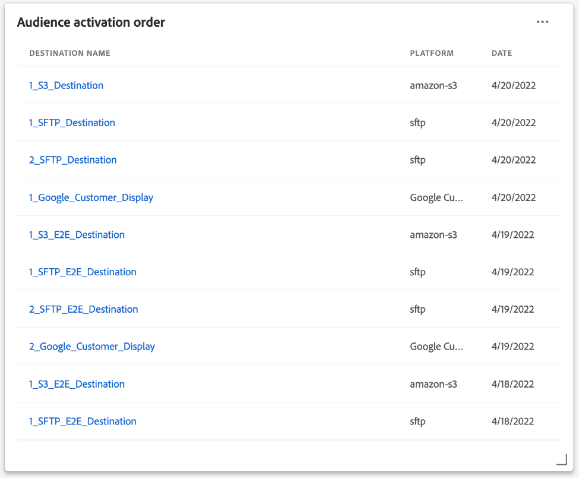

# Tableau de bord de segments {#segment-dashboard}

L’interface utilisateur de Adobe Experience Platform fournit un tableau de bord grâce auquel vous pouvez afficher des informations importantes sur vos segments, telles qu’elles sont capturées lors d’un instantané quotidien. Ce guide explique comment accéder au tableau de bord des segments et l’utiliser dans l’interface utilisateur. Il fournit également des informations supplémentaires sur les visualisations affichées dans le tableau de bord.

Pour un aperçu de toutes les fonctionnalités du service de segmentation Adobe Experience Platform dans l’interface utilisateur de Platform, consultez le [Guide de l’interface utilisateur de Segmentation Service](../../segmentation/ui/overview.md).

## Données du tableau de bord de segment

Le tableau de bord des segments affiche un instantané des données d’attribut (enregistrement) dont votre organisation dispose dans la banque de profils en Experience Platform. L’instantané n’inclut aucune donnée d’événement (série temporelle).

Les données d’attribut de l’instantané affichent les données exactement telles qu’elles apparaissent au moment précis où l’instantané a été pris. En d’autres termes, l’instantané n’est pas une approximation ou un échantillon des données et le tableau de bord du segment n’est pas mis à jour en temps réel.

>[!NOTE]
>
>Les modifications ou mises à jour apportées aux données depuis la prise dʼun instantané ne seront pas reflétées dans le tableau de bord avant la prise de lʼinstantané suivant.

## Exploration du tableau de bord des segments

Pour accéder au [!UICONTROL Segments] Tableau de bord dans l’interface utilisateur de Platform, sélectionnez **[!UICONTROL Segments]** dans le rail de gauche, puis sélectionnez l’option **[!UICONTROL Présentation]** pour afficher le tableau de bord.

>[!NOTE]
>
>Si votre entreprise est une nouvelle entreprise de Platform et qu’elle ne dispose pas encore de jeux de données Profile principaux ni de stratégies de fusion créés, la variable [!UICONTROL Segments] tableau de bord n’est pas visible. Au lieu de cela, la variable [!UICONTROL Présentation] affiche des liens et de la documentation pour vous aider à commencer à utiliser la segmentation.

### Modification de la variable [!UICONTROL Segments] tableau de bord

Vous pouvez modifier l’aspect de la variable [!UICONTROL Segments] tableau de bord en sélectionnant **[!UICONTROL Modifier le tableau de bord]**. Cela vous permet de déplacer, d’ajouter et de supprimer des widgets du tableau de bord, ainsi que d’accéder au **[!UICONTROL Bibliothèque de widgets]** pour explorer les widgets disponibles et créer des widgets personnalisés pour votre organisation.

Reportez-vous à la section [modification des tableaux de bord](../customize/modify.md) et [Présentation de la bibliothèque de widgets](../customize/widget-library.md) pour en savoir plus.

## Sélection d’un segment

Le tableau de bord sélectionne automatiquement un segment à afficher. Vous pouvez toutefois le modifier à l’aide du menu déroulant ou du sélecteur de segments.

Pour choisir un autre segment, sélectionnez la liste déroulante en regard du nom du segment ou utilisez le sélecteur de segments pour ouvrir la boîte de dialogue de sélection de segment.

## Widgets et mesures

Le tableau de bord des segments est constitué de widgets, qui sont des mesures en lecture seule fournissant des informations importantes sur le segment sélectionné.

La date et l’heure de la &quot;dernière mise à jour&quot; d’un widget indique le moment où le dernier instantané des données a été pris. La date et l’heure de l’instantané sont indiquées en UTC ; il ne se trouve pas dans le fuseau horaire de l’utilisateur ou de l’organisation.

## Widgets standard {#standard-widgets}

Adobe fournit plusieurs widgets standard que vous pouvez utiliser pour visualiser différentes mesures liées à vos segments. Vous pouvez également créer des widgets personnalisés à partager avec votre organisation à l’aide de la variable [!UICONTROL Bibliothèque de widgets]. Pour en savoir plus sur la création de widgets personnalisés, commencez par lire le [Présentation de la bibliothèque de widgets](../customize/widget-library.md).

Pour en savoir plus sur chacun des widgets standard disponibles, sélectionnez le nom d’un widget dans la liste suivante :

* [[!UICONTROL Taille de l’audience]](#audience-size)
* [[!UICONTROL Superposition des identités]](#identity-overlap)
* [[!UICONTROL Profils par identité]](#profiles-by-identity)
* [[!UICONTROL Ordre d’activation de l’audience]](#audience-activation-order)
* [[!UICONTROL Tendance de la taille de l’audience]](#audience-size-trend)
* [[!UICONTROL Tendance de changement de la taille de l’audience]](#audience-size-change-trend)
* [[!UICONTROL Tendance de la taille de l’audience par identité]](#audience-size-trend-by-identity)
* [[!UICONTROL Supervision de l’audience]](#audience-overlap)

### [!UICONTROL Taille de l’audience] {#audience-size}

>[!CONTEXTUALHELP]
>id="platform_dashboards_segments_audiencesize"
>title="Taille de l’audience"
>abstract="Ce widget affiche le nombre total de profils fusionnés dans le segment sélectionné. Ce nombre dépend de la stratégie de fusion appliquée à vos données et est correct au moment de l’instantané le plus récent."
>additional-url="https://experienceleague.adobe.com/docs/experience-platform/dashboards/guides/segments.html#audience-size" text="En savoir plus dans la documentation"

Le **[!UICONTROL Taille de l’audience]** widget affiche le nombre total de profils fusionnés dans le segment sélectionné au moment de la prise de vue instantanée. Ce nombre est le résultat de l’application de la stratégie de fusion de segments à vos données de profil afin de fusionner les fragments de profil pour former un seul profil pour chaque individu du segment.

Pour plus d’informations sur les fragments et les profils fusionnés, commencez par lire la section [Présentation de Real-time Customer Profile](../../profile/home.md).

### [!UICONTROL Superposition des identités] {#identity-overlap}

>[!CONTEXTUALHELP]
>id="platform_dashboards_segments_identityoverlap"
>title="Superposition des identités"
>abstract="Ce widget affiche le chevauchement des profils de votre segment contenant les deux identités sélectionnées. Les cercles affichent la taille relative de chaque identité. Le nombre de profils contenant les deux espaces de noms est représenté par le chevauchement entre les cercles."
>additional-url="https://experienceleague.adobe.com/docs/experience-platform/dashboards/guides/segments.html#identity-overlap" text="En savoir plus dans la documentation"

Le **[!UICONTROL Superposition des identités]** Ce widget affiche un diagramme de Venn, ou un diagramme de jeu, qui montre le chevauchement des profils de votre segment contenant plusieurs identités.

Utilisez les menus déroulants du widget pour sélectionner les identités à comparer. Les cercles affichent la taille relative de chaque identité choisie, le nombre de profils contenant les deux espaces de noms étant représenté par la taille du chevauchement entre les cercles.

Si un client interagit avec votre marque sur plusieurs canaux, plusieurs identités seront associées à ce client individuel. Par conséquent, il est probable que votre organisation dispose de plusieurs profils contenant des fragments provenant de plusieurs identités.

Pour en savoir plus sur les identités, rendez-vous sur la page [Documentation du service Adobe Experience Platform Identity](../../identity-service/home.md).

### [!UICONTROL Profils par identité] {#profiles-by-identity}

>[!CONTEXTUALHELP]
>id="platform_dashboards_segments_profilesbyidentity"
>title="Profils par identité"
>abstract="Ce widget affiche la ventilation des identités pour chaque profil fusionné du segment sélectionné."
>additional-url="https://experienceleague.adobe.com/docs/experience-platform/dashboards/guides/segments.html#profiles-by-identity" text="En savoir plus dans la documentation"

Le **[!UICONTROL Profils par identité]** widget affiche la ventilation des identités pour chaque profil fusionné du segment sélectionné. Le nombre total de profils par identité peut être supérieur au nombre total de profils dans le segment, car plusieurs identités peuvent y être associées pour un profil. En d’autres termes, le fait de cumuler les valeurs affichées pour chaque identité peut être supérieur à la taille totale de l’audience dans le segment, car si un client interagit avec votre marque sur plusieurs canaux, plusieurs identités peuvent être associées à ce client individuel.

Sélectionner **[!UICONTROL Sous-titres]** pour ouvrir la boîte de dialogue des sous-titres automatiques.

Un modèle d’apprentissage automatique génère automatiquement des informations sur les données en analysant la distribution globale et les dimensions clés des données.

Pour en savoir plus sur les identités, rendez-vous sur la page [Documentation du service Adobe Experience Platform Identity](../../identity-service/home.md).

### [!UICONTROL Ordre d’activation de l’audience] {#audience-activation-order}

Le [!UICONTROL Ordre d’activation de l’audience] Le widget fournit un tableau à trois colonnes qui répertorie la variable [!UICONTROL nom de la destination], la variable [!UICONTROL platform]et l’activation [!UICONTROL date] de l’audience. La liste est classée de haut en bas en fonction de la récence et peut contenir jusqu’à 10 lignes.

### [!UICONTROL Tendance de la taille de l’audience] {#audience-size-trend}

>[!CONTEXTUALHELP]
>id="platform_dashboards_segments_audiencesizetrend"
>title="Tendance de la taille de l’audience"
>abstract="Ce widget fournit des informations sur le nombre total de profils qui répondent aux critères de **any** définition de segment, telle qu’elle est capturée lors de l’instantané quotidien, pendant les 30 derniers jours, 90 jours ou 12 mois."
>additional-url="https://experienceleague.adobe.com/docs/experience-platform/dashboards/guides/segments.html#audience-size-trend" text="En savoir plus dans la documentation"

Le **[!UICONTROL Tendance de la taille de l’audience]** Le widget fournit une représentation graphique linéaire pour le nombre total de profils qui répondent aux critères de **any** définition de segment sur une période donnée. La tendance de la taille de l’audience peut être visualisée sur des périodes de 30 jours, 90 jours et 12 mois. La période est sélectionnée dans un menu déroulant du widget. La taille de l’audience est répercutée sur l’axe des ordonnées et l’heure sur l’axe des abscisses.

Ce widget inclut également le [!UICONTROL Sous-titres] fonction dans laquelle un modèle d’apprentissage automatique analyse les données de graphique et de segment et génère automatiquement des sous-titres pour décrire les tendances clés et les événements importants. Sélectionner **[!UICONTROL Sous-titres]** pour ouvrir la boîte de dialogue des sous-titres automatiques.

La boîte de dialogue de sous-titres automatiques s’ouvre, vous permettant d’obtenir des informations sur vos données.

Pour en savoir plus sur l’évaluation des segments et sur la manière dont les profils sont qualifiés et sortent des segments, reportez-vous à la section [Documentation de Segmentation Service](../../segmentation/home.md).

### [!UICONTROL Tendance de changement de la taille de l’audience] {#audience-size-change-trend}

Ce widget fournit un graphique linéaire qui illustre la différence entre le nombre total de profils qualifiés pour un segment donné et les aperçus quotidiens les plus récents. Le segment choisi pour l’analyse est sélectionné dans la liste déroulante d’aperçu. La période d’analyse des tendances peut être consultée sur des périodes de 30 jours, 90 jours et 12 mois. La période est sélectionnée dans un menu déroulant du widget. La taille de l’audience est répercutée sur l’axe des ordonnées et l’heure sur l’axe des abscisses.

### [!UICONTROL Tendance de la taille de l’audience par identité] {#audience-size-trend-by-identity}

Ce widget illustre la tendance de taille de l’audience d’un segment particulier en fonction du type d’identité sélectionné dans le menu déroulant du widget. Le segment utilisé pour l’analyse est sélectionné dans la liste déroulante d’aperçu. La période d’analyse des tendances peut être consultée sur des périodes de 30 jours, 90 jours et 12 mois. La période est sélectionnée dans un menu déroulant du widget.

### [!UICONTROL Supervision de l’audience] {#audience-overlap}

Ce widget représente le nombre de profils de deux segments qui répondent aux critères des deux définitions de segment. Les segments utilisés pour la comparaison sont sélectionnés dans les menus déroulants du widget. Le nombre total de profils contenus dans la définition de segment pertinente peut être affiché en passant la souris sur un cercle ou l’intersection du diagramme de Venn.

Ce widget vous permet d’optimiser la stratégie de segmentation en consultant les similitudes dans les résultats des définitions de segment.

<!-- * [[!UICONTROL Audience overlap report]](#audience-overlap-report) -->
<!-- ### [!UICONTROL Audience overlap report] {#audience-overlap-report} -->

<!-- View an ordered list of audiences by Highest or Lowest overlap percentages. -->

<!--  -->

<!-- https://jira.corp.adobe.com/browse/PLAT-125511 -->

## Étapes suivantes

En suivant ce document, vous devriez maintenant pouvoir localiser le tableau de bord des segments et sélectionner un segment à afficher. Vous devez également comprendre les mesures affichées dans les widgets disponibles. Pour en savoir plus sur l’utilisation des segments dans l’interface utilisateur de l’Experience Platform, reportez-vous à la section [Guide de l’interface utilisateur de Segmentation Service](../../segmentation/ui/overview.md).
