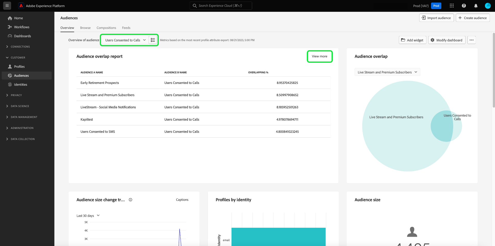
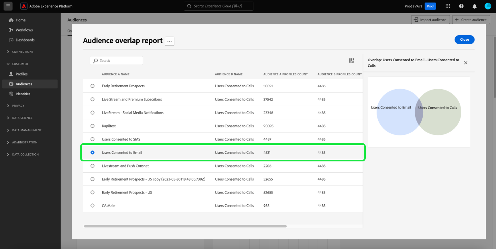
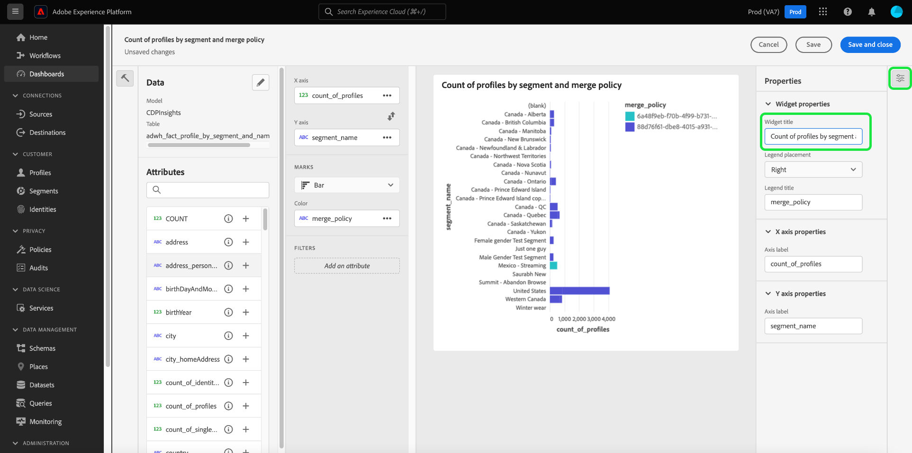

# Analyse et suivi du consentement

Dans le paysage marketing d’aujourd’hui, vous devez comprendre et respecter les préférences de consentement des clients. Adobe Real-Time Customer Data Platform permet aux spécialistes marketing d’analyser le consentement des clients afin de créer de la confiance, de se conformer aux réglementations de confidentialité et de proposer des expériences plus personnalisées.

Ce document explique comment créer un tableau de bord de consentement pour divers cas d’utilisation marketing des données Real-Time CDP. Plus précisément, il se concentre sur la création d’une audience avec les attributs appropriés aux besoins de votre entreprise, puis sur l’utilisation des informations grâce à l’utilisation de widgets préconfigurés dans l’interface utilisateur de Adobe Experience Platform. Une autre méthode permettant de créer votre propre widget personnalisé avec la fonctionnalité de tableaux de bord définis par l’utilisateur est également présentée.

## Cas d’utilisation {#use-cases}

Les cas d’utilisation couverts dans ce guide sont les tendances de consentement et le chevauchement des consentements.

- Le tableau **Tendance du consentement** indique les tendances relatives au consentement des utilisateurs au fil du temps. L’analyse des modifications des préférences de consentement aide les spécialistes marketing à planifier et à exécuter des campagnes qui s’adaptent à ces modifications. Par exemple, vous pouvez lancer des campagnes éducatives ciblées, des campagnes de transparence et de confiance ou des campagnes d’incitation pour orienter les choix de consentement. Vous pouvez également mettre en corrélation des campagnes qui ont pu avoir une incidence négative sur le consentement afin de réduire de manière proactive la fréquence de ces campagnes.
- **Chevauchement du consentement** utilise le chevauchement entre les canaux de consentement pour fournir une messagerie personnalisée cohérente sur plusieurs canaux pour vos clients qui ont consenti à plusieurs canaux. Les marketeurs peuvent hiérarchiser et allouer des ressources à certains canaux pour lesquels un degré supérieur de consentement et de messagerie personnalisée peut interagir avec les clients et générer des taux de réponse plus élevés.

## Créer des audiences consentantes {#create-consent-audiences}

Pour créer un tableau de bord de consentement, vous devez d’abord créer une audience de tous les profils qui ont consenti à contacter. Pour accéder au créateur de segments de Real-Time Customer Data Platform, sélectionnez **[!UICONTROL Audiences]** dans le volet de navigation de gauche de l’interface utilisateur de Platform. Dans l’onglet [!UICONTROL Client] du tableau de bord [!UICONTROL Audiences], sélectionnez **[!UICONTROL Créer une audience]** en haut à droite de la vue, puis **[!UICONTROL Créer des règles]**.

![Tableau de bord [!UICONTROL Audiences] avec [!UICONTROL Client], [!UICONTROL Audiences] et [!UICONTROL Créer un segment] en surbrillance.](../images/insights-use-cases/consent-analysis/create-audience.png)

Le créateur de segments s’affiche. Sélectionnez ensuite **[!UICONTROL Profil individuel XDM]** dans les options disponibles. Consultez la documentation pour plus d’informations sur la zone de travail du [créateur de règles](../../segmentation/ui/segment-builder.md#rule-builder-canvas).

![Créateur de segments avec le dossier d’attributs [!UICONTROL Profil individuel XDM] en surbrillance.](../images/insights-use-cases/consent-analysis/xdm-individual-profile.png)

Recherchez vos attributs de consentement parmi les options disponibles. Sélectionnez **[!UICONTROL Consentements et préférences]**.

>[!NOTE]
>
>Si vous avez conservé votre consentement utilisateur dans un attribut différent du groupe de champs recommandé par Adobe, vous devez sélectionner ces attributs au lieu de ceux affichés ci-dessous.

Vous trouverez plus d’informations sur la [gestion du consentement dans la documentation sur la segmentation](../../segmentation/tutorials/consents.md#handling-consent-in-segmentation).

![Créateur de segments avec le dossier d’attributs [!UICONTROL Consentement et préférences] en surbrillance.](../images/insights-use-cases/consent-analysis/consent-and-preferences.png)

Les différentes options de consentement et de préférence s’affichent. Comme cette démonstration porte sur le consentement pour contacter via divers canaux marketing, sélectionnez **[!UICONTROL Préférences marketing]**.

![Créateur de segments avec le dossier [!UICONTROL Préférences marketing] en surbrillance.](../images/insights-use-cases/consent-analysis/marketing-preferences.png)

La liste des préférences marketing s’affiche. Bien que cet exemple de cas d’utilisation se concentre sur les e-mails, les SMS et les appels, vous pouvez créer des informations pour toute autre combinaison ou l’intégralité des options. Pour chacun des canaux, effectuez les étapes ci-dessous pour créer une audience.

Pour commencer à configurer une audience, sélectionnez **[!UICONTROL Recevoir un SMS]** / **[!UICONTROL Recevoir un e-mail]** / **[!UICONTROL Recevoir des appels]**.

Le dossier [!UICONTROL Abonnements] s’affiche. Dans les options disponibles, sélectionnez l’attribut **[!UICONTROL Valeur de choix]** et faites-le glisser vers le volet central, puis sélectionnez la valeur souhaitée dans la liste déroulante. Dans ce cas, sélectionnez **Oui (opt-in)**. Attribuez ensuite un nom à l’audience en fonction des besoins de votre entreprise et fournissez une description conviviale.

>[!NOTE]
>
>Il existe une limite conditionnelle au nombre d’audiences que vous êtes recommandé de créer. Vous trouverez plus d’informations dans la [documentation sur les mécanismes de sécurisation de la segmentation](../../profile/guardrails.md#segmentation-guardrails).

![ Attribut [!UICONTROL Valeur de choix] avec la valeur [!UICONTROL Oui (opt-in)] mise en surbrillance dans le créateur de segments. Le nom et la description de l’audience sont également mis en surbrillance.](../images/insights-use-cases/consent-analysis/choice-value.png)

Une fois les audiences nécessaires créées, elles sont répertoriées dans l’onglet [!UICONTROL Audiences] [!UICONTROL Parcourir].

>[!NOTE]
>
>Lors de la création d’une audience, vous devez attendre la fin de la tâche de segmentation par lots avant que les données ne soient disponibles pour commencer à créer votre tableau de bord de consentement. La segmentation par lots décrit le processus de déplacement de toutes vos données de profil à la fois dans vos définitions de segment pour produire les audiences correspondantes. Une fois créée, cette audience est enregistrée et stockée pour que vous puissiez l’exporter et l’utiliser. Les segments par lot sont automatiquement évalués toutes les 24 heures.

## Consommer des informations {#consume-insights}

Adobe a créé différentes informations qui sont automatiquement disponibles pour vous dans les tableaux de bord Profils, Audiences et Destinations . Toute audience que vous créez est alors automatiquement utilisable avec ces informations préconfigurées. Consultez la documentation du widget standard pour obtenir la liste des informations disponibles dans les tableaux de bord [Profils](../guides/profiles.md#standard-widgets), [Audiences](../guides/audiences.md#standard-widgets) et [Destinations](../guides/destinations.md).

## Chevauchement des audiences {#audience-overlap}

Pour vérifier le chevauchement entre deux audiences de consentement, ajoutez l’[!UICONTROL chevauchement des audiences par politique de fusion] à votre tableau de bord Profils et sélectionnez les audiences souhaitées dans les menus déroulants. Consultez la documentation pour obtenir des instructions sur la manière d’ajouter un widget à votre tableau de bord [*Chevauchement des audiences par politique de fusion*](../guides/profiles.md#audience-overlap-by-merge-policy) pour plus d’informations sur ces informations.

<!-- Image needs updating to night mode -->

Vous pouvez afficher le chevauchement de toutes les audiences où les utilisateurs ont consenti à recevoir des appels dans toutes les autres audiences, avec le rapport Chevauchement des audiences dans le tableau de bord Audiences . Pour afficher le chevauchement des audiences de consentement, accédez d’abord à l’onglet [!UICONTROL Audiences] [!UICONTROL Aperçu]. De là, vous pouvez ajouter le widget [!UICONTROL  Rapport de chevauchement des audiences ] au tableau de bord des audiences. Une fois le widget créé, sélectionnez l’audience **[!UICONTROL L’utilisateur a consenti aux appels]** dans le menu déroulant Présentation de l’audience en haut de la page. Sélectionnez ensuite **[!UICONTROL En savoir plus]** dans le widget Rapport de chevauchement des audiences pour afficher jusqu’à 50 des chevauchements les plus importants et jusqu’à 50 des chevauchements les moins importants concernant le segment sélectionné.

<!-- Image needs updating to night mode -->

La boîte de dialogue Rapport de chevauchement des audiences se développe pour afficher d’autres données de chevauchement des audiences.

<!-- Image needs updating to night mode -->

## Tendances de la taille d’audience {#audience-size-trends}

Lorsque vous créez une audience basée sur le consentement, sa tendance s’établit automatiquement sur une période allant jusqu’à 12 mois à compter de la date à laquelle vous avez créé l’audience. Pour obtenir une tendance entièrement fonctionnelle de votre consentement client, ajoutez les widgets suivants à la page [!UICONTROL Segments] [!UICONTROL Aperçu]. Ces informations offrent un moyen puissant de suivre l’évolution de votre consentement au fil du temps. Elles sont même corrélées à toutes les campagnes que vous exécutez en parallèle et qui peuvent avoir une incidence positive ou négative sur le consentement. Les descriptions proposées pour ces widgets s’appliquent à un cas d’utilisation de consentement.

- [Tendance de la taille d’audience](../guides/audiences.md#audience-size-trend) : ce widget permet de suivre l’évolution de votre consentement respectif au fil du temps.
- [Tendance de changement de la taille de l’audience](../guides/audiences.md#audience-size-change-trend) : ce widget effectue le suivi quotidien de l’évolution du consentement de votre client. Par exemple, si le nombre de consentements de vos clients a diminué de 100 000, vous pouvez voir comment ce changement s’est produit sur une base quotidienne.
- [Tendance de la taille de l’audience par identité](../guides/audiences.md#audience-size-trend-by-identity) : ce widget vous permet de suivre l’évolution de votre consentement respectif au fil du temps, mais aussi de le filtrer selon une identité spécifique, telle qu’un e-mail.

<!-- Image needs updating to night mode -->

## Tableau de bord de présentation des audiences {#audiences-overview-dashboard}

Après avoir créé une audience liée au consentement telle que « Utilisateurs ayant consenti aux SMS », vous pouvez afficher des informations personnalisées clés sur le consentement de votre audience en ajoutant les widgets appropriés à votre tableau de bord de présentation des audiences. Accédez à la [!UICONTROL Audiences] [!UICONTROL Présentation] et ajoutez les widgets de votre choix dans la bibliothèque de widgets. Tout widget ajouté à l’affichage du tableau de bord peut être redimensionné et déplacé à l’aide de la fonctionnalité [!UICONTROL Modifier le tableau de bord]. Votre vue personnalisée peut contenir des informations telles que la tendance au fil du temps (jusqu’à 12 mois), les chevauchements avec d’autres audiences et la composition de l’identité de l’audience. Un exemple de vue est illustré ci-dessous.

## Tableaux de bord définis par l’utilisateur ou l’utilisatrice {#usr-defined-dashboards}

Vous pouvez également créer vos propres widgets à l’aide de tableaux de bord définis par l’utilisateur. La création de votre propre widget vous permet de contrôler entièrement le type de widget, ainsi que d’ajouter des filtres et bien plus encore, directement dans Adobe Real-Time CDP.

Par exemple, si vous souhaitez suivre la tendance de plusieurs audiences de consentement dans le même graphique afin de voir au fil du temps comment chacune de vos préférences de consentement a changé. Ce type de visualisation est possible avec des tableaux de bord définis par l’utilisateur en quelques étapes seulement et en une seule configuration. Sélectionnez tout d’abord **[!UICONTROL Tableaux de bord]** dans le volet de navigation de gauche. L’espace de travail [!UICONTROL Tableaux de bord] s’affiche. Sélectionnez ensuite **[!UICONTROL Créer un tableau de bord]**. Vous trouverez des instructions complètes sur la [création d’un tableau de bord et d’un widget personnalisé](../standard-dashboards.md) dans le guide des tableaux de bord définis par l’utilisateur.

Lorsque vous [sélectionnez votre modèle de données](../standard-dashboards.md#select-data-model) dans le compositeur de widgets, sélectionnez `CDPInsights` suivi de **[!UICONTROL Suivant]**. La boîte de dialogue [!UICONTROL Sélectionner un tableau] s’affiche.

La vue suivante affiche une liste des tableaux disponibles dans le rail de gauche. Sélectionnez le `adwh_fact_profile_by_segment_and_namespace_trendlines`.

Une fois le compositeur de widget renseigné avec les données du tableau de votre choix, effectuez les étapes ci-dessous :

- [Rechercher [!UICONTROL Attributs]](../standard-dashboards.md#add-filter-attributes) par `[!UICONTROL date]`, puis utilisez l’icône + pour ajouter l’attribut `[!UICONTROL date]` à l’axe X à partir du menu déroulant.
  
- Recherchez [!UICONTROL Attributs] par `[!UICONTROL count_of_profiles]`, puis utilisez l’icône + pour ajouter l’attribut `[!UICONTROL count_of_profiles]` à l’axe Y à partir du menu déroulant.
- Sélectionnez l’icône `...` (des points de suspension) dans le champ [!UICONTROL Axe Y], puis sélectionnez la fonction d’agrégat [!UICONTROL SOMME] dans le menu déroulant.
  
- Sélectionnez le menu déroulant [!UICONTROL Marques] et remplacez le type de graphique par [!UICONTROL Ligne].
- Recherchez [!UICONTROL Attributs] pour le `[!UICONTROL segment_name]`, puis utilisez l’icône + pour ajouter le `segment_name` en tant que [!UICONTROL Filtre] dans le menu déroulant. La boîte de dialogue [!UICONTROL Filtre : nom_segment] s’affiche. Sélectionnez les audiences créées précédemment et liées au consentement. Pour cet exemple, sélectionnez **[!UICONTROL Utilisateurs ayant consenti aux appels]**, **[!UICONTROL Utilisateurs ayant consenti aux SMS]** et **[!UICONTROL Utilisateurs ayant consenti aux e-mails]**, suivis de **[!UICONTROL Appliquer]**.
- Recherchez `[!UICONTROL segment_name]` [!UICONTROL Attributs], puis sélectionnez l’icône + pour ajouter `segment_name` en tant que [!UICONTROL Couleur] dans le menu déroulant.
- Ouvrez [le panneau [!UICONTROL Propriétés]](../standard-dashboards.md#widget-properties) et fournissez un [!UICONTROL Titre du widget] et un [!UICONTROL Libellé de l’axe] appropriés.
  
- Sélectionnez **[!UICONTROL Enregistrer et fermer]** pour confirmer les paramètres.

>[!TIP]
>
>Vous pouvez désormais redimensionner ou déplacer le widget à la taille et à la position souhaitées avant d’enregistrer le tableau de bord.

L’image ci-dessous montre l’aspect de votre widget terminé et d’autres informations personnalisées potentielles. Pour plus d’informations sur les types de widgets qui peuvent être créés, reportez-vous à la [documentation sur les modèles de données](../data-models/cdp-insights-data-model-b2c.md).

<!-- The diagram shows straight lines due to a lack of data, however in your environment the trends will reflect the actual changes over time. -->

## Suivi des politiques de consentement {#consent-policies}

Les tableaux de bord du consentement que vous créez capturent uniquement la **répartition des attributs de consentement et de préférence**.

>[!NOTE]
>
>Pour les clients de **Adobe Healthcare Shield** ou **Adobe Privacy &amp; Security Shield**, ces tableaux de bord **ne reflètent aucun suivi des politiques de consentement**. Le suivi disponible inclut le nombre de politiques créées et activées, ainsi que l’impact sur l’appartenance à l’audience.

## Étapes suivantes

En lisant ce document, vous avez appris à créer des tableaux de bord pour obtenir une vue d’ensemble complète de vos préférences de consentement des clients à l’aide des informations Real-Time CDP. Ce document explique comment Real-Time CDP offre une solution robuste au paysage actuel axé sur la confidentialité, où la collecte, la segmentation, l’analyse et les campagnes marketing personnalisées basées sur les données de consentement sont essentielles pour les professionnels du marketing.
