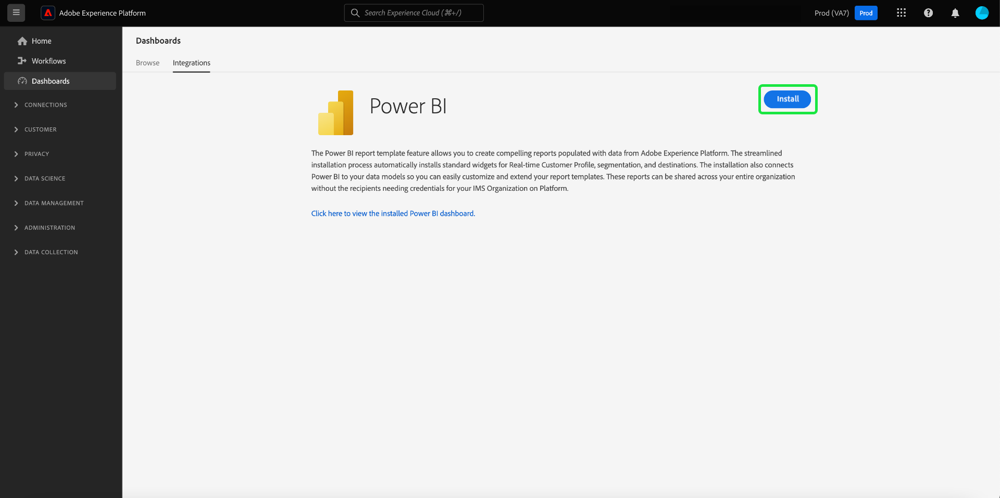

# Modèles de rapports de Power BI pour les tableaux de bord

La fonctionnalité de modèle de rapport de Power BI vous permet de créer des rapports attrayants remplis de données provenant de Adobe Experience Platform. Le processus d’installation simplifié installe automatiquement les widgets standard pour Real-time Customer Profile, la segmentation et les destinations. L’installation connecte également Power BI à vos modèles de données afin que vous puissiez facilement personnaliser et étendre vos modèles de rapport. Ces rapports peuvent être partagés dans l’ensemble de l’organisation sans que les destinataires aient besoin d’informations d’identification pour votre organisation IMS sur Platform.

Ce document explique comment connecter Adobe Experience Platform à l’application Power BI et utiliser des modèles de rapport pour partager des informations de données Platform clés avec des utilisateurs externes.

## Prise en main

Avant de poursuivre ce tutoriel, il est recommandé de bien comprendre les [composition du schéma](../../xdm/schema/composition.md) dans Experience Platform et comment les attributs sont inclus dans Real-time Customer Profile via la variable [schéma d’union](../../xdm/schema/composition.md#union).

Pour installer l’intégration de l’application de Power BI, les utilisateurs doivent avoir au préalable acquis les autorisations Platform suivantes :

- Gestion des requêtes
- Gestion des environnements de test

Pour savoir comment attribuer ces autorisations, veuillez lire le [contrôle d&#39;accès](../../access-control/home.md) documentation.

Vous devez également disposer d’un compte Power BI pour suivre ce tutoriel. Pour créer un compte, accédez au [Page d’accueil Power BI](https://powerbi.microsoft.com/en-us/) et suivez le processus d’inscription. Les utilisateurs de ce compte de Power BI doivent également activer la variable **Créer un espace de travail** dans leurs paramètres de Power BI. Ce paramètre se trouve dans les paramètres du client du portail d’administration Power BI. Si votre compte est fourni par votre client ou votre employeur, contactez votre administrateur respectif pour activer ce paramètre.

>[!NOTE]
>
>Pour que l’onglet Tableaux de bord s’affiche dans le volet de navigation de gauche de l’interface utilisateur de Platform et que la vue Inventaire du tableau de bord soit visible, vous devez avoir accès à l’un des tableaux de bord Profil, Segmentation ou Destination dans le cadre de votre licence Platform.

## Installation de l’intégration de l’application Power BI

Dans l’interface utilisateur de Platform, sélectionnez **[!UICONTROL Tableaux de bord]** dans le volet de navigation de gauche pour ouvrir la [!UICONTROL Tableaux de bord] workspace. Le [!UICONTROL Parcourir] affiche une liste des vues de tableau de bord actuellement disponibles. Pour en savoir plus sur l’affichage des tableaux de bord disponibles, voir [documentation d’inventaire](../inventory.md).

Sélectionnez ensuite le **[!UICONTROL Intégrations]** . La page d’intégration de l’application Power BI s’affiche. À partir de là, sélectionnez **[!UICONTROL Installer]** pour commencer l’installation.

>[!NOTE]
>
>Le [!UICONTROL Installer] est désactivé, sauf si vous disposez des autorisations de gestion et de gestion de Query Service Sandbox.

### Spécification des informations d’identification

La première étape du processus d’installation consiste à fournir des informations d’identification non expirantes pour l’intégration de l’application Power BI. Deux options sont disponibles pour fournir les éléments suivants : [[!UICONTROL Création d’informations d’identification]](#create-new-credentials) ou [[!UICONTROL Utilisation des informations d’identification existantes]](#use-existing-credentials). Sélectionnez la bascule appropriée pour continuer.

#### Création d’informations d’identification {#create-new-credentials}

Deux champs sont obligatoires lors de la génération de nouvelles informations d’identification : [!UICONTROL Nom] et [!UICONTROL Affecté à]. Le [!UICONTROL Affecté à] correspond à l’adresse électronique associée à votre compte de Power BI.

>[!IMPORTANT]
>
>La création d’informations d’identification non arrivant à expiration requiert l’attribution de certains rôles et autorisations. Les autorisations nécessaires sont Gérer les environnements de test et Gérer l’intégration de Query Service. Les rôles requis sont les rôles d’administrateur et de développeur de Adobe Experience Platform. Pour savoir comment attribuer ces autorisations, veuillez lire le [contrôle d&#39;accès](../../access-control/home.md) documentation.

Pour en savoir plus sur la génération d’informations d’identification Query Service non arrivant à expiration, reportez-vous au [guide des informations d’identification non arrivant à expiration](../../query-service/ui/credentials.md#non-expiring-credentials).

Après avoir généré pour la première fois des informations d’identification non arrivant à expiration, un fichier JSON est téléchargé sur cet ordinateur. Ce fichier JSON peut ensuite être partagé avec d’autres utilisateurs en tant qu’informations d’identification pour terminer le processus d’installation.

#### Utilisation des informations d’identification existantes {#use-existing-credentials}

Un fichier d’informations d’identification JSON peut également être chargé pour passer la validation. Ces fichiers JSON contenant les valeurs d’informations d’identification non expirantes sont téléchargés sur l’ordinateur local utilisé lors de la création d’informations d’identification non expirantes.

>[!IMPORTANT]
>
>Pour utiliser des informations d’identification existantes qui ne expirent pas, l’utilisateur doit déjà se voir attribuer une information d’identification. Si l’utilisateur ne dispose pas d’informations d’identification et ne peut pas en créer à l’aide de Adobe Admin Console, il ne peut pas poursuivre le processus d’installation.

Sélectionner **[!UICONTROL Chargement du fichier d’informations d’identification]**, puis sélectionnez le fichier JSON approprié à charger dans la boîte de dialogue qui s’affiche.

Une fois que vous avez fourni les informations d’identification non arrivant à expiration, elles sont automatiquement validées par Platform. Un message de confirmation s’affiche une fois la validation effectuée. Sélectionner **[!UICONTROL Suivant]** pour examiner le consentement de la demande de Power BI.

### Fournir le consentement

L’affichage du consentement s’affiche. Sélectionner **[!UICONTROL Réviser le consentement]** pour ouvrir une nouvelle fenêtre détaillant les autorisations requises pour que Power BI puisse accéder à vos données et les utiliser en fonction de leurs conditions d’utilisation et de leur politique de confidentialité.

Sélectionner **[!UICONTROL Accepter]** pour accorder à Power BI l’autorisation d’accéder à vos données Platform et de les utiliser.

>[!NOTE]
>
>Si vous quittez le processus d’installation à tout moment avant de donner votre consentement, l’intégration de l’application de Power BI ne sera pas installée dans l’inventaire des tableaux de bord.

Après avoir donné son consentement, le modèle de rapport est automatiquement installé dans l’environnement de Power BI dans le cadre du processus d’installation. Power BI utilise ensuite les informations d’identification non arrivées à expiration pour accéder à Platform, exécute de manière séquentielle toutes les requêtes SQL et renseigne le modèle de rapport avec les données renvoyées.

Sélectionner **[!UICONTROL Terminer]** pour revenir à l’inventaire du tableau de bord.

Maintenant que le modèle de rapport Power BI est installé, il apparaît dans la liste des tableaux de bord disponibles sous le [!UICONTROL Parcourir] . Sélectionner **[!UICONTROL Power BI]** de la liste pour accéder à l’environnement Power BI.

>[!IMPORTANT]
>
>Les administrateurs de Power BI doivent s’assurer que les utilisateurs disposent des autorisations d’accès appropriées pour afficher ces tableaux de bord dans l’environnement Power BI.

## espace de travail Power BI

Après vous être connecté à [l’espace de travail Power BI](https://dxt.powerbi.com), des modèles de rapport sont disponibles pour chacun des services auxquels vous avez accès. Les modèles de rapport incluent les tableaux de bord des profils, des segments et des destinations. **only** s’ils disposent des autorisations d’affichage correspondantes.

Les widgets standard des profils, des segments et des destinations sont disponibles par défaut dans les rapports de modèle de Power BI.

>[!NOTE]
>
>Les autorisations de modification doivent être activées pour un tableau de bord donné afin que ce tableau de bord puisse être installé dans l’environnement de Power BI.

Une fois qu’un tableau de bord est installé dans Power BI, les modèles de rapports s’affichent par défaut pour tous les utilisateurs. Si vous souhaitez restreindre l&#39;accès aux modèles de rapports, assurez-vous de désactiver l&#39;accès des utilisateurs concernés depuis l&#39;environnement de Power BI.

## Personnalisation de votre modèle de rapport de Power BI

Grâce aux widgets personnalisés, vous pouvez ajouter des attributs personnalisés à votre modèle de données pour enrichir les modèles de rapports fournis par Power BI.

>[!NOTE]
>
>Les attributs que vous pouvez utiliser pour les widgets personnalisés dépendent de ce qui est disponible dans le schéma d’union. Pour savoir comment afficher et explorer les schémas d’union au profit de vos widgets personnalisés, reportez-vous à la section [guide de l’interface utilisateur de schéma d’union](../../profile/ui/union-schema.md).

### Création d’un widget personnalisé

Les widgets personnalisés sont créés à l’aide de la bibliothèque de widgets. Voir [Présentation de la bibliothèque de widgets](../customize/widget-library.md) pour une présentation de la fonctionnalité et de la fonction [tutoriel de création d’un widget personnalisé](../customize/custom-widgets.md) pour obtenir des instructions spécifiques.

>[!IMPORTANT]
>
>Les widgets personnalisés nouvellement créés sont **not** synchronisé automatiquement entre les tableaux de bord Adobe Experience Platform et les modèles de rapport Power BI. Tous les widgets personnalisés créés dans l’interface utilisateur de Platform doivent être recréés manuellement dans l’environnement Power BI.

### Recréez votre widget personnalisé dans l’environnement de Power BI.

Une fois que votre tableau de bord comporte les mesures et attributs appropriés contenus dans des widgets personnalisés, vous êtes prêt à modifier le modèle de rapport affiché dans l’environnement de Power BI. Voir [Documentation du Power BI](https://docs.microsoft.com/fr-FR/power-bi/) pour plus d’informations sur la modification d’un rapport via son interface utilisateur.

## Suppression de l’intégration de l’application Power BI

Pour supprimer le tableau de bord, accédez à l’inventaire du tableau de bord et sélectionnez l’icône de suppression () en regard du nom du tableau de bord.

>[!NOTE]
>
>Seul l’utilisateur qui a installé le tableau de bord du Power BI peut supprimer l’intégration de l’interface utilisateur de Platform.

Une fenêtre contextuelle de confirmation s’affiche. Sélectionner **[!UICONTROL Supprimer]** pour confirmer le processus.

>[!IMPORTANT]
>
>La suppression du tableau de bord de Power BI de l’interface utilisateur de Platform n’entraîne pas **not** supprimez les modèles de rapport disponibles dans votre environnement de Power BI. Si vous souhaitez supprimer complètement les informations contenues dans les modèles de rapports de Power BI, vous devez vous connecter à votre compte Power BI et supprimer les modèles de rapports de cet environnement. Une fois supprimé, l’utilisateur peut réinstaller le tableau de bord du Power BI en suivant les mêmes instructions d’installation que celles décrites ci-dessus.

## Étapes suivantes

En lisant ce document, vous comprenez mieux comment les modèles de rapports Power BI peuvent être intégrés à Platform pour partager des informations de données attrayantes à partir de vos profils, segments ou tableaux de bord de destinations. Voir [Présentation de la personnalisation des tableaux de bord](../customize/overview.md) pour en savoir plus sur la personnalisation de vos tableaux de bord.
