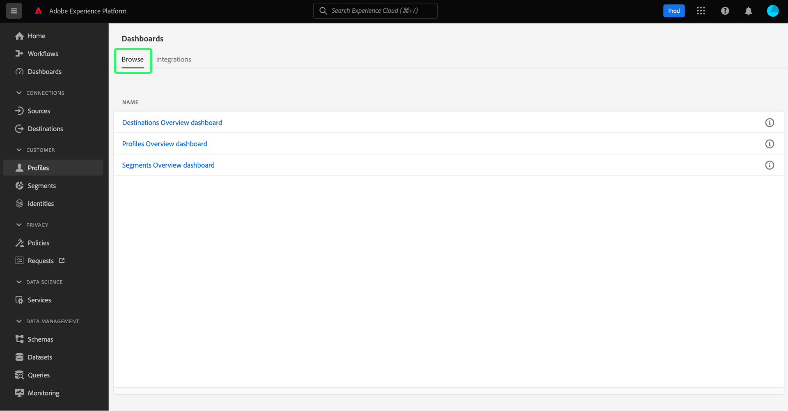
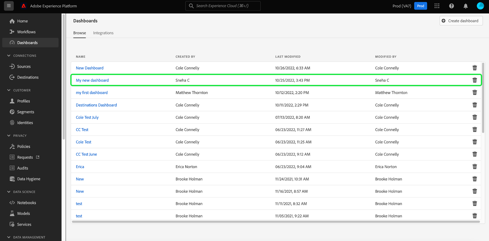

# Afficher les tableaux de bord configurés

Si votre organisation dispose de plusieurs tableaux de bord dans Adobe Experience Platform, vous pouvez les consulter dans l’inventaire des tableaux de bord de l’interface utilisateur (IU).

Pour afficher les tableaux de bord que votre organisation a configurés, sélectionnez **[!UICONTROL Tableaux de bord]** dans le volet de navigation de gauche, puis sélectionnez l’onglet **[!UICONTROL Parcourir]**.

Une liste de tous les tableaux de bord disponibles sur votre instance Experience Platform est affichée sous l’onglet [!UICONTROL Parcourir]. Cela inclut les tableaux de bord intégrés créés par votre entreprise et qui ont été configurés par le biais d’applications tierces.

Vous pouvez afficher un tableau de bord individuel en sélectionnant son nom dans la liste.

.

Lorsque cette option est sélectionnée, le tableau de bord s’ouvre dans l’interface utilisateur d’Experience Platform ou dans un espace de travail d’application entièrement intégré qui nécessite que vous vous connectiez à l’aide des informations d’identification nécessaires.

## Créer des tableaux de bord personnalisés

Les Tableaux de bord Adobe Experience Platform vous permettent de créer et de gérer des tableaux de bord personnalisés dans lesquels vous pouvez créer, ajouter et modifier des widgets personnalisés pour visualiser les mesures clés pertinentes pour votre organisation. Voir le [guide des tableaux de bord définis par l’utilisateur](./standard-dashboards.md) pour obtenir des instructions complètes sur la création et la configuration de tableaux de bord personnalisés.
