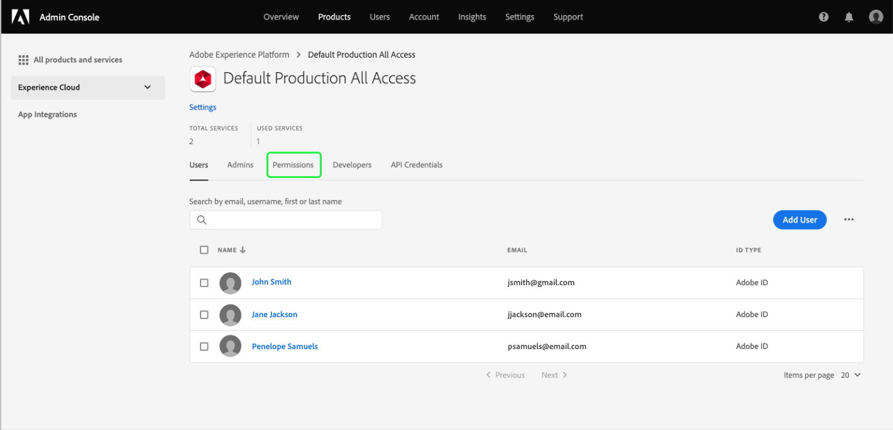

# Autorisations dʼaccès pour les tableaux de bord

Afin dʼoctroyer aux utilisateurs la possibilité dʼafficher, de modifier et de mettre à jour les tableaux de bord, vous devez dʼabord activer les autorisations. Dans Adobe Experience Platform, le contrôle dʼaccès est assuré par Adobe Admin Console. Cette fonctionnalité exploite les profils de produit dans [!DNL Admin Console], liant les utilisateurs à des autorisations et des environnements de test.

Ce document propose un résumé sur la manière de donner accès à des autorisations spécifiques aux tableaux de bord dans Admin Console. Pour obtenir des informations détaillées sur lʼobtention et lʼattribution dʼautorisations dʼaccès, commencez par lire la [Présentation du contrôle dʼaccès](../access-control/home.md).

>[!NOTE]
>
>Pour configurer le contrôle dʼaccès dans [!DNL Experience Platform], vous devez posséder des droits dʼadministrateur pour une organisation qui dispose dʼune intégration de produit [!DNL Experience Platform]. Pour en savoir plus, consultez l’article d’Adobe Help Center sur les [rôles administratifs](https://helpx.adobe.com/fr/enterprise/using/admin-roles.html).

## Autorisations disponibles {#available-permissions}

Deux autorisations principales sont nécessaires afin dʼaccéder aux tableaux de bord dans Experience Platform. Ces autorisations sont les suivantes :

* **Affichage du tableau de bord dʼutilisation des licences** : cette autorisation permet aux utilisateurs dʼaccéder en lecture seule au tableau de bord dʼutilisation des licences dans lʼinterface utilisateur Experience Platform.
* **Gestion des tableaux de bord standard** : cette autorisation permet aux utilisateurs dʼajouter des attributs personnalisés qui ne figurent pas encore dans lʼentrepôt de données.

Les étapes suivantes vous expliquent la manière dʼajouter ces autorisations à lʼaide dʼAdmin Console.

## Sélectionnez les profils de produits

Pour octroyer aux utilisateurs lʼaccès aux tableaux de bord dans Experience Platform, commencez par vous connecter à [Adobe Admin Console](https://adminconsole.adobe.com) et sélectionnez **Produits** dans la barre de navigation supérieure.

Sélectionnez **Adobe Experience Platform** dans la liste déroulante dʼExperience Cloud dans le volet de navigation de gauche ou dans les cartes répertoriées sous *Tous les produits et services*. Sur la page produit Adobe Experience Platform, sélectionnez le profil de produit auquel vous souhaitez ajouter les autorisations relatives aux tableaux de bord ou sélectionnez **Nouveau profil** pour créer un profil de produit.

Le profil de produit sélectionné sʼouvre et affiche les utilisateurs associés à ce profil de produit. Pour gérer les autorisations du profil de produit, sélectionnez **Autorisations**.

## Ajouter/modifier des autorisations

Lʼonglet **Autorisations** affiche toutes les autorisations disponibles pour le profil de produit sélectionné. Recherchez la ligne **Tableaux de bord**, vous remarquez quʼelle indique actuellement « 0 sur 2 inclus », ce qui signifie quʼaucune autorisation relative aux tableaux de bord nʼest activée pour le profil de produit.

Pour modifier les autorisations relatives aux tableaux de bord, sélectionnez **Modifier** sur la ligne du tableau de bord.

La boîte de dialogue **Modifier les autorisations** sʼouvre et affiche les éléments dʼautorisation disponibles ainsi que les éléments dʼautorisation inclus. Sélectionnez le signe Plus (`+`) en regard de lʼautorisation afin de lʼajouter ou sélectionnez **+ Ajouter tout** afin dʼajouter toutes les autorisations en même temps.

Pour obtenir une description des autorisations, reportez-vous à la section [Autorisations disponibles](#available-permissions) plus haut dans ce document.

>[!NOTE]
>
>Il nʼest pas nécessaire dʼactiver toutes les autorisations pour tous les utilisateurs. Selon la structure de votre entreprise, vous pouvez choisir de créer des profils de produit distincts pour certains utilisateurs ainsi quʼoctroyer un accès limité à dʼautres (comme la lecture seule).

Une fois les autorisations ajoutées, sélectionnez **Enregistrer** pour revenir au profil de produit.

Lorsque vous revenez au profil de produit, vous pouvez vérifier que les autorisations ont bien été ajoutées en confirmant que la ligne **Tableaux de bord** indique « 2 sur 2 inclus ».

## Étapes suivantes

Maintenant que vous avez ajouté des autorisations dʼaccès aux tableaux de bord, les utilisateurs de votre entreprise peuvent commencer à visualiser les tableaux de bord dans lʼinterface utilisateur Experience Platform et effectuer dʼautres actions en fonction des autorisations que vous leur avez attribuées.