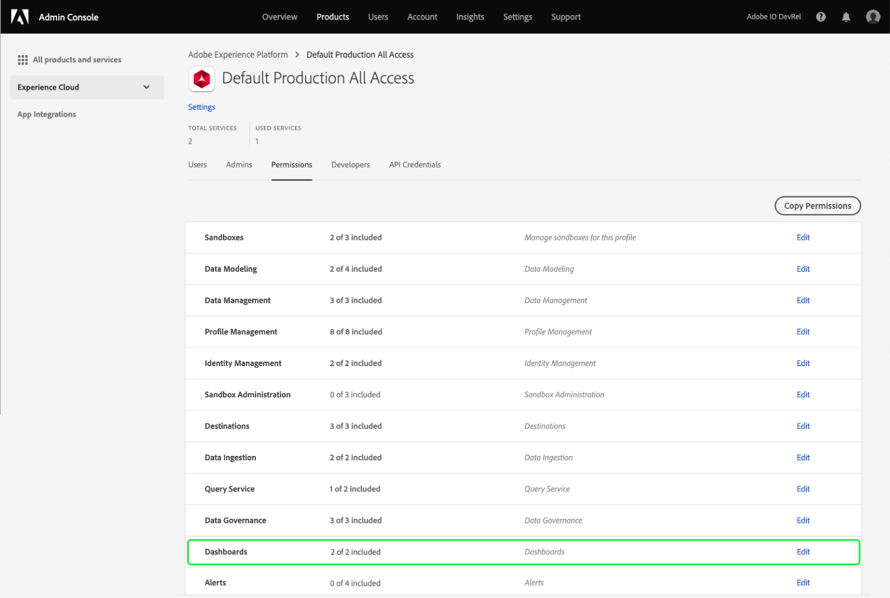

# Autorisations d’accès aux tableaux de bord

Pour permettre aux utilisateurs d’afficher, de modifier et de mettre à jour les tableaux de bord, vous devez d’abord activer les autorisations. Dans Adobe Experience Platform, le contrôle d’accès est fourni via Adobe Admin Console. Cette fonctionnalité exploite les profils de produit dans [!DNL Admin Console], liant les utilisateurs à des autorisations et des environnements de test.

Ce document résume la manière dont vous pouvez accéder à des autorisations de tableau de bord spécifiques dans Admin Console. Pour plus d’informations sur l’obtention et l’attribution des autorisations d’accès, commencez par lire la [présentation du contrôle d’accès](../access-control/home.md).

>[!NOTE]
>
>Pour configurer le contrôle dʼaccès dans [!DNL Experience Platform], vous devez posséder des droits dʼadministrateur pour une organisation qui dispose dʼune intégration de produit [!DNL Experience Platform]. Pour en savoir plus, consultez l’article d’Adobe Help Center sur les [rôles administratifs](https://helpx.adobe.com/fr/enterprise/using/admin-roles.html).

## Autorisations disponibles {#available-permissions}

Deux autorisations principales sont requises pour accéder aux tableaux de bord dans Experience Platform. Ces autorisations sont les suivantes :

* **Afficher le tableau de bord de l’utilisation de la licence** : Cette autorisation permet aux utilisateurs d’accéder en lecture seule au tableau de bord de l’utilisation des licences dans l’interface utilisateur de l’Experience Platform.
* **Gérer les tableaux de bord** standard : Cette autorisation permet aux utilisateurs d’ajouter des attributs personnalisés qui ne se trouvent pas encore dans l’entrepôt de données.

Les étapes suivantes vous montrent comment ajouter ces autorisations à l’aide de Admin Console.

## Sélectionnez les profils de produits

Pour accorder aux utilisateurs l’accès aux tableaux de bord en Experience Platform, commencez par se connecter à [Adobe Admin Console](https://adminconsole.adobe.com) et sélectionnez **Produits** dans la barre de navigation supérieure.

Sélectionnez **Adobe Experience Platform** dans la liste déroulante de l’Experience Cloud dans le volet de navigation de gauche ou dans les cartes répertoriées sous *Tous les produits et services*. Sur la page du produit Adobe Experience Platform, sélectionnez le profil de produit auquel vous souhaitez ajouter les autorisations du tableau de bord ou sélectionnez **Nouveau profil** pour créer un nouveau profil de produit.

Le profil de produit sélectionné s’ouvre, indiquant les utilisateurs associés à ce profil de produit. Pour gérer les autorisations du profil de produit, sélectionnez **Autorisations**.

## Ajouter/modifier des autorisations

L’onglet **Autorisations** affiche toutes les autorisations disponibles pour le profil de produit. Recherchez la ligne **Tableaux de bord** et notez qu’elle indique actuellement &quot;0 sur 2 inclus&quot;. Cela signifie qu’aucune autorisation de tableau de bord n’est activée pour le profil de produit.

Pour modifier les autorisations du tableau de bord, sélectionnez **Modifier** sur la ligne du tableau de bord.

La boîte de dialogue **Modifier les autorisations** s’ouvre, affichant les éléments d’autorisation disponibles et les éléments d’autorisation inclus. Vous pouvez sélectionner le signe plus (`+`) en regard de l’autorisation de l’ajouter ou sélectionner **+ Ajouter tout** pour ajouter toutes les autorisations à la fois.

Pour obtenir une description des autorisations, reportez-vous à la section [Autorisations disponibles](#available-permissions) plus haut dans ce document.

>[!NOTE]
>
>Il n’est pas nécessaire d’activer toutes les autorisations pour tous les utilisateurs. Selon la structure de votre entreprise, vous pouvez créer des profils de produit distincts pour certains utilisateurs et accorder un accès limité (comme la lecture seule).

Une fois les autorisations ajoutées, sélectionnez **Enregistrer** pour revenir au profil de produit.

Lorsque vous revenez au profil de produit, vous pouvez vérifier que les autorisations ont été ajoutées en confirmant que la ligne **Tableaux de bord** indique &quot;2 sur 2 inclus&quot;.

## Étapes suivantes

Maintenant que vous avez ajouté des autorisations d’accès aux tableaux de bord, les utilisateurs de votre entreprise peuvent commencer à afficher les tableaux de bord dans l’interface utilisateur de l’Experience Platform et effectuer d’autres actions en fonction des autorisations que vous avez attribuées.