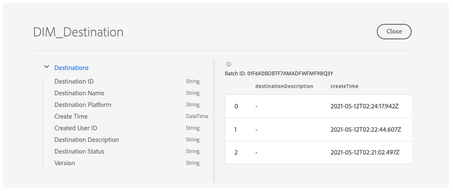

# Exploration, vérification et traitement des jeux de données de tableau de bord à l’aide de [!DNL Query Service]

Adobe Experience Platform fournit des informations importantes sur les données de profil, d’audience et de destination de votre entreprise par le biais de tableaux de bord disponibles dans l’interface utilisateur de l’Experience Platform. Vous pouvez ensuite utiliser Adobe Experience Platform [!DNL Query Service] pour explorer, vérifier et traiter les jeux de données bruts qui alimentent ces tableaux de bord dans le lac de données.

## Prise en main de [!DNL Query Service]

Adobe Experience Platform [!DNL Query Service] prend en charge les marketeurs pour obtenir des informations à partir de leurs données en permettant l’utilisation de SQL standard pour interroger les données dans le lac de données. [!DNL Query Service] offre une interface utilisateur et une API qui peuvent être utilisées pour joindre n’importe quel jeu de données dans le lac de données et capturer les résultats de la requête en tant que nouveaux jeux de données à utiliser dans les rapports, l’apprentissage automatique ou pour ingestion dans Real-Time Customer Profile.

Pour en savoir plus sur [!DNL Query Service] et son rôle dans Experience Platform, commencez par lire la [[!DNL Query Service] présentation](../query-service/home.md).

## Accès aux jeux de données disponibles

Vous pouvez utiliser [!DNL Query Service] pour interroger des jeux de données bruts pour les tableaux de bord de profil, d’audience et de destinations. Pour afficher vos jeux de données disponibles, dans l’interface utilisateur de l’Experience Platform, sélectionnez **Jeux de données** dans le volet de navigation de gauche pour ouvrir le tableau de bord Jeux de données. Le tableau de bord répertorie tous les jeux de données disponibles pour votre organisation. Des détails s’affichent pour chaque jeu de données répertorié, notamment son nom, le schéma auquel le jeu de données adhère et l’état de l’exécution d’ingestion la plus récente.


### Jeux de données générés par le système {#system-generated-datasets}

>[!IMPORTANT]
>
>Les jeux de données générés par le système sont masqués par défaut. Par défaut, l’onglet [!UICONTROL Parcourir] affiche uniquement les jeux de données dans lesquels vous avez ingéré des données.

Pour afficher les jeux de données générés par le système, sélectionnez l’icône de filtre () situé à gauche de la barre de recherche.


Une barre latérale s’affiche et contient deux bascules, [!UICONTROL Inclus dans Profile] et [!UICONTROL Afficher les jeux de données système]. Sélectionnez le bouton d’activation/désactivation de [!UICONTROL Afficher les jeux de données système] pour inclure les jeux de données générés par le système dans la liste des jeux de données pouvant être parcourus.


### Jeux de données d’attributs de profils {#profile-attribute-datasets}

Les informations contenues dans le tableau de bord du profil sont liées aux politiques de fusion qui ont été définies par votre organisation. Pour chaque politique de fusion active, un jeu de données d’attributs de profil est disponible dans le lac de données.

La convention d’affectation des noms de ces jeux de données est **Profile-Snapshot-Export** suivie d’une valeur alphanumérique aléatoire générée par le système. Par exemple : `Profile-Snapshot-Export-abbc7093-80f4-4b49-b96e-e743397d763f`.

Pour comprendre le schéma complet de chaque jeu de données d’exportation d’instantané de profil, vous pouvez prévisualiser et explorer les jeux de données [à l’aide de la visionneuse de jeux de données](../catalog/datasets/user-guide.md) dans l’interface utilisateur d’Experience Platform.


#### Mappage des jeux de données d’attributs de profil aux ID de politique de fusion

La valeur alphanumérique attribuée à chaque jeu de données d’attributs de profil généré par le système est une chaîne aléatoire qui correspond à un identifiant de stratégie de fusion de l’une des stratégies de fusion créées par votre organisation. Le mappage de chaque ID de politique de fusion à sa chaîne de jeu de données d’attributs de profil correspondante est conservé dans le jeu de données `adwh_dim_merge_policies`.

Le jeu de données `adwh_dim_merge_policies` contient les champs suivants :

* `merge_policy_name`
* `merge_policy_id`
* `merge_policy`
* `dataset_id`

Ce jeu de données peut être exploré à l’aide de l’interface utilisateur de l’éditeur de requêtes dans Experience Platform. Pour en savoir plus sur l’utilisation de l’éditeur de requêtes, reportez-vous au [Guide de l’interface utilisateur de l’éditeur de requêtes](../query-service/ui/user-guide.md).

### Jeu de données de métadonnées d’audience

Un jeu de données de métadonnées d’audience est disponible dans le lac de données et contient des métadonnées pour chaque audience de votre entreprise.

La convention d’affectation des noms de ce jeu de données est **Segmentdefinition-Snapshot-Export** suivi d’une valeur alphanumérique. Par exemple : `Segmentdefinition-Snapshot-Export-acf28952-2b6c-47ed-8f7f-016ac3c6b4e7`

Pour comprendre le schéma complet de chaque jeu de données d’exportation d’instantané de définition de segment, vous pouvez prévisualiser et explorer les jeux de données [à l’aide de la visionneuse de jeux de données](../catalog/datasets/user-guide.md) dans l’interface utilisateur d’Experience Platform.

### Jeu de données de métadonnées de destination

Les métadonnées de toutes les destinations activées de votre organisation sont disponibles sous la forme d’un jeu de données brut dans le lac de données.

La convention d’affectation des noms de ce jeu de données est **DIM_Destination**.

Pour comprendre le schéma complet du jeu de données de destination DIM, vous pouvez prévisualiser et explorer le schéma [à l’aide de la visionneuse de jeux de données](../catalog/datasets/user-guide.md) dans l’interface utilisateur d’Experience Platform.



## Rapports d’informations sur la plateforme de données client (CDP)

La fonction Modèles de données de statistiques CDP expose le code SQL qui alimente les informations pour divers widgets de profil, de destination et de segmentation. Vous pouvez personnaliser ces modèles de requête SQl afin de créer des rapports CDP pour vos cas d’utilisation de marketing et d’ICP.

Les rapports CDP fournissent des informations sur vos données de profil et sur leurs relations avec les audiences et les destinations. Pour plus d’informations sur la manière d’ [appliquer les modèles de données de statistiques de la plateforme CDP à vos cas d’utilisation d’IPC spécifiques, consultez la documentation du modèle de données de statistiques de la plateforme CDP ](./data-models/cdp-insights-data-model-b2c.md).

## Exemples de requêtes

Les exemples de requêtes suivants incluent des exemples de requêtes SQL pouvant être utilisées dans [!DNL Query Service] pour explorer, vérifier et traiter les jeux de données bruts qui alimentent vos tableaux de bord.

### Nombre de profils par identité

Ces informations de profil fournissent une ventilation des identités pour tous les profils fusionnés du jeu de données.

>[!NOTE]
>
>Le nombre total de profils par identité (c’est-à-dire en additionnant les valeurs affichées pour chaque espace de noms) peut être supérieur au nombre total de profils fusionnés, car plusieurs espaces de noms peuvent être associés à un profil. Par exemple, si un client interagit avec votre marque sur plusieurs canaux, plusieurs espaces de noms seront associés à ce client individuel.

**Requête**

```sql
Select
        Key namespace,
        count(1) count_of_profiles
     from
        (
           Select
               explode(identitymap)
           from
              Profile-Snapshot-Export-abbc7093-80f4-4b49-b96e-e743397d763f
        )
     group by
        namespace;
```

### Nombre de profils par audience

Cet aperçu de l’audience fournit le nombre total de profils fusionnés dans chaque audience du jeu de données. Ce nombre est le résultat de l’application de la stratégie de fusion d’audiences à vos données de profil afin de fusionner les fragments de profil pour former un seul profil pour chaque individu de l’audience.

```sql
Select          
        concat_ws('-', key, source_namespace) audience_id,
        count(1) count_of_profiles
      from
        (
            Select
              Upper(key) as source_namespace,
              explode(value)
            from
              (
                  Select
                    explode(Audiencemembership)
                  from
                    Profile-Snapshot-Export-abbc7093-80f4-4b49-b96e-e743397d763f
              )
        )
      group by
      audience_id
```

## Étapes suivantes

En lisant ce guide, vous pouvez désormais utiliser [!DNL Query Service] pour exécuter plusieurs requêtes afin d’explorer et de traiter les jeux de données bruts qui alimentent vos tableaux de bord de profil, d’audience et de destinations.

Pour en savoir plus sur ces tableaux de bord et les mesures associées, sélectionnez-les dans la liste des tableaux de bord disponibles dans la navigation de la documentation.
