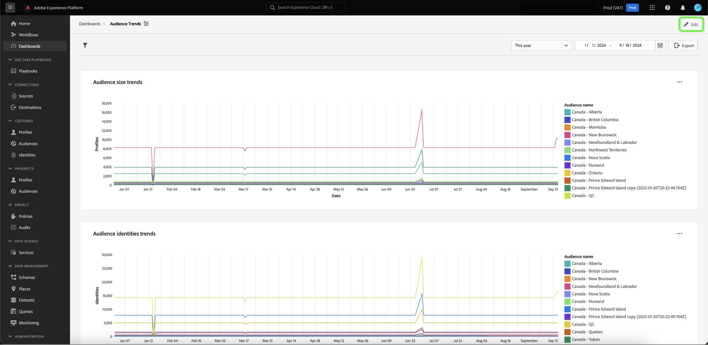
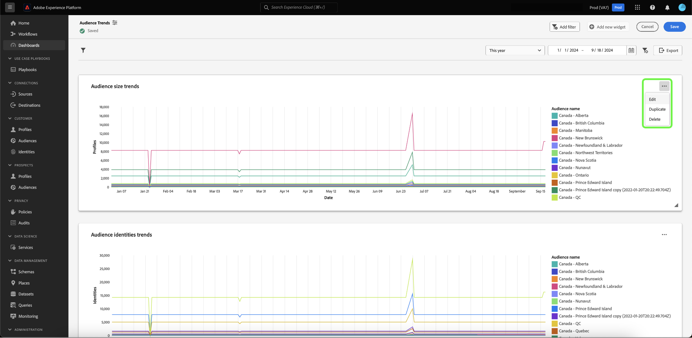
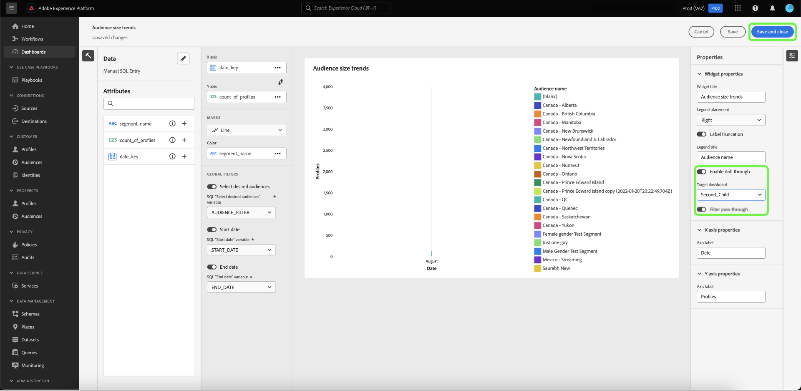
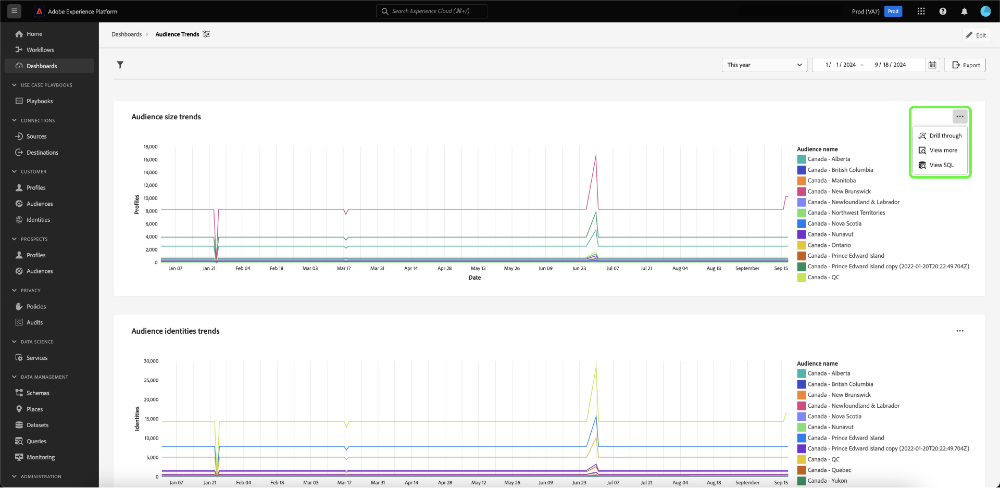
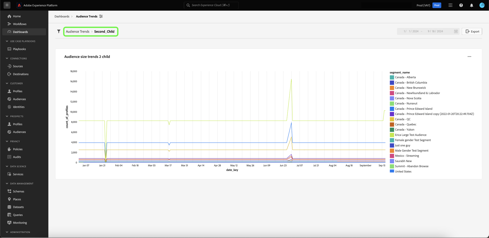

# Analyser en amont {#drill-through}

L’exploration en amont facilite l’analyse des données à plusieurs couches en facilitant la navigation de n’importe quel graphique vers un nouveau tableau de bord. Cette fonctionnalité facilite la transition de présentations de haut niveau vers des rapports détaillés lors de l’étude des tendances, du comportement des clients et clientes, des indicateurs opérationnels, etc., en vous assurant de toujours disposer du contexte dont vous avez besoin.

Le système garantit que l’analyse que vous commencez se poursuit de manière transparente tout au long de l’expérience d’exploration complète en transmettant automatiquement les filtres globaux et les filtres de période des tableaux de bord sources aux tableaux de bord cibles. Pour faciliter la navigation entre les différentes couches de l&#39;étude, le système permet des forages à plusieurs niveaux.

## Créer une exploration amont {#create-drill-through}

Pour créer une exploration, commencez par sélectionner **[!UICONTROL Edit]** dans la vue de votre tableau de bord.

Sélectionnez les points de suspension dans le graphique que vous souhaitez analyser, puis sélectionnez **[!UICONTROL Edit]**.

Dans le panneau [!UICONTROL Properties], utilisez le bouton (bascule) pour activer le **[!UICONTROL Enable drill through]**, puis utilisez la liste déroulante pour sélectionner le **[!UICONTROL Target dashboard]**. Assurez-vous que le bouton (bascule) correspondant à **[!UICONTROL Filter pass-through]** est activé, puis sélectionnez **[!UICONTROL Save and close]**.

>[!INFO]
>
>Répétez les étapes mises en évidence ci-dessus pour que le tableau de bord cible configure une exploration amont à plusieurs niveaux.

## Affichage d’une exploration {#view-drill-through}

Pour afficher une exploration en amont, sélectionnez des points de suspension dans le graphique depuis la vue de votre tableau de bord, puis sélectionnez **[!UICONTROL Drill through]**.

Le tableau de bord d&#39;exploration en amont de la cible s&#39;affiche. Vous pouvez répéter cette étape si vous disposez d&#39;une analyse à plusieurs niveaux.

>[!NOTE]
>
>Tous les filtres appliqués dans le tableau de bord source sont transmis au tableau de bord cible. Toutefois, les filtres de date et les filtres globaux sont désactivés sur les tableaux de bord enfants.

## Supprimer une exploration amont {#remove-drill-through}

Pour supprimer une exploration en amont, sélectionnez d’abord **[!UICONTROL Edit]** dans la vue de votre tableau de bord.

Dans le graphique, sélectionnez les points de suspension dont vous souhaitez supprimer une analyse, puis sélectionnez **[!UICONTROL Edit]**.

Dans le panneau de [!UICONTROL Properties], sélectionnez le bouton (bascule) pour désactiver le **[!UICONTROL Enable drill through]**, puis sélectionnez **[!UICONTROL Save and close]**.

![Panneau Propriétés du graphique avec le bouton (bascule) désactivé pour les [!UICONTROL Enable drill through] en surbrillance.](../images/sql-insights-query-pro-mode/drill-through-disable.png)

## Étapes suivantes

Vous êtes arrivé au bout de ce document. À présent, vous savez comment créer une exploration en amont pour votre tableau de bord. Vous pouvez également apprendre à générer des graphiques à partir de modèles de données existants dans l’interface utilisateur de Adobe Experience Platform à l’aide du [&#x200B; guide du mode de conception guidé &#x200B;](../standard-dashboards.md).
