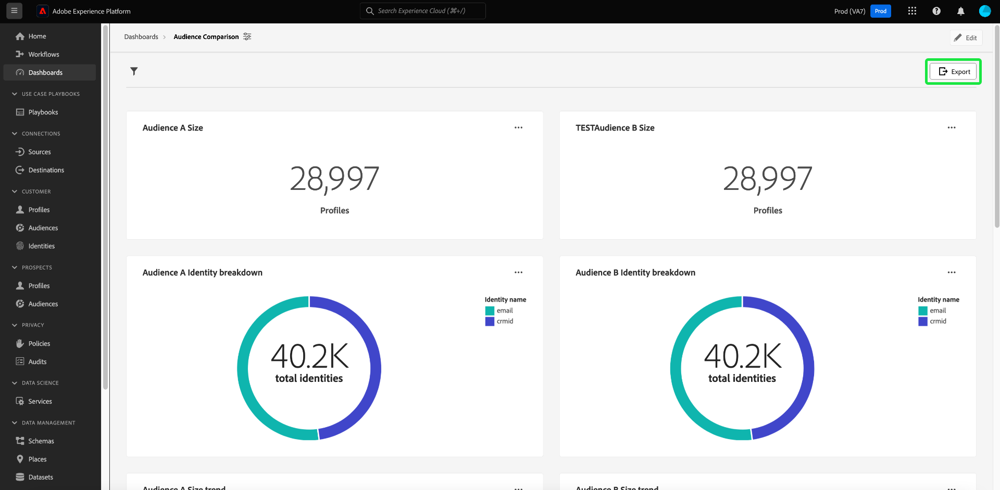

# Export PDF {#export-pdf}

Une fois que vous avez créé un [insight personnalisé](./overview.md) avec [query pro mode](./overview.md#query-pro-mode), vous pouvez exporter vos données de graphique au format PDF. Cette action est effectuée à partir de la vue d’ensemble de votre tableau de bord personnalisé.

Dans l’espace de travail Tableaux de bord , sélectionnez un tableau de bord personnalisé dans l’inventaire répertorié dans l’onglet [!UICONTROL Parcourir].

Votre tableau de bord personnalisé s’affiche. Sélectionnez ensuite **[!UICONTROL Exporter]** dans le coin supérieur droit de l’interface utilisateur.

>[!NOTE]
>
>Les exportations destinées uniquement à la visualisation ne nécessitent pas l’autorisation [!UICONTROL Exporter les données du tableau de bord]. Pour plus d’informations, consultez la documentation [[!UICONTROL En savoir plus] &#x200B;](./view-more.md#export) .

La boîte de dialogue **[!UICONTROL Exporter un fichier]** s’affiche. Enfin, sélectionnez **[!UICONTROL Télécharger]**

L’aperçu PDF s’affiche. Sélectionnez **[!UICONTROL Enregistrer]** pour terminer le processus.

