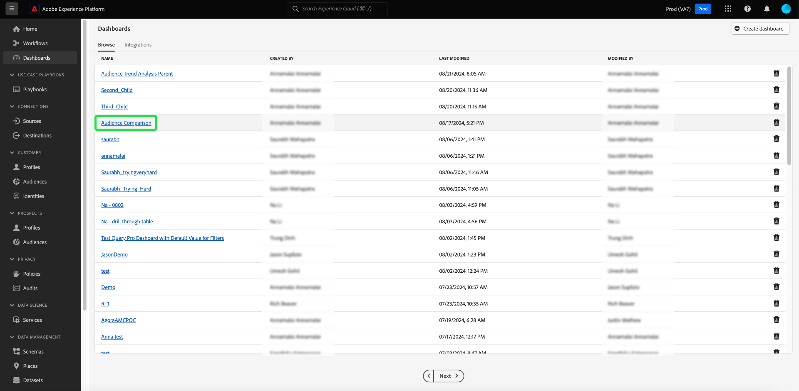
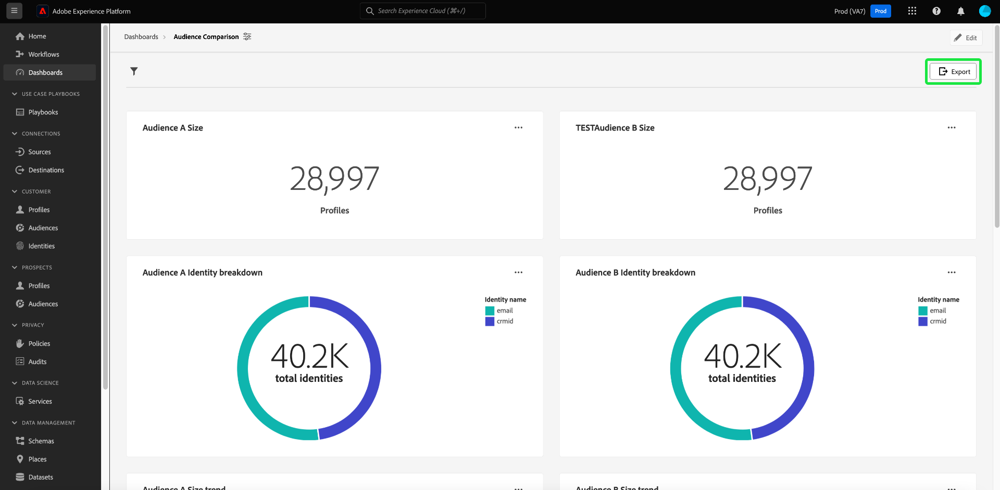
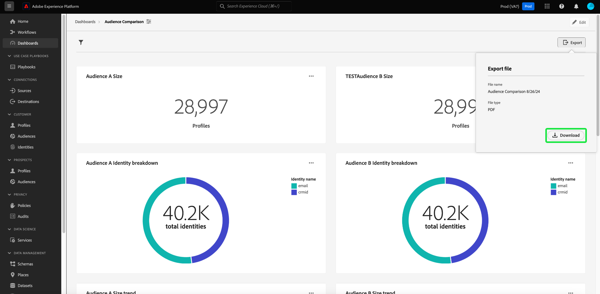
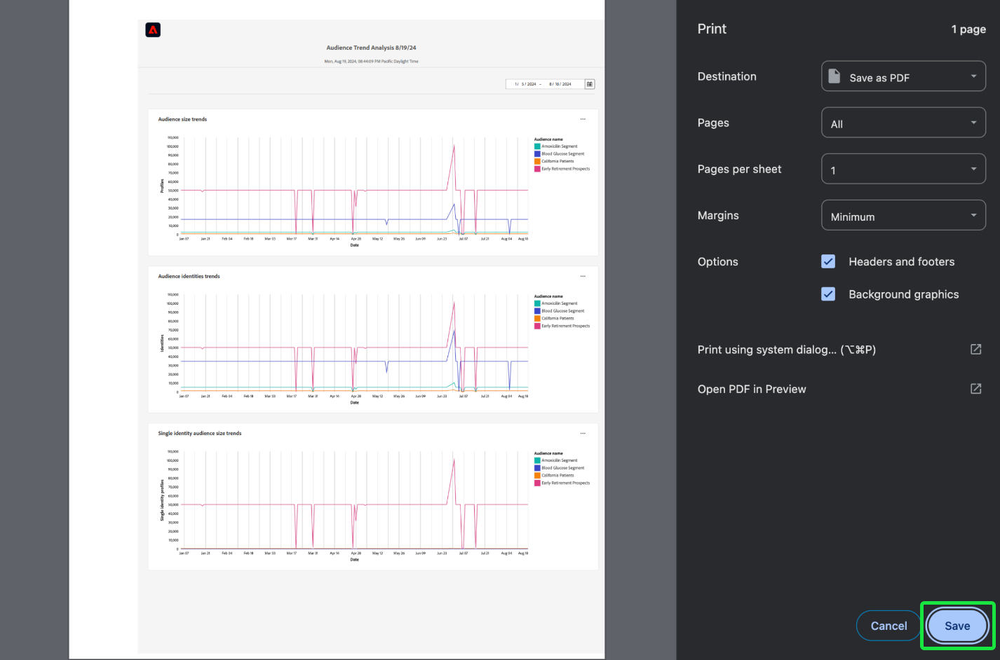

# Export PDF {#export-pdf}

Une fois que vous avez créé un insight personnalisé](./overview.md) avec [query pro mode](./overview.md#query-pro-mode), vous pouvez exporter vos données de graphique au format PDF. [Cette action est effectuée à partir de la vue d’ensemble de votre tableau de bord personnalisé.

Dans l’espace de travail Tableaux de bord , sélectionnez un tableau de bord personnalisé dans l’inventaire répertorié dans l’onglet [!UICONTROL Browse] .

Votre tableau de bord personnalisé s’affiche. Sélectionnez ensuite **[!UICONTROL Export]** dans le coin supérieur droit de l’interface utilisateur.

>[!NOTE]
>
>Les exportations destinées uniquement à la visualisation ne nécessitent pas l’autorisation [!UICONTROL Export Dashboard Data]. Pour plus d’informations](./view-more.md#export) consultez la documentation [[!UICONTROL View more] .

La boîte de dialogue **[!UICONTROL Export file]** s’affiche. Enfin, sélectionnez **[!UICONTROL Download]**

L’aperçu PDF s’affiche. Sélectionnez **[!UICONTROL Save]** pour terminer le processus.

