# Création d’un filtre de date {#create-date-filter}

Pour filtrer vos informations par date, vous devez ajouter à vos requêtes SQL des paramètres qui peuvent accepter des contraintes de date. Cette opération est effectuée dans le cadre du workflow de création d’insight Query Pro Mode. Consultez la [documentation du mode pro de requête](../overview.md#query-pro-mode) pour savoir comment saisir SQL pour vos informations.

Les paramètres de requête vous permettent d’utiliser des données dynamiques car ils servent d’espaces réservés pour les valeurs que vous ajoutez au moment de l’exécution. Ces valeurs d’espace réservé peuvent être mises à jour via l’interface utilisateur et permettent aux utilisateurs moins techniques de mettre à jour les informations en fonction de périodes.

Si vous ne connaissez pas les paramètres de requête, consultez la documentation pour obtenir des [&#x200B; sur la manière d’implémenter des requêtes paramétrées](../../../query-service/ui/parameterized-queries.md).

## Application d’un filtre de date à votre tableau de bord {#apply-date-filter}

Pour appliquer un filtre de date, sélectionnez **[!UICONTROL Ajouter un filtre]**, puis **[!UICONTROL Filtre de date]** dans le menu déroulant de l’affichage du tableau de bord.

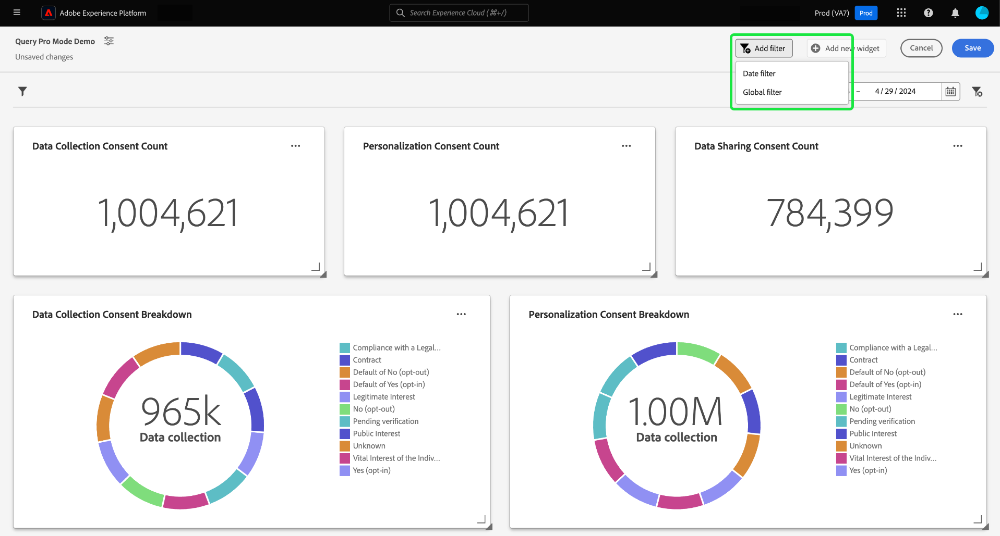

Les options de filtrage de date suivantes s’affichent.

| Filtre | Description |
| --- | --- |
| Aucune date personnalisée | Sélectionnez une ou plusieurs dates personnalisées parmi plusieurs valeurs prédéfinies. |
| Période personnalisée | Sélectionnez une ou plusieurs dates personnalisées parmi plusieurs valeurs prédéfinies, ou spécifiez une période personnalisée. |
| Date personnalisée | Sélectionnez l’une des valeurs prédéfinies ou spécifiez la date de début de votre tableau de bord. |

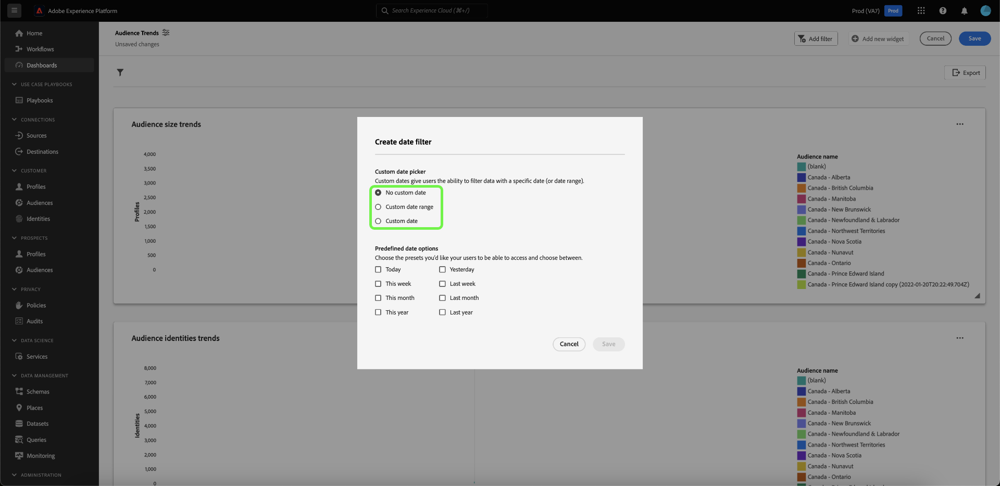

### Créer un filtre de date non personnalisé

Pour appliquer un filtre de date prédéfini, sélectionnez **[!UICONTROL Aucune date personnalisée]**, puis sélectionnez les options de date prédéfinie à inclure. Enfin, utilisez la liste déroulante pour sélectionner la période par défaut, puis sélectionnez **[!UICONTROL Enregistrer]**.

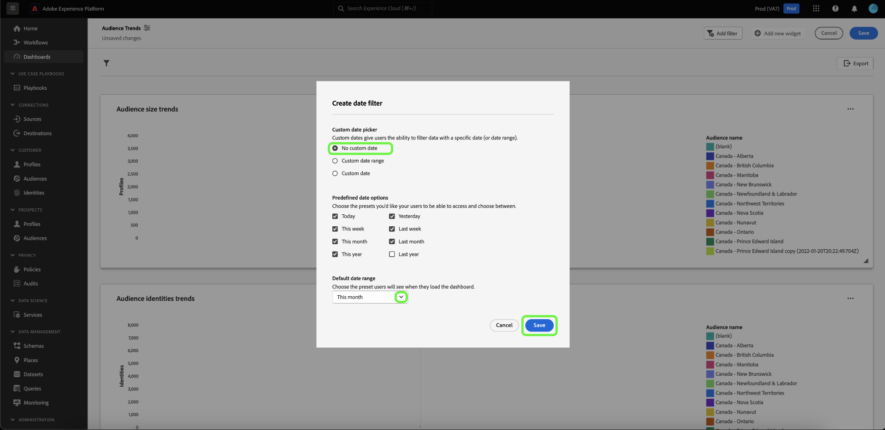

Vous revenez alors au tableau de bord, qui affiche la période par défaut que vous avez précédemment sélectionnée. Utilisez le menu déroulant pour sélectionner une autre période prédéfinie.

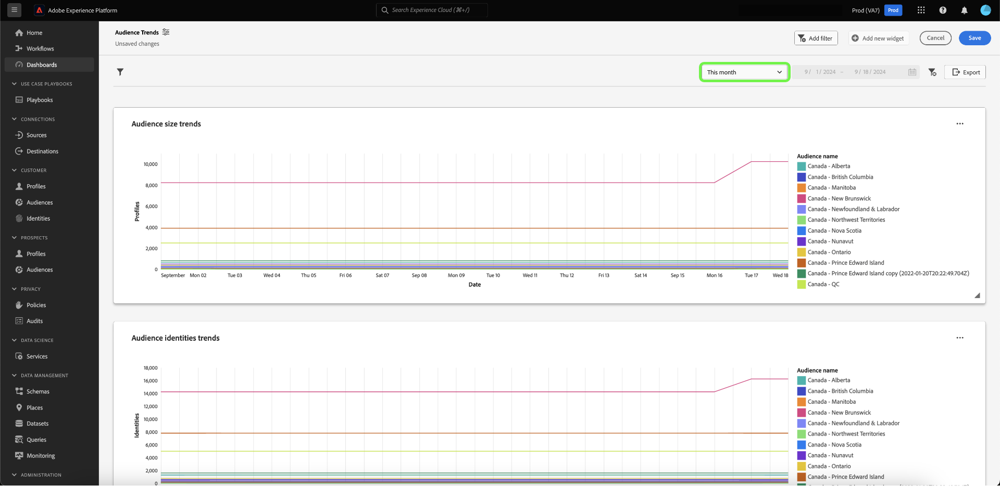

### Création d’un filtre de période personnalisé

Pour appliquer un filtre de période personnalisé, sélectionnez **[!UICONTROL Période personnalisée]**, puis sélectionnez les options de date prédéfinies à inclure. Enfin, sélectionnez **[!UICONTROL Personnalisé]** pour définir la période par défaut. Utilisez le calendrier pour spécifier une période, puis sélectionnez **[!UICONTROL Enregistrer]**.

>[!NOTE]
>
>Il n’est pas nécessaire de sélectionner des options de date prédéfinies.

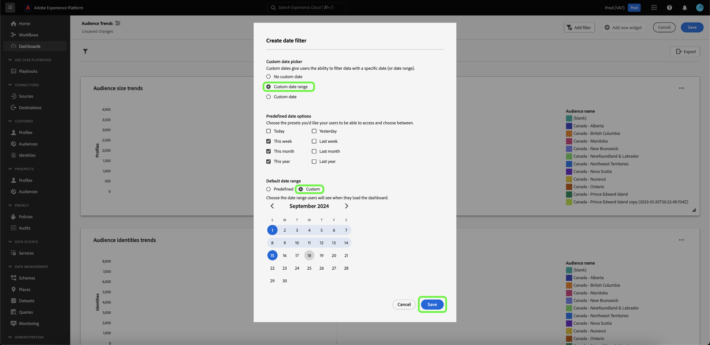

Vous revenez alors au tableau de bord , qui affiche la plage de données personnalisée que vous avez précédemment spécifiée. Utilisez le menu déroulant pour sélectionner une autre période prédéfinie.

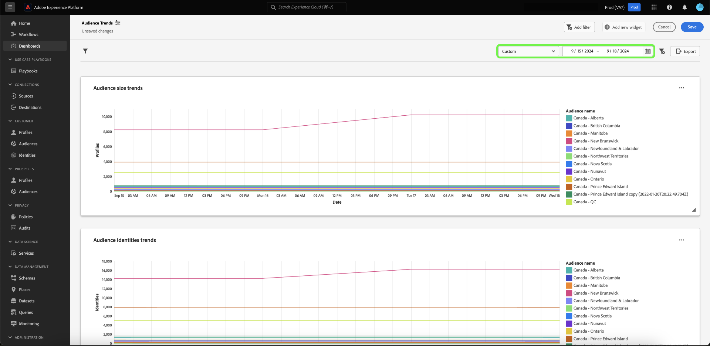

### Création d’un filtre de date personnalisé

Pour appliquer un filtre de date personnalisé, sélectionnez **[!UICONTROL Date personnalisée]**, puis sélectionnez les options de date prédéfinies à inclure. Enfin, sélectionnez **[!UICONTROL Personnalisé]**, puis utilisez le calendrier pour sélectionner une date de début. Enfin, sélectionnez **[!UICONTROL Enregistrer]**.

>[!NOTE]
>
>Il n’est pas nécessaire de sélectionner des options de date prédéfinies.

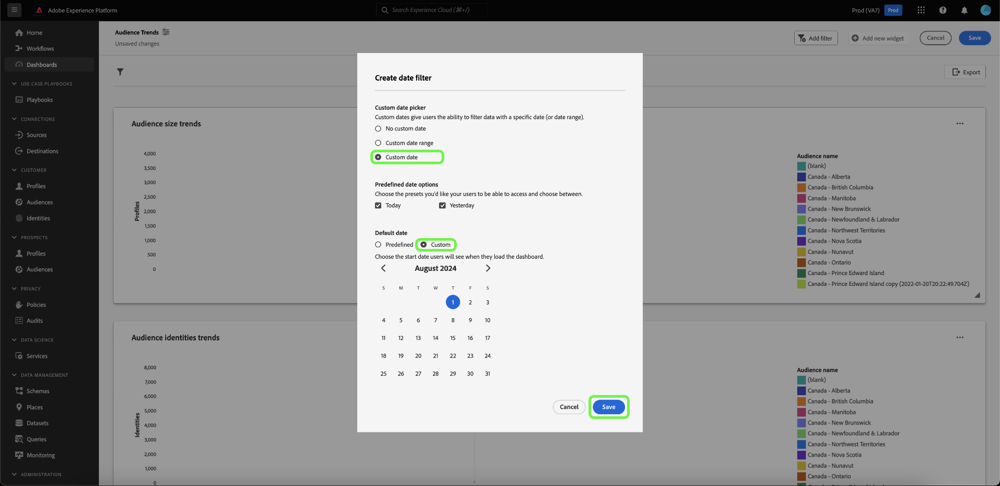

Vous revenez alors au tableau de bord , qui affiche les données personnalisées que vous avez précédemment spécifiées. Utilisez le menu déroulant pour sélectionner une autre date.

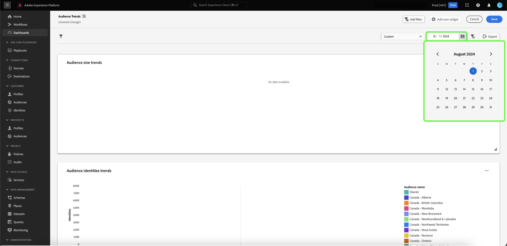

## Suppression d’un filtre de date {#delete-date-filter}

Pour supprimer votre filtre de date, sélectionnez l’icône Supprimer le filtre ().

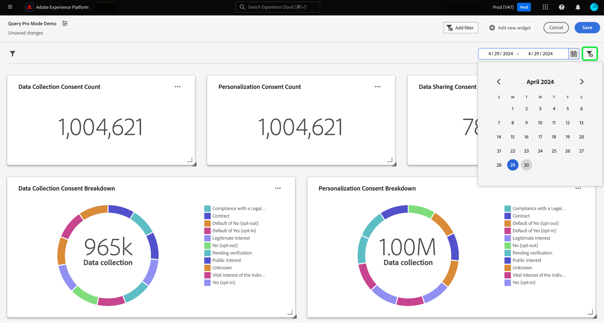

## Modifiez votre code SQL pour inclure des paramètres de requête de date {#include-date-parameters}

Ensuite, assurez-vous que votre requête SQL inclut des paramètres de requête pour autoriser une période. Si vous n’avez pas encore incorporé de paramètres de requête dans votre SQL, modifiez vos informations pour inclure ces paramètres. Consultez la documentation pour obtenir des instructions sur la [modification d’une insight](../overview.md#edit).

>[!TIP]
>
>Il est recommandé d’ajouter des paramètres `$START_DATE` et `$END_DATE` à votre instruction SQL dans chacun des graphiques pour lesquels vous souhaitez activer les filtres de date.

>[!NOTE]
>
>Les filtres de date ne prennent pas en charge les contraintes de temps. Le filtre s’applique uniquement aux périodes. Cela signifie que si vous disposez de plusieurs rapports au cours d’une période de 24 heures, vous ne pouvez pas faire la distinction entre différentes heures d’une même journée. Pour cette raison, il est recommandé de convertir le composant Heure en date.

Si le modèle de données ou les tableaux que vous analysez comportent un composant Heure, vous pouvez regrouper vos données par date, puis appliquer ces filtres de date.

L’exemple d’instruction SQL ci-dessous montre comment incorporer des paramètres `$START_DATE` et `$END_DATE` et utilise `cast` pour cadrer le composant d’heure en tant que date.

```sql
SELECT Sum(personalization_consent_count) AS Personalization,
       Sum(datacollection_consent_count)  AS Datacollection,
       Sum(datasharing_consent_count)     AS Datasharing
FROM   fact_daily_consent_aggregates f
       INNER JOIN dim_consent_valued
               ON f.consent_value_id = d.consent_value_id
WHERE  f.date BETWEEN Upper(Coalesce(Cast('$START_DATE' AS date), '')) AND Upper
                      (
                             Coalesce(Cast('$END_DATE' AS date), ''))
       AND ( ( Upper(Coalesce($consent_value_filter, '')) IN ( '', 'NULL' ) )
              OR ( f.consent_value_id IN ( $consent_value_filter ) ) )
LIMIT  0; 
```

La capture d’écran ci-dessous met en évidence les contraintes de date intégrées dans les paires instruction SQL et valeur de clé de paramètre de requête.

>[!NOTE]
>
>Lors de la composition de votre instruction en mode Query Pro, vous devez fournir des exemples de valeurs pour chaque paramètre afin d’exécuter l’instruction SQL et de créer le graphique. Les exemples de valeurs que vous fournissez lors de la composition de votre instruction sont remplacés par les valeurs réelles que vous sélectionnez pour le filtre de date (ou global) au moment de l’exécution.

![Boîte de dialogue [!UICONTROL Saisir le code SQL] avec les paramètres de date mis en surbrillance dans le code SQL.](../../images/sql-insights-query-pro-mode/sql-date-parameters.png)

## Activation des paramètres de date dans chaque insight {#enable-date-parameters}

Une fois que vous avez intégré les paramètres appropriés au SQL de vos informations, les variables `Start_date` et `End_date` sont désormais disponibles sous forme de bascules dans le compositeur de widgets. Pour plus d’informations sur la modification d’une insight, consultez la section [population de widgets du mode pro &#x200B;](../overview.md#populate-widget) .

Dans le compositeur de widgets, sélectionnez bascules pour activer les paramètres `Start_date` et `End_date`.

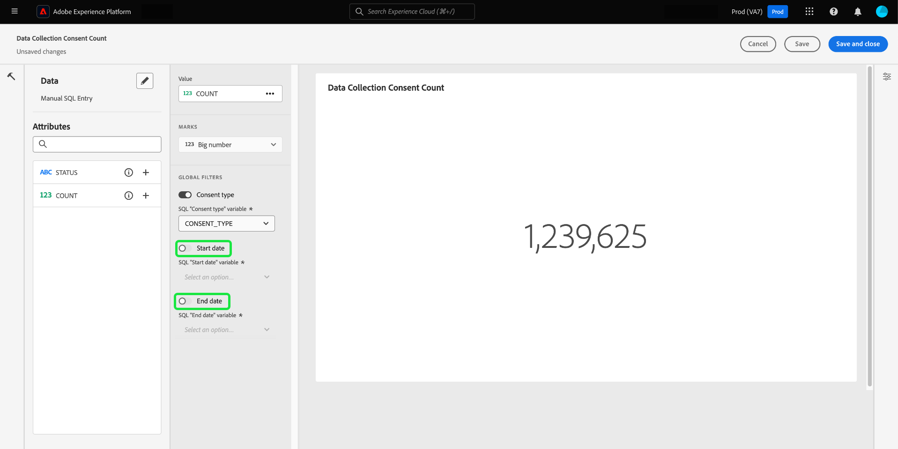

Sélectionnez ensuite les paramètres de requête appropriés dans les menus déroulants.

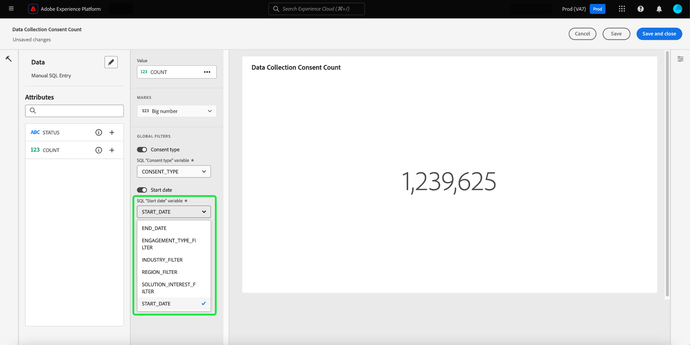

Enfin, sélectionnez **[!UICONTROL Enregistrer et fermer]** pour revenir à votre tableau de bord. Les filtres de date sont désormais activés pour toutes les informations dont les paramètres de date de début et de fin sont définis.
