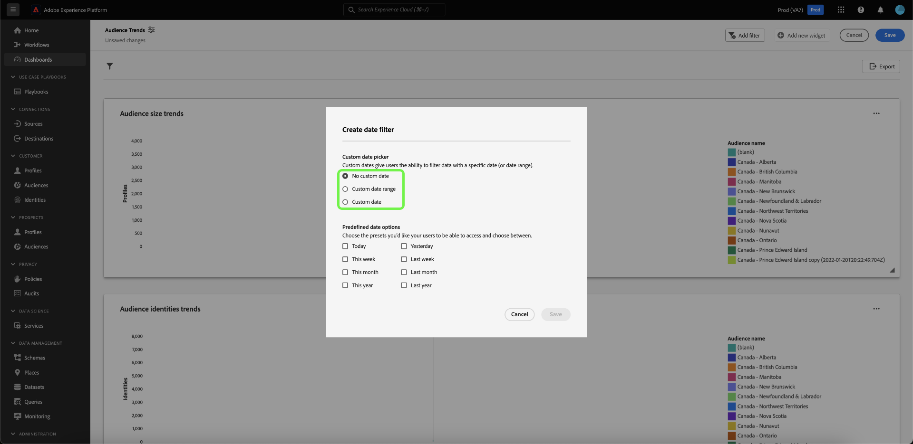
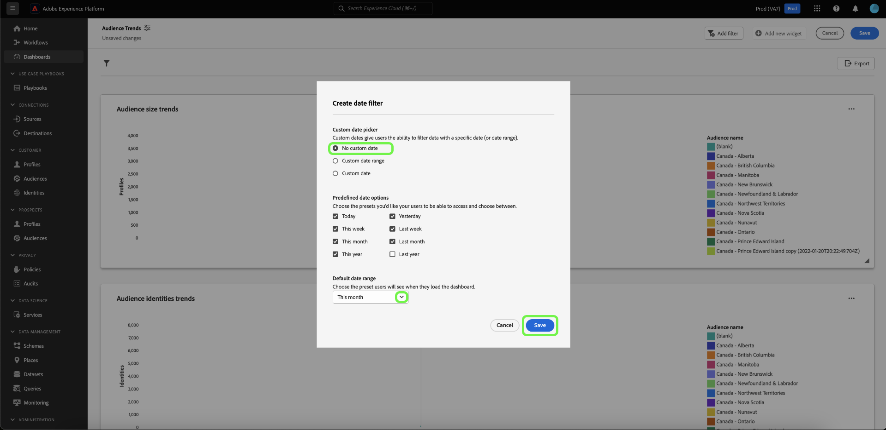
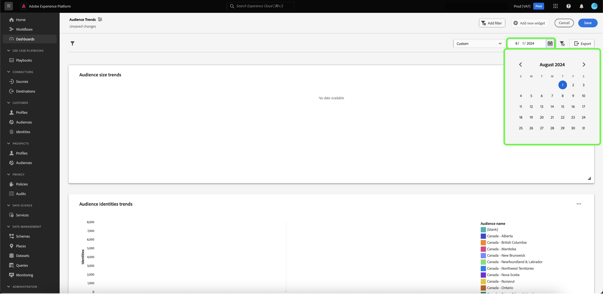

# Création d’un filtre de date {#create-date-filter}

Pour filtrer vos informations par date, vous devez ajouter des paramètres à vos requêtes SQL qui peuvent accepter des contraintes de date. Cela s’inscrit dans le cadre du workflow de création d’informations sur le mode professionnel des requêtes. Consultez la [documentation sur le mode professionnel des requêtes](../overview.md#query-pro-mode) pour savoir comment entrer dans SQL pour vos informations.

Les paramètres de requête vous permettent d’utiliser des données dynamiques qui agissent comme espaces réservés aux valeurs que vous ajoutez au moment de l’exécution. Ces valeurs d’espace réservé peuvent être mises à jour via l’interface utilisateur et permettent aux utilisateurs moins techniques de mettre à jour les informations en fonction des périodes.

Si vous ne connaissez pas les paramètres de requête, reportez-vous à la documentation de [&#x200B; conseils sur la mise en oeuvre de requêtes paramétrées](../../../query-service/ui/parameterized-queries.md).

## Appliquer un filtre de date à votre tableau de bord {#apply-date-filter}

Pour appliquer un filtre de date, sélectionnez **[!UICONTROL Ajouter un filtre]**, puis **[!UICONTROL Filtre de date]** dans le menu déroulant de la vue de votre tableau de bord.


Les options de filtrage par date suivantes s’affichent.

| Filtre | Description |
| --- | --- |
| Aucune date personnalisée | Sélectionnez une ou plusieurs dates personnalisées à partir de plusieurs valeurs prédéfinies. |
| Période personnalisée | Sélectionnez une ou plusieurs dates personnalisées à partir de plusieurs valeurs prédéfinies ou spécifiez une plage de dates personnalisée. |
| Date personnalisée | Choisissez parmi les valeurs prédéfinies ou indiquez la date de début de votre tableau de bord. |



### Création d’un filtre de date non personnalisé

Pour appliquer un filtre de date prédéfini, sélectionnez **[!UICONTROL Aucune date personnalisée]**, puis sélectionnez les options de date prédéfinies que vous souhaitez inclure. Enfin, utilisez la liste déroulante pour sélectionner la période par défaut, puis sélectionnez **[!UICONTROL Enregistrer]**.



Le tableau de bord affiche alors la période par défaut que vous avez sélectionnée. Utilisez le menu déroulant pour sélectionner une autre période prédéfinie.


### Création d’un filtre de période personnalisé

Pour appliquer un filtre de période personnalisé, sélectionnez **[!UICONTROL Période personnalisée]**, puis sélectionnez les options de date prédéfinies que vous souhaitez inclure. Enfin, sélectionnez **[!UICONTROL Personnalisé]** pour définir la période par défaut. Utilisez le calendrier pour spécifier une période, puis sélectionnez **[!UICONTROL Enregistrer]**.

>[!NOTE]
>
>Il n’est pas nécessaire de sélectionner des options de date prédéfinies.


Le tableau de bord affiche alors la plage de données personnalisée que vous avez précédemment spécifiée. Utilisez le menu déroulant pour sélectionner une autre période prédéfinie.


### Création d’un filtre de date personnalisé

Pour appliquer un filtre de date personnalisé, sélectionnez **[!UICONTROL Date personnalisée]**, puis les options de date prédéfinies que vous souhaitez inclure. Enfin, sélectionnez **[!UICONTROL Personnalisé]**, puis utilisez le calendrier pour sélectionner une date de début. Enfin, sélectionnez **[!UICONTROL Enregistrer]**.

>[!NOTE]
>
>Il n’est pas nécessaire de sélectionner des options de date prédéfinies.


Le tableau de bord affiche alors les données personnalisées que vous avez précédemment spécifiées. Utilisez le menu déroulant pour sélectionner une autre date.



## Suppression d’un filtre de date {#delete-date-filter}

Pour supprimer votre filtre de date, sélectionnez l’icône Supprimer le filtre ().


## Modifier votre code SQL pour inclure les paramètres de requête de date {#include-date-parameters}

Ensuite, assurez-vous que votre SQL inclut des paramètres de requête pour permettre une période. Si vous n’avez pas encore incorporé de paramètres de requête dans votre SQL, modifiez vos informations pour inclure ces paramètres. Consultez la documentation pour obtenir des instructions sur la façon de [modifier une information](../overview.md#edit).

>[!TIP]
>
>Nous vous recommandons d’ajouter des paramètres `$START_DATE` et `$END_DATE` à votre instruction SQL dans chacun des graphiques pour lesquels vous souhaitez activer des filtres de dates.

>[!NOTE]
>
>Les filtres de date ne prennent pas en charge les contraintes de temps. Le filtre s’applique uniquement aux périodes. En d’autres termes, si vous disposez de plusieurs rapports sur une période de 24 heures, vous ne pouvez pas faire la distinction entre différentes heures au cours d’une même journée. C’est pourquoi il est recommandé de définir le composant de temps comme une date.

Si le ou les tableaux de données que vous analysez comportent un composant d’heure, vous pouvez regrouper vos données par date, puis appliquer ces filtres de date.

L’exemple d’instruction SQL ci-dessous montre comment incorporer des paramètres `$START_DATE` et `$END_DATE` et utilise `cast` pour encadrer le composant temporel en tant que date.

```sql
SELECT Sum(personalization_consent_count) AS Personalization,
       Sum(datacollection_consent_count)  AS Datacollection,
       Sum(datasharing_consent_count)     AS Datasharing
FROM   fact_daily_consent_aggregates f
       INNER JOIN dim_consent_valued
               ON f.consent_value_id = d.consent_value_id
WHERE  f.date BETWEEN Upper(Coalesce(Cast('$START_DATE' AS date), '')) AND Upper
                      (
                             Coalesce(Cast('$END_DATE' AS date), ''))
       AND ( ( Upper(Coalesce($consent_value_filter, '')) IN ( '', 'NULL' ) )
              OR ( f.consent_value_id IN ( $consent_value_filter ) ) )
LIMIT  0; 
```

La capture d’écran ci-dessous met en évidence les contraintes de date intégrées à l’instruction SQL et les paires clé-valeur du paramètre de requête.

>[!NOTE]
>
>Lors de la composition de votre instruction en mode query pro, vous devez fournir des exemples de valeurs pour chaque paramètre afin d’exécuter l’instruction SQL et de créer le graphique. Les exemples de valeurs que vous fournissez lors de la composition de votre instruction sont remplacés par les valeurs réelles que vous sélectionnez pour le filtre de date (ou global) au moment de l’exécution.

![Boîte de dialogue [!UICONTROL Entrer SQL] avec les paramètres de date surlignés dans le SQL.](../../images/sql-insights-query-pro-mode/sql-date-parameters.png)

## Activation des paramètres de date dans chaque insight {#enable-date-parameters}

Une fois que vous avez intégré les paramètres appropriés au SQL de vos insights, les variables `Start_date` et `End_date` sont désormais disponibles en tant que bascules dans le compositeur de widgets. Pour plus d’informations sur la modification d’un aperçu, reportez-vous à la section [population du widget de mode de requête pro](../overview.md#populate-widget) .

Dans le compositeur de widgets, sélectionnez des bascules pour activer les paramètres `Start_date` et `End_date`.


Sélectionnez ensuite les paramètres de requête appropriés dans les menus déroulants.


Enfin, sélectionnez **[!UICONTROL Enregistrer et fermer]** pour revenir à votre tableau de bord. Les filtres de date sont désormais activés pour toutes les informations qui comportent des paramètres de date de début et de fin.
