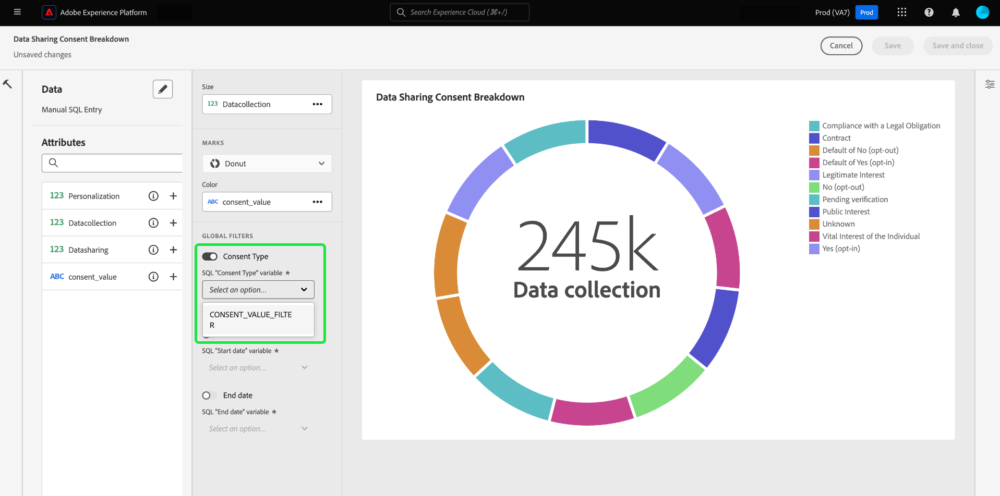

# Créer un filtre global {#create-global-filter}

Pour créer un filtre global, sélectionnez d’abord **[!UICONTROL Ajouter un filtre]** dans la vue de votre tableau de bord, puis **[!UICONTROL Filtre global]** dans le menu déroulant.

>[!IMPORTANT]
>
>Veillez à mapper vos filtres globaux à tous vos graphiques. Il ne s&#39;agit pas d&#39;un processus automatique. Pour utiliser un filtre global, vous devez inclure un [paramètre de requête](../../../query-service/ui/parameterized-queries.md) dans le code SQL de votre graphique, [activer le filtre global](#enable-global-filter) dans le compositeur de widgets et [sélectionner une valeur d’exécution](#select-global-filter) pour le paramètre dans la boîte de dialogue Filtre global. Consultez le guide de query pro pour savoir comment modifier votre code SQL si vous devez incorporer un paramètre de requête.

Vous pouvez rapidement modifier les informations fournies par votre SQL à l’aide de filtres globaux personnalisés.

La boîte de dialogue [!UICONTROL Créer un filtre global] s’ouvre. La création d’un filtre global suit le même processus que la création d’une insight avec SQL. Sélectionnez tout d’abord une base de données (modèle de données d’informations) à interroger, puis saisissez votre code SQL personnalisé dans le Query Editor, et enfin sélectionnez l’icône d’exécution ().

>[!IMPORTANT]
>
>Vous devez inclure un identifiant et une valeur lors de la création d’un filtre global. Les exemples de valeurs permettent d’exécuter l’instruction SQL et de créer le graphique. Notez que les exemples de valeurs que vous fournissez lors de la composition de votre instruction sont remplacés par les valeurs réelles que vous sélectionnez pour la date ou le filtre global au moment de l’exécution.

Une fois la requête exécutée, l’onglet Résultats affiche les résultats. Sélectionnez **[!UICONTROL Suivant]**.

>[!NOTE]
>
>Par défaut, les résultats de la requête sont limités à 100 lignes. Pour renvoyer davantage de lignes, ajoutez une clause LIMIT à votre requête SQL avec le nombre de lignes souhaité. Pour récupérer toutes les lignes et supprimer la limite par défaut, utilisez LIMIT 0 dans votre requête.

![La boîte de dialogue [!UICONTROL Créer un filtre global] avec le menu déroulant du jeu de données, l’icône d’exécution et Suivant en surbrillance.](../../images/sql-insights-query-pro-mode/global-filter.png)

La dernière étape du workflow de création de filtre global nécessite que vous ajoutiez un libellé pour votre filtre. Ajoutez un libellé au champ de texte **[!UICONTROL Libellé du filtre]** et sélectionnez un type de filtre dans la liste déroulante.

>[!NOTE]
>
>Seule l’option de type de filtre [!UICONTROL zone de liste déroulante] est actuellement prise en charge.

Enfin, sélectionnez **[!UICONTROL Sélectionner]** pour revenir à la vue de votre tableau de bord.

![&#x200B; La boîte de dialogue [!UICONTROL Créer un filtre global] avec Sélectionner et la saisie de texte Libellé du filtre mise en surbrillance.](../../images/sql-insights-query-pro-mode/global-filter-label.png)

## Activer le filtre global pour chaque insight {#enable-global-filter}

>[!TIP]
>
>Activez les filtres globaux dans chaque graphique que vous créez. Cela permet de s’assurer que les valeurs que vous choisissez comme filtre global se reflètent dans tous vos graphiques.

Après avoir créé votre filtre global pour votre tableau de bord, le bouton (bascule) de ce filtre global devient disponible dans le cadre du compositeur de widgets.

>[!IMPORTANT]
>
>Assurez-vous que le paramètre de filtre global est inclus dans le code SQL de chaque insight.

## Sélectionner un filtre global {#select-global-filter}

Pour ouvrir la boîte de dialogue [!UICONTROL Filtres] qui répertorie tous vos filtres personnalisés, sélectionnez l’icône de filtre () à gauche de votre tableau de bord. Ensuite, pour appliquer les effets sur les informations de votre tableau de bord, choisissez une option dans le menu déroulant de votre filtre global, puis sélectionnez **[!UICONTROL Appliquer]**.

## Effacer le filtre global {#clear-global-filter}

Pour effacer tous vos filtres globaux personnalisés, sélectionnez **[!UICONTROL Effacer tout]** dans la boîte de dialogue [!UICONTROL Filtres].

