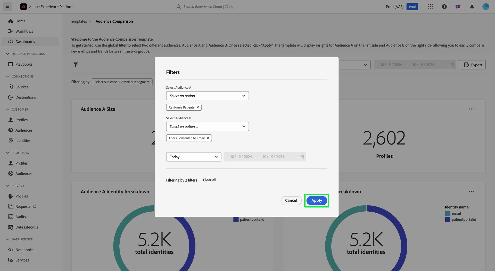

# Comparaison des audiences

Le tableau de bord [!UICONTROL Comparaison des audiences] compare et compare les mesures d’audience clés dans une vue côte à côte. Depuis ce tableau de bord, vous pouvez effectuer diverses actions pour comparer deux groupes d’audiences et analyser les mesures clés entre elles. Vous pouvez ensuite prendre des décisions basées sur les données concernant la segmentation de l’audience et les stratégies de ciblage.

## Définition des comparaisons d’audience {#set-audience-comparisons}

Pour obtenir des informations et des comparaisons plus significatives, utilisez les filtres système afin de cibler précisément les segments d’audience et la période que vous souhaitez analyser. Sélectionnez l’icône de filtre () pour choisir deux audiences différentes ([!UICONTROL Audience A] et [!UICONTROL Audience B]) et définir des paramètres spécifiques pour la comparaison.

La boîte de dialogue [!UICONTROL Filter] s’affiche. Pour choisir la première audience à analyser, sélectionnez la liste déroulante **[!UICONTROL Sélectionner l’audience A]** . Dans cet exemple, `California Patients` a été sélectionné en tant qu’audience A. Cette audience s’affiche sur le côté gauche de la comparaison une fois le filtre appliqué.

Ensuite, choisissez une seconde audience à comparer à [!UICONTROL Audience A] dans la liste déroulante **[!UICONTROL Sélectionner l’audience B]** . Dans cette image, [!UICONTROL Utilisateurs consentés au courrier électronique] a été sélectionné comme [!UICONTROL Audience B]. Cette audience s’affiche sur le côté droit du tableau de bord [!UICONTROL Comparaison des audiences] une fois le filtre appliqué.

### Ajustement des plages de dates {#adjust-date-ranges}

Vous pouvez également filtrer vos données selon des périodes spécifiques afin de déterminer les performances ou les modifications de ces audiences sur une période personnalisée. Pour définir une période afin de filtrer les données de l’audience selon une période spécifique, sélectionnez les dates de début et de fin dans les champs du calendrier.

La boîte de dialogue indique également le nombre de filtres appliqués (dans la capture d’écran ci-dessous, deux filtres sont utilisés : Audience A et Audience B, et aujourd’hui comme période). Pour supprimer tous les filtres appliqués, sélectionnez **[!UICONTROL Effacer tout]**.

Après avoir défini les audiences et la période, sélectionnez **[!UICONTROL Appliquer]** pour actualiser le tableau de bord [!UICONTROL Comparaison des audiences].

Le tableau de bord affiche désormais les graphiques comparatifs affichés côte à côte pour chaque audience.

## Graphiques de comparaison d’audiences disponibles {#available-charts}

<!-- Potentially could expand this section to include images of each widget.  -->

Le tableau de bord propose plusieurs graphiques pour comparer les insights :

- [[!UICONTROL Taille de l’audience]](../../guides/audiences.md#audience-size) : effectuez facilement un suivi de la taille de chaque audience en fonction du nombre de profils qu’elle contient. Cette mesure vous aide à comprendre l’échelle des deux audiences que vous comparez.
- [!UICONTROL Ventilation de l’identité de l’audience] : un graphique circulaire fournit une ventilation de la composition relative des identités au sein de chaque audience. Vous pouvez afficher le nombre total d’identités et examiner comment différents identifiants (tels que l’e-mail ou l’identifiant CRM) contribuent à ce total. Ce graphique vous permet de comprendre la composition de chaque audience en fonction des types d’identité. Passez la souris sur une section du graphique circulaire pour afficher un nombre exact d’identités.
- [[!UICONTROL Tendance de la taille de l’audience]](../../guides/audiences.md#audience-size-trend) : ce graphique représente les tendances de la taille au fil du temps pour l’audience choisie. Utilisez ces graphiques pour visualiser l’évolution de la taille de chaque audience au cours d’une période sélectionnée, avec des pics et des creux indiquant les périodes de croissance ou de réduction du nombre de profils.
- [[!UICONTROL Tendance des changements de taille de l’audience]](../../guides/audiences.md#audience-size-change-trend) : ce graphique affiche les tendances de changement de taille pour l’audience choisie. Il permet de visualiser l’augmentation ou la diminution de la taille de l’audience au fil du temps et d’identifier les changements ou tendances significatifs dans la population de l’audience.

>[!NOTE]
>
>Les graphiques [!UICONTROL Tendance de la taille de l’audience] et [!UICONTROL Tendance du changement de la taille de l’audience] vous aident à suivre et comparer la taille absolue et les fluctuations de la taille entre deux audiences sur une période spécifiée. Ces informations facilitent la compréhension des modèles et des facteurs qui influencent les changements d’audience.

## Exporter des insights {#export-insights}

Après avoir appliqué des filtres et analysé les audiences, vous pouvez exporter les données à des fins d’analyse hors ligne ou de création de rapports supplémentaires. Pour exporter vos insights, sélectionnez **[!UICONTROL Exporter]** en haut à droite du tableau. La boîte de dialogue Imprimer le PDF s’affiche. Dans cette boîte de dialogue, vous pouvez enregistrer en tant que PDF ou imprimer les données affichées dans le tableau.

Sélectionnez **[!UICONTROL Modèles]** pour revenir à l’aperçu [!UICONTROL Modèle].

## Étapes suivantes

Après avoir lu ce document, vous avez appris à comparer des mesures clés entre différents groupes d’audiences à l’aide du tableau de bord **Comparaison de l’audience**. Pour continuer à améliorer la segmentation et les stratégies de ciblage de votre audience, explorez d’autres modèles de Data Distiller qui apportent des informations supplémentaires. Reportez-vous aux [Audience Trends](./trends.md), [Audience Identity Overlaps](./identity-overlaps.md) et aux [Advanced Audience Overlaps](./overlaps.md) guides de l’interface utilisateur pour améliorer davantage votre prise de décision et optimiser les efforts d’engagement.

