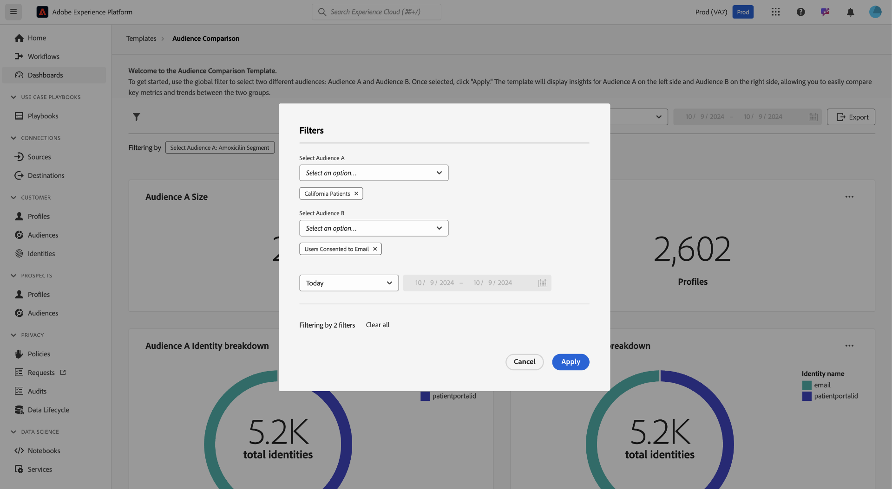
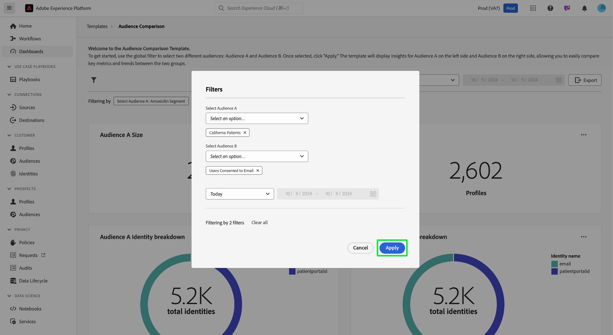
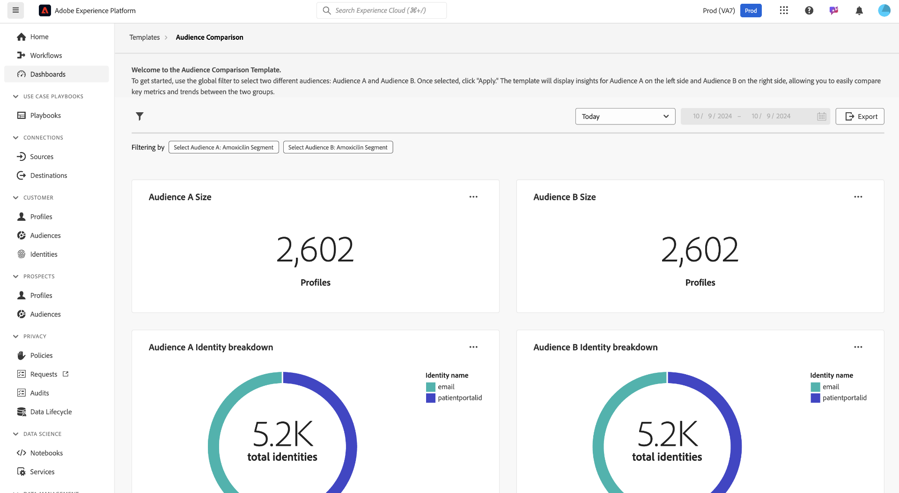
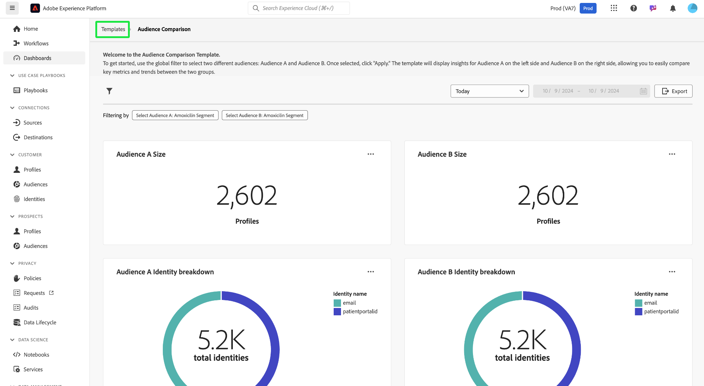

# Comparaison des audiences

Le tableau de bord [!UICONTROL Comparaison des audiences] compare et met en contraste les mesures d’audience clés dans une vue côte à côte. Depuis ce tableau de bord, vous pouvez effectuer différentes actions pour comparer deux groupes d’audiences et analyser les mesures clés entre eux. Vous pouvez ensuite prendre des décisions basées sur les données concernant la segmentation de l’audience et les stratégies de ciblage.

## Définir des comparaisons d’audience {#set-audience-comparisons}

Pour obtenir des informations et des comparaisons plus pertinentes, utilisez les filtres système pour cibler précisément les segments d’audience et la période que vous souhaitez analyser. Sélectionnez l’icône de filtre (). pour choisir deux audiences différentes ([!UICONTROL Audience A] et [!UICONTROL Audience B]) et définir des paramètres spécifiques à comparer.

La boîte de dialogue [!UICONTROL Filtre] s’affiche. Pour choisir la première audience à analyser, sélectionnez le menu déroulant **[!UICONTROL Sélectionner l’audience A]**. Dans cet exemple, `California Patients` a été sélectionné comme audience A. Cette audience s’affiche sur le côté gauche de la comparaison une fois le filtre appliqué.

Choisissez ensuite une deuxième audience à comparer à [!UICONTROL Audience A] dans le menu déroulant **[!UICONTROL Sélectionner l’audience B]**. Dans cette image, l’option [!UICONTROL Les utilisateurs ont consenti à l’e-mail] a été sélectionnée en tant qu’[!UICONTROL audience B]. Cette audience s’affiche dans la partie droite du tableau de bord [!UICONTROL Comparaison des audiences] une fois le filtre appliqué.

### Ajuster les périodes {#adjust-date-ranges}

Vous pouvez également filtrer vos données par périodes spécifiques pour voir comment ces audiences se comportent ou changent sur une période personnalisée. Pour définir une période afin de filtrer les données de l’audience selon une période spécifique, sélectionnez les dates de début et de fin dans les champs du calendrier.

La boîte de dialogue indique également le nombre de filtres appliqués (dans la capture d’écran ci-dessous, deux filtres sont utilisés : l’audience A et l’audience B, et aujourd’hui comme période). Pour supprimer tous les filtres appliqués, sélectionnez **[!UICONTROL Effacer tout]**.

Après avoir défini les audiences et la période, sélectionnez **[!UICONTROL Appliquer]** pour actualiser le tableau de bord [!UICONTROL Comparaison des audiences].

Le tableau de bord affiche désormais les graphiques comparatifs affichés côte à côte pour chaque audience.

## Graphiques de comparaison d’audiences disponibles {#available-charts}

<!-- Potentially could expand this section to include images of each widget.  -->

Le tableau de bord fournit plusieurs graphiques pour comparer les informations :

- [[!UICONTROL Taille de l’audience]](../../guides/audiences.md#audience-size) : suivez facilement la taille de chaque audience en fonction du nombre de profils qu’elle contient. Cette mesure vous aide à comprendre l’échelle des deux audiences que vous comparez.
- [!UICONTROL Répartition des identités d’audience] : un graphique en secteurs fournit une répartition de la composition relative des identités au sein de chaque audience. Vous pouvez visualiser le nombre total d’identités et examiner la contribution des différents identifiants (tels que l’e-mail ou l’identifiant CRM) à ce total. Ce graphique vous aide à comprendre la composition de chaque audience en fonction des types d’identité. Passez la souris sur une section du graphique en secteurs pour afficher le nombre exact d’identités.
- [[!UICONTROL Tendance de la taille de l’audience]](../../guides/audiences.md#audience-size-trend) : ce graphique représente les tendances de la taille au fil du temps pour l’audience choisie. Utilisez ces graphiques pour visualiser l’évolution de la taille de chaque audience sur une période sélectionnée, avec des pics et des creux indiquant des périodes de croissance ou de réduction du nombre de profils.
- [[!UICONTROL Tendance de changement de la taille de l’audience]](../../guides/audiences.md#audience-size-change-trend) : ce graphique affiche les tendances de changement de la taille de l’audience choisie. Il visualise l’augmentation ou la diminution de la taille de l’audience au fil du temps et vous permet d’identifier des changements ou des tendances importants dans la population de l’audience.

>[!NOTE]
>
>Les graphiques [!UICONTROL Tendance de la taille de l’audience] et [!UICONTROL Tendance de la modification de la taille de l’audience] vous permettent de suivre et de comparer la taille absolue et les fluctuations de taille entre deux audiences sur une période spécifiée. Ces informations permettent de comprendre plus facilement les modèles et les facteurs qui influencent les changements d’audience.

## Exporter des informations {#export-insights}

Une fois les filtres appliqués et les audiences analysées, vous pouvez exporter les données à des fins d’analyse hors ligne ou de création de rapports. Pour exporter vos informations, sélectionnez **[!UICONTROL Exporter]** en haut à droite du tableau. La boîte de dialogue d’impression de PDF s’affiche. À partir de cette boîte de dialogue, vous pouvez enregistrer en tant que PDF ou imprimer les données affichées dans le tableau.

Sélectionnez **[!UICONTROL Modèles]** pour revenir à la présentation de [!UICONTROL Modèle].

## Étapes suivantes

Vous êtes arrivé au bout de ce document. À présent, vous savez comment comparer des mesures clés entre différents groupes d’audiences à l’aide du tableau de bord **Comparaison des audiences**. Pour continuer à améliorer vos stratégies de segmentation et de ciblage d’audience, explorez d’autres modèles de Distiller de données qui fournissent des informations supplémentaires. Reportez-vous aux guides d’interface utilisateur [Tendances d’audience](./trends.md), [Chevauchements d’identités d’audience](./identity-overlaps.md) et [Chevauchements d’audience avancés](./overlaps.md) pour améliorer davantage votre prise de décision et optimiser les efforts d’engagement.
