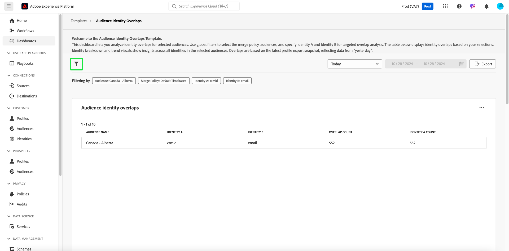
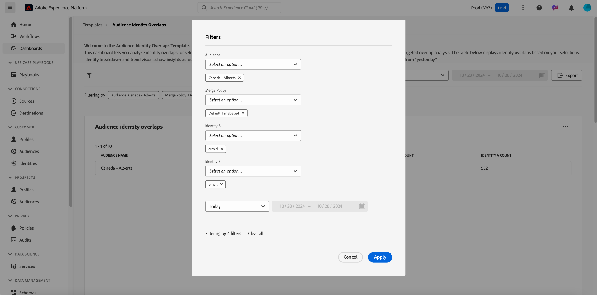
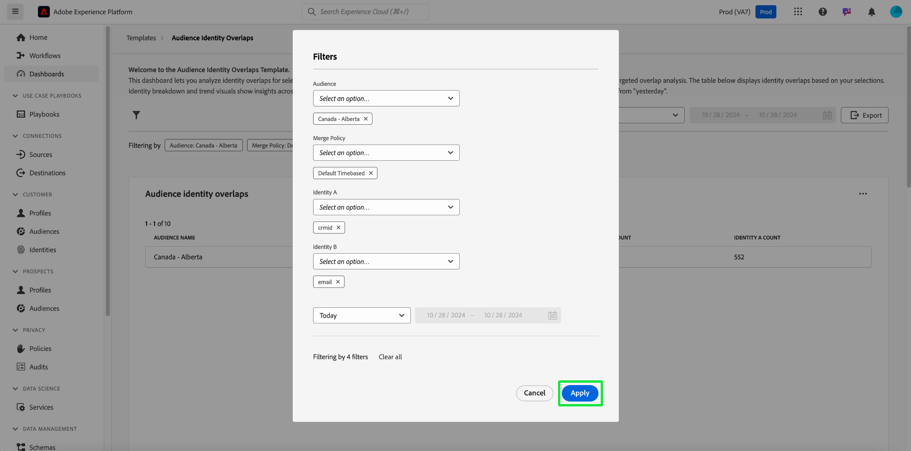
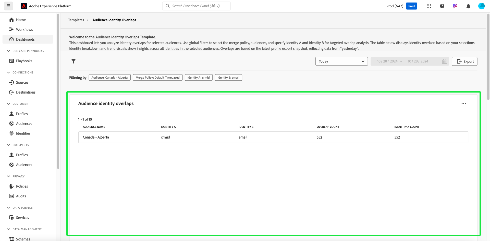
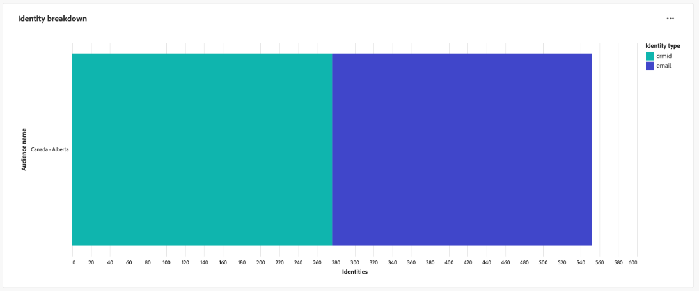
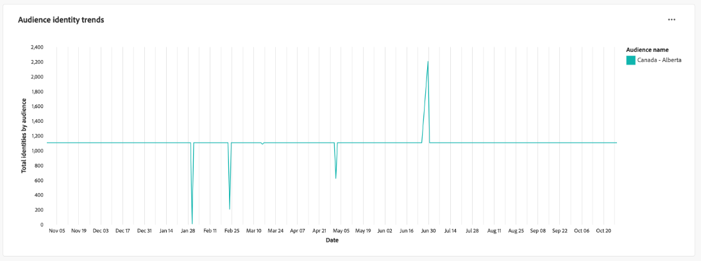
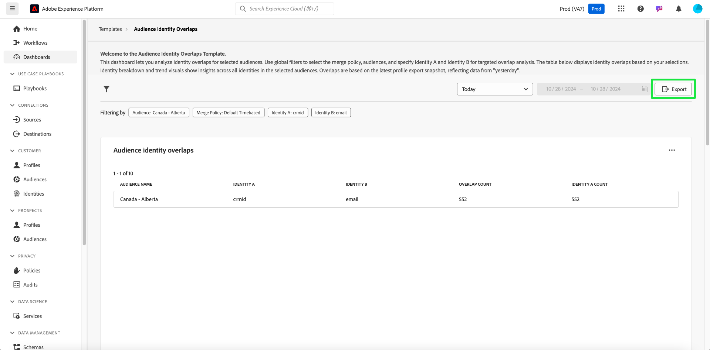

# Chevauchements d’identité d’audience

Analysez les chevauchements d’identités pour les audiences sélectionnées avec le tableau de bord [!UICONTROL Chevauchements d’identités d’audience]. Vous pouvez utiliser des informations sur la manière dont les différentes identités d’une audience sont liées les unes aux autres afin d’optimiser les stratégies d’assemblage, de réduire la redondance et d’améliorer la précision de la segmentation des clients. Développez des stratégies de ciblage efficaces et rationalisez les interactions client en comprenant mieux le chevauchement entre les types d’identité.

## Filtrer des audiences {#filter-audiences}

Utilisez des filtres personnalisés pour une analyse ciblée d’audiences et de types d’identité spécifiques afin de vous assurer que les données présentées s’alignent sur les objectifs de votre analyse. Pour lancer votre analyse, sélectionnez l’icône de filtre ().

La boîte de dialogue **[!UICONTROL Filtres]** s’affiche. Dans cette vue, choisissez les filtres globaux pour configurer votre audience, la politique de fusion et les identités à comparer. Sélectionnez les paramètres à analyser dans le menu déroulant de chaque section

1. Sélectionnez un **[!UICONTROL Audience]** : choisissez le segment d’audience à analyser (par exemple, **Canada - Alberta**).
2. Spécifiez une **[!UICONTROL Politique de fusion]** : définissez la politique de fusion qui détermine la manière dont les identités sont combinées dans l’audience sélectionnée (dans l’exemple de capture d’écran, la politique **basée sur la durée par défaut** est sélectionnée).
3. Sélectionnez une **[!UICONTROL Identité A]** et **[!UICONTROL Identité B]** à comparer **&#x200B; : choisissez les deux types d’identité à comparer. Dans l’exemple, &#x200B;** Identité A **&#x200B; est sélectionné comme « crmId » et &#x200B;** Identité B** est sélectionné comme « e-mail ».
4. **Définir une période** : sélectionnez une période prédéfinie telle que « Aujourd’hui » ou définissez manuellement les dates de début et de fin à l’aide des champs de calendrier.

>[!TIP]
>
>Pour effacer tous vos filtres globaux personnalisés, sélectionnez **[!UICONTROL Effacer tout]** dans la boîte de dialogue [!UICONTROL Filtres]. Pour supprimer un seul filtre, sélectionnez « [!UICONTROL X &#x200B;] » à droite du nom du filtre.

Une fois les filtres sélectionnés, sélectionnez **[!UICONTROL Appliquer]** pour actualiser le tableau de bord.

## Informations disponibles sur le tableau de bord {#available-insights}

Le tableau de bord **Chevauchements d’identités d’audience** fournit plusieurs visualisations et données tabulées pour vous aider à comprendre les chevauchements d’identités et les tendances au sein de votre audience.

### Chevauchements d’identité d’audience {#overlaps-table}

Le tableau **[!UICONTROL Chevauchements d’identités d’audience]** affiche les chevauchements d’identités en fonction des filtres sélectionnés. Utilisez ces informations pour évaluer le chevauchement entre les différents types d’identité et comprendre dans quelle mesure les identités sont résolues efficacement. Le tableau ci-dessous explique chaque colonne en détail :

| Nom de la colonne | Description |
|-----------------|-------------------------------|
| **[!UICONTROL Nom de l’audience]** | Nom de l’audience en cours d’analyse. Cette colonne identifie le segment d’audience en cours de révision afin de s’assurer que les informations sont axées sur le groupe cible prévu. |
| **[!UICONTROL Identité A]** et **[!UICONTROL Identité B]** | Identités comparées (par exemple, `crmId` et `email`). Savoir quels types d’identité sont comparés vous permet d’identifier les stratégies de résolution d’identité qui contribuent au chevauchement des audiences et d’optimiser ces relations. |
| **[!UICONTROL Nombre de chevauchements]** | Nombre de profils où les deux identités sont présentes. Cette mesure fournit des informations sur l’ampleur du chevauchement des identités dans l’audience. Ces informations sont essentielles pour évaluer l’efficacité de la résolution de plusieurs identités en profils unifiés, ce qui peut améliorer les stratégies de ciblage et de personnalisation. |
| **[!UICONTROL Nombre d’identités A]** | Nombre total de profils dans l’audience sélectionnée qui contiennent **Identité A**. Utilisez ces informations pour comprendre la prévalence du type d’identité principale au sein de l’audience et évaluer son rôle dans l’analyse de chevauchement. |

### Répartition des identités {#identity-breakdown}

Le graphique **[!UICONTROL Répartition des identités]** affiche la composition relative des identités au sein de l’audience sélectionnée. L’axe X représente le nombre total d’identités au sein de l’audience sélectionnée, tandis que l’axe Y représente le nom de l’audience en cours d’analyse. Utilisez cette visualisation pour comprendre la prévalence de chaque type d’identité et évaluer l’impact de votre stratégie de gestion des identités. Le graphique permet de différencier les types d’identité à l’aide de couleurs distinctes, ce qui fournit un aperçu rapide de la répartition des identités dans votre audience.

>[!TIP]
>
>Passez la souris sur les colonnes pour afficher le nombre individuel de profils pour chaque type d’identité.

### Tendances d’identité d’audience {#audience-identity-trends}

Le graphique **[!UICONTROL Tendances des identités d’audience]** fournit des informations sur la manière dont le nombre total d’identités a changé au fil du temps. L’axe X représente la période en cours d’analyse, tandis que l’axe Y représente le nombre total d’identités par audience. Utilisez cette mesure pour suivre la croissance des identités, évaluer la stabilité et mesurer l’efficacité des efforts de gestion des identités en cours.

>[!TIP]
>
>Passez la souris sur une date du graphique pour afficher le nombre total d’identités de l’audience à une date spécifique.

## Export Insights {#export-insights}

Une fois l’analyse des chevauchements d’identités terminée, vous pouvez exporter les données pour une analyse ou un compte rendu des performances hors ligne. Pour exporter vos données, sélectionnez **[!UICONTROL Exporter]** en haut à droite du tableau. La boîte de dialogue d’impression de PDF s’affiche, vous permettant d’enregistrer les données visualisées sous forme de PDF ou de les imprimer.

Le tableau de bord **Chevauchements d’identités d’audience** fournit des informations essentielles sur la manière dont les différentes identités se croisent parmi vos audiences sélectionnées. En exploitant ces informations, vous pouvez affiner les stratégies de combinaison d’identités, réduire la redondance et vous assurer que la segmentation de votre audience est plus précise et plus efficace.

## Étapes suivantes

Après lecture de ce document, vous avez appris à obtenir des informations précieuses sur les chevauchements d’identités pour les audiences sélectionnées à l’aide du tableau de bord **Chevauchements d’identités d’audience**. Pour mieux comprendre la segmentation de l’audience et la gestion des identités, explorez d’autres modèles de Distiller de données qui fournissent des informations complètes. Reportez-vous aux guides de l’interface utilisateur [Tendances d’audience](./trends.md), [Comparaison d’audience](./comparison.md) et [Chevauchements d’audience avancés](./overlaps.md) pour continuer à améliorer vos stratégies de ciblage et d’engagement.
