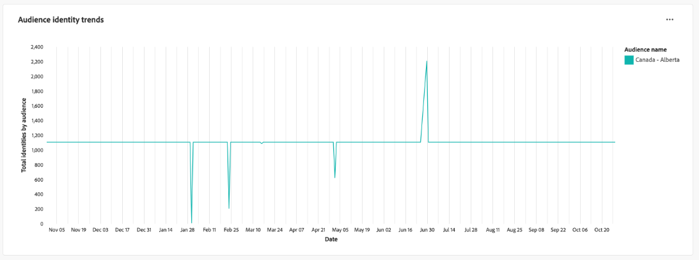
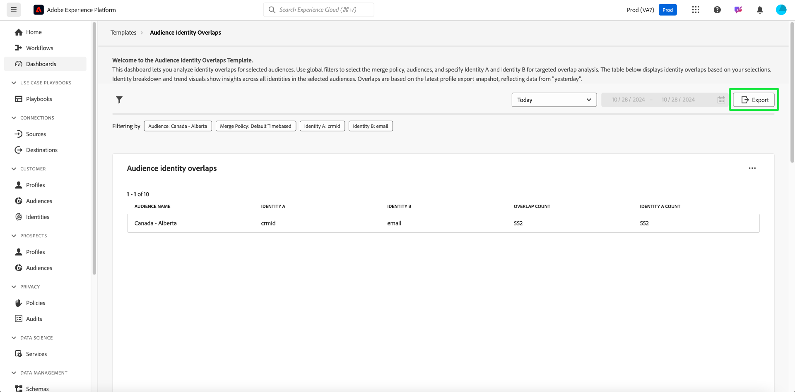

# Chevauchements d’identité d’audience

Analysez les chevauchements d’identités pour les audiences sélectionnées à l’aide du tableau de bord [!UICONTROL &#x200B; Recouvrements d’identités d’audience &#x200B;]. Vous pouvez utiliser des insights sur la manière dont les différentes identités au sein d’une audience sont liées les unes aux autres afin d’optimiser les stratégies de regroupement, de réduire la redondance et d’améliorer la précision de la segmentation des clients. Développer des stratégies de ciblage efficaces et rationaliser les interactions client avec une meilleure compréhension du chevauchement entre les types d’identité.

## Filtrage des audiences {#filter-audiences}

Utilisez des filtres personnalisés pour l’analyse ciblée d’audiences et de types d’identité spécifiques afin de vous assurer que les données présentées correspondent à vos objectifs d’analyse. Pour lancer votre analyse, sélectionnez l’icône de filtre ().

La boîte de dialogue **[!UICONTROL Filtres]** s’affiche. Dans cette vue, sélectionnez les filtres globaux pour configurer votre audience, votre stratégie de fusion et les identités à des fins de comparaison. Sélectionnez vos paramètres d’analyse dans le menu déroulant de chaque section.

1. Sélectionnez une **[!UICONTROL audience]** : sélectionnez le segment d’audience que vous souhaitez analyser (par exemple, **Canada - Alberta**).
2. Spécifiez une **[!UICONTROL stratégie de fusion]** : définissez la stratégie de fusion qui détermine la manière dont les identités sont combinées dans l’audience sélectionnée (dans l’exemple de capture d’écran, la stratégie **basée sur le temps par défaut** est sélectionnée).
3. Sélectionnez une **[!UICONTROL identité A]** et une **[!UICONTROL identité B]** à des fins de comparaison **&#x200B; : sélectionnez les deux types d’identité à comparer. Dans l’exemple, &#x200B;** Identity A **&#x200B; est sélectionné en tant que &quot;crmId&quot; et &#x200B;** Identity B** est sélectionné en tant que &quot;email&quot;.
4. **Définir une plage de dates** : sélectionnez une plage prédéfinie comme &quot;Aujourd’hui&quot; ou définissez manuellement les dates de début et de fin à l’aide des champs du calendrier.

>[!TIP]
>
>Pour effacer tous vos filtres globaux personnalisés, sélectionnez **[!UICONTROL Effacer tout]** dans la boîte de dialogue [!UICONTROL Filtres] . Pour supprimer un seul filtre, sélectionnez &quot;[!UICONTROL X]&quot; à droite du nom du filtre.

Une fois les filtres sélectionnés, sélectionnez **[!UICONTROL Appliquer]** pour actualiser le tableau de bord.

## Aperçu des tableaux de bord disponibles {#available-insights}

Le tableau de bord **Recouvrements d’identité d’audience** fournit plusieurs visualisations et données tabulées pour vous aider à comprendre les chevauchements et les tendances d’identité au sein de votre audience.

### Chevauchements d’identité d’audience {#overlaps-table}

La table **[!UICONTROL Chevauchement d’identité d’audience]** affiche des chevauchements d’identité en fonction des filtres sélectionnés. Utilisez ces informations pour évaluer le chevauchement entre les différents types d’identité et comprendre l’efficacité de la résolution des identités. Le tableau ci-dessous explique en détail chaque colonne :

| Nom de la colonne | Description |
|-----------------|-------------------------------|
| **[!UICONTROL Nom de l’audience]** | Nom de l’audience en cours d’analyse. Cette colonne identifie le segment d’audience en cours de révision afin de s’assurer que les informations sont axées sur le groupe cible prévu. |
| **[!UICONTROL Identité A]** et **[!UICONTROL Identité B]** | Les identités comparées (par exemple, `crmId` et `email`). Connaître les types d’identité comparés permet d’identifier les stratégies de résolution d’identité qui contribuent au chevauchement des audiences et d’optimiser ces relations. |
| **[!UICONTROL Nombre de chevauchements]** | Le nombre de profils où les deux identités sont présentes. Cette mesure fournit des informations sur le degré de chevauchement des identités au sein de l’audience. Ces informations sont essentielles pour évaluer l’efficacité de la résolution de plusieurs identités en profils unifiés, ce qui peut à son tour améliorer les stratégies de ciblage et de personnalisation. |
| **[!UICONTROL Identité A Nombre]** | Le nombre total de profils de l’audience sélectionnée qui contiennent **Identité A**. Utilisez ces informations pour comprendre la prévalence du type d’identité principal au sein de l’audience et évaluer son rôle dans l’analyse du chevauchement. |

### Ventilation des identités {#identity-breakdown}

Le graphique **[!UICONTROL Ventilation des identités]** montre la composition relative des identités au sein de l’audience sélectionnée. L’axe X représente le nombre total d’identités au sein de l’audience sélectionnée, tandis que l’axe Y représente le nom de l’audience analysée. Utilisez cette visualisation pour comprendre la prévalence de chaque type d’identité et évaluer l’impact de votre stratégie de gestion des identités. Le graphique fait la distinction entre les types d’identité à l’aide de couleurs distinctes, ce qui vous permet d’obtenir un aperçu rapide de la manière dont les identités sont réparties dans votre audience.

>[!TIP]
>
>Passez la souris sur les colonnes pour afficher le nombre individuel de profils pour chaque type d’identité.

### Tendances d’identité d’audience {#audience-identity-trends}

Le graphique **[!UICONTROL Tendances d’identités d’audience]** fournit des insights sur l’évolution du nombre total d’identités au fil du temps. L’axe X représente la période analysée, tandis que l’axe Y représente le nombre total d’identités par audience. Utilisez cette mesure pour suivre la croissance des identités, évaluer la stabilité et mesurer l’efficacité des efforts constants de gestion de l’identité.

>[!TIP]
>
>Passez la souris sur une date du graphique pour afficher le nombre total d’identités de l’audience à une date spécifique.

## Informations sur l’exportation {#export-insights}

Après avoir analysé les chevauchements d’identités, vous pouvez exporter les données pour une analyse hors ligne ou un compte rendu des performances. Pour exporter vos données, sélectionnez **[!UICONTROL Export]** en haut à droite du tableau. La boîte de dialogue Imprimer le PDF s’affiche, vous permettant d’enregistrer les données visualisées en tant que PDF ou de les imprimer.

Le tableau de bord **Recouvrements d’identités d’audience** fournit des informations essentielles sur la manière dont les différentes identités se croisent entre les audiences sélectionnées. En exploitant ces informations, vous pouvez affiner les stratégies de combinaison d’identités, réduire la redondance et vous assurer que la segmentation de votre audience est plus précise et plus efficace.

## Étapes suivantes

Après avoir lu ce document, vous avez appris à obtenir des informations précieuses sur les chevauchements d’identités pour les audiences sélectionnées à l’aide du tableau de bord **Chevauchement d’identité d’audience**. Pour mieux comprendre la segmentation de l’audience et la gestion des identités, explorez d’autres modèles de Distiller de données qui fournissent des informations complètes. Pour continuer à améliorer vos stratégies de ciblage et d’engagement, reportez-vous aux guides suivants : [Tendances d’audience](./trends.md), [Comparaison d’audience](./comparison.md) et [Chevauchement d’audience avancé](./overlaps.md).

