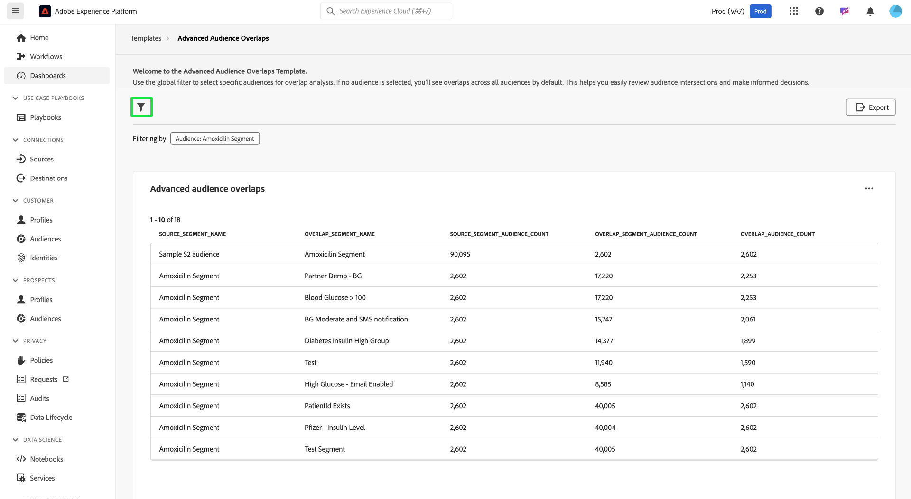

# Chevauchements avancés des audiences

Obtenez des informations précieuses pour optimiser la segmentation et les stratégies de ciblage de votre audience en analysant la manière dont les différents segments d’audience intersectent avec le tableau de bord [!UICONTROL  Recouvrements d’audience avancés]. Examinez les mesures tabulées pour identifier les chevauchements, affiner la segmentation et réduire les messages redondants. En fin de compte, vous pouvez utiliser ces informations pour créer des campagnes plus ciblées et des efforts marketing efficaces. Ce tableau de bord vous permet de passer en revue les intersections d’audience, d’appliquer des filtres et d’effectuer une analyse détaillée des chevauchements afin de prendre des décisions basées sur les données et d’améliorer les résultats de l’engagement.

## Filtrage des audiences {#filter-audiences}

Pour filtrer des audiences spécifiques pour l’analyse du chevauchement, sélectionnez l’icône de filtre () pour ouvrir la boîte de dialogue [!UICONTROL Filter]. À partir de là, vous pouvez ajouter ou supprimer des audiences du modèle de chevauchement pour affiner votre analyse.

La boîte de dialogue [!UICONTROL Filtres] s’affiche. Pour choisir une audience pour l’analyse du chevauchement, sélectionnez un nom d’audience dans la liste déroulante **[!UICONTROL Audience]**. Le nom de toute audience que vous ajoutez s’affiche avec une balise sous la liste déroulante. Une fois ajoutées, vous pouvez sélectionner le &quot;X&quot; en fonction de son nom pour le supprimer. Pour supprimer tous les filtres appliqués, sélectionnez **[!UICONTROL Effacer tout]**.

## Filtres appliqués {#applied-filters}

Une fois qu’un filtre est appliqué ([!UICONTROL Segment Amoxicilin] dans l’exemple de capture d’écran), les données d’audience affichées sont réduites. Toutes les audiences supplémentaires que vous choisissez d’ajouter s’affichent en regard de la balise [!UICONTROL Filtrage par] au-dessus du graphique [!UICONTROL Chevauchement d’audience avancé].

## Tableau de chevauchement des audiences avancé {#advanced-audience-overlaps-table}

La section principale du tableau de bord affiche la table [!UICONTROL Chevauchement d’audience avancé], qui fournit une comparaison détaillée des chevauchements d’audience entre différents segments. Les colonnes du tableau sont les suivantes :

| Nom de la colonne | Description |
|------------------------------------|----------------------------------------------------------------------------------------------|
| **[!UICONTROL Source_Segment_Name]** | L’audience d’origine en cours d’analyse (par exemple, &quot;Segment Amoxicilin&quot;). |
| **[!UICONTROL Overlap_Segment_Name]** | Audience dont les recouvrements sont comparés à (par exemple, &quot;Glucide de sang > 100&quot;). |
| **[!UICONTROL Source_Segment_Audience_Count]** | Le nombre total de profils de l’audience source. |
| **[!UICONTROL Overlap_Segment_Audience_Count]** | Taille de l’audience qui se chevauche, qui varie selon le chevauchement. |
| **[!UICONTROL Overlap_Audience_Count]** | Taille de l’audience qui se chevauchent réellement entre les audiences source et de chevauchement. |

{style="table-layout:auto"}

## Informations sur l’exportation {#export-insights}

Une fois les audiences filtrées et analysées, vous pouvez exporter les données à des fins d’analyse hors ligne ou de création de rapports supplémentaires. Pour exporter vos insights, sélectionnez **[!UICONTROL Exporter]** en haut à droite du tableau. La boîte de dialogue Imprimer le PDF s’affiche, vous permettant d’enregistrer les données en tant que PDF ou de les imprimer.

Pour revenir à la présentation [!UICONTROL Template], sélectionnez **[!UICONTROL Templates]**.

## Étapes suivantes

Après avoir lu ce document, vous avez appris à analyser les intersections d’audience et à prendre des décisions pilotées par les données à l’aide du tableau de bord **[!UICONTROL Recouvrements d’audience avancés]**. Pour optimiser davantage la segmentation de votre audience et vos stratégies de ciblage, explorez d’autres modèles de Data Distiller qui fournissent des informations précieuses. Reportez-vous aux [Tendances de l’audience](./trends.md), [Comparaison de l’audience](./comparison.md) et aux [chevauchement des identités d’audience](./identity-overlaps.md) des guides de l’interface utilisateur pour continuer à améliorer l’engagement de l’audience et les efforts de segmentation.

