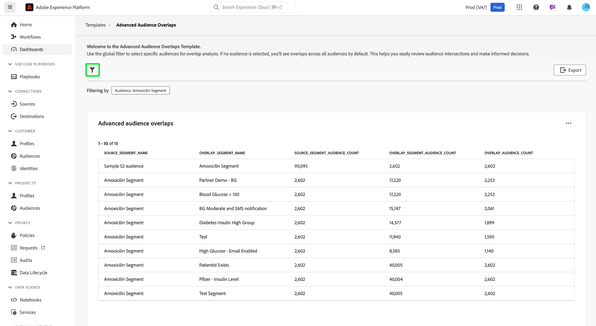
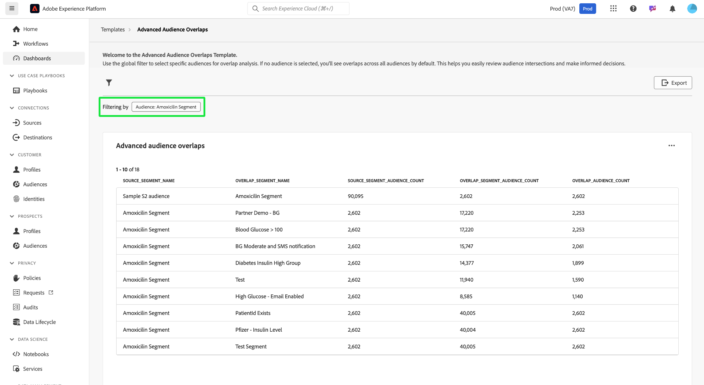
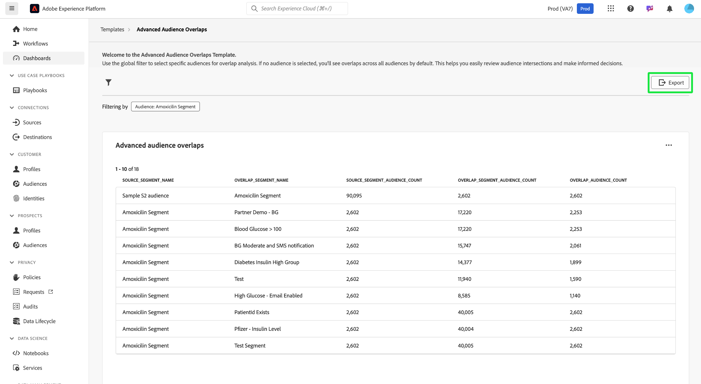
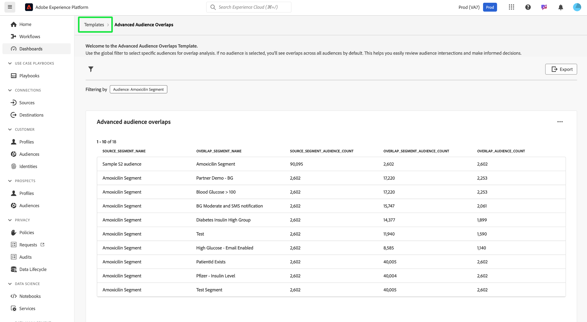

# Chevauchements avancés des audiences

Obtenez des informations précieuses pour optimiser vos stratégies de ciblage et de segmentation d’audience en analysant la manière dont différents segments d’audience interagissent avec le tableau de bord [!UICONTROL Advanced Audience Overlaps]. Examinez les mesures tabulées pour identifier les chevauchements, affiner la segmentation et réduire les messages redondants. En fin de compte, vous pouvez utiliser ces informations pour créer des campagnes plus ciblées et des efforts marketing efficaces. Sur ce tableau de bord, vous pouvez examiner les intersections des audiences, appliquer des filtres et effectuer une analyse de chevauchement détaillée pour prendre des décisions basées sur les données et améliorer les résultats d’engagement.

## Filtrer les audiences {#filter-audiences}

Pour filtrer des audiences spécifiques pour l’analyse de chevauchement, sélectionnez l’icône de filtre () pour ouvrir la boîte de dialogue [!UICONTROL Filter]. À partir de là, vous pouvez ajouter ou supprimer des audiences du modèle de chevauchement pour affiner votre analyse.

La boîte de dialogue [!UICONTROL Filters] s’affiche. Pour choisir une audience pour l’analyse de chevauchement, sélectionnez un nom d’audience dans la liste déroulante **[!UICONTROL Audience]** . Le nom de toute audience que vous ajoutez s’affiche avec une balise sous la liste déroulante. Une fois ajoutés, vous pouvez sélectionner les « X » par leur nom pour les supprimer. Pour supprimer tous les filtres appliqués, sélectionnez **[!UICONTROL Clear all]**.

## Filtres appliqués {#applied-filters}

Une fois un filtre appliqué ([!UICONTROL Amoxicilin Segment] dans l’exemple de capture d’écran), les données d’audience affichées sont réduites. Toutes les audiences supplémentaires que vous choisissez d’ajouter sont affichées à côté de la balise [!UICONTROL Filtering by] au-dessus du graphique [!UICONTROL Advanced Audience overlaps].

## Tableau Avancé De Chevauchements D’Audiences {#advanced-audience-overlaps-table}

La section principale du tableau de bord affiche le tableau de [!UICONTROL Advanced Audience Overlaps], qui fournit une comparaison détaillée des chevauchements d’audiences entre différents segments. Les colonnes du tableau sont les suivantes :

| Nom de la colonne | Description |
|------------------------------------|----------------------------------------------------------------------------------------------|
| **[!UICONTROL Source_Segment_Name]** | L’audience originale en cours d’analyse (par exemple, « Segment Amoxicilline »). |
| **[!UICONTROL Overlap_Segment_Name]** | Audience dont les chevauchements sont comparés à (par exemple, « Glucose sanguin > 100 »). |
| **[!UICONTROL Source_Segment_Audience_Count]** | Nombre total de profils de l’audience source. |
| **[!UICONTROL Overlap_Segment_Audience_Count]** | Taille de l’audience qui se chevauche, qui varie en fonction du chevauchement. |
| **[!UICONTROL Overlap_Audience_Count]** | Taille de l’audience qui se chevauche réellement entre l’audience source et l’audience qui se chevauche. |

{style="table-layout:auto"}

## Export Insights {#export-insights}

Une fois les audiences filtrées et analysées, vous pouvez exporter les données à des fins d’analyse hors ligne ou de création de rapports. Pour exporter vos informations, sélectionnez **[!UICONTROL Export]** en haut à droite du tableau. La boîte de dialogue d’impression de PDF s’affiche, vous permettant d’enregistrer les données en tant que PDF ou de les imprimer.

Pour revenir à l’aperçu de la [!UICONTROL Template], sélectionnez **[!UICONTROL Templates]**.

## Étapes suivantes

Vous êtes arrivé au bout de ce document. À présent, vous savez comment analyser les intersections d’audience et prendre des décisions basées sur les données à l’aide du tableau de bord **[!UICONTROL Advanced Audience Overlaps]**. Pour optimiser davantage vos stratégies de ciblage et de segmentation d’audience, explorez d’autres modèles de Distiller de données qui fournissent des informations précieuses. Consultez les guides [Tendances d’audience](./trends.md), [Comparaison d’audience](./comparison.md) et [Chevauchements d’identités d’audience](./identity-overlaps.md) de l’interface utilisateur pour continuer à améliorer l’engagement de votre audience et vos efforts de segmentation.
