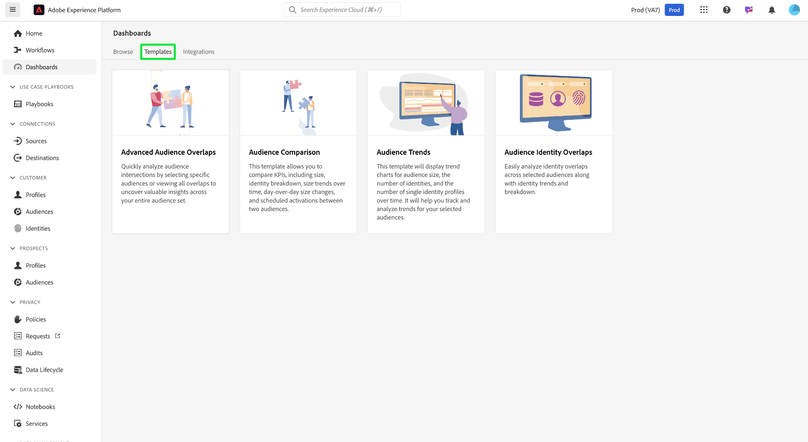

# Modèles de Data Distiller

>[!AVAILABILITY]
>
>Les modèles de Distiller de données sont exclusifs aux utilisateurs qui ont acheté le SKU de Distiller de données. Contactez votre représentant ou représentante Adobe pour plus d’informations.

Les **[!UICONTROL modèles de Distiller de données]** fournissent un ensemble de tableaux de bord puissants conçus pour vous aider à obtenir des informations sur vos données d’audience. Pour vous aider à prendre des décisions basées sur les données et à améliorer les stratégies de ciblage, chaque modèle propose un guide structuré pour analyser les aspects spécifiques du comportement de l’audience, de la segmentation et de la gestion des identités.

Ces modèles garantissent la cohérence et l’efficacité de vos workflows d’analyse en offrant des informations exploitables qui vous aident à affiner la segmentation, à réduire la redondance et à améliorer l’engagement. Que vous souhaitiez suivre les tendances d’audience, comparer des groupes d’audience ou analyser les chevauchements d’identités, les modèles de Distiller de données fournissent les outils nécessaires pour mieux comprendre votre audience et mener des campagnes marketing efficaces.

Pour commencer, sélectionnez l’onglet **[!UICONTROL Modèles]** dans l’espace de travail [!UICONTROL Tableaux de bord] Service et choisissez une carte de modèle dans la liste disponible.

## Modèles disponibles {#available-templates}

Les modèles actuellement disponibles dans l’espace de travail [!UICONTROL Tableaux de bord] sont les suivants :

### Chevauchements avancés des audiences {#advanced-audience-overlaps}

Utilisez le tableau de bord [!UICONTROL Chevauchements d’audience avancés] pour analyser rapidement les intersections d’audience pour des audiences spécifiques ou afficher tous les chevauchements afin de découvrir des informations précieuses sur l’ensemble de votre jeu d’audiences. Utilisez ces informations pour affiner la segmentation, réduire les messages redondants et créer des campagnes plus ciblées pour une meilleure efficacité marketing.

### Comparaison des audiences {#audience-comparison}

Le tableau de bord [!UICONTROL Comparaison des audiences] vous permet de comparer côte à côte les mesures clés entre deux groupes d’audiences. Utilisez ce tableau de bord pour analyser les KPI importants, tels que la taille de l’audience, la répartition des identités et les modifications de la taille de l’audience au fil du temps. Ces informations vous aident à prendre des décisions éclairées sur la segmentation de l’audience et à améliorer les stratégies de ciblage.

### Tendances des audiences {#audience-trends}

Utilisez le tableau de bord [!UICONTROL Tendances d’audience] pour analyser les mesures d’audience au fil du temps. Visualisez les tendances en fonction de la taille de l’audience, du nombre d’identités et du nombre de profils d’identité uniques afin de surveiller l’évolution de l’audience, de mesurer la croissance et d’affiner efficacement les stratégies d’engagement.

### Chevauchements d’identité d’audience {#audience-identity-overlaps}

Utilisez le tableau de bord [!UICONTROL Chevauchements d’identités d’audience] pour analyser les chevauchements d’identités dans les audiences sélectionnées. Consultez les tendances et répartitions des identités pour comprendre comment les différents types d’identité sont liés, ce qui améliore la combinaison d’identités et la précision de la segmentation client.

## Étapes suivantes

Vous êtes arrivé au bout de ce document. À présent, vous en savez plus sur les quatre modèles de Distiller de données disponibles dans l’espace de travail Tableaux de bord et sur la manière dont ils vous aident à analyser les données d’audience pour une meilleure prise de décision. Ces modèles fournissent des outils pour comprendre les intersections des audiences, comparer des mesures, suivre les tendances et analyser les chevauchements d’identités afin d’affiner la segmentation, réduire la redondance et améliorer l’engagement.

Pour plus d’informations sur chaque modèle, reportez-vous aux guides respectifs pour [chevauchements d’audiences avancés](./overlaps.md), [comparaison d’audiences](./comparison.md), [tendances d’audience](./trends.md) et [chevauchements d’identités d’audience](./identity-overlaps.md).
