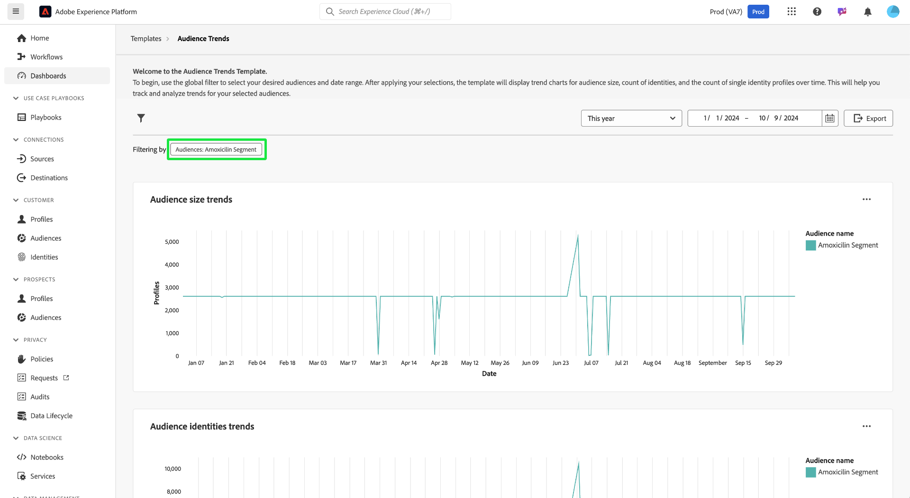

# Tendances des audiences

Analysez l’évolution de vos audiences au fil du temps à l’aide de visualisations des mesures d’audience clés sur le tableau de bord [!UICONTROL Tendances de l’audience]. Ce tableau de bord vous permet de suivre les tendances telles que la croissance de l’audience, le nombre d’identités et le nombre de profils d’identité uniques, et vous permet de prendre des décisions basées sur les données. En analysant ces mesures, les marketeurs peuvent optimiser les stratégies de ciblage, améliorer l’engagement de l’audience et affiner leurs efforts de segmentation pour des campagnes plus efficaces.

## Filtrage des audiences {#filter-audiences}

Pour lancer votre analyse, utilisez le filtre global afin de sélectionner les audiences spécifiques et la période que vous souhaitez analyser. Sélectionnez l’icône de filtre () pour ouvrir la boîte de dialogue **[!UICONTROL Filter]**, dans laquelle vous pouvez :

1. **Sélectionner une audience** : sélectionnez l’audience que vous souhaitez analyser (dans l’exemple de capture d’écran, l’audience **Amoxicillin** a été sélectionnée).
1. **Définir une plage de dates** : sélectionnez une plage prédéfinie dans le menu déroulant ou sélectionnez manuellement les dates de début et de fin à l’aide des champs du calendrier.

Après avoir défini vos filtres, sélectionnez **[!UICONTROL Appliquer]** pour mettre à jour le tableau de bord. Les filtres que vous choisissez sont appliqués et des informations ciblées sur les audiences sélectionnées au cours d’une période donnée s’affichent. Vos filtres personnalisés garantissent que les données sont pertinentes pour vos objectifs d’analyse.

## Graphiques de tendances d’audience disponibles {#available-charts}

Il existe trois graphiques principaux pour vous aider à comprendre les mesures d’audience au fil du temps. Pour chaque graphique, vous pouvez sélectionner l’ellipse (`...`) en haut à droite, suivie de l’option [!UICONTROL &#x200B; Afficher plus] pour afficher une forme tabulée des résultats, ou télécharger les données sous forme de fichier CSV à afficher dans une feuille de calcul. Pour plus d&#39;informations, consultez le [guide d&#39;affichage supplémentaire](../view-more.md).

>[!TIP]
>
>Vous pouvez pointer sur une date spécifique d’un graphique pour afficher le nombre de profils individuels dans une boîte de dialogue.

### Tendances de la taille de l’audience {#audience-size-trends}

Le graphique **[!UICONTROL Tendances de la taille de l’audience]** montre le nombre de profils au sein de l’audience sélectionnée au fil du temps. Il permet de suivre la croissance ou la réduction des audiences. Vous pouvez utiliser ce graphique pour surveiller l’efficacité de l’engagement et comprendre les changements de taille de l’audience.

### Tendances des identités d’audience {#audience-identities-trends}

Le graphique **[!UICONTROL Tendances des identités d’audience]** fournit des insights sur le nombre total d’identités dans le segment d’audience. Utilisez ce graphique pour comprendre comment les identités uniques contribuent à la taille globale de l’audience. Elle indique la stabilité et l’engagement de l’audience.

### Tendances de la taille d’audience d’identité unique {#single-identity-audience-size-trends}

Le graphique **[!UICONTROL Tendances de taille d’audience d’identité unique]** indique le nombre de membres d’audience avec une seule identité. Cette mesure s’avère utile pour comprendre la composition de votre audience, en particulier en termes d’unicité identitaire, et permet d’évaluer l’efficacité des efforts de combinaison d’identités.

## Informations sur l’exportation {#export-insights}

Après avoir analysé les mesures et appliqué les filtres appropriés, vous pouvez exporter les données à d’autres fins d’analyse hors ligne ou de création de rapports. Pour ce faire, sélectionnez **[!UICONTROL Export]** en haut à droite du tableau. La boîte de dialogue Imprimer le PDF s’affiche. À partir de cette boîte de dialogue, vous pouvez enregistrer les données visualisées en tant que PDF ou les imprimer.

## Étapes suivantes

Après avoir lu ce document, vous avez appris à obtenir des informations précieuses sur le comportement des audiences au fil du temps à partir du tableau de bord **Tendances d’audience**. Pour en savoir plus sur d’autres modèles de Distiller de données qui peuvent vous aider à prendre des décisions éclairées, à optimiser la segmentation et à améliorer les stratégies d’engagement, reportez-vous aux [Comparaison d’audience](./comparison.md), [Chevauchement d’identité d’audience](./identity-overlaps.md) et aux [Chevauchement d’audience avancé](./overlaps.md) des guides de l’interface utilisateur.
