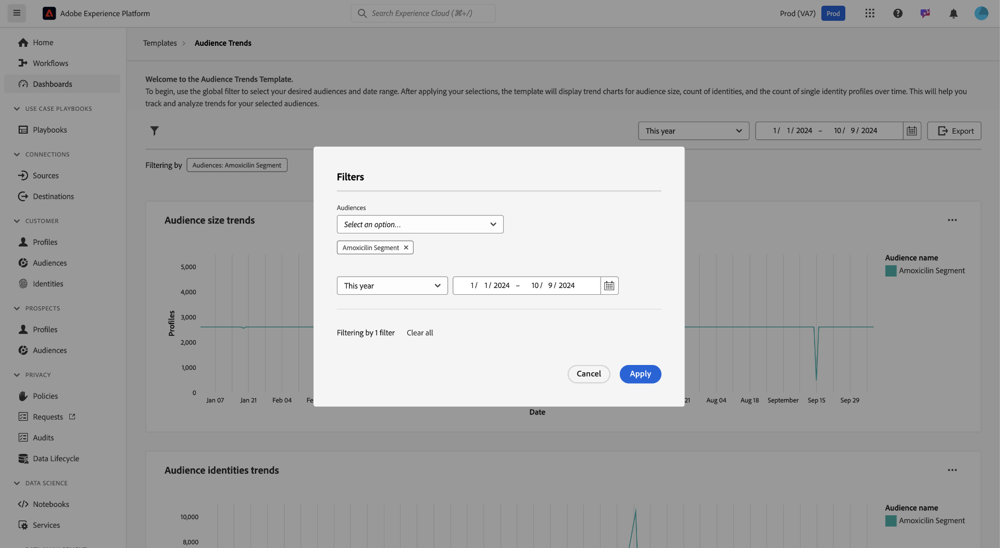
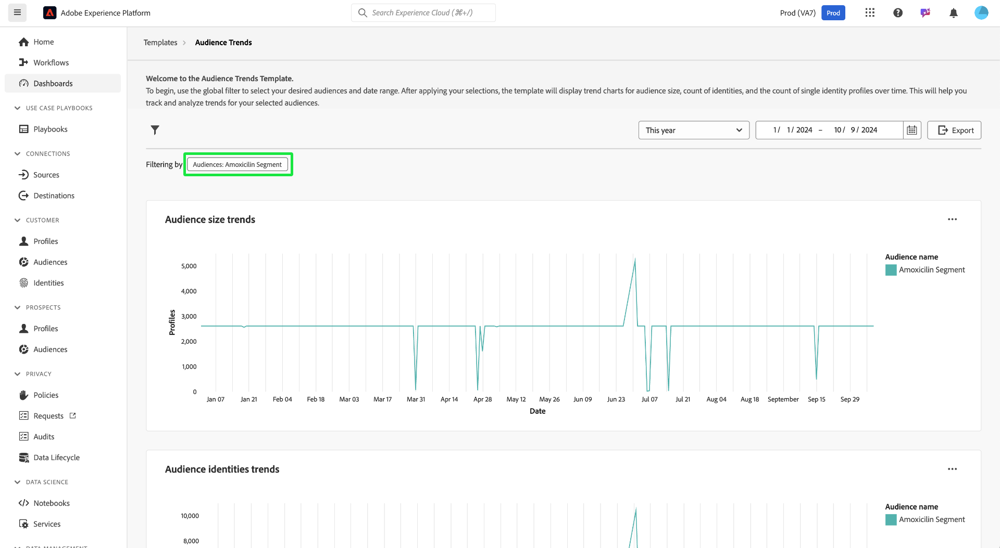
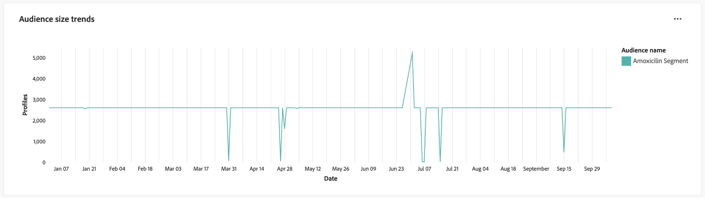
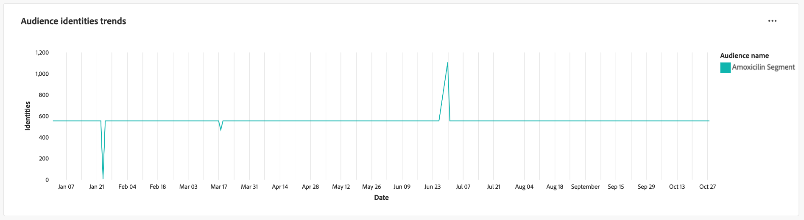
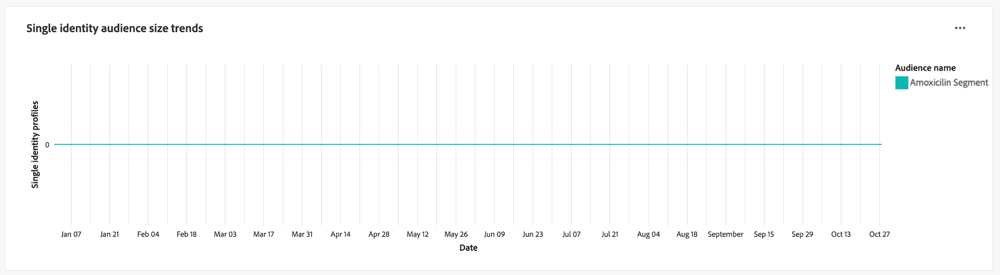
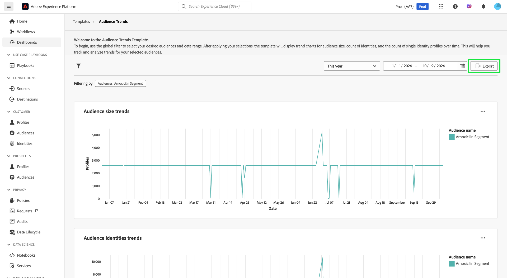

# Tendances des audiences

Analysez l’évolution de vos audiences au fil du temps avec des visualisations des mesures d’audience clés sur le tableau de bord [!UICONTROL Audience Trends]. Ce tableau de bord vous aide à suivre les tendances telles que la croissance de l’audience, le nombre d’identités et le nombre de profils d’identité uniques, et vous permet de prendre des décisions pilotées par les données. En analysant ces mesures, les spécialistes marketing peuvent optimiser les stratégies de ciblage, améliorer l’engagement de l’audience et affiner leurs efforts de segmentation pour rendre les campagnes plus efficaces.

## Filtrer des audiences {#filter-audiences}

Pour commencer votre analyse, utilisez le filtre global pour sélectionner les audiences spécifiques et la période que vous souhaitez analyser. Sélectionnez l’icône de filtre (). pour ouvrir la boîte de dialogue **[!UICONTROL Filter]**, où vous pouvez :

1. **Sélectionner une audience** : choisissez l&#39;audience que vous souhaitez analyser (dans l&#39;exemple de capture d&#39;écran, l&#39;audience **Amoxicillin** a été sélectionnée).
1. **Définir une période** : sélectionnez une période prédéfinie dans le menu déroulant ou sélectionnez manuellement les dates de début et de fin à l’aide des champs de calendrier.

Une fois vos filtres définis, sélectionnez **[!UICONTROL Apply]** pour mettre à jour le tableau de bord. Les filtres que vous avez choisis sont appliqués et des informations ciblées sur les audiences sélectionnées au cours d’une période donnée s’affichent. Vos filtres personnalisés garantissent que les données sont pertinentes par rapport aux objectifs de votre analyse.

## Graphiques de tendance d’audience disponibles {#available-charts}

Il existe trois graphiques principaux pour vous aider à comprendre les mesures d’audience au fil du temps. Pour chaque graphique, vous pouvez sélectionner l’ellipse (`...`) en haut à droite, suivie de [!UICONTROL View more] pour afficher un formulaire tabulé des résultats ou télécharger les données sous la forme d’un fichier CSV à afficher dans une feuille de calcul. Pour plus d’informations, consultez le guide [Afficher plus](../view-more.md).

>[!TIP]
>
>Vous pouvez pointer sur une date spécifique dans n’importe quel graphique pour afficher le nombre de profils individuels dans une boîte de dialogue.

### Tendances de la taille de l’audience {#audience-size-trends}

Le graphique **[!UICONTROL Audience size trends]** affiche le nombre de profils au sein de l’audience sélectionnée au fil du temps. Cela permet de suivre la croissance ou la réduction de l’audience. Vous pouvez utiliser ce graphique pour surveiller l’efficacité de l’engagement et comprendre les modifications de la taille de l’audience.

### Tendances des identités d’audience {#audience-identities-trends}

Le graphique **[!UICONTROL Audience identities trends]** fournit des informations sur le nombre total d’identités dans le segment d’audience. Utilisez ce graphique pour comprendre comment les identités uniques contribuent à la taille globale de l’audience. Cela fournit une indication de la stabilité et de l’engagement de l’audience.

### Tendances De Taille D’Audience D’Identité Unique {#single-identity-audience-size-trends}

Le graphique **[!UICONTROL Single identity audience size trends]** indique le nombre de membres de l’audience ne disposant que d’une seule identité. Cette mesure est utile pour comprendre la composition de votre audience, en particulier en termes d’unicité des identités, et permet d’évaluer l’efficacité des efforts de combinaison d’identités.

## Export Insights {#export-insights}

Après avoir analysé les mesures et appliqué les filtres pertinents, vous pouvez exporter les données à des fins d’analyse hors ligne ou de création de rapports supplémentaires. Pour ce faire, sélectionnez **[!UICONTROL Export]** en haut à droite du tableau. La boîte de dialogue d’impression de PDF s’affiche. Dans cette boîte de dialogue, vous pouvez enregistrer les données visualisées sous la forme d’un PDF ou les imprimer.

## Étapes suivantes

Après lecture de ce document, vous avez appris à obtenir des informations précieuses sur le comportement de l’audience au fil du temps à partir du tableau de bord **Tendances de l’audience**. Pour en savoir plus sur les autres modèles de Distiller de données qui peuvent vous aider à prendre des décisions éclairées, à optimiser la segmentation et à améliorer les stratégies d’engagement, reportez-vous aux guides d’interface utilisateur [Comparaison d’audiences](./comparison.md), [Chevauchements d’identités d’audience](./identity-overlaps.md) et [Chevauchements d’audience avancés](./overlaps.md).
