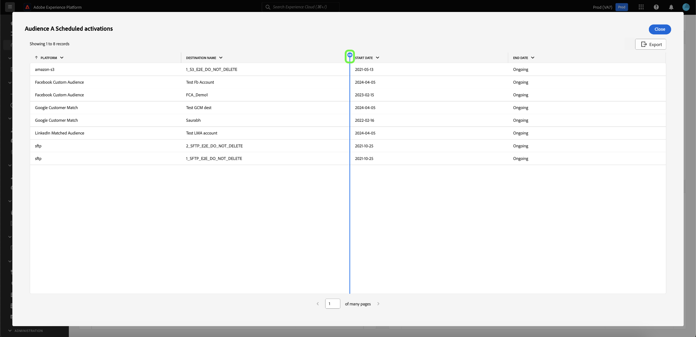

# Afficher plus {#view-more}

Une fois que vous avez créé un [aperçu personnalisé](./overview.md) avec le [ mode de requête pro ](./overview.md#query-pro-mode), vous pouvez afficher vos données de graphique dans différents formats. Vous pouvez afficher une forme de tableau des résultats ou télécharger les données sous la forme d’un fichier CSV à afficher dans une feuille de calcul.

## Résultats tabulés {#tabulated-results}

Pour chaque graphique créé en mode de requête pro via SQL, vous pouvez visualiser les résultats tabulés de votre analyse dans l’interface utilisateur de l’Experience Platform.

Dans votre tableau de bord personnalisé, sélectionnez les ellipses (`...`) de n’importe quel widget pour accéder aux options [!UICONTROL Afficher plus] et [!UICONTROL Afficher SQL] .

## Télécharger le fichier CSV {#download-csv}

La fonction [!UICONTROL Afficher plus] affiche sous forme tabulaire les points de données spécifiques du graphique. Pour simplifier le processus de partage et de manipulation des données, vous pouvez télécharger les données traitées au format CSV à partir de cette boîte de dialogue. Sélectionnez **[!UICONTROL Télécharger CSV]** pour télécharger vos données.

>[!NOTE]
>
>Le téléchargement CSV est limité aux 500 premiers enregistrements.

## Tri par colonne {#sort-column}

Lors de l’affichage des résultats tabulés, vous pouvez utiliser la fonctionnalité de tri pour trier par colonne dans l’ordre croissant ou décroissant. Dans votre tableau de bord personnalisé, sélectionnez les ellipses (`...`) sur n’importe quelle table pour accéder à l’option [!UICONTROL Afficher plus] .

Vous pouvez trier les colonnes en sélectionnant le menu déroulant en regard de leur nom, puis en sélectionnant **[!UICONTROL Tri croissant]** ou **[!UICONTROL Tri décroissant]**.

>[!NOTE]
>
>Les options [!UICONTROL Tri croissant] et [!UICONTROL Tri décroissant] s’affichent uniquement pour les colonnes qui ont été configurées avec la [fonctionnalité de tri](./overview.md#advanced-attributes).

## Redimensionner une colonne {#resize-column}

Vous pouvez redimensionner les colonnes dans les résultats tabulés afin d’améliorer la lisibilité des données. Dans votre tableau de bord personnalisé, sélectionnez les ellipses (`...`) de votre table pour accéder à l’option [!UICONTROL Afficher plus] . Utilisez le menu déroulant en regard du nom de la colonne pour la redimensionner, puis sélectionnez **[!UICONTROL Redimensionner la colonne]**.

Sélectionnez le curseur et faites-le glisser vers la gauche ou la droite pour ajuster la taille de la colonne selon les besoins.

## Pagination des tableaux {#table-pagination}

La pagination est automatiquement appliquée à vos tables dans la fonction [!UICONTROL Afficher plus], ce qui évite d’avoir à modifier manuellement vos requêtes SQL. Cette fonctionnalité garantit que vos données sont présentées dans un format plus gérable, ce qui facilite le processus de navigation dans les jeux de données volumineux.

Vous pouvez afficher jusqu’à 500 enregistrements par page. Pour parcourir les enregistrements, utilisez le **[!UICONTROL >]** situé au bas de la page.

## Étapes suivantes

Après avoir lu ce document, vous savez maintenant comment afficher les résultats tabulés de l’analyse SQL de votre graphique personnalisé et télécharger les données sous forme de fichier CSV. Consultez le document d’affichage SQL pour savoir comment [afficher le code SQL derrière vos insights personnalisés](./view-sql.md).

Vous pouvez également apprendre à générer des graphiques à partir de modèles de données existants dans l’interface utilisateur de Adobe Experience Platform avec le [guide de mode de conception guidé](../standard-dashboards.md).
