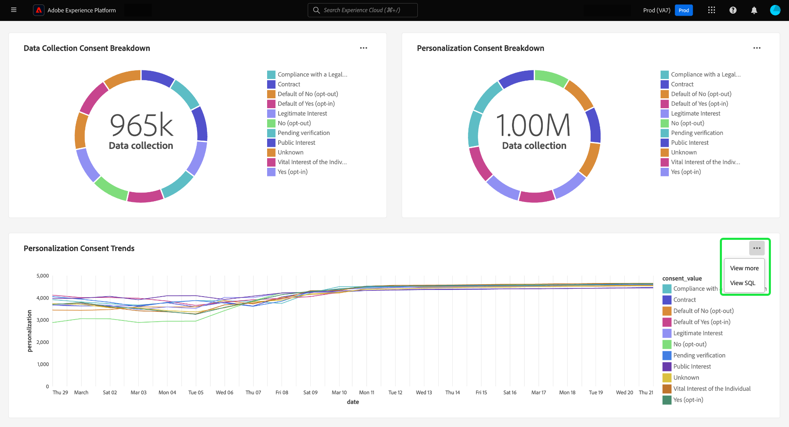
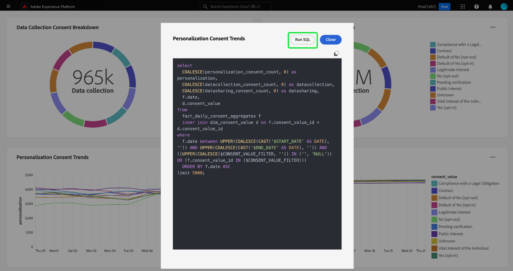
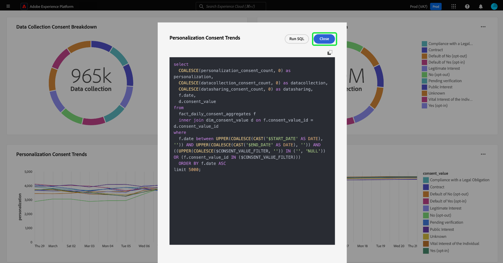

# Afficher le SQL {#view-sql}

Une fois que vous avez créé un insight personnalisé[&#128279;](./overview.md) avec [query pro mode](./overview.md#query-pro-mode), vous pouvez afficher le code SQL qui renseigne vos graphiques avec la fonctionnalité d’affichage du code SQL.

Dans votre tableau de bord personnalisé, sélectionnez les points de suspension (`...`) de n’importe quel widget pour accéder aux options [!UICONTROL Afficher plus] et [!UICONTROL Afficher SQL].

Pour afficher le code SQL derrière vos informations personnalisées, sélectionnez l’option **[!UICONTROL Afficher le code SQL]**. La boîte de dialogue est intitulée avec le nom de l’insight. Depuis cette vue, vous pouvez copier le code SQL dans le presse-papiers afin de l’utiliser comme base pour la création future de graphiques en mode query pro ou ouvrir le code SQL directement dans Query Editor. Sélectionnez **[!UICONTROL Exécuter SQL]** pour ouvrir la requête dans Query Editor.

Sélectionnez **[!UICONTROL Fermer]** pour fermer la boîte de dialogue.

## Étapes suivantes

Vous êtes arrivé au bout de ce document. À présent, vous savez comment afficher le code SQL derrière vos informations personnalisées. Consultez le document Afficher plus pour savoir comment [comparer votre graphique personnalisé aux résultats tabulés de votre analyse SQL](./view-more.md).

Vous pouvez également apprendre à générer des graphiques à partir de modèles de données existants dans l’interface utilisateur de Adobe Experience Platform à l’aide du [&#x200B; guide du mode de conception guidé &#x200B;](../standard-dashboards.md).
