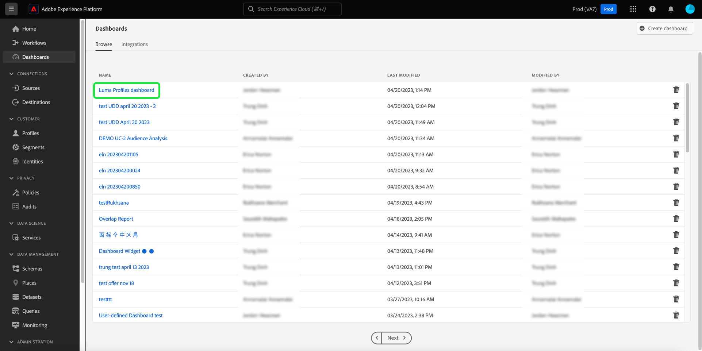

# Tableaux de bord standard

Utilisez les tableaux de bord Adobe Experience Platform pour accélérer les informations et personnaliser la visualisation grâce à la fonctionnalité Tableaux de bord . Utilisez cette fonctionnalité pour créer et gérer des tableaux de bord personnalisés dans lesquels vous pouvez créer, ajouter et modifier des widgets personnalisés afin de visualiser les mesures clés pertinentes pour votre organisation.

<!-- Getting started / permissions section commented out for Beta. This will be necessary after GA only

## Getting started

To view dashboards in Adobe Experience Platform you must have the appropriate permissions enabled. Please read the [dashboards permissions documentation](./permissions.md#available-permissions) to learn how to grant users the ability to view, edit, and update Experience Platform dashboards using Adobe Admin Console. If you do not have administrator privileges for your organization, contact your product administrator to obtain the required permissions. -->

## Créer un tableau de bord personnalisé

Pour créer un tableau de bord personnalisé, commencez par accéder à l’inventaire des tableaux de bord. Sélectionnez **[!UICONTROL Dashboards]** dans le volet de navigation de gauche de l’interface utilisateur d’Experience Platform, puis **[!UICONTROL Create dashboard]**.

Avant d’ajouter un tableau de bord personnalisé, l’inventaire des tableaux de bord est vide et affiche un message « Aucun tableau de bord trouvé ». message. Une fois créés, tous vos tableaux de bord sont répertoriés dans l’inventaire des tableaux de bord.

<!-- >[!NOTE]
>
>To edit an existing dashboard, select the dashboard name from the inventory list followed by the pencil icon ()
>{width="100" zoomable="yes"} -->

La boîte de dialogue [!UICONTROL Create dashboard] s’affiche. Saisissez un nom convivial et descriptif pour la collection de widgets que vous avez l’intention de créer, puis sélectionnez **[!UICONTROL Save]**.

Les utilisateurs et utilisatrices qui ont acheté le SKU Data Distiller ont la possibilité d’utiliser des requêtes SQL personnalisées pour créer leurs informations. Voir la [présentation du mode pro de query](./sql-insights-query-pro-mode/overview.md) pour obtenir des instructions sur ce workflow.

Le tableau de bord vierge que vous venez de créer s’affiche avec le nom de votre choix dans le coin supérieur gauche de la vue.

## Créer un widget {#create-widget}

>[!CONTEXTUALHELP]
>id="platform_dashboards_udd_maxwidgets"
>title="Nombre maximal de widgets"
>abstract="Le service Tableau de bord prend en charge jusqu’à dix widgets. Une fois que vous avez ajouté dix widgets à votre tableau de bord, l’option [!UICONTROL Add new widget] est désactivée et apparaît en gris."

Dans la nouvelle vue de tableau de bord, sélectionnez **[!UICONTROL Add new widget]** pour lancer le processus de création de widgets.

>[!IMPORTANT]
>
>Chaque tableau de bord prend en charge jusqu’à dix widgets. Une fois que vous avez ajouté dix widgets à votre tableau de bord, l’option [!UICONTROL Add new widget] est désactivée et apparaît en gris.

### Compositeur de widget

L’espace de travail du compositeur de widgets s’affiche. Sélectionnez ensuite **[!UICONTROL Select data]** pour choisir le modèle de données à partir duquel ajouter des attributs à vos widgets.

#### Sélectionner le modèle de données {#select-data-model}

La boîte de dialogue [!UICONTROL Select data model] s’affiche. Sélectionnez un modèle de données dans la colonne de gauche pour afficher une liste de prévisualisation de tous les tableaux disponibles. Le modèle de données préconfiguré pour Real-Time Customer Data Platform est nommé [!UICONTROL CDPInsights].

>[!TIP]
>
>Sélectionnez l’icône d’information () pour afficher le nom complet du modèle de données s’il est trop long à afficher dans le rail de données.

La liste de prévisualisation fournit des détails sur les tables contenues dans le modèle de données. Le tableau ci-dessous fournit des descriptions des champs de colonne et de leurs valeurs potentielles.

| Champ de colonne | Description |
|---|---|
| [!UICONTROL Title] | Nom de la table. |
| [!UICONTROL Table type] | Type de table. Les types potentiels sont les suivants : `fact`, `dimension` et `none`. |
| [!UICONTROL Records] | Le nombre d&#39;enregistrements associés à la table choisie. |
| [!UICONTROL Lookups] | Nombre de tables jointes à la table choisie. |
| [!UICONTROL Attributes] | Nombre d’attributs pour le tableau sélectionné. |

Sélectionnez **[!UICONTROL Next]** pour confirmer votre choix du modèle de données. La vue suivante affiche une liste des tableaux disponibles dans le rail de gauche. Sélectionnez une table pour afficher une répartition complète des données contenues dans la table sélectionnée.

### Renseigner le widget {#populate-widget}

Le panneau [!UICONTROL Preview] contient des onglets pour les [!UICONTROL Sample records] et les [!UICONTROL Attributes]. L’onglet [!UICONTROL Sample records] fournit un sous-ensemble des enregistrements de la table sélectionnée dans une vue tabulée. L’onglet [!UICONTROL Attributes] fournit le nom de l’attribut, le type de données et la table source pour chaque attribut associé à la table sélectionnée.

Sélectionnez un tableau dans la liste disponible dans le rail de gauche pour fournir des données pour votre widget, puis sélectionnez **[!UICONTROL Select]** pour revenir au compositeur de widgets.

Le compositeur de widgets est maintenant renseigné avec les données du tableau de votre choix.

Le modèle de données et le tableau actuellement sélectionné s’affichent en haut du rail de gauche et les attributs disponibles pour créer votre widget sont répertoriés dans la colonne [!UICONTROL Attributes]. Vous pouvez utiliser la barre de recherche pour rechercher des attributs au lieu de faire défiler la liste ou de modifier le modèle de données sélectionné en sélectionnant l’icône en forme de crayon () dans le rail de gauche.

#### Ajouter et filtrer des attributs {#add-and-filter-attributes}

Sélectionnez l’icône d’ajout () à côté d’un nom d’attribut pour ajouter un attribut à votre widget. Le menu déroulant qui s’affiche vous permet d’ajouter un attribut en tant qu’axe X, axe Y, couleur ou filtre pour votre widget. L’attribut [!UICONTROL Color] vous permet de différencier les résultats des marques d’axe X et Y en fonction de la couleur. Pour ce faire, il divise les résultats en différentes couleurs en fonction de leur composition d’un troisième attribut.

>[!TIP]
>
>Si vous souhaitez inverser la disposition des axes X et Y, sélectionnez l’icône des flèches haut et bas () pour changer leur arrangement.

Pour modifier le type de graphique ou de graphique de votre widget, sélectionnez la liste déroulante [!UICONTROL Marks] et choisissez parmi les options disponibles. Les options disponibles sont les barres, les points, les graduations, les lignes ou les aires. Une fois sélectionné, un aperçu des paramètres actuels de votre widget est généré.

En ajoutant un attribut en tant que filtre, vous pouvez sélectionner les valeurs à inclure ou à exclure du widget. Après avoir ajouté un filtre à partir de la liste des attributs, la boîte de dialogue [!UICONTROL Filter] s’affiche. Vous pouvez y sélectionner ou désélectionner des valeurs à l’aide de leur case à cocher.

#### Filtrer les données historiques {#filter-historical-data}

Pour filtrer les données historiques à partir des informations générées par votre widget, ajoutez l’attribut `date_key` en tant que filtre et sélectionnez **[!UICONTROL Recent date]** suivi de **[!UICONTROL Apply]**. Ce filtre garantit que les données utilisées pour obtenir des informations sont extraites de l’instantané système le plus récent.

![La boîte de dialogue [!UICONTROL Filter: date_key] avec [!UICONTROL Recent date] et [!UICONTROL Apply] mise en surbrillance.](./images/standard-dashboards/recent-date.png)

Vous pouvez également créer une période personnalisée pour filtrer vos données. Sélectionnez **[!UICONTROL Select dates]** pour étendre la boîte de dialogue avec une liste de dates disponibles. Utilisez la case à cocher **[!UICONTROL Select all]** pour activer ou désactiver toutes les options disponibles, ou cochez la case de chaque jour individuellement. Enfin, sélectionnez **[!UICONTROL Apply]** pour confirmer vos choix.

>[!NOTE]
>
>Si l’attribut `date_key` a déjà été ajouté en tant que filtre, sélectionnez les points de suspension suivis d’un **[!UICONTROL Edit]** dans les options de liste déroulante pour modifier la période de filtre.

![La boîte de dialogue [!UICONTROL Filter: date_key] avec des cases à cocher de jour individuelles est cochée et décochée.](./images/standard-dashboards/select-dates.png)

### Propriétés du widget

Sélectionnez l’icône des propriétés () dans le rail de droite pour ouvrir le panneau propriétés . Dans le panneau [!UICONTROL Properties], saisissez le nom du widget dans le champ de texte [!UICONTROL Widget title] .

Dans le panneau des propriétés du widget, vous pouvez modifier plusieurs aspects de votre widget. Vous disposez d’un contrôle complet pour modifier l’emplacement de la légende du widget. Pour déplacer la légende, sélectionnez la liste déroulante [!UICONTROL Legend placement] et choisissez l’emplacement souhaité dans la liste des options disponibles. Vous pouvez également renommer le libellé associé à la légende et à l’axe X ou Y en saisissant un nouveau nom dans le champ de texte [!UICONTROL Legend title] ou [!UICONTROL Axis label] champ de texte, respectivement.

#### Enregistrer le widget {#save-widget}

L’enregistrement dans le compositeur de widgets enregistre le widget localement dans votre tableau de bord. Si vous souhaitez enregistrer votre travail et reprendre ultérieurement, sélectionnez **[!UICONTROL Save]**. Une icône représentant une coche sous le nom du widget indique que le widget a été enregistré. Lorsque vous êtes satisfait(e) de votre widget, vous pouvez également sélectionner **[!UICONTROL Save and close]** pour rendre le widget disponible pour tous les autres utilisateurs ayant accès à votre tableau de bord. Sélectionnez **[!UICONTROL Cancel]** pour abandonner votre travail et revenir à votre tableau de bord personnalisé.

>[!TIP]
>
>Sélectionnez l’icône des propriétés () à côté du nom du tableau de bord pour afficher les détails de sa création. Vous pouvez modifier le nom de votre tableau de bord dans la boîte de dialogue qui s’affiche.

Les widgets peuvent être réorganisés et redimensionnés dans cet espace de travail. Sélectionnez **[!UICONTROL Save]** pour conserver le nom du tableau de bord et la mise en page configurée.

Pour s’assurer que chaque requête d’un tableau de bord Adobe Real-Time Customer Data Platform Insights dispose de suffisamment de ressources pour s’exécuter efficacement, l’API suit l’utilisation des ressources en attribuant des emplacements d’accès simultanés à chaque requête. Le système peut traiter jusqu’à quatre requêtes simultanées. Par conséquent, quatre emplacements de requêtes simultanées sont disponibles à tout moment. Les requêtes sont placées dans une file d’attente en fonction des emplacements d’accès simultanés, puis attendent dans la file d’attente que suffisamment d’emplacements d’accès simultanés soient disponibles.

### Modification, duplication ou suppression d’un widget {#duplicate}

Une fois que vous avez créé un widget, vous pouvez modifier, dupliquer ou supprimer des widgets entiers de votre tableau de bord personnalisé.

>[!TIP]
>
>Pour basculer entre vos tableaux de bord personnalisés existants, sélectionnez Tableaux de bord dans la barre de navigation de gauche, puis sélectionnez le nom du tableau de bord dans la liste d’inventaire.

Sélectionnez l’icône en forme de crayon () en haut à droite de votre tableau de bord personnalisé pour passer en mode d’édition.

Sélectionnez ensuite les points de suspension en haut à droite du widget que vous souhaitez modifier, copier ou supprimer. Sélectionnez l’action appropriée dans le menu déroulant.

>[!NOTE]
>
>La duplication vous permet de personnaliser les attributs d’un insight afin de créer un widget unique sans avoir à partir de zéro. Si vous dupliquez un widget, il apparaît dans votre tableau de bord personnalisé. Vous pouvez ensuite sélectionner les points de suspension de votre nouveau widget, puis les **[!UICONTROL Edit]**, pour personnaliser votre insight.

## Étapes suivantes et ressources supplémentaires

Grâce à la lecture de ce document, vous comprenez mieux comment créer un tableau de bord personnalisé et comment créer, modifier et mettre à jour des widgets personnalisés pour ce tableau de bord.

Pour découvrir les mesures et visualisations préconfigurées disponibles pour les tableaux de bord [profils](./guides/profiles.md#standard-widgets), [segments](./guides/audiences.md#standard-widgets) et [destinations](./guides/destinations.md#standard-widgets), consultez la liste des widgets standard dans leur documentation respective.

Pour mieux comprendre les tableaux de bord dans Experience Platform, regardez la vidéo suivante :

>[!VIDEO](https://video.tv.adobe.com/v/3409637?quality=12&learn=on)
